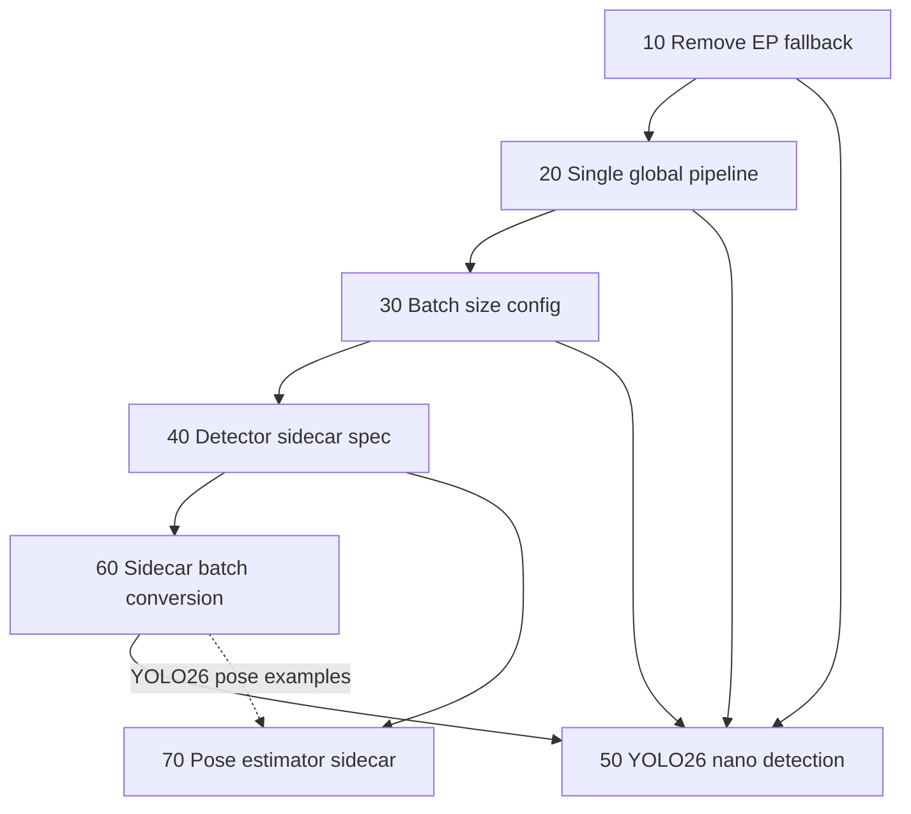

# Implementation Plans Summary (10–70)

This folder holds numbered implementation plans for skellytracker realtime inference and the sidecar-backed model catalog. Each plan is a self-contained spec with goals, boundaries, deliverables, and test guidance. Plans reference a sibling **freemocap** checkout (`../freemocap`) where noted.

**How to use these documents**

- Implement in the [recommended order](#recommended-implementation-order) below unless a plan explicitly allows parallel work.
- Plan numbers are **not** strict multiples of ten after 40: **60** (batch conversion) lands before **50** (YOLO26 detector wiring) because plan 50 depends on vendored `model_batch_convert()`.
- Numbers **45–69** are reserved for future plans.
- Detailed specs live inside each `*_*.plan.md` file; this document is the map.

### Implementation status

Status is tracked against the **skellytracker** repo and sibling **freemocap** checkout (`../freemocap`). Update this column when a plan’s deliverables land (code, spec artifacts, and tests — not plan markdown alone).

| Status | Meaning |
|--------|---------|
| **Implemented** | Deliverables merged; runtime behavior matches the plan |
| **Planned** | Plan document exists; implementation not started (or spec-only stubs pending) |
| **Future** | Exploratory / post-70 work; not in the 10–70 sequence |

| Plan | Status | Notes |
|------|--------|-------|
| **10** | **Implemented** | skellytracker: strict `build_tuned_ort_session`, `OnnxExecutionProviderStartupError` (`ba3d707`). freemocap: worker startup errors, no `on_provider_missing` toggle |
| **20** | **Implemented** | freemocap: singleton `RealtimePipelineManager`, `_apply_pipeline_config`, pipeline error UX (`6e9b96f0`, `8e19d152`) |
| **30** | **Implemented** | skellytracker: `batch_size`, `BatchSizeMismatchError` (`566e9a7`). freemocap: derived `batch_size=len(camera_ids)` (`935f9296`) |
| **40** | **Planned** | Plan + deltas documented; no `specs/sidecar-spec.md` or `sidecar_validation.py` yet |
| **60** | **Planned** | No vendored `model_batch_convert.py` or `batch_conversion` spec in repo |
| **50** | **Planned** | Legacy `list_detection_models()` / `ModelSpec` only; no YOLO26 sidecar path |
| **70** | **Planned** | Pose estimator sidecar spec only; no `load_pose_keypoint_definition()` yet |

**Next up:** plan **40** (detector sidecar spec), then **60**, then **50**.

---

## Recommended implementation order



| Order | Plan | Status | Document | Primary repo |
|-------|------|--------|----------|--------------|
| 1 | **10** | Implemented | [10_remove_ep_fallback.plan.md](10_remove_ep_fallback.plan.md) | skellytracker + freemocap |
| 2 | **20** | Implemented | [20_single_global_realtime_pipeline.plan.md](20_single_global_realtime_pipeline.plan.md) | freemocap (pipeline UX) |
| 3 | **30** | Implemented | [30_realtime_batch_size.plan.md](30_realtime_batch_size.plan.md) | skellytracker + freemocap |
| 4 | **40** | Planned | [40_detector_sidecar_spec.plan.md](40_detector_sidecar_spec.plan.md) | skellytracker (`specs/`, validation) |
| 5 | **60** | Planned | [60_sidecar_batch_conversion.plan.md](60_sidecar_batch_conversion.plan.md) | skellytracker (vendored converter) |
| 6 | **50** | Planned | [50_yolo26_nano_detection.plan.md](50_yolo26_nano_detection.plan.md) | skellytracker + freemocap |
| 7 | **70** | Planned | [70_pose_estimator_sidecar_spec.plan.md](70_pose_estimator_sidecar_spec.plan.md) | skellytracker (`specs/`, validation) |

**Parallelism:** Plan **70** can proceed after plan **40** (spec + validation) while plan **50** is in flight; plan **70** YOLO26 pose examples that need `batching.batch_conversion` should wait for plan **60**.

---

## Cross-cutting themes

| Theme | Plans | Summary |
|-------|-------|---------|
| Strict ONNX Runtime providers | 10, 50 | No silent TRT→CUDA→CPU fallback; recoverable startup errors in freemocap workers |
| Realtime pipeline lifecycle | 20, 30, 50 | One global pipeline, worker-start session create, derived `batch_size = len(cameras)` |
| Sidecar contract | 40, 60, 70 | YAML `{model_id}.yaml` beside ONNX; `schema_version` tied to skellytracker releases |
| Legacy `ModelSpec` registry | 50, 70 | Sidecar catalog grows alongside `MODEL_URLS`; full migration is gradual |

**Canonical sidecar spec (when implemented):** [`specs/sidecar-spec.md`](../specs/sidecar-spec.md) in this repository — not the retired external `model-batch-converter` package.

---

## Plan 10 — Remove EP fallback

**Status:** Implemented  
**File:** [10_remove_ep_fallback.plan.md](10_remove_ep_fallback.plan.md)

**Problem:** `build_tuned_ort_session` and freemocap's `fallback_on_missing_provider` can silently run on a different execution provider than the user selected.

**Deliverables:**

- Strict single-provider ORT session creation in skellytracker (`ort_session_utils.py`)
- Wire strict mode through `RTMPoseSession`, `CompositeGPUSession`, and related paths
- Freemocap realtime workers use `on_provider_missing="raise"` and surface structured startup failures (no `ipc.kill_everything` on EP mismatch)

**Prerequisites:** None (first in sequence).

**Downstream:** Required by all later realtime and sidecar session work.

---

## Plan 20 — Single global realtime pipeline

**Status:** Implemented  
**File:** [20_single_global_realtime_pipeline.plan.md](20_single_global_realtime_pipeline.plan.md)

**Problem:** `RealtimePipelineManager` can accumulate multiple pipelines; UI state includes unused `cameraGroupId`; pipeline errors are hard to recover from.

**Deliverables:**

- At most one `RealtimePipeline` globally; centralized `_apply_pipeline_config` / `needs_recreate`
- Remove `cameraGroupId` from Redux and backend; `realtimeCameraIds` on every apply
- Reject zero-camera apply (HTTP 422); block removing the last camera while connected
- Pipeline error UX (lightning-bolt status, tooltips, dismiss); worker-start validation (not eager apply-time `RTMPoseSession.create()`)

**Prerequisites:** Plan 10.

**Downstream:** Plan 30 batch-size derivation; plan 50 YOLO26 apply error fields.

---

## Plan 30 — Realtime batch size config

**Status:** Implemented  
**File:** [30_realtime_batch_size.plan.md](30_realtime_batch_size.plan.md)

**Problem:** `max_batch_size` implies an upper bound, but realtime needs an **exact** session batch equal to the number of active cameras.

**Deliverables:**

- Rename `max_batch_size` → `batch_size` on `RTMPoseSessionConfig` and `CompositeGPUSessionConfig` (default `1`)
- Exact-batch `predict_batch` / `predict_pose_from_bboxes` with `BatchSizeMismatchError`
- YOLOX TRT profiles and warmup sized to `batch_size` only
- Freemocap: remove persisted batch setting; derive `batch_size=len(resolved_ids)` at worker session create
- Skeleton-node batch gating (`should_run_inference`, full-camera read semantics)

**Prerequisites:** Plans 10, 20.

**Out of scope:** Sidecar `batch_artifacts` / `batch_conversion` (plans 40, 60, 50).

---

## Plan 40 — Detector sidecar spec

**Status:** Planned  
**File:** [40_detector_sidecar_spec.plan.md](40_detector_sidecar_spec.plan.md)

**Problem:** Model I/O contracts are hardcoded in `ModelSpec` / session code; exporters and runtime lack a single versioned schema.

**Deliverables:**

- [`specs/sidecar-spec.md`](../specs/sidecar-spec.md) — YAML sidecars, calendar `schema_version`, one `{model_id}.yaml` per model
- `onnx.batch_artifacts` (native batch × precision map); runtime batch must match a listed key (**no conversion in plan 40**)
- `input.normalization` modes (`none`, `unit_float`, `imagenet_bgr`, `custom`) and `input.resize.interpolation`
- `sidecar_validation.py` — `parse_sidecar_file()`, `validate_sidecar_metadata()`, batch artifact helpers
- `resolve_resize_interpolation()` / `resolve_normalization_mode()` in `rtm_preprocessing.py`
- Reference artifact `models/yolo26-nano.yaml` (without `batch_conversion` — plan 60)
- `pose.keypoint_config` **documented only** (full pose role → plan 70)

**Prerequisites:** Plans 10–30 (sequence).

**Does not include:** `SidecarModelRegistry`, `detector_letterbox_preprocess`, YOLO26 session wiring, `batch_conversion`.

---

## Plan 60 — Sidecar batch conversion

**Status:** Planned  
**File:** [60_sidecar_batch_conversion.plan.md](60_sidecar_batch_conversion.plan.md)

**Problem:** Native ONNX artifacts ship at fixed batch sizes (e.g. YOLO26 `b2`); freemocap may request any positive runtime batch.

**Deliverables:**

- `batching.batch_conversion` section in `specs/sidecar-spec.md` (`profile_id`, `rewrite_rules`, `tensor_matchers`, `validation`, …)
- Vendored [`model_batch_convert.py`](../skellytracker/utilities/gpu_utils/model_batch_convert.py) (retire external `model-batch-converter` repo)
- `validate_batch_conversion_profile()` in `sidecar_validation.py`
- Update `models/yolo26-nano.yaml` and YOLO-Exporter to emit `batch_conversion`

**Prerequisites:** Plan 40.

**Downstream:** Plan 50 session-start conversion; plan 70 YOLO26 pose examples.

---

## Plan 50 — YOLO26 nano detection

**Status:** Planned  
**File:** [50_yolo26_nano_detection.plan.md](50_yolo26_nano_detection.plan.md)

**Problem:** The realtime pipeline uses hardcoded YOLOX detection; YOLO26 nano should be the first sidecar-backed detector.

**Deliverables:**

- `SidecarModelRegistry` / `list_detection_models()` with YAML discovery under `models/`
- `detector_letterbox_preprocess()` wired to sidecar normalization + interpolation
- `RTMPoseSession` path for sidecar-backed detectors (precision selection, `model_batch_convert()` at session start, exact-batch inference)
- EP+GPU precision lookup table (v1: `fp32` / `fp16` whitelist)
- Freemocap: YOLO26 in model panel; apply-time error fields for conversion/precision failures

**Prerequisites:** Plans 10, 20, 30, 40, **60**.

**Does not include:** Pose estimator sidecars (plan 70); legacy `ModelSpec` removal.

---

## Plan 70 — Pose estimator sidecar spec

**Status:** Planned (spec document only; runtime/catalog wiring pending)  
**File:** [70_pose_estimator_sidecar_spec.plan.md](70_pose_estimator_sidecar_spec.plan.md)

**Problem:** Pose models (RTMW, RTMW3D, RTMO, YOLO26 pose) need the same declarative contract as detectors, including skeleton schema and decode profiles.

**Deliverables:**

- `role: pose_estimator` contract in `specs/sidecar-spec.md`
- `input.resize.method: affine_person_crop` for top-down models (RTMW / RTMW3D)
- Keypoint schema via [`names_and_connections/`](../skellytracker/trackers/rtmpose_tracker/names_and_connections/) — `load_pose_keypoint_definition()`, `keypoint_label_slice` with connection filtering
- Decode modes: `simcc_2d`, `simcc_3d`, `direct` (RTMO), `packed_rows` (YOLO26 pose)
- `validate_pose_sidecar_metadata()`; reference sidecars for RTMW, RTMW3D, RTMO, YOLO26 pose
- Optional: `resolve_pose_preprocess_profile()`; `list_pose_models()` catalog wiring may follow in a later plan

**Prerequisites:** Plan 40 (required); plan 60 (recommended for batch-converted pose ONNX examples).

**Reference families:**

| Family | Type | Keypoints | Decode |
|--------|------|-----------|--------|
| RTMW | Top-down | 133 wholebody | `simcc_2d` |
| RTMW3D | Top-down | 133 wholebody | `simcc_3d` |
| RTMO | One-stage | 17 COCO body | `direct` + host NMS |
| YOLO26 pose | One-stage | 17 COCO body | `packed_rows` |

---

## Future plans (beyond 70)

These live in the same folder but are **not** part of the 10–70 sequence:

| Document | Status | Topic |
|----------|--------|-------|
| [future_streaming_pipeline_implementation.plan.md](future_streaming_pipeline_implementation.plan.md) | Future | Graph-based realtime executor; sidecar-backed nodes after RTMPose parity |
| [future_hand_and_face_detection.plan.md](future_hand_and_face_detection.plan.md) | Future | MediaPipe-style ROI refinement (orthogonal to YOLO26 whole-body path) |

---

## Quick dependency reference

```
10 → 20 → 30 → 40 → 60 → 50
              └────────→ 70
```

| If you are implementing… | Read first | Status prerequisite |
|--------------------------|------------|---------------------|
| YOLO26 detector in freemocap | 10, 20, 30, 40, 60, then 50 | 10–30 done; **40 + 60 next** |
| Sidecar YAML for a new detector | 40, then 60 if batch conversion needed | **Planned** |
| Sidecar YAML for RTMW / RTMO / YOLO26 pose | 40, then 70 (60 for YOLO26 pose batch conversion) | **Planned** |
| Batch size / multi-camera realtime | 20, then 30 | **Implemented** |
| Strict TensorRT / CUDA failures | 10 | **Implemented** |
