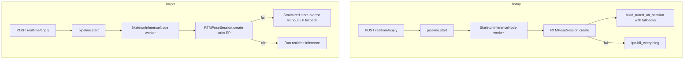

# Remove EP Fallback

## Motivation

Today [`build_tuned_ort_session`](skellytracker/utilities/gpu_utils/ort_session_utils.py) silently appends fallback providers when constructing ORT sessions:

```597:609:skellytracker/utilities/gpu_utils/ort_session_utils.py
        providers.append(("TensorrtExecutionProvider", trt_options))
        providers.append(
            (
                "CUDAExecutionProvider",
                cuda_provider_options(gpu_mem_limit=gpu_mem_limit, device_id=device_id),
            )
        )
        providers.append("CPUExecutionProvider")
    elif provider == "cuda":
        providers.append(("CUDAExecutionProvider", cuda_provider_options(gpu_mem_limit=gpu_mem_limit, device_id=device_id)))
        providers.append("CPUExecutionProvider")
```

A second fallback layer exists in [`resolve_provider`](skellytracker/utilities/gpu_utils/ort_session_utils.py) (`trt` → `cuda` → `cpu` chains) and freemocap's `fallback_on_missing_provider` toggle (default `true`).

For realtime pipelines this is undesirable: users think they selected TensorRT but may silently run on CPU; misconfigured GPU installs surface late inside a worker that calls `ipc.kill_everything()`.

This work was extracted from [50_yolo26_nano_detection.plan.md](50_yolo26_nano_detection.plan.md) (former implementation step 1). Plan **50** references this document as a prerequisite for sidecar-backed detector sessions and all realtime EP handling.

## Prerequisite Plans

None — first in the numbered realtime sequence.

Plan **10** must not depend on plan **20**. It ships strict provider behavior in skellytracker and ensures freemocap realtime workers request strict providers. Eager apply-time validation is deferred to [20_single_global_realtime_pipeline.plan.md](20_single_global_realtime_pipeline.plan.md), where the singleton/global pipeline manager path exists, unless plan **10** is later expanded to include the minimal manager refactor required to validate before `pipeline.start()`.

## Plan sequence

| Order | This plan | Depends on |
|-------|-----------|------------|
| **10** (this) | Strict ORT; skellytracker + freemocap worker strict mode | — |
| **20** | [20_single_global_realtime_pipeline.plan.md](20_single_global_realtime_pipeline.plan.md) + eager apply-time session validation | **10** |
| **30** | `batch_size` rename and derived pass-through | **10**, **20** |
| **40** | [40_sidecar_spec_updates.plan.md](40_sidecar_spec_updates.plan.md) | **10**–**30** (sequence) |
| **50** | YOLO26 detector sessions | **10**, **20**, **30**, **40** |
| future | [future_streaming_pipeline_implementation.plan.md](future_streaming_pipeline_implementation.plan.md) | After **50** |

Freemocap eager `RTMPoseSession.create()` on apply is not a plan **10** deliverable. It should be added during plan **20** and later pass `batch_size=len(resolved_ids)` per [30_realtime_batch_size.plan.md](30_realtime_batch_size.plan.md) once plan **30** lands; skellytracker strict ORT work in plan **10** does not require the rename.



## Scope

### In scope (skellytracker realtime session paths)

All code paths that back freemocap realtime inference today or in planned streaming work:

| Path | Sessions using `build_tuned_ort_session` | Notes |
|------|-------------------------------------------|-------|
| [`RTMPoseSession.create`](skellytracker/trackers/rtmpose_tracker/rtmpose_session.py) | `yolox` det, `rtmpose` pose, `yolox_prenms` | Freemocap centralized + per-camera `RTMPoseDetector` |
| [`CompositeGPUSession`](skellytracker/trackers/composite_gpu_tracker/composite_gpu_session.py) | body, hand, face | Same shared builder; align for consistency |
| Future streaming graph ([future_streaming_pipeline_implementation.plan.md](future_streaming_pipeline_implementation.plan.md)) | `YoloXInferNode`, `PoseInferNode` | Inherit strict sessions from `RTMPoseSession.create()` — no separate builder |

**Not** a new function. Extend the existing `build_tuned_ort_session` signature.

### Out of scope (for this plan)

- `resolve_yolox_provider()` mapping TRT/TRT-RTX → CUDA for YOLOX detector EP selection — this is an intentional model constraint, not an ORT provider-list fallback. Keep it; strict mode still passes only `[CUDA]` (or `[CPU]`) to ORT for the detector session.
- `resolve_provider(requested=None)` auto chain for explicit "Auto" EP selection — still walks installed-best at config resolution time; strict mode applies to **ORT session construction**, not auto-pick semantics.

There is **no legacy fallback opt-in** in this plan. Explicit EP requests must either run on exactly that EP, or fail clearly. This applies in tests, demos, benches, CLI entrypoints, and freemocap operation.

**Strictness note:** strict provider behavior is enforced per resolved ORT sub-session. If a user selects `trt` / `trt-trx` for `RTMPoseSession`, the pose session is strict TRT/TRT-RTX, while YOLOX detector and pre-NMS sessions are strict CUDA because `resolve_yolox_provider()` intentionally maps those sub-sessions to CUDA. They must not include CPU fallback.

## Skellytracker Implementation

### 1. Make `build_tuned_ort_session` strict-only

**File:** [`skellytracker/utilities/gpu_utils/ort_session_utils.py`](skellytracker/utilities/gpu_utils/ort_session_utils.py)

Behavior:

- Build a **single-entry** provider configuration for every supported skellytracker EP id (`trt-trx`, `trt`, `cuda`, `coreml`, `cpu`).
- `trt-trx` path already uses only `add_provider_for_devices` — keep as-is; after create, assert `nv_tensorrt_rtx` is active.
- Do **not** append fallback providers behind any requested EP: no CUDA/CPU behind TRT, no CPU behind CUDA, and no CPU behind CoreML.
- After `InferenceSession` construction, verify the active provider matches the requested EP (map skellytracker id → expected ORT name via `_ORT_PROVIDER_NEEDS`). If mismatch, raise typed startup error (do not retry with another provider).
- Wrap ORT `InferenceSession` constructor failures in the same typed error.
- Remove existing multi-provider fallback list construction entirely; do not keep an `allow_provider_fallback` parameter or config field.

Add exception:

```python
class OnnxExecutionProviderStartupError(RuntimeError):
    """Recoverable session-start failure with structured context."""
    # fields: model_label, requested_provider, expected_ort_provider,
    # active_ort_providers, device_id, cause
```

Provider-resolution failures must also be structured: `resolve_provider(..., on_missing="raise")` should raise `OnnxExecutionProviderStartupError` or a sibling typed exception with the same payload fields before any session build starts. Freemocap should be able to handle missing-provider and failed-session-start errors through one recovery path.

### 2. Wire strict mode through session factories

**[`RTMPoseSession.create`](skellytracker/trackers/rtmpose_tracker/rtmpose_session.py)**

- All three `build_tuned_ort_session` calls (det, pose, prenms) inherit strict-only behavior.
- Remove `"fallback"` as an `on_provider_missing` behavior, or keep only `"raise"` semantics for explicit EP requests. No config or test path should be able to request fallback.
- Audit direct skellytracker entrypoints (`RTMPoseDetector.create`, `bench_rtmpose_session.py`, demos/CLI) and update expectations/docs so strict failure is the only behavior for unavailable explicit EPs.

**[`CompositeGPUSession`](skellytracker/trackers/composite_gpu_tracker/composite_gpu_session.py)**

- Body/hand/face session builds inherit strict-only `build_tuned_ort_session` behavior.
- Ensure `resolve_provider` is called with strict missing-provider behavior.
- Treat optional component startup consistently under strict mode: if body/hand/face model session creation fails because the requested EP cannot run it, fail `CompositeGPUSession.create` instead of silently falling back or disabling that component. Existing model-download failures may keep their current behavior if unrelated to EP startup.

### 3. Tests (skellytracker)

Update / add in [`skellytracker/tests/test_trt_trx_provider.py`](skellytracker/tests/test_trt_trx_provider.py), [`skellytracker/tests/test_yolox_provider_matrix.py`](skellytracker/tests/test_yolox_provider_matrix.py), [`skellytracker/tests/test_rtmpose_session_create.py`](skellytracker/tests/test_rtmpose_session_create.py):

- Unit-test `build_tuned_ort_session(...)` passes exactly one provider for `trt`, `cuda`, `coreml`, and `cpu`, and configures only `nv_tensorrt_rtx` for `trt-trx`.
- Unit-test strict paths do **not** include fallback providers (`trt` excludes CUDA/CPU, `cuda` excludes CPU, `coreml` excludes CPU).
- Unit-test post-create provider mismatch raises `OnnxExecutionProviderStartupError`.
- Unit-test no public config or function argument can opt into provider fallback.
- Unit-test `RTMPoseSession.create` with mocked ORT: requested unavailable EP fails before session build with a typed startup/provider error.
- Unit-test direct entrypoint behavior (`RTMPoseDetector.create` and bench/demo configs where practical) so strict missing-provider failures are explicit.

## Freemocap Implementation

Freemocap lives in sibling checkout `C:\Users\Dom\GitHub\freemocap\freemocap`. Markdown links below are written relative to this plan file.

### 4. Defer eager session validation to plan 20

**Problem today:** [`_build_session`](../../freemocap/freemocap/core/pipeline/realtime/realtime_skeleton_inference_node.py) runs inside the skeleton worker after start; failure returns `None` → `ipc.kill_everything()`.

**Plan 10 target:** do not silently fall back to another execution provider. The worker still owns session creation, and failures during provider resolution / ORT session construction / TRT compile are reported as **asynchronous realtime errors**. Synchronous apply-time validation is deferred to plan **20**.

**Concrete plan 10 error transport:**

1. Add a small structured realtime error payload, e.g. `RealtimePipelineErrorMessage`, with fields matching skellytracker's typed EP error (`requested_execution_provider`, `expected_ort_provider`, `active_ort_providers`, `model_label`, `device_id`, `error_type`, `message`, `install_hint`) plus `pipeline_id`, `node_kind`, and `recoverable`.
2. Add a pubsub topic and/or queue for realtime pipeline errors so child workers can report recoverable startup/config failures to the parent/UI path without setting the global kill flag. Prefer a pubsub topic if it can be consumed by the existing websocket/realtime state flow; otherwise add a dedicated `PipelineIPC` error queue and bridge it to the existing UI error state.
3. In `RealtimeSkeletonInferenceNode._run`, let `_build_session()` raise typed EP startup/config errors instead of swallowing them as `None`. Catch those typed errors at worker startup, publish the structured realtime error, call `ipc.shutdown_pipeline()` (not `ipc.kill_everything()`), and return cleanly.
4. Treat centralized GPU inference with a non-`RTMPoseDetectorConfig` as the same class of recoverable config error. It should publish a structured realtime error and shut down the pipeline, not return `None` into the old global-kill path.
5. `RealtimePipeline.start()` in plan **10** does not promise synchronous validation. `/realtime/apply` may return before session construction/compile finishes; subsequent EP/session failures are asynchronous realtime errors shown in UI/log state. Plan **20** owns making these failures synchronous by validating before `pipeline.start()`.
6. Keep generic unexpected worker exceptions on the existing fatal path until a broader runtime-error strategy is designed; plan **10** only downgrades known EP startup/config errors from global kill to recoverable pipeline shutdown.

**Deferred plan 20 target flow:**

1. `POST /realtime/apply` → resolve cameras / config.
2. If `use_centralized_gpu_inference` and RTMPose detector: call `RTMPoseSession.create()` **in the API/manager path** (same config as `_build_session` today).
3. On success: start the pipeline with validated session configuration. Do not pass a raw `onnxruntime.InferenceSession` / `RTMPoseSession` object across process boundaries; either keep creation in the owning process with a startup handshake or introduce an explicit same-process session owner.
4. On failure: return HTTP error **without** starting workers; pipeline remains stopped.

**Files to change in plan 10:**

- [`freemocap/core/pipeline/realtime/realtime_skeleton_inference_node.py`](../../freemocap/freemocap/core/pipeline/realtime/realtime_skeleton_inference_node.py) — keep worker-owned session creation; pass strict `RTMPoseSessionConfig`; on startup failure, report a structured error and exit cleanly instead of invoking unrecoverable global shutdown for EP misconfiguration.
- [`freemocap/pubsub/pubsub_topics.py`](../../freemocap/freemocap/pubsub/pubsub_topics.py) and/or [`freemocap/core/pipeline/abcs/pipeline_ipc.py`](../../freemocap/freemocap/core/pipeline/abcs/pipeline_ipc.py) — add realtime error message plumbing for recoverable asynchronous worker startup failures.
- [`freemocap/core/pipeline/realtime/realtime_pipeline.py`](../../freemocap/freemocap/core/pipeline/realtime/realtime_pipeline.py) — expose/bridge realtime error messages to the existing frontend state path where needed; do not claim apply/start synchronously validates session construction in plan **10**.
- [`freemocap/api/http/realtime/realtime_router.py`](../../freemocap/freemocap/api/http/realtime/realtime_router.py) / manager layer as needed — avoid fallback EP metadata in apply responses; plan **20** owns structured synchronous HTTP errors for eager validation.
- Plan **20** owns API/manager eager validation and any pipeline reuse/session-invalidating field logic.

### 5. Remove / disable EP fallback in freemocap config

- [`realtime_skeleton_inference_node_config.py`](../../freemocap/freemocap/core/pipeline/realtime/realtime_skeleton_inference_node_config.py): remove `fallback_on_missing_provider` entirely and stop exposing it.
- [`realtime_skeleton_inference_node._build_session`](../../freemocap/freemocap/core/pipeline/realtime/realtime_skeleton_inference_node.py): always use strict provider resolution; remove fallback config handling.
- [`realtime-types.ts`](../../freemocap-ui/src/store/slices/realtime/realtime-types.ts) / [`ExecutionProviderConfigPanel.tsx`](../../freemocap-ui/src/components/control-panels/realtime-panel/ExecutionProviderConfigPanel.tsx): drop `fallback_on_missing_provider` from defaults and config merges.
- [`RealtimePipelineCreateResponse.from_pipeline`](../../freemocap/freemocap/api/http/realtime/realtime_router.py): stop calling `resolve_provider()` with fallback defaults for response metadata. Prefer `requested_execution_provider` in the response; set `active_execution_provider=None` until a worker session reports readiness.

### 6. Graceful failure UX

**Plan 10 startup failures** (missing EP, ORT session create, TRT compile timeout, future YOLO26 batch conversion):

- Do not leave a partially running pipeline after an asynchronous worker startup/config error.
- Surface error in Redux `realtime.error` through the realtime error message path; plan **20** should move missing-EP/session-create errors into `applyRealtimePipeline.rejected` by validating before `pipeline.start()`.
- Show Alert in realtime panels ([`ExecutionProviderConfigPanel.tsx`](../../freemocap-ui/src/components/control-panels/realtime-panel/ExecutionProviderConfigPanel.tsx), [`RealtimePipelinePanel.tsx`](../../freemocap-ui/src/components/control-panels/realtime-panel/RealtimePipelinePanel.tsx)) with parsed backend `detail` (provider, model, install hint).
- Include loading/error state improvements where the current start path can report long-running startup or failure; plan **20** owns "Preparing model…" apply-time UX for eager session creation.

**Deferred to plan 20: config changes requiring session rebuild** (camera selection, EP, detector, batch size):

- Frontend: `closePipeline()` then `applyRealtimePipeline()` ([`realtime-thunks.ts`](../../freemocap-ui/src/store/slices/realtime/realtime-thunks.ts)) — ensure manager removes old pipeline so reuse path does not skip session rebuild.

**Runtime failures** (already running, session dies mid-stream):

- Keep OOM/session-rebuild behavior separate from startup validation. For known OOMs, continue the existing limited rebuild policy. If rebuild fails with the typed EP startup/config error, treat it as a recoverable asynchronous pipeline-level failure (`ipc.shutdown_pipeline()` + structured realtime error) rather than global kill. If rebuild fails because repeated OOMs exceeded the limit or an unexpected exception occurred, keep the current fatal path until a broader runtime-error policy is planned.

**Error payload fields** (minimum):

- `requested_execution_provider`, `expected_ort_provider`, `active_ort_providers`, `active_execution_provider` (if any), detector/pose model ids, `batch_size` (when applicable), skellytracker error type + message, install/doc hint when EP missing.

### 7. Tests (freemocap)

Extend [`freemocap/tests/test_system_gpu_and_rtmpose_config.py`](../../freemocap/tests/test_system_gpu_and_rtmpose_config.py):

- `_build_session` uses strict provider resolution and has no fallback configuration path.
- Worker/startup path reports structured asynchronous realtime error when `RTMPoseSession.create` raises `OnnxExecutionProviderStartupError`; no silent EP fallback occurs.
- Worker/startup path reports structured asynchronous realtime error for centralized GPU + non-RTMPose config; no global kill occurs.
- `/realtime/apply` response metadata does not resolve an unavailable requested EP to a fallback `active_execution_provider`; it reports requested EP and leaves active EP unset until worker readiness is known.
- Plan **20** adds apply endpoint tests proving eager validation returns structured error and pipeline is not started.
- Explicit missing-provider request does not silently resolve to CUDA/CPU.

## Validation Checklist

- skellytracker: `pytest skellytracker/tests/test_trt_trx_provider.py skellytracker/tests/test_yolox_provider_matrix.py skellytracker/tests/test_rtmpose_session_create.py`
- freemocap: `pytest freemocap/tests/test_system_gpu_and_rtmpose_config.py` (+ new worker startup failure tests)
- Manual: request `trt-trx` without package installed → asynchronous realtime error appears with clear message, app stays up
- Manual: request `cuda` with broken CUDA install → asynchronous realtime error appears, no silent CPU fallback
- Manual: request `coreml` on a supported macOS install → ORT session is configured with CoreML only, no CPU fallback

## Risks

- Stricter startup will surface misconfigured GPU stacks earlier — freemocap must never call `kill_everything()` for recoverable EP startup/config errors.
- First TRT run during worker startup may take minutes — UI needs loading/error state. Plan **20** should revisit async apply behavior when adding eager validation.
- Removing provider fallback may affect direct skellytracker CLI/demo/bench users — document in release notes and make strict failure messages actionable.

## Related Plans

- [20_single_global_realtime_pipeline.plan.md](20_single_global_realtime_pipeline.plan.md) — **next** in sequence; singleton apply path; completes freemocap eager session validation (§4).
- [30_realtime_batch_size.plan.md](30_realtime_batch_size.plan.md) — `batch_size=len(resolved_ids)` at session create; coordinates with eager apply.
- [40_sidecar_spec_updates.plan.md](40_sidecar_spec_updates.plan.md) — sidecar contract; follows this plan in sequence.
- [50_yolo26_nano_detection.plan.md](50_yolo26_nano_detection.plan.md) — depends on plan **10** for strict ORT session creation and plan **20** for freemocap eager session validation.
- [future_streaming_pipeline_implementation.plan.md](future_streaming_pipeline_implementation.plan.md) — streaming graph nodes inherit strict sessions from `RTMPoseSession.create()`.
