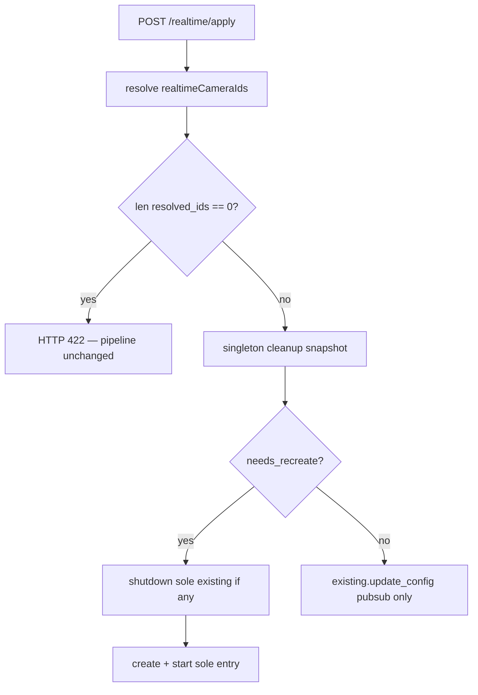
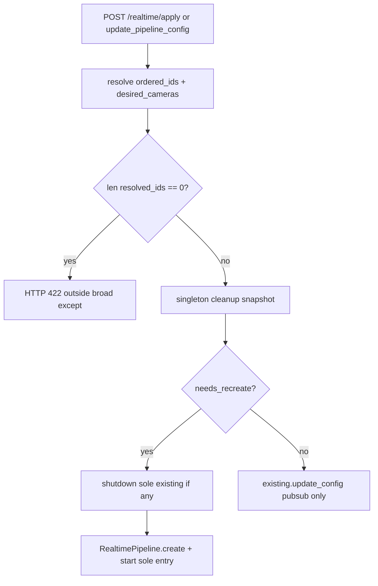

# Single Global Realtime Pipeline

## Motivation

Today [`create_pipeline`](../freemocap/freemocap/core/pipeline/realtime/realtime_pipeline_manager.py) can accumulate **multiple** `RealtimePipeline` instances (reuse loop by camera set without shutting down orphans). The desktop UX is one connected realtime pipeline at a time.

The UI also stores unused [`cameraGroupId`](../freemocap/freemocap-ui/src/store/slices/realtime/realtime-slice.ts) on apply — written and cleared but never read (`selectCameraGroupId` has zero consumers). With a global singleton, `pipelineId` + `isConnected` are sufficient client state.

This work was extracted from [30_realtime_batch_size.plan.md](30_realtime_batch_size.plan.md) during the batch-size plan split. Plan **30** depends on this plan as a **prerequisite** for derived `batch_size` wiring and skeleton batch gating.

## Prerequisite Plans

- [**10 — Remove EP fallback**](10_remove_ep_fallback.plan.md) — strict single-provider ORT sessions and freemocap worker strict mode.

## Plan sequence

| Order | Plan |
|-------|------|
| **10** | [10_remove_ep_fallback.plan.md](10_remove_ep_fallback.plan.md) |
| **20** (this) | Single global realtime pipeline |
| **30** | [30_realtime_batch_size.plan.md](30_realtime_batch_size.plan.md) |
| **40** | [40_sidecar_spec_updates.plan.md](40_sidecar_spec_updates.plan.md) |
| **50** | [50_yolo26_nano_detection.plan.md](50_yolo26_nano_detection.plan.md) |
| future | [future_streaming_pipeline_implementation.plan.md](future_streaming_pipeline_implementation.plan.md) |
| future | [future_hand_and_face_detection.plan.md](future_hand_and_face_detection.plan.md) |



## Scope

### In scope

| Layer | Change |
|-------|--------|
| `RealtimePipelineManager` | At most one global pipeline; `_apply_pipeline_config`; `lifecycle_lock`; duplicate cleanup snapshot; recreate on group / camera set / skeleton session config change |
| `realtime_pipeline_lifecycle.py` | `needs_centralized_rtmpose`, `skeleton_session_config_changed` |
| Skeleton worker | No `PipelineConfigUpdateTopic` subscription; immutable spawn-time `pipeline_config` |
| Apply API / router | Zero-camera **422** before manager; remove `camera_group_id` from apply response; eager `RTMPoseSession.create()` validation before `pipeline.start()` (builds on strict ORT from plan **10**) |
| Redux / UI | `pipelineId` only (remove `cameraGroupId`); `guardRealtimeApply`; last-camera block; pipeline error Alert/Snackbar; camera toggle auto-apply while connected |
| Tests | Manager lifecycle, router 422, slice reducer, Vitest setup |

### Out of scope

- `batch_size` rename, TRT profiles, `BatchSizeMismatchError`, skeleton batch gating — [30_realtime_batch_size.plan.md](30_realtime_batch_size.plan.md)
- Skellytracker strict ORT (`allow_provider_fallback=False`) — [10_remove_ep_fallback.plan.md](10_remove_ep_fallback.plan.md)
- Streaming pipeline graph — [future_streaming_pipeline_implementation.plan.md](future_streaming_pipeline_implementation.plan.md)

## Freemocap Implementation

Freemocap lives in sibling checkout `../freemocap`. Complete [10_remove_ep_fallback.plan.md](10_remove_ep_fallback.plan.md) before this plan; complete this plan before [30_realtime_batch_size.plan.md](30_realtime_batch_size.plan.md) freemocap batch wiring.

#### Files to change

- [`realtime_skeleton_inference_node.py`](../freemocap/freemocap/core/pipeline/realtime/realtime_skeleton_inference_node.py) — **Remove** `PipelineConfigUpdateTopic` subscription and config-update drain loop (section 6). Worker `create()` kwargs omit `pipeline_config_sub`.
- **New:** [`realtime_pipeline_lifecycle.py`](../freemocap/freemocap/core/pipeline/realtime/realtime_pipeline_lifecycle.py) — `needs_centralized_rtmpose`, `skeleton_session_config_changed` (Tests section).
- **New:** [`realtime_camera_selection.py`](../freemocap/freemocap/core/pipeline/realtime/realtime_camera_selection.py) — shared `camera_ids_for_realtime_pipeline(camera_group, realtime_camera_ids)` used by router, manager, and `RealtimePipeline.create()` so zero-camera validation, camera ordering, and pipeline creation cannot drift.
- [`realtime_pipeline_manager.py`](../freemocap/freemocap/core/pipeline/realtime/realtime_pipeline_manager.py) — `_apply_pipeline_config`; `lifecycle_lock`; duplicate cleanup snapshot / `_get_realtime_pipeline`; global singleton (`len(pipelines) <= 1`); update class docstring (drop "per camera ID set"); remove or redirect dead `get_pipeline_by_camera_ids`; imports lifecycle and camera-selection helpers only.
- [`realtime_pipeline.py`](../freemocap/freemocap/core/pipeline/realtime/realtime_pipeline.py) — import `camera_ids_for_realtime_pipeline` in `create()` (replace inline subset logic) and import `needs_centralized_rtmpose` in both `create()` and `update_config()`.
- [`realtime-types.ts`](../freemocap/freemocap-ui/src/store/slices/realtime/realtime-types.ts) — **Remove `cameraGroupId` from `PipelineState` and `camera_group_id` from `PipelineApplyResponse`** — global singleton pipeline; `pipelineId` is the only apply identity the UI stores.
- [`realtime-slice.ts`](../freemocap/freemocap-ui/src/store/slices/realtime/realtime-slice.ts) — `realtimeApplyBlocked` + **`pipelineErrorDismissed`** reducers + `realtimeApplyBlockedMessage` for Snackbar (section 2). **Delete** `cameraGroupId` from `initialState`, `applyRealtimePipeline.fulfilled`, and `closePipeline.fulfilled`. **`applyRealtimePipeline.pending`:** set `state.error = null` and `state.realtimeApplyBlockedMessage = null` so retry after pipeline-start failure or blocked apply does not show stale messages alongside the new request.
- [`cameras-selectors.ts`](../freemocap/freemocap-ui/src/store/slices/cameras/cameras-selectors.ts) — **add** `selectIsLastRealtimePipelineCamera` (section 2 / 6).
- [`realtime/index.ts`](../freemocap/freemocap-ui/src/store/slices/realtime/index.ts) — explicitly export new realtime helpers/actions/selectors and re-export `selectIsLastRealtimePipelineCamera` so components can import from `@/store/slices/realtime`.
- [`realtime-selectors.ts`](../freemocap/freemocap-ui/src/store/slices/realtime/realtime-selectors.ts) — `selectCanConnectPipeline` uses `countRealtimeApplyCameras` (section 2). **Delete** `selectCameraGroupId` (unused today; do not replace). Do **not** add `selectIsLastRealtimePipelineCamera` here — it belongs in cameras-selectors (section 2).
- [`CameraTreeItem.tsx`](../freemocap/freemocap-ui/src/components/control-panels/camera-config-panel/camera-config-tree-view/CameraTreeItem.tsx) — when pipeline connected: block **last** `selected && realtimeEnabled` camera from realtime-off **or** selection-off (section 2 + section 6); otherwise **either** toggle → `guardRealtimeApply` + `applyRealtimePipeline`. Use `store.getState()` for post-dispatch reads (section 6).
- **New:** [`formatApplyErrorDetail.ts`](../freemocap/freemocap-ui/src/store/slices/realtime/formatApplyErrorDetail.ts) — normalize FastAPI `detail` (string or validation array) for thunk `rejectWithValue` (section 2).
- **New:** [`realtime-messages.ts`](../freemocap/freemocap-ui/src/store/slices/realtime/realtime-messages.ts) — `REALTIME_AT_LEAST_ONE_CAMERA_MESSAGE` (shared with Python 422 `detail`).
- **New:** [`guardRealtimeApply.ts`](../freemocap/freemocap-ui/src/store/slices/realtime/guardRealtimeApply.ts) (or beside thunks) — shared pre-dispatch guard (section 2).
- [`realtime-thunks.ts`](../freemocap/freemocap-ui/src/store/slices/realtime/realtime-thunks.ts) — `applyRealtimePipeline` calls `guardRealtimeApply` first (`rejectWithValue` on block — see below); always sends **explicit** `realtimeCameraIds` array (never `null`/omit).
- [`RealtimePipelinePanel.tsx`](../freemocap/freemocap-ui/src/components/control-panels/realtime-panel/RealtimePipelinePanel.tsx) — add **always-mounted Alert/Snackbar shell** for pipeline errors and blocked apply (section 2 — not slice-only; must not live only inside collapsed children).
- [`RealtimePipelineConnectionToggle.tsx`](../freemocap/freemocap-ui/src/components/control-panels/realtime-panel/RealtimePipelineConnectionToggle.tsx) — use `guardRealtimeApply` before connect; align tooltip with `t("realtime_atLeastOneCameraRequired")` (section 2).
- [`RealtimePipelineSummary.tsx`](../freemocap/freemocap-ui/src/components/control-panels/realtime-panel/RealtimePipelineSummary.tsx) — remove generic "Error" chip branch; Active/Inactive only (section 2).
- **Delete** [`RealtimePipelineConnectionStatus.tsx`](../freemocap/freemocap-ui/src/components/control-panels/realtime-panel/RealtimePipelineConnectionStatus.tsx) — unused duplicate error UI.
- [`freemocap-ui/package.json`](../freemocap/freemocap-ui/package.json) + `vitest.config.ts` — minimal Vitest for unit tests (Tests section).
- [`freemocap-ui/src/i18n/locales/`](../freemocap/freemocap-ui/src/i18n/locales/) — add flat key `realtime_atLeastOneCameraRequired` (section 2).
- [`noxfile.py`](../freemocap/noxfile.py) — align `test_ui` / `test_all` with Vitest script name (see Tests section).
- [`TESTING.md`](../freemocap/TESTING.md) — document `npm run test` / `npm run test:watch` (Vitest); note `uv run poe test-all` is backend-only unless extended (Tests section).
- [`realtime_router.py`](../freemocap/freemocap/api/http/realtime/realtime_router.py) / apply path — `len(resolved_ids) == 0` → **422** before manager (section 1). **Remove `camera_group_id` from `RealtimePipelineCreateResponse`**, `from_pipeline()`, and any response `examples=[...]` on apply models — clients use `pipeline_id` only; update OpenAPI examples on `RealtimePipelineConnectRequest` / response models. Backend still binds pipelines to `CameraGroup` internally.
- **New:** `freemocap/api/http/realtime/realtime_messages.py` — Python `REALTIME_AT_LEAST_ONE_CAMERA_MESSAGE` constant matching frontend.


### 1. Zero realtime cameras — reject apply (never mutate pipeline)

Apply requires **≥1** realtime camera. Zero-camera requests must **not** connect, update, or shut down an existing pipeline. Users disconnect explicitly via [`closePipeline`](../freemocap/freemocap-ui/src/store/slices/realtime/realtime-thunks.ts) / [`RealtimePipelineConnectionToggle`](../freemocap/freemocap-ui/src/components/control-panels/realtime-panel/RealtimePipelineConnectionToggle.tsx) (`DELETE /realtime/all/close`).

Resolve camera IDs **before** create/restart:

```python
resolved_ids = camera_ids_for_realtime_pipeline(camera_group, realtime_camera_ids)
# batch_size = len(resolved_ids)  — always use resolved list, not len(request) if IDs were filtered
```

| Input | `resolved_ids` | Server behavior |
|-------|----------------|-----------------|
| `realtimeCameraIds: []` | `[]` | **422** — do not call `_apply_pipeline_config`; **existing realtime pipeline unchanged** |
| Non-empty request but every ID unknown / not in group | `[]` | Same **422** |

**Partial no-op on zero-camera apply:** the router example may still run `create_or_update_camera_group` (camera **configs** can update) before the 422 — only the **realtime pipeline** must not be created, updated, or shut down. Tests assert manager / `_apply_pipeline_config` not invoked, not that the HTTP handler is a total no-op.

**Always explicit `realtimeCameraIds` (desktop UI):** [`applyRealtimePipeline`](../freemocap/freemocap-ui/src/store/slices/realtime/realtime-thunks.ts) and all UI call sites **must** send a JSON array — `Object.keys(selectRealtimeEnabledCameraConfigs(state))` — never `null` or omit the field. Batch size is `len(resolved_ids)` from that list intersected with the camera group. Do not rely on server-side “all group cameras” fallback in the desktop UI.

**Resolved ID order:** server `camera_ids_for_realtime_pipeline` returns `[cid for cid in camera_group.configs.keys() if cid in realtime_camera_ids]` — order follows **camera group config keys**, not the request array order. `batch_size = len(resolved_ids)` is order-independent; zip mapping uses worker `camera_ids` (same resolution at pipeline create). Document in tests; no UI change required.

**Shared resolver:** move the current manager-private `_camera_ids_for_pipeline` logic into [`realtime_camera_selection.py`](../freemocap/freemocap/core/pipeline/realtime/realtime_camera_selection.py) as `camera_ids_for_realtime_pipeline`. Import it in [`realtime_router.py`](../freemocap/freemocap/api/http/realtime/realtime_router.py), [`realtime_pipeline_manager.py`](../freemocap/freemocap/core/pipeline/realtime/realtime_pipeline_manager.py), and [`realtime_pipeline.py`](../freemocap/freemocap/core/pipeline/realtime/realtime_pipeline.py) `create()`; do not duplicate the subset/order logic in the router, manager, or pipeline constructor.

Delete the module-level `_camera_ids_for_pipeline` from [`realtime_pipeline_manager.py`](../freemocap/freemocap/core/pipeline/realtime/realtime_pipeline_manager.py) after extraction. In [`realtime_pipeline.py`](../freemocap/freemocap/core/pipeline/realtime/realtime_pipeline.py) `create()`, replace the inline `pipeline_camera_ids` list comprehension with `camera_ids_for_realtime_pipeline(camera_group, realtime_camera_ids)`.

**API `realtimeCameraIds: null` / omitted (non-UI callers):** [`RealtimePipelineConnectRequest`](../freemocap/freemocap/api/http/realtime/realtime_router.py) still allows `null` → `camera_ids_for_realtime_pipeline(..., None)` resolves **all cameras in the group**. This is intentional for scripts/tests that omit the field; `batch_size = len(group cameras)`. Update the OpenAPI field description to note desktop UI always sends an explicit subset. Do **not** add a batch-size picker to the UI.

**HTTP 422** — `HTTPException` is a subclass of `Exception`, so a 422 raised **inside** today’s `try` / `except Exception → 500` block becomes a **500**. Restructure [`pipeline_apply_endpoint`](../freemocap/freemocap/api/http/realtime/realtime_router.py) — resolve `camera_group` + `resolved_ids` and validate **before** the broad `try`, **or** add `except HTTPException: raise` before the generic handler:

```python
async def pipeline_apply_endpoint(request: RealtimePipelineConnectRequest = Body(...)) -> RealtimePipelineCreateResponse:
    app = get_freemocap_app()
    camera_configs = ...  # existing resolution
    camera_group = await app.camera_group_manager.create_or_update_camera_group(...)
    resolved_ids = camera_ids_for_realtime_pipeline(camera_group, request.realtime_camera_ids)
    if len(resolved_ids) == 0:
        raise HTTPException(
            status_code=422,
            detail=REALTIME_AT_LEAST_ONE_CAMERA_MESSAGE,  # same string as frontend realtime-messages.ts
        )
    try:
        pipeline = await app.create_or_update_realtime_pipeline(
            pipeline_config=request.realtime_config,
            camera_configs=camera_configs,
            realtime_camera_ids=request.realtime_camera_ids,
        )
        return RealtimePipelineCreateResponse.from_pipeline(pipeline=pipeline, ...)
    except HTTPException:
        raise
    except Exception as e:
        ...
```

Also add `except HTTPException: raise` before the generic handler as belt-and-suspenders if validation is moved inside the `try` later.

**Avoid double camera-group update on success:** after the router has called `create_or_update_camera_group` for validation, do not call an app wrapper that creates/updates the same group again on the happy path. Either call `app.realtime_pipeline_manager.create_pipeline(camera_group=..., pipeline_config=..., realtime_camera_ids=...)` directly, or add an optional `camera_group` parameter to `create_or_update_realtime_pipeline` so the validated group can be reused.

Test asserts **`response.status_code == 422`** (not 500), response body `detail` matches `REALTIME_AT_LEAST_ONE_CAMERA_MESSAGE`, and manager is not invoked — use valid non-empty `cameraConfigs` so unrelated errors do not mask the 422 path.

Define the same string on the Python side (e.g. `freemocap/api/http/realtime/realtime_messages.py`) so router `detail` cannot drift from the frontend constant.
### 2. `guardRealtimeApply()` before every apply

**Canonical copy (one string everywhere):** export a shared constant — do **not** call `t()` in guard, thunk, or reducer.

```typescript
// realtime-messages.ts (or guardRealtimeApply.ts)
export const REALTIME_AT_LEAST_ONE_CAMERA_MESSAGE =
  "At least one camera must be selected for realtime.";
```

- **Guard / thunk / reducer / server 422 `detail`:** use `REALTIME_AT_LEAST_ONE_CAMERA_MESSAGE` verbatim.
- **UI display only:** Snackbar, tooltip, and Alert render `t("realtime_atLeastOneCameraRequired")` (i18n value must match the constant in the default locale).
- **Add i18n key** — key does not exist in locale files today. Existing locale files use flat keys, so add a flat key to [`en-english.json`](../freemocap/freemocap-ui/src/i18n/locales/en-english.json):

```json
"realtime_atLeastOneCameraRequired": "At least one camera must be selected for realtime."
```

English string must match `REALTIME_AT_LEAST_ONE_CAMERA_MESSAGE` exactly. v1 may add only the English key and rely on the app's English fallback for other locales; if updating all locale files, use the same flat key in each file. Snackbar still uses `t(...)` only, never Redux-stored English.

Add the key to [`en-english.json`](../freemocap/freemocap-ui/src/i18n/locales/en-english.json) as a **top-level** entry, following the existing flat-key pattern such as `pipelineStages_*`; do not nest it under a `realtime` object. Suggested placement: alphabetically near the `pipelineStages_*` block. Other locales may fall back to English via [`i18n.ts`](../freemocap/freemocap-ui/src/i18n/i18n.ts); v1 English-only is sufficient.

- Update [`RealtimePipelineConnectionToggle`](../freemocap/freemocap-ui/src/components/control-panels/realtime-panel/RealtimePipelineConnectionToggle.tsx) tooltip (replace `"Select cameras first"` with `t("realtime_atLeastOneCameraRequired")`).

**Shared camera count** — single helper used by guard, connect button, and toggles:

```typescript
// realtime-apply-guard.ts (or guardRealtimeApply.ts)
export function countRealtimeApplyCameras(state: RootState): number {
  return Object.keys(selectRealtimeEnabledCameraConfigs(state)).length;
}
```

Refactor [`selectCanConnectPipeline`](../freemocap/freemocap-ui/src/store/slices/realtime/realtime-selectors.ts) to use `countRealtimeApplyCameras(state) > 0` (same rule as `guardRealtimeApply`; do not duplicate logic).

**Shared guard** — all apply entry points call this **before** `dispatch(applyRealtimePipeline(...))`. Do not guard only leaf panels; some apply paths are delegated through parent callbacks.

| Call site | Guard location |
|-----------|----------------|
| Connect toggle | [`RealtimePipelineConnectionToggle.tsx`](../freemocap/freemocap-ui/src/components/control-panels/realtime-panel/RealtimePipelineConnectionToggle.tsx) `handleToggle` before connect apply |
| Pipeline panel config callback | [`RealtimePipelinePanel.tsx`](../freemocap/freemocap-ui/src/components/control-panels/realtime-panel/RealtimePipelinePanel.tsx) `handleConfigChange` before apply — covers EP panel when `onConfigChange` is provided plus charuco / skeleton / triangulation / filter / rigid-body toggles |
| EP panel direct path | [`ExecutionProviderConfigPanel.tsx`](../freemocap/freemocap-ui/src/components/control-panels/realtime-panel/ExecutionProviderConfigPanel.tsx) only when `onConfigChange` is **not** provided |
| Config tree generic apply | [`RealtimePipelineConfigTree.tsx`](../freemocap/freemocap-ui/src/components/control-panels/realtime-panel/RealtimePipelineConfigTree.tsx) `triggerRealtimeApply` before dispatch |
| Config tree RTMPose model update | [`RealtimePipelineConfigTree.tsx`](../freemocap/freemocap-ui/src/components/control-panels/realtime-panel/RealtimePipelineConfigTree.tsx) `handleUpdateRtmposeDetectorConfig` before any apply branch |
| Timing toggle | [`PipelineStagesView.tsx`](../freemocap/freemocap-ui/src/components/framerate-viewer/PipelineStagesView.tsx) `handleToggleTiming` before apply |
| Camera realtime toggle | [`CameraTreeItem.tsx`](../freemocap/freemocap-ui/src/components/control-panels/camera-config-panel/camera-config-tree-view/CameraTreeItem.tsx) last-camera block before toggle, then guard after allowed toggle |
| Camera selection toggle | [`CameraTreeItem.tsx`](../freemocap/freemocap-ui/src/components/control-panels/camera-config-panel/camera-config-tree-view/CameraTreeItem.tsx) same as realtime toggle when connected |

Optional helper: add `dispatchRealtimeApplyIfAllowed(dispatch, getState, config)` beside `guardRealtimeApply` and use it at all non-camera call sites to reduce guard drift.

**Delegated apply paths:** [`RealtimePipelinePanel.tsx`](../freemocap/freemocap-ui/src/components/control-panels/realtime-panel/RealtimePipelinePanel.tsx) `handleConfigChange` is the single guard point for charuco / skeleton / triangulation / filter / rigid-body toggles and for [`ExecutionProviderConfigPanel.tsx`](../freemocap/freemocap-ui/src/components/control-panels/realtime-panel/ExecutionProviderConfigPanel.tsx) when `onConfigChange` is provided. Do **not** add a second guard inside EP when the parent callback is used.

**Config-tree freshness:** [`RealtimePipelineConfigTree.tsx`](../freemocap/freemocap-ui/src/components/control-panels/realtime-panel/RealtimePipelineConfigTree.tsx) apply paths must read fresh config from `selectPipelineConfig(getState())` immediately before `guardRealtimeApply` + `applyRealtimePipeline`, especially after `updateSkeletonFilterConfigLocalOnly` / `replaceSkeletonFilterConfigLocalOnly`. Do not post a stale `pipelineConfig` closure captured before local reducer updates.

**Circular import guardrail:** `guardRealtimeApply` dispatches `realtimeApplyBlocked`, while `realtime-slice.ts` imports thunks today. If the bundler reports a slice → thunk → guard → slice cycle, extract `realtimeApplyBlocked`, `realtimeApplyBlockedDismissed`, and `pipelineErrorDismissed` into `realtime-notify-actions.ts` and re-export them from the slice/barrel, or keep the thunk's internal check to `countRealtimeApplyCameras` + `rejectWithValue` while call sites dispatch `realtimeApplyBlocked`.

```typescript
// guardRealtimeApply.ts — returns false if blocked (no dispatch)
import { REALTIME_AT_LEAST_ONE_CAMERA_MESSAGE } from "./realtime-messages";

export function guardRealtimeApply(
  dispatch: AppDispatch,
  getState: () => RootState,
): boolean {
  if (countRealtimeApplyCameras(getState()) > 0) return true;
  dispatch(realtimeApplyBlocked({ message: REALTIME_AT_LEAST_ONE_CAMERA_MESSAGE }));
  return false;
}
```

`applyRealtimePipeline` thunk also calls the guard internally (defense in depth). Blocked apply: **no** `fetch`, **no** `fulfilled`, **no** pipeline mutation.

**Thunk `condition` + guard policy (v1 decision):** enable **`condition`** on the thunk **and** require **`guardRealtimeApply` before every `dispatch(applyRealtimePipeline(...))`** at all call sites in the guard table (section 2). Rationale:

| Mechanism | When zero cameras |
|-----------|-------------------|
| `guardRealtimeApply` (pre-dispatch) | Snackbar via `realtimeApplyBlocked` — **required** at every call site |
| `condition: (_, { getState }) => countRealtimeApplyCameras(getState()) > 0` | RTK dispatches **nothing** — no `pending` flash, no fetch |
| In-thunk `guardRealtimeApply` + `rejectWithValue` | Defense in depth if `condition` passes but state changed between check and run (race) |

When `condition` returns false, the thunk body **does not run** — there is no `rejectWithValue` and no Snackbar unless a panel already called `guardRealtimeApply`. **Do not** dispatch `applyRealtimePipeline` without a prior guard at call sites.

```typescript
export const applyRealtimePipeline = createAsyncThunk(
  'realtime/apply',
  async (realtimeConfig, { dispatch, getState, rejectWithValue }) => {
    if (!guardRealtimeApply(dispatch, getState)) {
      return rejectWithValue(REALTIME_AT_LEAST_ONE_CAMERA_MESSAGE);
    }
    const cameraConfigs = selectSelectedCameraConfigs(getState());
    const realtimeCameraIds = Object.keys(selectRealtimeEnabledCameraConfigs(getState()));
    const calibrationConfig = selectCalibrationConfig(getState());
    const configWithBoard: RealtimePipelineConfig = {
      ...realtimeConfig,
      camera_node_config: {
        ...realtimeConfig.camera_node_config,
        charuco_detector_config: {
          ...realtimeConfig.camera_node_config.charuco_detector_config,
          board: calibrationConfig.charucoBoard,
        },
      },
    };
    const response = await fetch(serverUrls.endpoints.realtimeConnectOrUpdate, {
      method: 'POST',
      headers: { 'Content-Type': 'application/json' },
      body: JSON.stringify({ realtimeConfig: configWithBoard, cameraConfigs, realtimeCameraIds }),
    });
    if (!response.ok) {
      const body = await response.json().catch(() => ({}));
      return rejectWithValue(formatApplyErrorDetail(body, response.status));
    }
    return (await response.json()) as PipelineApplyResponse;
  },
  {
    condition: (_, { getState }) => countRealtimeApplyCameras(getState()) > 0,
  },
);
```

**Preserve Charuco calibration merge:** the current [`applyRealtimePipeline`](../freemocap/freemocap-ui/src/store/slices/realtime/realtime-thunks.ts) injects `selectCalibrationConfig(getState()).charucoBoard` into `camera_node_config.charuco_detector_config` before POST. Keep that `configWithBoard` behavior while adding guard / `condition` / `rejectWithValue`; do not copy a simplified thunk that sends raw `realtimeConfig` and drops the board. Keep the full `camera_node_config` spread from `realtimeConfig` and only inject/replace `charuco_detector_config.board`.
Keep the existing calibration import path: `import { selectCalibrationConfig } from "@/store/slices/calibration/calibration-slice";`.

**`formatApplyErrorDetail`** — add [`formatApplyErrorDetail.ts`](../freemocap/freemocap-ui/src/store/slices/realtime/formatApplyErrorDetail.ts) (or beside thunks):

```typescript
export function formatApplyErrorDetail(body: unknown, status: number): string {
  if (body && typeof body === "object" && "detail" in body) {
    const { detail } = body as { detail?: unknown };
    if (typeof detail === "string") return detail;
    if (Array.isArray(detail)) {
      // FastAPI validation errors — join msg fields
      const parts = detail
        .map((item) =>
          item && typeof item === "object" && "msg" in item
            ? String((item as { msg: unknown }).msg)
            : null,
        )
        .filter(Boolean);
      if (parts.length) return parts.join("; ");
    }
  }
  return `Failed to apply realtime (${status})`;
}
```

**Server 422 zero-camera (defense in depth):** when `formatApplyErrorDetail` returns exactly `REALTIME_AT_LEAST_ONE_CAMERA_MESSAGE`, the `rejected` reducer treats it like a guard block (`realtimeApplyBlockedMessage` only — no pipeline deactivation). Guard should run first in normal UI; this path covers API/scripts.

Use `rejectWithValue` for both guard blocks and HTTP apply failures — do **not** `throw new Error(...)` on `!response.ok` (keeps failures in `action.payload` for the reducer).

**Panel guards vs thunk guard:** EP panel, config tree, timing toggle, connect toggle, and camera toggles **must** call `guardRealtimeApply` before `dispatch(applyRealtimePipeline(...))` (section 2 call-site table). The thunk `condition` suppresses `pending`/fetch on zero cameras but **does not** show the Snackbar — pre-dispatch guard is required for user feedback.

### 3. Two connection layers (do not conflate)

| Layer | Redux / UI | Meaning on pipeline apply failure |
|-------|------------|----------------------------------|
| **Backend / server** | [`ServerContextProvider`](../freemocap/freemocap-ui/src/services/server/ServerContextProvider.tsx) `isConnected`, WebSocket section | **Unchanged** — cameras stay connected to the freemocap backend |
| **Realtime pipeline** | `realtime.isConnected`, [`RealtimePipelineConnectionToggle`](../freemocap/freemocap-ui/src/components/control-panels/realtime-panel/RealtimePipelineConnectionToggle.tsx) green border | **Inactive** (`isConnected: false`) — pipeline did not start or was torn down by a failed recreate |

Pipeline apply failure must **not** call `closePipeline`, `disconnect`, or otherwise affect the server/WebSocket connection. Only realtime-pipeline Redux fields change (`isConnected`, `pipelineId`, `activeExecutionProvider`, `error`).

### 4. Remove `cameraGroupId` from realtime client state

With **one global realtime pipeline**, the UI does not need to track which `CameraGroup` a pipeline is attached to — `pipelineId` + `isConnected` are sufficient. Today [`cameraGroupId`](../freemocap/freemocap-ui/src/store/slices/realtime/realtime-slice.ts) is written on apply and cleared on close but **never read** by any component (`selectCameraGroupId` has zero consumers). Remove it to avoid conflating server/WebSocket connectivity with pipeline identity.

| Remove | Keep (backend internal) |
|--------|-------------------------|
| `PipelineState.cameraGroupId` | `RealtimePipeline.camera_group` / worker log labels |
| `RealtimePipelineCreateResponse.camera_group_id` | `CameraGroup` in skellycam manager |
| `PipelineApplyResponse.camera_group_id` TypeScript field | Thunk `return response.json()` typing |
| `selectCameraGroupId` | `get_pipeline_by_camera_group_id` for websocket timing (delegates to singleton) |
| Realtime apply response `camera_group_id` examples | `camera_group_id` on websocket frame payloads (unrelated to realtime Redux) |

`applyRealtimePipeline.fulfilled` sets **`pipelineId`**, `isConnected`, `activeExecutionProvider`, and `pipelineConfig` only — not `camera_group_id`.

### 5. Pipeline start failure UX

When `POST /realtime/apply` fails (first connect, recreate after shutdown, OOM, TRT compile, 500, etc.):

1. **`realtime.isConnected: false`** — pipeline power icon **not** active (no green border).
2. **`pipelineId: null`**, **`activeExecutionProvider: null`**.
3. **`state.error`** — server `detail` string (from thunk `rejectWithValue`).
4. **User-visible message** — MUI **Alert** or **Snackbar** in [`RealtimePipelinePanel.tsx`](../freemocap/freemocap-ui/src/components/control-panels/realtime-panel/RealtimePipelinePanel.tsx) bound to `selectPipelineError` (severity `error`); user can retry via connect toggle (`selectCanConnectPipeline`).

**Do not** show the server/WebSocket connection as disconnected. [`GpuExecutionProviderStatus`](../freemocap/freemocap-ui/src/components/ui-components/GpuExecutionProviderStatus.tsx) and camera preview continue to reflect backend connectivity.

Clear `state.error` on: **`applyRealtimePipeline.pending`** (retry clears stale Alert before new apply), `applyRealtimePipeline.fulfilled`, `closePipeline.fulfilled`, and **`pipelineErrorDismissed`** (user dismiss on pipeline-start Alert — **required**, not optional). Clear `realtimeApplyBlockedMessage` on `applyRealtimePipeline.pending`, `applyRealtimePipeline.fulfilled`, `closePipeline.fulfilled`, and `realtimeApplyBlockedDismissed` so stale blocked Snackbars do not overlap a legitimate apply/close.

**`applyRealtimePipeline.pending` handler:**

```typescript
.addCase(applyRealtimePipeline.pending, (state) => {
  state.isLoading = true;
  state.error = null; // hide stale pipeline-start Alert while retry is in flight
  state.realtimeApplyBlockedMessage = null;
}),
```

**`pipelineErrorDismissed` reducer (required):**

```typescript
pipelineErrorDismissed(state) {
  state.error = null;
},
```

Export action; wire `RealtimePipelinePanel` pipeline-start **Alert** `onClose` → `dispatch(pipelineErrorDismissed())`. Symmetric with `realtimeApplyBlockedDismissed` for the zero-camera Snackbar.

**`closePipeline` error handling (out of scope):** this plan migrates **`applyRealtimePipeline`** to `rejectWithValue` + slice branches. **`closePipeline`** may keep `throw new Error(...)` on `!response.ok` for v1 — inconsistent `action.error.message` vs `payload` is acceptable until a follow-up aligns close with the same pattern.

**`rejectWithValue` and `rejected` handler (RTK):** update [`realtime-slice.ts`](../freemocap/freemocap-ui/src/store/slices/realtime/realtime-slice.ts) `applyRealtimePipeline.rejected`:

```typescript
import { isRejectedWithValue } from "@reduxjs/toolkit";
import { REALTIME_AT_LEAST_ONE_CAMERA_MESSAGE } from "./realtime-messages";

.addCase(applyRealtimePipeline.rejected, (state, action) => {
  state.isLoading = false;
  if (!isRejectedWithValue(action)) {
    state.error = action.error.message ?? "Failed to apply pipeline";
    state.isConnected = false;
    state.pipelineId = null;
    state.activeExecutionProvider = null;
    return;
  }
  const message = action.payload as string;
  if (message === REALTIME_AT_LEAST_ONE_CAMERA_MESSAGE) {
    state.realtimeApplyBlockedMessage = message;
    return; // no pipeline field changes — guard blocked before fetch
  }
  // Pipeline start failure (HTTP 4xx/5xx detail from thunk)
  state.error = message;
  state.isConnected = false;
  state.pipelineId = null;
  state.activeExecutionProvider = null;
})
```

Guard-blocked applies set only `realtimeApplyBlockedMessage`. Pipeline start failures set `state.error` + deactivate pipeline fields (`isConnected`, `pipelineId`, `activeExecutionProvider` only — no `cameraGroupId` in realtime Redux).

**`realtimeApplyBlocked` UI — Snackbar/Alert:** add to [`realtime-slice.ts`](../freemocap/freemocap-ui/src/store/slices/realtime/realtime-slice.ts):

```typescript
realtimeApplyBlockedMessage: string | null;  // initial null

// reducer
realtimeApplyBlocked(state, action: PayloadAction<{ message: string }>) {
  state.realtimeApplyBlockedMessage = action.payload.message;
},
realtimeApplyBlockedDismissed(state) {
  state.realtimeApplyBlockedMessage = null;
},
```

- **Set (zero cameras):** `guardRealtimeApply`, last-camera toggle blocks, and `applyRealtimePipeline.rejected` when `action.payload === REALTIME_AT_LEAST_ONE_CAMERA_MESSAGE`.
- **Set (pipeline start failure):** `applyRealtimePipeline.rejected` when `rejectWithValue` payload is **not** the zero-camera constant — populate `state.error`; show Alert/Snackbar in panel shell.
- **Clear:** **`applyRealtimePipeline.pending`** (`state.error = null`, `realtimeApplyBlockedMessage = null`), `applyRealtimePipeline.fulfilled`, `realtimeApplyBlockedDismissed` (Snackbar `onClose`), `closePipeline.fulfilled`, and **`pipelineErrorDismissed`** (pipeline-start Alert `onClose`). `closePipeline.fulfilled` clears both `state.error` and `realtimeApplyBlockedMessage`.
- **Selector:** `selectRealtimeApplyBlockedMessage` (zero-camera); `selectPipelineError` (start failure).

#### `RealtimePipelinePanel` — always-mounted Alert + Snackbar shell (required UI work)

Today [`RealtimePipelinePanel.tsx`](../freemocap/freemocap-ui/src/components/control-panels/realtime-panel/RealtimePipelinePanel.tsx) has **no** error UI — only child panels. [`RealtimePipelineSummary.tsx`](../freemocap/freemocap-ui/src/components/control-panels/realtime-panel/RealtimePipelineSummary.tsx) shows a generic **"Error"** chip when `selectPipelineError` is set (no server detail). **Add visible feedback in the panel shell** — slice/reducer changes alone are insufficient.

**Mounting requirement:** [`CollapsibleSidebarSection`](../freemocap/freemocap-ui/src/components/common/CollapsibleSidebarSection.tsx) wraps detail children in `<Collapse unmountOnExit>` and [`RealtimePipelinePanel.tsx`](../freemocap/freemocap-ui/src/components/control-panels/realtime-panel/RealtimePipelinePanel.tsx) uses `defaultExpanded={false}`. Therefore blocked-apply and pipeline-start notifications **must not live only inside the collapsible detail children**; they would be unmounted while collapsed, including camera-tree blocked-apply events triggered from outside the realtime panel.

**Default mount (v1):** implement `RealtimePipelineNotifications` in [`AppContent.tsx`](../freemocap/freemocap-ui/src/layout/AppContent.tsx) beside `PipelineProgressSnackbar` so blocked-apply from `CameraTreeItem` and pipeline-start errors from `PipelineStagesView` stay visible regardless of realtime section collapse or sidebar scroll. A sibling of `CollapsibleSidebarSection` inside [`RealtimePipelinePanel.tsx`](../freemocap/freemocap-ui/src/components/control-panels/realtime-panel/RealtimePipelinePanel.tsx) is acceptable only if global duplication is avoided and manual testing confirms camera-tree blocked applies are visible while the realtime section is collapsed.

**Snackbar details:** import `useTranslation` from `react-i18next`; set `anchorOrigin={{ vertical: "bottom", horizontal: "left" }}` so it does not overlap `PipelineProgressSnackbar` on bottom-right; use `autoHideDuration={null}` for pipeline-start errors and blocked-apply warnings so users dismiss explicitly. If both `pipelineError` and `blockedMessage` are set, show the pipeline-start error first; `applyRealtimePipeline.pending` clears `blockedMessage`.

| Widget | Selector | Behavior |
|--------|----------|----------|
| **Snackbar** + **Alert** (zero cameras) | `selectRealtimeApplyBlockedMessage` | Always mounted; visible when non-null; body uses `t("realtime_atLeastOneCameraRequired")` — not raw Redux string; `onClose` → `realtimeApplyBlockedDismissed` |
| **Snackbar** + **Alert** `severity="error"` or always-mounted Alert (pipeline start failure) | `selectPipelineError` | Always mounted; visible when non-null even if realtime section is collapsed; show **full** `state.error` (server detail); `onClose` → **`pipelineErrorDismissed`** |

```tsx
// RealtimePipelinePanel.tsx — pattern (outside CollapsibleSidebarSection's collapsed children)
const blockedMessage = useAppSelector(selectRealtimeApplyBlockedMessage);
const pipelineError = useAppSelector(selectPipelineError);

const { t } = useTranslation();

const handlePipelineErrorClose = (_: unknown, reason?: string) => {
  if (reason === "clickaway") return;
  dispatch(pipelineErrorDismissed());
};

const handleBlockedClose = (_: unknown, reason?: string) => {
  if (reason === "clickaway") return;
  dispatch(realtimeApplyBlockedDismissed());
};

<Snackbar
  open={pipelineError != null}
  anchorOrigin={{ vertical: "bottom", horizontal: "left" }}
  autoHideDuration={null}
  onClose={handlePipelineErrorClose}
>
  <Alert severity="error" onClose={() => dispatch(pipelineErrorDismissed())}>
    {pipelineError ?? ""}
  </Alert>
</Snackbar>
<Snackbar
  open={blockedMessage != null && pipelineError == null}
  anchorOrigin={{ vertical: "bottom", horizontal: "left" }}
  autoHideDuration={null}
  onClose={handleBlockedClose}
>
  <Alert severity="warning" onClose={() => dispatch(realtimeApplyBlockedDismissed())}>
    {t("realtime_atLeastOneCameraRequired")}
  </Alert>
</Snackbar>
```

**`RealtimePipelineSummary`:** **remove** the `if (error)` branch that shows generic **"Error"** caption ([`RealtimePipelineSummary.tsx`](../freemocap/freemocap-ui/src/components/control-panels/realtime-panel/RealtimePipelineSummary.tsx) L13–27 today). Summary chip is **only** `Active (pipelineId)` / `Inactive` from `selectIsPipelineConnected` — full error detail lives in the always-mounted notification shell. Drop unused `selectPipelineError` import from Summary. Optional follow-up: add a compact header warning indicator only if product wants a persistent collapsed-state reminder after the Snackbar is dismissed.

**`RealtimePipelineConnectionStatus`:** [`RealtimePipelineConnectionStatus.tsx`](../freemocap/freemocap-ui/src/components/control-panels/realtime-panel/RealtimePipelineConnectionStatus.tsx) is **dead code** (not imported anywhere). **Delete the file** in this change set to avoid a second inline error UI duplicating the always-mounted notification shell; do not wire it into the tree.

- Render blocked-apply Snackbar **always** with `t("realtime_atLeastOneCameraRequired")` when `realtimeApplyBlockedMessage` is set — **do not** display the raw English constant from Redux.

**Last pipeline camera while connected** — in [`CameraTreeItem.tsx`](../freemocap/freemocap-ui/src/components/control-panels/camera-config-panel/camera-config-tree-view/CameraTreeItem.tsx), when `selectIsPipelineConnected` and this camera is the **only** `selected && realtimeEnabled` camera.

**Shared selector** — add to [`cameras-selectors.ts`](../freemocap/freemocap-ui/src/store/slices/cameras/cameras-selectors.ts) (camera-tree concern; uses `selectCameras`). Re-export from [`src/store/slices/realtime/index.ts`](../freemocap/freemocap-ui/src/store/slices/realtime/index.ts) so `CameraTreeItem` and realtime components can consistently import from `@/store/slices/realtime`:

```typescript
// cameras-selectors.ts
export const selectIsLastRealtimePipelineCamera = createSelector(
  [selectCameras, (_: RootState, cameraId: string) => cameraId],
  (cameras, cameraId) => {
    const pipelineCameras = cameras.filter((c) => c.selected && c.realtimeEnabled);
    return pipelineCameras.length === 1 && pipelineCameras[0].id === cameraId;
  },
);
```

**Realtime barrel exports:** update [`realtime/index.ts`](../freemocap/freemocap-ui/src/store/slices/realtime/index.ts) so new helpers are available through the existing barrel import path:

```typescript
export * from "./realtime-messages";
export * from "./guardRealtimeApply";
export * from "./formatApplyErrorDetail";
export { dispatchRealtimeApplyIfAllowed } from "./guardRealtimeApply"; // if implemented
export { selectIsLastRealtimePipelineCamera } from "../cameras/cameras-selectors";
```

The existing `export * from "./realtime-slice"` / `export * from "./realtime-selectors"` should expose `realtimeApplyBlocked`, `realtimeApplyBlockedDismissed`, `pipelineErrorDismissed`, and `selectRealtimeApplyBlockedMessage` once those are added. Ensure [`realtime-selectors.ts`](../freemocap/freemocap-ui/src/store/slices/realtime/realtime-selectors.ts) explicitly exports `selectRealtimeApplyBlockedMessage`. No change to [`src/store/index.ts`](../freemocap/freemocap-ui/src/store/index.ts) is required because it already re-exports `./slices/realtime`.

Use `selectIsLastRealtimePipelineCamera(store.getState(), cameraId) && selectIsPipelineConnected(store.getState())` in both toggle handlers (section 6).

| User action | Behavior |
|-------------|----------|
| Turn off realtime toggle | **Block** — `dispatch(realtimeApplyBlocked({ message: REALTIME_AT_LEAST_ONE_CAMERA_MESSAGE }))` (Snackbar); do not dispatch `cameraRealtimeToggled` |
| Turn off selection toggle | **Block** — same Snackbar; do not dispatch `cameraSelectionToggled` |

User must **disconnect** first (`closePipeline`), then change selection/realtime flags.

**Rule:** freemocap **always** passes `batch_size=len(resolved_ids)` explicitly into `RTMPoseSessionConfig` at session create when `len(resolved_ids) >= 1` — never reads batch size from persisted config and never relies on skellytracker's library default of `1`.
### 6. Session restart on config change (camera / model / EP)

When realtime config changes in ways that affect `RTMPoseSession` shape, the backend must **restart the entire `RealtimePipeline`** — not hot-update the skeleton worker via pubsub, and not recreate only the skeleton node inside a running pipeline.

#### Hard rule: skeleton node has no config subscription

**`RealtimeSkeletonInferenceNode` must not receive runtime config updates.** Remove `PipelineConfigUpdateTopic` subscription and delete the config-update drain loop (today L173–184 in [`realtime_skeleton_inference_node.py`](../freemocap/freemocap/core/pipeline/realtime/realtime_skeleton_inference_node.py)).

| Today | After |
|-------|-------|
| `create()` passes `pipeline_config_sub=pubsub.get_subscription(PipelineConfigUpdateTopic)` | **No** `pipeline_config_sub` kwarg or `_run` parameter |
| Main loop drains pubsub and mutates `pipeline_config` in memory | `pipeline_config` is **immutable** for the worker lifetime — captured once at spawn |
| `log_pipeline_times` toggles via pubsub without session rebuild | Changing skeleton-relevant settings requires **pipeline restart** (see below) |

Camera nodes and the aggregator may continue to receive `PipelineConfigUpdateMessage` via pubsub for settings they can apply live. The skeleton node is excluded from that path entirely.

#### What `RealtimeSkeletonInferenceNode` owns (why pipeline restart matters)

`RealtimeSkeletonInferenceNode` is a **separate worker process** that:

1. Holds the live **`RTMPoseSession`** (ORT sessions, TRT engines, GPU memory) created once at worker start via `_build_session` from the **spawn-time** `pipeline_config`.
2. Subscribes to per-camera ring buffers and **`predict_batch`** over all attached `camera_ids` each frame.
3. Publishes `SkeletonInferenceResultMessage` to the aggregator.

Model, EP, `batch_size`, and `log_pipeline_times` are all fixed at worker spawn. There is no supported path to push a new `RealtimePipelineConfig` into a running skeleton worker — any change that would alter `_build_session` inputs or skeleton loop behavior requires tearing down the pipeline and creating a new one (new skeleton worker with fresh config at `create()`).

#### Frontend (no special close/reopen flow)

Keep today's pattern: when the pipeline is connected, panels call **`applyRealtimePipeline(newConfig)`** with the updated [`RealtimePipelineConfig`](../freemocap/freemocap/core/pipeline/realtime/realtime_pipeline_config.py). That already happens on:

- RTMPose model changes ([`RealtimePipelineConfigTree.tsx`](../freemocap/freemocap-ui/src/components/control-panels/realtime-panel/RealtimePipelineConfigTree.tsx))
- Execution provider changes ([`ExecutionProviderConfigPanel.tsx`](../freemocap/freemocap-ui/src/components/control-panels/realtime-panel/ExecutionProviderConfigPanel.tsx))

**Add:** while connected, **both** camera toggles must auto-apply when allowed — today [`CameraTreeItem.tsx`](../freemocap/freemocap-ui/src/components/control-panels/camera-config-panel/camera-config-tree-view/CameraTreeItem.tsx) only dispatches toggle reducers and never calls `applyRealtimePipeline`, so `realtimeCameraIds` (and derived `batch_size`) stay stale.

`cameraSelectionToggled` **also clears `realtimeEnabled`** when deselecting ([`cameras-slice.ts`](../freemocap/freemocap-ui/src/store/slices/cameras/cameras-slice.ts)) — selection-off changes the realtime set the same as realtime-off.

When `selectIsPipelineConnected` is true:

1. **Disabling realtime or selection on the last pipeline camera** — block both toggles; show canonical message (section 2); user disconnects via `closePipeline` first.
2. **Any other realtime toggle** — `cameraRealtimeToggled`, then `guardRealtimeApply` + `applyRealtimePipeline(selectPipelineConfig(state))`.
3. **Any other selection toggle** — `cameraSelectionToggled`, then `guardRealtimeApply` + `applyRealtimePipeline(selectPipelineConfig(state))` (same as realtime toggle).

**`CameraTreeItem` handler pattern** — use a **single synchronous handler** per toggle (not `useEffect` on `realtimeEnabled` / `selected` — that risks double-apply). Redux reducers run synchronously, so `dispatch(toggle)` then `store.getState()` in the same handler sees the updated camera set.

**`getState` in components:** today no freemocap-ui component uses `useStore`. Import the configured store:

```typescript
import { store } from "@/store";
import {
  applyRealtimePipeline,
  guardRealtimeApply,
  REALTIME_AT_LEAST_ONE_CAMERA_MESSAGE,
  realtimeApplyBlocked,
  selectIsLastRealtimePipelineCamera,
  selectIsPipelineConnected,
  selectPipelineConfig,
} from "@/store/slices/realtime";

const handleRealtimeToggle = () => {
  const getState = () => store.getState();
  const isConnected = selectIsPipelineConnected(getState());
  if (selectIsLastRealtimePipelineCamera(getState(), camera.id) && isConnected) {
    dispatch(realtimeApplyBlocked({ message: REALTIME_AT_LEAST_ONE_CAMERA_MESSAGE }));
    return;
  }
  dispatch(cameraRealtimeToggled(camera.id));
  if (!isConnected) return;
  if (!guardRealtimeApply(dispatch, getState)) return;
  dispatch(applyRealtimePipeline(selectPipelineConfig(getState())));
};

const handleSelectionToggle = () => {
  const getState = () => store.getState();
  const isConnected = selectIsPipelineConnected(getState());
  if (selectIsLastRealtimePipelineCamera(getState(), camera.id) && isConnected) {
    dispatch(realtimeApplyBlocked({ message: REALTIME_AT_LEAST_ONE_CAMERA_MESSAGE }));
    return;
  }
  dispatch(cameraSelectionToggled(camera.id));
  if (!isConnected) return;
  if (!guardRealtimeApply(dispatch, getState)) return;
  dispatch(applyRealtimePipeline(selectPipelineConfig(getState())));
};
```

Alternative: `const getState = useStore<RootState>().getState` from `react-redux` — either is fine; prefer `store` import for consistency with thunk `getState` typing.

**Rapid toggles:** multiple cameras toggled in quick succession may queue overlapping applies. Acceptable for v1 — **last `applyRealtimePipeline` response wins** (`pipelineId` updated on each `fulfilled`). RTK does not cancel in-flight fetches — out-of-order HTTP responses could briefly show a stale `pipelineId` until the next apply settles (low probability; see Risks). No debounce required; document in manual test notes.

`applyRealtimePipeline` sends `realtimeConfig` + `realtimeCameraIds` to `POST /realtime/apply`. **Disconnect** is only via `closePipeline` — never by applying with zero cameras.


#### Backend — single global realtime pipeline

**Invariant:** the manager holds **at most one** `RealtimePipeline` **in total** — not per `camera_group_id`, not per camera set. Starting a new realtime session (apply that needs recreate) shuts down any existing pipeline first. Matches desktop UX: one connected realtime pipeline; [`closePipeline`](../freemocap/freemocap-ui/src/store/slices/realtime/realtime-thunks.ts) / `DELETE /realtime/all/close` clears it via [`RealtimePipelineManager.shutdown()`](../freemocap/freemocap/core/pipeline/realtime/realtime_pipeline_manager.py).

Today [`create_pipeline`](../freemocap/freemocap/core/pipeline/realtime/realtime_pipeline_manager.py) can accumulate **multiple** pipelines (orphans from camera-set changes without shutdown). This plan **replaces** matching/reuse with: **one global slot** + `needs_recreate`. **`create_pipeline` body:** delete the reuse loop (today L71–81: scan `set(pipeline.camera_ids) == desired_cameras` + `update_config`) and **delegate entirely** to `_apply_pipeline_config(...)` — **remove** the outer `with self.lock` from `create_pipeline`.

[`create_or_update_realtime_pipeline`](../freemocap/freemocap/app/freemocap_application.py) may remain a thin wrapper for non-router callers, but the apply router should avoid creating/updating the same camera group twice after pre-validation. Either let the router call `manager.create_pipeline(...)` with the validated `camera_group`, or extend the app wrapper to accept an already-resolved `camera_group`. All manager semantics still live in `_apply_pipeline_config`.

All config updates go through **`_apply_pipeline_config`** — shared by `create_pipeline` and `update_pipeline_config`. `update_pipeline_config` must not call `pipeline.update_config` directly for skeleton-affecting changes; it also **must not** wrap `_apply_pipeline_config` in its own `with self.lock` (today L103–108 holds lock then would deadlock).

```python
def _apply_pipeline_config(
    self,
    *,
    camera_group: CameraGroup,
    pipeline_config: RealtimePipelineConfig,
    realtime_camera_ids: list[CameraIdString] | None = None,
) -> RealtimePipeline:
    """Apply realtime pipeline. Caller must ensure len(resolved cameras) >= 1 (section 2)."""
```

- **`realtime_camera_ids`:** from HTTP apply payload (UI always explicit). For `update_pipeline_config`, pass **`list(pipeline.camera_ids)`** — do **not** pass `None` (see pitfall below).
- **Precondition:** `len(desired_cameras) >= 1` — router validates before calling; manager may `raise ValueError` if violated.
- Camera count at `RealtimePipeline.create()` / skeleton worker spawn — [30_realtime_batch_size.plan.md](30_realtime_batch_size.plan.md) passes `batch_size=len(camera_ids)` into `_build_session`.

**Pitfall — `None` vs pipeline subset:** `camera_ids_for_realtime_pipeline(camera_group, None)` returns **all** group cameras. Realtime may use a subset. `update_pipeline_config` must pass `list(pipeline.camera_ids)`.

**Locks:** split apply serialization from short dictionary reads/writes.

- Add `lifecycle_lock: multiprocessing.synchronize.Lock = field(default_factory=multiprocessing.Lock)` to serialize `create_pipeline` / `update_pipeline_config` / `shutdown()` / recreate operations.
- Keep `self.lock` as the short critical-section lock for `self.pipelines` reads/writes used by websocket/timing/payload paths.
- Never call `_apply_pipeline_config` while holding `self.lock` (today's manager uses non-reentrant `multiprocessing.Lock`).
- Do **not** hold `self.lock` across `RealtimePipeline.create()`, `pipeline.start()`, `pipeline.shutdown()`, or `existing.update_config()`; ORT/TRT startup can block for a long time and should not stall read-only manager lookups.
- Apply path and `shutdown()` use the same pattern: hold `lifecycle_lock` for lifecycle serialization, use `self.lock` only to snapshot/clear `self.pipelines`, then call slow pipeline teardown outside `self.lock`.

**Storage:** keep `self.pipelines: dict[PipelineIdString, RealtimePipeline]` but enforce `len(self.pipelines) <= 1` after every successful apply (optional refactor to `self._pipeline: RealtimePipeline | None` — either is fine; invariant is what matters).

```python
def create_pipeline(
    self,
    *,
    camera_group: CameraGroup,
    pipeline_config: RealtimePipelineConfig,
    realtime_camera_ids: list[CameraIdString] | None = None,
) -> RealtimePipeline:
    return self._apply_pipeline_config(
        camera_group=camera_group,
        pipeline_config=pipeline_config,
        realtime_camera_ids=realtime_camera_ids,
    )

def update_pipeline_config(
    self,
    *,
    pipeline_id: PipelineIdString,
    new_config: RealtimePipelineConfig,
) -> RealtimePipeline:
    with self.lock:
        pipeline = self.pipelines[pipeline_id]  # KeyError if missing
        camera_group = pipeline.camera_group
        realtime_camera_ids = list(pipeline.camera_ids)
    return self._apply_pipeline_config(
        camera_group=camera_group,
        pipeline_config=new_config,
        realtime_camera_ids=realtime_camera_ids,
    )
```

**Lock pitfall:** do **not** call `_apply_pipeline_config` **while** holding `self.lock` — today `create_pipeline` and `update_pipeline_config` both wrap their bodies in `with self.lock`; after refactor, `_apply_pipeline_config` holds `lifecycle_lock` for the full apply and uses `self.lock` only for short snapshots / dict swaps. `update_pipeline_config` may use a **short** read under lock (copy `camera_group` + `camera_ids`), **release**, then call `_apply_pipeline_config`.

#### `_apply_pipeline_config` control flow

```text
with self.lifecycle_lock:
1. ordered_ids = camera_ids_for_realtime_pipeline(camera_group, realtime_camera_ids)
   desired_cameras = set(ordered_ids)
2. with self.lock:
     existing, duplicates = _snapshot_and_clear_duplicate_pipelines()
     # 0 pipelines → None; 1 → that pipeline; >1 legacy → remove ALL from dict, return them for shutdown
3. shutdown duplicate pipelines outside self.lock, still inside lifecycle_lock
4. needs_recreate = (
     existing is None
     or existing.camera_group_id != camera_group.id
     or set(existing.camera_ids) != desired_cameras
     or skeleton_session_config_changed(existing.config, pipeline_config)
   )
5. If needs_recreate:
     with self.lock:
       remove existing from self.pipelines if still registered
     shutdown existing outside self.lock, still inside lifecycle_lock
     pipeline = RealtimePipeline.create(...)
     pipeline.start()
     with self.lock:
       self.pipelines.clear()
       self.pipelines[pipeline.id] = pipeline  # sole entry
     return pipeline
6. Else:
     existing.update_config(pipeline_config) outside self.lock
     return existing
```

`lifecycle_lock` prevents two apply/recreate requests from racing while `self.lock` remains available for short read-only manager operations during slow session startup. If `RealtimePipeline.create()` or `pipeline.start()` raises after the existing pipeline was removed and shut down, leave `self.pipelines` empty and surface the apply failure to the frontend (section 5).

**`old_config` for lifecycle compare:** step 4 uses `existing.config` before shutdown when `needs_recreate` is evaluated.

**Recreate triggers (step 4):**

| Condition | Why |
|-----------|-----|
| No pipeline (empty manager) | First connect |
| `existing.camera_group_id != camera_group.id` | Different camera group (future multi-group; today router has one group) |
| `set(existing.camera_ids) != desired_cameras` | Camera set change (triggers batch_size update in batch-size plan) |
| `skeleton_session_config_changed(existing.config, new)` | EP, models, `log_pipeline_times` (both centralized RTMPose) |

**Pubsub-only path (step 5):** same group, same `camera_ids`, no skeleton session field change — `existing.update_config` only.

**After:** `create_pipeline` delegates to `_apply_pipeline_config` with `realtime_camera_ids` from the HTTP apply payload.

**[`realtime_router.py`](../freemocap/freemocap/api/http/realtime/realtime_router.py):** resolve `resolved_ids`; **422** outside broad `except Exception → 500` (section 2). On success, `pipeline_id` may change after recreate — Redux updates on `fulfilled`.

#### `_snapshot_and_clear_duplicate_pipelines` (new)

Called at step 2 inside `_apply_pipeline_config` while holding `self.lock` briefly. This helper mutates only `self.pipelines`; callers shut removed pipelines down **after** releasing `self.lock`.

```python
def _snapshot_and_clear_duplicate_pipelines(
    self,
) -> tuple[RealtimePipeline | None, list[RealtimePipeline]]:
    """Return the sole pipeline, or remove legacy duplicates and return them for shutdown."""
    if not self.pipelines:
        return None, []
    if len(self.pipelines) == 1:
        return next(iter(self.pipelines.values())), []
    logger.warning(
        "Multiple realtime pipelines (%d) — shutting down all",
        len(self.pipelines),
    )
    duplicates = list(self.pipelines.values())
    self.pipelines.clear()
    return None, duplicates
```

If `len(self.pipelines) > 1`, **remove all from the registry**, return them for shutdown outside `self.lock`, and return `existing=None` — apply step 5 recreates one clean pipeline (no arbitrary survivor). **Side effect:** a pubsub-only apply that hits legacy duplicates still becomes a **full recreate** (`existing is None` ⇒ `needs_recreate`) — intentional cleanup, not a bug.

#### `_get_realtime_pipeline` (refactor)

Read-only helper (lock held by caller) used by apply and by [`get_pipeline_by_camera_group_id`](../freemocap/freemocap/core/pipeline/realtime/realtime_pipeline_manager.py):

```python
def _get_realtime_pipeline(self) -> RealtimePipeline | None:
    if len(self.pipelines) > 1:
        # Read paths should not shut workers down. Return None and let the next apply clean up duplicates.
        logger.warning("Multiple realtime pipelines detected during read; awaiting apply cleanup")
        return None
    return next(iter(self.pipelines.values()), None)
```

**`get_pipeline_by_camera_group_id(camera_group_id)`:** under `self.lock`, return `_get_realtime_pipeline()` when the sole pipeline’s `camera_group_id` matches (today’s signature kept for websocket/timing callers). With a global singleton, this is equivalent to “return the pipeline if it exists and belongs to this group” — no multi-pipeline lookup. Optional follow-up: rename to `get_realtime_pipeline()` on the manager and update [`freemocap_application.py`](../freemocap/freemocap/app/freemocap_application.py) callers; **not required** for this plan if the delegate behavior is correct.

**Dead API:** [`get_pipeline_by_camera_ids`](../freemocap/freemocap/core/pipeline/realtime/realtime_pipeline_manager.py) is unused — remove or delegate to `_get_realtime_pipeline()` (ignore `camera_ids` when singleton holds).

**Class docstring:** replace “singleton per camera ID set” with **at most one global realtime pipeline**.

**Do not** perform duplicate shutdown on read-only lookups. Read paths may log and return `None` if duplicates are detected; the next apply path performs cleanup under `lifecycle_lock`.

**Other read paths:** refactor [`freemocap_application.py`](../freemocap/freemocap/app/freemocap_application.py) `get_latest_frontend_payloads` to stop reading `realtime_pipeline_manager.pipelines` directly. Delegate to `RealtimePipelineManager.get_latest_frontend_payloads()` or take a short locked snapshot through a manager method. Read paths must not shut down pipelines; they may return `[]` / `None` during recreate while the registry is briefly empty.

#### Bulk shutdown / close path

[`RealtimePipelineManager.shutdown()`](../freemocap/freemocap/core/pipeline/realtime/realtime_pipeline_manager.py) — used by `close_pipelines()` / `DELETE /realtime/all/close` — must serialize with apply/recreate via `lifecycle_lock`:

```python
def shutdown(self) -> None:
    with self.lifecycle_lock:
        with self.lock:
            snapshot = list(self.pipelines.values())
            self.pipelines.clear()
        for pipeline in snapshot:
            pipeline.shutdown()  # outside self.lock, still inside lifecycle_lock
    logger.info("RealtimePipelineManager: all pipelines shut down")
```

Do **not** release `lifecycle_lock` before slow `pipeline.shutdown()` calls — mirror `_apply_pipeline_config` (slow work outside `self.lock`, serialization inside `lifecycle_lock`). This prevents a new apply from starting while the prior pipeline is still shutting down.

If close arrives while apply holds `lifecycle_lock`, it waits until apply finishes, then clears/shuts down whatever apply registered. Close wins over a partially registered apply in v1 because registry insertion happens before `lifecycle_lock` is released. Normal apply recreate still shuts down the single `existing` inline with the same short-lock removal + slow-shutdown-outside-`self.lock` pattern; no per-group shutdown helper needed on the apply path.

**Recreate failure:** step 4 shuts down `existing` before `RealtimePipeline.create()` + `start()`. If create/start raises (OOM, TRT compile, etc.), the manager is **empty** until the user retries apply — expected; eager session validation on apply (this plan, building on strict ORT from [10_remove_ep_fallback.plan.md](10_remove_ep_fallback.plan.md)) surfaces session-create errors before workers start. **Frontend:** apply returns error → pipeline power icon **inactive** (`isConnected: false`), `pipelineId` cleared, server/WebSocket connection **unchanged**, `state.error` + Alert shown (section 2 — pipeline start failure UX). User retries via connect toggle.

#### `_apply_pipeline_config` replaces today’s reuse-and-`update_config` path

Today [`create_pipeline`](../freemocap/freemocap/core/pipeline/realtime/realtime_pipeline_manager.py) **reuses** by scanning for `set(pipeline.camera_ids) == desired_cameras` and always calls `update_config` — including skeleton-affecting changes that require full restart.

**After:** one global pipeline; recreate when group, camera set, or skeleton session config changes; pubsub-only otherwise.

**[`create_pipeline` / `_apply_pipeline_config`]** decision table:

| Signal | Action |
|--------|--------|
| **Any apply** | Duplicate snapshot / singleton cleanup (step 2) |
| No pipeline in manager | `RealtimePipeline.create()` + `start()` + register (sole dict entry) |
| Different `camera_group_id` | shutdown existing + `create` + `start()` |
| Same group, `camera_ids` changed | shutdown existing + `create` + `start()` |
| Same group + `camera_ids`, skeleton session fields changed (both centralized RTMPose) | shutdown existing + `create` + `start()` |
| Same group + `camera_ids`, only non-skeleton fields changed (or centralized RTMPose off on both sides) | `existing.update_config` pubsub only |
| `needs_centralized_rtmpose` flips on/off (same group + cameras) | Existing `update_config` on/off branches in [`realtime_pipeline.py`](../freemocap/freemocap/core/pipeline/realtime/realtime_pipeline.py) — no full pipeline restart unless group or `camera_ids` also changed |

**`_skeleton_session_config_changed`** — defined **only** in [`realtime_pipeline_lifecycle.py`](../freemocap/freemocap/core/pipeline/realtime/realtime_pipeline_lifecycle.py). Manager and tests import it from there — do not duplicate in `realtime_pipeline_manager.py`.

Compare only when **`needs_centralized_rtmpose(old)` and `needs_centralized_rtmpose(new)`** are both true (same helper module). If centralized inference is off on either side, skeleton session fields are irrelevant; pubsub-only `update_config` is sufficient until the user enables centralized mode (existing on-branch spawns a fresh worker with current config).

**Centralized off → on in one apply:** intentional **no** full pipeline restart when `camera_ids` unchanged — `RealtimePipeline.update_config` spawns skeleton via on-branch (`needs_recreate` is false because `skeleton_session_config_changed` requires both old and new centralized). Model/EP change while centralized **stays on** triggers `needs_recreate` via `skeleton_session_config_changed`.

When both sides need centralized RTMPose, any difference in these fields triggers recreate via `needs_recreate`:

| Field | Why |
|-------|-----|
| `skeleton_inference_node_config` (EP, `engine_cache_dir`, etc.) | ORT EP / TRT engines |
| `camera_node_config.skeleton_detector_config` (RTMPose: `detector_model`, `pose_model`, `mode`) | ONNX models and TRT profiles |
| `log_pipeline_times` | Read by skeleton worker loop — no pubsub path after this change |

**Not a separate comparison:** `batch_size` — implied by `set(existing.camera_ids) != desired_cameras` in `needs_recreate`; [30_realtime_batch_size.plan.md](30_realtime_batch_size.plan.md) wires the new value at worker spawn.

Reuse `needs_centralized_rtmpose` / `skeleton_session_config_changed` from [`realtime_pipeline_lifecycle.py`](../freemocap/freemocap/core/pipeline/realtime/realtime_pipeline_lifecycle.py). Import `RealtimePipelineConfig` from [`realtime_pipeline_config.py`](../freemocap/freemocap/core/pipeline/realtime/realtime_pipeline_config.py) in lifecycle module (not `realtime_aggregator_node` re-exports). Refactor **both** [`realtime_pipeline.py`](../freemocap/freemocap/core/pipeline/realtime/realtime_pipeline.py) `create()` and `update_config()` to import `needs_centralized_rtmpose` from lifecycle instead of keeping duplicate inline / nested predicates.

**`needs_centralized_rtmpose`** — extract the exact predicate from today’s nested closure (L278–283 in [`realtime_pipeline.py`](../freemocap/freemocap/core/pipeline/realtime/realtime_pipeline.py)) into lifecycle module; manager and `update_config` must import the **same** function:

```python
def needs_centralized_rtmpose(cfg: RealtimePipelineConfig) -> bool:
    return (
        cfg.use_centralized_gpu_inference
        and cfg.camera_node_config.skeleton_tracking_enabled
        and cfg.realtime_detector_kind == "rtmpose"
    )
```

**`skeleton_session_config_changed`** — per-field `model_dump()` compare (not whole-model `==`):

```python
def skeleton_session_config_changed(
    old: RealtimePipelineConfig,
    new: RealtimePipelineConfig,
) -> bool:
    if not (needs_centralized_rtmpose(old) and needs_centralized_rtmpose(new)):
        return False
    if old.skeleton_inference_node_config.model_dump() != new.skeleton_inference_node_config.model_dump():
        return True
    if old.log_pipeline_times != new.log_pipeline_times:
        return True
    return (
        old.camera_node_config.skeleton_detector_config.model_dump()
        != new.camera_node_config.skeleton_detector_config.model_dump()
    )
```

Manager step 4 (`needs_recreate`): `skeleton_session_config_changed(existing.config, pipeline_config)` inside the `needs_recreate` expression.

**[`realtime_pipeline.py`](../freemocap/freemocap/core/pipeline/realtime/realtime_pipeline.py) `update_config`:** keep today's RTMPose **on/off** lifecycle branches (shutdown skeleton when centralized mode disabled; `RealtimeSkeletonInferenceNode.create` + `start` when enabled). **Do not** add skeleton-node recreate-on-model-change inside `update_config` — that case is handled by manager-level pipeline restart. `update_config` continues to pubsub `PipelineConfigUpdateMessage` for camera and aggregator workers only.


## Tests

Implementation ships **with** the feature code in the same change set — follow this order:

1. **Freemocap pure modules** — `realtime_pipeline_lifecycle.py`, `realtime_camera_selection.py`, `realtime_messages.py` (Python).
2. **Unit tests** on lifecycle helpers, router 422, slice reducer **before** wiring manager `_apply_pipeline_config` and Redux/UI.
3. **Wire** manager, router, skeleton pubsub removal, Redux/UI.
4. **Manual** checklist for Alert/Snackbar UX (Playwright e2e not updated in this plan).

All planned freemocap test files (`test_realtime_router.py`, `test_realtime_pipeline_lifecycle.py`, `test_realtime_camera_selection.py`, `test_realtime_slice.test.ts`) are **new** today — none exist in the repo yet.


### Freemocap — extract modules (implement before tests)

**[`realtime_pipeline_lifecycle.py`](../freemocap/freemocap/core/pipeline/realtime/realtime_pipeline_lifecycle.py)** — pure restart decisions (manager imports these):

```python
def needs_centralized_rtmpose(cfg: RealtimePipelineConfig) -> bool: ...
def skeleton_session_config_changed(old: RealtimePipelineConfig, new: RealtimePipelineConfig) -> bool: ...
```

Implement `skeleton_session_config_changed` per section 6 (`model_dump()` on skeleton subtrees).

**[`realtime_camera_selection.py`](../freemocap/freemocap/core/pipeline/realtime/realtime_camera_selection.py)** — shared camera subset/order resolver:

```python
def camera_ids_for_realtime_pipeline(
    camera_group: CameraGroup,
    realtime_camera_ids: list[CameraIdString] | None,
) -> list[CameraIdString]: ...
```

Router, manager, and `RealtimePipeline.create()` all import this helper. Add [`test_realtime_camera_selection.py`](../freemocap/freemocap/tests/test_realtime_camera_selection.py): explicit subset preserves `camera_group.configs.keys()` order, unknown IDs are filtered out, `[]` returns `[]`, and `None` returns all group cameras.
### Freemocap — [`test_realtime_pipeline_lifecycle.py`](../freemocap/freemocap/tests/test_realtime_pipeline_lifecycle.py)

| Test | Assert |
|------|--------|
| `skeleton_session_config_changed` EP change | `True` when both centralized RTMPose |
| `skeleton_session_config_changed` log timing | `True` when both centralized RTMPose and `log_pipeline_times` differs |
| `skeleton_session_config_changed` model off | `False` when old or new lacks centralized RTMPose |
| `skeleton_session_config_changed` triangulation only | `False` — toggle `aggregator_config.triangulation_enabled` on a copy of config (non-skeleton field in [`RealtimeAggregatorNodeConfig`](../freemocap/freemocap/core/pipeline/realtime/realtime_aggregator_node_config.py)) |
| `needs_centralized_rtmpose` predicate | `True` only when centralized inference is enabled, skeleton tracking is enabled, and `realtime_detector_kind == "rtmpose"` |

Manager integration — add to [`test_realtime_pipeline_lifecycle.py`](../freemocap/freemocap/tests/test_realtime_pipeline_lifecycle.py) (mock `RealtimePipeline.shutdown` / `create` / `update_config`):

| Test | Setup | Assert |
|------|-------|--------|
| First connect | empty manager | `create` + `start`; `len(pipelines)==1` |
| Same cameras, EP change, centralized on | one pipeline | shutdown + `create` + `start`; still `len(pipelines)==1` |
| Same cameras, triangulation only | one pipeline | `update_config` only; no shutdown |
| Camera set change | one pipeline, new `realtime_camera_ids` | shutdown + `create` + `start` |
| Legacy duplicates | two+ pipelines in manager | duplicate snapshot removes all from registry, shuts down outside `self.lock`, then apply recreates one |
| Legacy duplicates + pubsub-only config | two+ pipelines, triangulation-only change | duplicate snapshot removes all ⇒ full recreate (not pubsub-only) — acceptable cleanup |
| Legacy duplicates on read | two+ pipelines in manager | `get_pipeline_by_camera_group_id` returns `None`, does not shutdown; next apply cleans up |
| Wrong camera group on read | sole pipeline with mismatched `camera_group_id` | `get_pipeline_by_camera_group_id` returns `None` |
| Read during recreate | registry cleared mid-apply | `get_latest_frontend_payloads` / read wrapper returns `[]` without raising; no shutdown on read |
| `update_pipeline_config` | sole `pipeline_id` + new config | delegates with `realtime_camera_ids=list(pipeline.camera_ids)` |
| Global singleton | after any successful apply | `len(manager.pipelines) <= 1` |
| Slow start lock scope | mocked `RealtimePipeline.create()` / `start()` asserts `manager.lock` is not held during slow create/start work; `lifecycle_lock` still serializes applies |
| Slow shutdown lock scope | mocked `pipeline.shutdown()` asserts `manager.lock` is not held during teardown |
| `shutdown()` lifecycle scope | mocked slow `pipeline.shutdown()` | `lifecycle_lock` remains held until all snapshot pipelines finish shutdown; `self.lock` is not held during teardown |
| Close during slow apply | mocked slow `create` / `start`, concurrent `shutdown()` waits on `lifecycle_lock` | close wins after apply settles; manager ends empty and no orphan pipeline remains registered |
| Recreate failure | mock `create` / `start` raises after existing shutdown | `len(manager.pipelines) == 0`; exception propagates to apply caller |
### Freemocap — new [`test_realtime_router.py`](../freemocap/freemocap/tests/test_realtime_router.py)

Apply / zero-camera behavior (see [test harness](#apply-endpoint-test-harness) below):

- `POST /realtime/apply` with `realtimeCameraIds: []` and **valid** `cameraConfigs` → **`response.status_code == 422`** (not 500), `detail` matches canonical copy; `create_or_update_camera_group` may be called for camera config updates, but mock manager **`create_or_update_realtime_pipeline` / `_apply_pipeline_config` not called**; existing pipeline unchanged if one was running.
- `POST /realtime/apply` with explicit non-empty `realtimeCameraIds` → normal create path.
- Successful apply response contract → response includes `pipeline_id` / `active_execution_provider` and **does not include** `camera_group_id`.

#### Apply endpoint test harness

Do **not** overload `test_system_gpu_and_rtmpose_config.py` (it only mounts `system_router`). Add **`test_realtime_router.py`**:

- `FastAPI` app + `include_router(realtime_router, prefix="/freemocap")`
- `@patch("freemocap.api.http.realtime.realtime_router.get_freemocap_app")` returning a mock `FreemocapApplication` — assert `create_or_update_realtime_pipeline` is **not** invoked on zero-camera apply
- Mock `app.camera_group_manager.create_or_update_camera_group` to return a `CameraGroup` with known `configs` keys when testing filtered-to-empty `realtimeCameraIds`. Spy `app.create_or_update_realtime_pipeline` or `app.realtime_pipeline_manager.create_pipeline` and assert it is **not** called on 422.
- For “existing pipeline unchanged,” pre-seed `realtime_pipeline_manager.pipelines` with a mock pipeline and assert it is not shut down, removed, or replaced after the 422 response.
- Keeps GPU/system tests separate from realtime apply lifecycle

Grep freemocap repo: zero `max_batch_size` in realtime config paths.
### Freemocap UI — Vitest setup (required for reducer tests)

Today [`freemocap-ui/package.json`](../freemocap/freemocap-ui/package.json) has **Playwright e2e only** (`e2e/example.spec.ts`) — **no** unit-test runner. This plan **adds minimal Vitest** for realtime slice / pure-helper tests (not full component render tests).

| File | Change |
|------|--------|
| [`package.json`](../freemocap/freemocap-ui/package.json) | Add devDeps: `vitest`, `@vitest/coverage-v8` (optional). Scripts: **`"test": "vitest run"`** (wire to existing nox `npm run test`), **`"test:watch": "vitest"`**. |
| `vitest.config.ts` (new) | Standalone Vitest config; `environment: "node"`; resolve `@/` alias. **Do not import** [`vite.config.ts`](../freemocap/freemocap-ui/vite.config.ts) wholesale because the Electron/Vite config has filesystem side effects such as clearing `dist-electron`. |
| [`tsconfig.node.json`](../freemocap/freemocap-ui/tsconfig.node.json) | Add `"vitest.config.ts"` to `"include"` alongside `vite.config.ts` so the config is type-checked by the editor/TS tooling. |
| [`noxfile.py`](../freemocap/noxfile.py) | `test_ui` and `test_all` already run `npm run test` in `freemocap-ui` — **no nox change** once `package.json` defines `"test": "vitest run"`. Verify `nox -s test_ui` passes after Vitest lands. |
| [`TESTING.md`](../freemocap/TESTING.md) | Replace references to missing `npm test` / `test:watch` with Vitest commands (`npm run test`, `npm run test:watch`). |
| [`pyproject.toml`](../freemocap/pyproject.toml) `[tool.poe.tasks]` | Optional: extend `test-all` to `sequence = ["test", "test-ui"]` so `uv run poe test-all` runs backend + frontend; today `test-all` is backend pytest only and `test-ui` is separate. |
| CI / local | Run `npm run test` (or `nox -s test_ui`) in freemocap-ui alongside `pytest` — document in validation checklist. |

**Scope:** unit-test **pure functions** (`formatApplyErrorDetail`) and **reducer branches** via `realtimeSlice.reducer` + dispatched actions — **no** jsdom/MUI render tests in this plan. Playwright e2e ([`e2e/example.spec.ts`](../freemocap/freemocap-ui/e2e/example.spec.ts)) is **not** updated for pipeline Alert/Snackbar — manual checklist covers that UX for v1.

Minimal standalone config:

```typescript
// vitest.config.ts
import path from "node:path";
import { defineConfig } from "vitest/config";

export default defineConfig({
  resolve: {
    alias: {
      "@": path.join(__dirname, "src"),
    },
  },
  test: {
    environment: "node",
    include: ["src/**/*.test.ts"],
  },
});
```

Align [`TESTING.md`](../freemocap/TESTING.md) on `npm run test` and `npm run test:watch` commands. `npm test` is equivalent once the script exists, but docs should use one spelling consistently.

Add `"test": "vitest run"` to [`package.json`](../freemocap/freemocap-ui/package.json) before updating [`TESTING.md`](../freemocap/TESTING.md); docs currently reference a missing script.
### Freemocap UI — [`test_realtime_slice.test.ts`](../freemocap/freemocap-ui/src/store/slices/realtime/test_realtime_slice.test.ts) (new)

Unit-test `applyRealtimePipeline.rejected` reducer branches (no fetch):

| Test | Assert |
|------|--------|
| Guard `rejectWithValue` | `realtimeApplyBlockedMessage` set; `isConnected` / `pipelineId` unchanged |
| Pipeline start `rejectWithValue` | `state.error` set; `isConnected` false; `pipelineId` null |
| Server 422 zero-camera detail | same as guard branch when payload === `REALTIME_AT_LEAST_ONE_CAMERA_MESSAGE` |
| Thrown error (network) | `state.error` set; pipeline fields deactivated |
| `realtimeApplyBlocked` | sets `realtimeApplyBlockedMessage`; pipeline fields unchanged |
| `realtimeApplyBlockedDismissed` | clears `realtimeApplyBlockedMessage` only |
| `pipelineErrorDismissed` | clears `state.error` only; `isConnected` unchanged |
| `applyRealtimePipeline.pending` | `state.error` null; `isLoading` true |
| `applyRealtimePipeline.fulfilled` | clears `error` and `realtimeApplyBlockedMessage`; sets connected pipeline fields |
| `closePipeline.fulfilled` | clears `error` and `realtimeApplyBlockedMessage`; clears connected pipeline fields |

Also unit-test `formatApplyErrorDetail` — string `detail`, validation array `detail`, missing `detail`.

Also unit-test `countRealtimeApplyCameras` and `guardRealtimeApply` with selected/realtime-enabled camera combinations. For `guardRealtimeApply`, assert it dispatches `realtimeApplyBlocked` only when the count is zero.

**Reducer / helper test fixtures:** use inline partial `RootState` objects with a `cameras: { cameras: [...] }` stub matching [`cameras-selectors.ts`](../freemocap/freemocap-ui/src/store/slices/cameras/cameras-selectors.ts) expectations. For `guardRealtimeApply`, pass a `vi.fn()` dispatch and assert `realtimeApplyBlocked` is dispatched only when count is zero. Avoid importing the configured app store unless using a dedicated `configureStore` test instance.

**Reducer test pattern** — `extraReducers` only run when actions match RTK async-thunk shape. Use **`rejectWithValue`** payloads with `meta.rejectedWithValue: true`:

```typescript
import { realtimeSlice, pipelineErrorDismissed } from "./realtime-slice";
import { applyRealtimePipeline } from "./realtime-thunks";
import { REALTIME_AT_LEAST_ONE_CAMERA_MESSAGE } from "./realtime-messages";

const reducer = realtimeSlice.reducer;

function rejectedWithValue(payload: string) {
  return {
    type: applyRealtimePipeline.rejected.type,
    payload,
    error: { message: "Rejected" },
    meta: {
      rejectedWithValue: true,
      requestStatus: "rejected" as const,
      requestId: "test",
      arg: {} as never,
      aborted: false,
      condition: false,
    },
  };
}

// Guard branch
let state = reducer(undefined, rejectedWithValue(REALTIME_AT_LEAST_ONE_CAMERA_MESSAGE));
// assert realtimeApplyBlockedMessage set; isConnected unchanged

// Pipeline start failure
state = reducer(undefined, rejectedWithValue("OOM during TRT compile"));
// assert state.error; isConnected false

// pipelineErrorDismissed
state = reducer(state, pipelineErrorDismissed());
// assert state.error null; isConnected still false
```

Alternatively use `@reduxjs/toolkit`'s `isRejectedWithValue` in assertions after dispatching through a configured store — pure `reducer(state, action)` with the helper above is sufficient for this plan.

Assert `pipelineErrorDismissed` clears `state.error` without touching `isConnected`.
### Freemocap — schema contract

- Grep [`test_schema_contract.py`](../freemocap/freemocap/tests/test_schema_contract.py) and OpenAPI for `RealtimePipelineCreateResponse` / apply response — **remove `camera_group_id` expectations** from realtime apply response contract tests if present.
- **`PipelineSettings`** in `test_schema_contract` (app settings model) is **separate** from realtime Redux — only update tests that assert the **`POST /realtime/apply` response** shape, not unrelated settings keys unless they duplicate the removed field. Do **not** remove `camera_group_id` from `TestPipelineSettingsSchema.EXPECTED_KEYS`.
- Add the positive apply response assertion in [`test_realtime_router.py`](../freemocap/freemocap/tests/test_realtime_router.py) so the new response contract is covered even if no existing schema test currently checks `RealtimePipelineCreateResponse`.
## Device review fixes (incorporated)

| # | Issue | Fix |
|---|-------|-----|
| 1 | `realtime_atLeastOneCameraRequired` missing from locale JSON | Add flat key to [`en-english.json`](../freemocap/freemocap-ui/src/i18n/locales/en-english.json) at minimum; English must match `REALTIME_AT_LEAST_ONE_CAMERA_MESSAGE` (section 2) |
| 2 | [`RealtimePipelineConnectionStatus.tsx`](../freemocap/freemocap-ui/src/components/control-panels/realtime-panel/RealtimePipelineConnectionStatus.tsx) unused duplicate error UI | **Delete file** — do not wire into tree; always-mounted notification shell is the single pipeline-error surface |
| 3 | Nox [`test_ui`](../freemocap/noxfile.py) runs `npm run test` but plan had `test:unit` | Define Vitest as **`"test": "vitest run"`** in `package.json` — nox unchanged (Tests section) |
| 4 | Reducer tests need RTK `rejectWithValue` action shape | Use `rejectedWithValue()` helper with `meta.rejectedWithValue: true` (Tests section) |
| 5 | Stale `state.error` on retry after pipeline failure | **`applyRealtimePipeline.pending`** sets `state.error = null` (section 2) |
| 6 | [`RealtimePipelineSummary`](../freemocap/freemocap-ui/src/components/control-panels/realtime-panel/RealtimePipelineSummary.tsx) generic "Error" chip duplicates notification shell | **Remove** error branch; Active/Inactive only; drop `selectPipelineError` import (section 2) |


## Second review gaps (incorporated)

| # | Issue | Suggested fix |
|---|-------|----------------|
| 1 | Manager lock deadlock / slow-start blocking | `_apply_pipeline_config` holds `lifecycle_lock` for the full apply and uses `self.lock` only for short snapshots / dict swaps. `create_pipeline` delegates with **no** outer lock. `update_pipeline_config`: short read under lock, **release**, then `_apply_pipeline_config` (section 6). |
| 2 | `npm run test` missing in `package.json` | Add `"test": "vitest run"`; update [`TESTING.md`](../freemocap/TESTING.md); verify `nox -s test_ui` (Tests section). |
| 3 | Guard-blocked apply and `pending` | Enable thunk `condition` + **require** pre-dispatch `guardRealtimeApply` at all call sites (section 2). |
| 4 | `isLastPipelineCamera` logic unspecified | Add `selectIsLastRealtimePipelineCamera` in **cameras-selectors** (section 2 / 6). |
| 5 | `create_or_update_realtime_pipeline` | **No change** — thin wrapper; manager refactor is internal (section 6). |
| 6 | Large new test surface | Implementation order in Tests section: pure modules → unit tests → wire manager/UI. |
| 7 | `closePipeline` still throws | **Out of scope** for v1 — document in section 2; align with `rejectWithValue` in a follow-up if desired. |
| 8 | `realtimeCameraIds` request order vs server | Server order follows `camera_group.configs.keys()`; document in tests (section 1). |
| 9 | Playwright e2e stale | Manual checklist for Alert/Snackbar; no e2e update in this plan (Tests section). |
| 10 | OpenAPI / schema contract | Grep `test_schema_contract.py`; remove `camera_group_id` from apply response expectations (Tests section). |
| 11 | Zero-camera apply partial no-op | Router may update camera group before 422; tests assert **pipeline manager not invoked**, not total handler no-op (section 1). |


## Third review gaps (incorporated)

| # | Issue | Suggested fix |
|---|-------|----------------|
| 1 | `CameraTreeItem` uses `getState()` but component has no `getState` | Import `store` from [`@/store`](../freemocap/freemocap-ui/src/store/index.ts); use `store.getState()` after synchronous `dispatch(toggle)` (section 6). |
| 2 | `condition` + in-thunk guard — silent no-op without pre-dispatch guard | **v1:** enable thunk `condition` **and** **require** `guardRealtimeApply` before every `dispatch(applyRealtimePipeline)` at all call sites (section 2). |
| 3 | `selectIsLastRealtimePipelineCamera` module placement | Define in [`cameras-selectors.ts`](../freemocap/freemocap-ui/src/store/slices/cameras/cameras-selectors.ts); re-export from realtime index for canonical component imports (section 2 / 6). |

## Fourth review gaps (incorporated)

| # | Issue | Suggested fix |
|---|-------|----------------|
| 1 | Realtime error UI hidden when collapsed | Render blocked-apply and pipeline-start notifications in an always-mounted shell outside `CollapsibleSidebarSection` collapsed children; summary chip remains Active/Inactive only (section 2). |
| 2 | Manager lock held through slow worker startup | Add `lifecycle_lock` for apply serialization; use `self.lock` only for short pipeline-dict snapshots / swaps; do not hold `self.lock` during `create`, `start`, `shutdown`, or `update_config` (section 6). |
| 3 | Router, manager, and pipeline constructor could duplicate camera subset/order logic | Move manager-private camera resolution into shared `realtime_camera_selection.py`; import it in router, manager, and `RealtimePipeline.create()` (section 1 / Tests). |
| 4 | Thunk rewrite could drop Charuco board injection | Preserve existing `configWithBoard` merge from calibration state while adding guard, `condition`, and `rejectWithValue` (section 2). |
| 5 | Centralized RTMPose predicate drift | Import `needs_centralized_rtmpose` from lifecycle in both `RealtimePipeline.create()` and `update_config()` (section 6). |
| 6 | Apply response contract under-tested | Add positive router response assertion that `pipeline_id` exists and `camera_group_id` is absent (Tests / schema contract). |

## Fifth review gaps (incorporated)

| # | Issue | Suggested fix |
|---|-------|----------------|
| 1 | `shutdown()` / close could race apply and still hold `self.lock` during slow teardown | Serialize close with `lifecycle_lock`; snapshot/clear under `self.lock`; call pipeline shutdown outside `self.lock` but still inside `lifecycle_lock`; test close during slow apply (section 6 / Tests). |
| 2 | Shared camera resolver still duplicated in `RealtimePipeline.create()` | Import `camera_ids_for_realtime_pipeline` in router, manager, and pipeline constructor; add `test_realtime_camera_selection.py` (section 1 / Tests). |
| 3 | UI i18n key used nested style unlike locale files | Use flat `realtime_atLeastOneCameraRequired`; add English key at minimum and rely on fallback for other locales unless translating all files (section 2). |
| 4 | Guard wiring could miss delegated apply paths | Guard `RealtimePipelinePanel.handleConfigChange`, EP direct path, both config-tree apply paths, timing toggle, connect toggle, and camera toggles; optionally centralize in `dispatchRealtimeApplyIfAllowed` (section 2). |
| 5 | Notification shell underspecified | Add `useTranslation`, bottom-left `anchorOrigin`, explicit dismissal/no auto-hide, error-first priority, and optional `AppContent` mount if panel-level sibling is too far from camera-tree actions (section 2). |
| 6 | Vitest config could import Electron Vite config with side effects | Use standalone `vitest.config.ts` with alias and test include; do not import `vite.config.ts` (Tests). |
| 7 | Barrel exports and helper tests underspecified | Export new realtime helpers/actions/selectors from `realtime/index.ts`; unit-test `guardRealtimeApply` and `countRealtimeApplyCameras` (section 2 / Tests). |

## Sixth review gaps (incorporated)

| # | Issue | Suggested fix |
|---|-------|----------------|
| 1 | Close/shutdown wording released `lifecycle_lock` too early | Keep `lifecycle_lock` held through slow `pipeline.shutdown()` while releasing only `self.lock`; close waits for apply then clears registered pipeline (section 6). |
| 2 | Router validation could create/update camera group twice on success | Reuse the validated `CameraGroup` by calling manager directly or extending the app wrapper with an optional `camera_group` parameter (section 1 / 6). |
| 3 | Read paths could inspect `manager.pipelines` without a lock | Refactor `freemocap_application.py` read path to delegate to locked manager methods and allow empty results during recreate (section 6 / Tests). |
| 4 | Thunk example replaced Charuco detector config | Merge existing `charuco_detector_config` and only replace `board`; keep calibration import path (section 2). |
| 5 | Guard helper could introduce slice/thunk import cycle | Add circular-import fallback via `realtime-notify-actions.ts` or move thunk guard to count + `rejectWithValue` only (section 2). |
| 6 | Snackbar and tests still underspecified | Ignore clickaway, no auto-hide, add reducer clear tests, `tsconfig.node.json`, stale-config grep, and Charuco POST validation (section 2 / Tests / Validation). |


## Validation Checklist

- `pytest freemocap/tests/test_realtime_pipeline_lifecycle.py freemocap/tests/test_realtime_camera_selection.py freemocap/tests/test_realtime_router.py`
- Freemocap UI: `npm run test` in [`freemocap-ui`](../freemocap/freemocap-ui) (or `nox -s test_ui`) — `test_realtime_slice.test.ts`, `formatApplyErrorDetail`, `guardRealtimeApply`, and `countRealtimeApplyCameras` pass
- `realtime_atLeastOneCameraRequired` present in default locale JSON; English matches `REALTIME_AT_LEAST_ONE_CAMERA_MESSAGE`
- Manual: with Realtime Pipeline section collapsed, pipeline-start failure still shows **full server detail** via always-mounted notification shell (not summary "Error" chip only); dismiss clears error; zero-camera Snackbar uses translated copy and is visible even when triggered from `CameraTreeItem`
- Manual: blocked apply from the camera tree while the realtime section is collapsed shows the bottom-left Snackbar; it does not overlap `PipelineProgressSnackbar`
- Manual: Snackbar uses `autoHideDuration={null}` and ignores clickaway close; dismiss buttons/actions still clear `pipelineError` / `realtimeApplyBlockedMessage`
- Manual: cannot disable last pipeline camera (realtime or selection) while connected — Snackbar shows canonical message; connect with zero cameras blocked via `guardRealtimeApply` (pre-dispatch) + thunk `condition`; toggling `log_pipeline_times` restarts pipeline briefly; simulate apply recreate failure → pipeline icon inactive, server connection still shown as connected, `selectPipelineError` Alert visible
- Grep freemocap-ui: every `dispatch(applyRealtimePipeline` is preceded by `guardRealtimeApply` or goes through the shared apply helper
- Grep freemocap-ui: `triggerRealtimeApply` / skeleton-filter apply paths read `selectPipelineConfig(getState())` immediately before apply, not stale closure config
- Manual/API inspect: apply POST body keeps `charuco_detector_config.board` from calibration state on every apply while preserving other camera-node config fields
- Grep freemocap-ui `realtime` slice: zero `cameraGroupId` / `selectCameraGroupId`
- `RealtimePipelineCreateResponse` / `PipelineApplyResponse` contain `pipeline_id` only (no `camera_group_id`)
- After any successful apply: `len(manager.pipelines) <= 1`
- Manager lock sanity: slow mocked `RealtimePipeline.create()` / `start()` does not hold `manager.lock`; read-only manager lookups are not blocked by the long startup critical path
- Manager close sanity: close during a slow apply ends with `len(manager.pipelines) == 0`; slow `pipeline.shutdown()` does not hold `manager.lock`
- `npm run test` in [`freemocap-ui`](../freemocap/freemocap-ui) does not load Electron Vite side effects or clear `dist-electron`


## Risks

- Skeleton-affecting apply triggers **full pipeline restart** (not in-process skeleton recreate). Expect a brief inference gap and possible TRT recompile on model/EP change — same cost as today's first skeleton node start.
- Legacy installs with multiple pipelines in manager: first apply removes duplicate entries under the short manager lock, shuts those pipelines down outside `self.lock`, then recreates/updates to a single entry. Pubsub-only apply after duplicate cleanup still full-recreates — see section 6.
- **Recreate failure:** if `RealtimePipeline.create()` / `start()` fails after shutting down the sole existing pipeline, manager is empty until retry. **Frontend:** deactivate pipeline icon only — keep backend/camera connection; show error Alert (section 2 — pipeline start failure UX). User retries via connect toggle.
- **Out-of-order apply responses:** rapid camera toggles may deliver older `fulfilled` actions after newer ones — brief stale `pipelineId` in Redux until the next apply settles (v1 acceptable; no request cancellation).
- Full pipeline restart returns a **new** `pipeline_id` — `applyRealtimePipeline.fulfilled` updates Redux; brief gap in inference/timing WS during worker respawn is expected.
- [`RealtimePipelineUpdateRequest`](../freemocap/freemocap/api/http/realtime/realtime_router.py) exists but is unused — do not wire a second apply path; all applies go through `POST /realtime/apply`.


## Related Plans

- [10_remove_ep_fallback.plan.md](10_remove_ep_fallback.plan.md) — **prerequisite**; strict ORT sessions and worker strict mode.
- [30_realtime_batch_size.plan.md](30_realtime_batch_size.plan.md) — **next** in sequence; derives `batch_size=len(resolved_ids)` at session create after singleton manager recreate on camera-set change.
- [50_yolo26_nano_detection.plan.md](50_yolo26_nano_detection.plan.md) — sidecar-backed detector; requires plans 10–40.
- [future_streaming_pipeline_implementation.plan.md](future_streaming_pipeline_implementation.plan.md) — **future**; depends on plans 10–50 before Phase 2.
- [future_hand_and_face_detection.plan.md](future_hand_and_face_detection.plan.md) — **future**; parallel exploration, not blocking numbered sequence.
