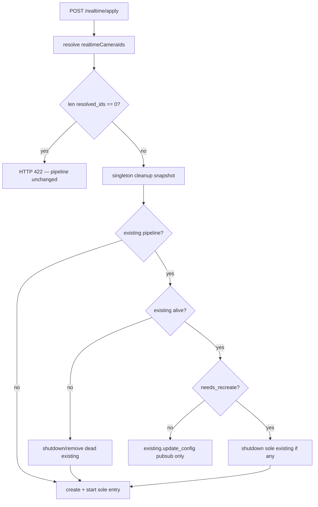
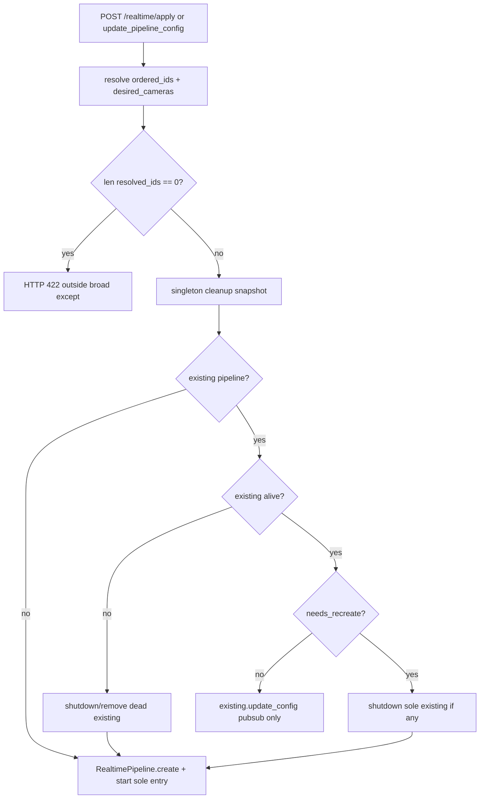

# Single Global Realtime Pipeline

## Motivation

Today [`create_pipeline`](../freemocap/freemocap/core/pipeline/realtime/realtime_pipeline_manager.py) can accumulate **multiple** `RealtimePipeline` instances (reuse loop by camera set without shutting down orphans). The desktop UX is one connected realtime pipeline at a time.

The UI also stores unused [`cameraGroupId`](../freemocap/freemocap-ui/src/store/slices/realtime/realtime-slice.ts) on apply — written and cleared but never read (`selectCameraGroupId` has zero consumers). With a global singleton, `pipelineId` + `isConnected` are sufficient client state.

This work was extracted from [30_realtime_batch_size.plan.md](30_realtime_batch_size.plan.md) during the batch-size plan split. Plan **30** depends on this plan as a **prerequisite** for derived `batch_size` wiring and skeleton batch gating.

## Prerequisite Plans

- [**10 — Remove EP fallback**](10_remove_ep_fallback.plan.md) — strict single-provider ORT sessions and freemocap worker strict mode.

## Plan sequence

| Order | Plan |
|-------|------|
| **10** | [10_remove_ep_fallback.plan.md](10_remove_ep_fallback.plan.md) |
| **20** (this) | Single global realtime pipeline |
| **30** | [30_realtime_batch_size.plan.md](30_realtime_batch_size.plan.md) |
| **40** | [40_sidecar_spec_updates.plan.md](40_sidecar_spec_updates.plan.md) |
| **50** | [50_yolo26_nano_detection.plan.md](50_yolo26_nano_detection.plan.md) |
| future | [future_streaming_pipeline_implementation.plan.md](future_streaming_pipeline_implementation.plan.md) |
| future | [future_hand_and_face_detection.plan.md](future_hand_and_face_detection.plan.md) |



## Scope

### In scope

| Layer | Change |
|-------|--------|
| `RealtimePipelineManager` | At most one global pipeline; `_apply_pipeline_config`; `lifecycle_lock`; duplicate cleanup snapshot; recreate on dead existing pipeline / group / camera set / skeleton session config change; `get_pipeline()` generic method (no camera_group_id parameter) |
| `realtime_pipeline_lifecycle.py` | `needs_centralized_rtmpose`, `skeleton_session_config_changed` |
| Skeleton worker | No `PipelineConfigUpdateTopic` subscription; immutable spawn-time `pipeline_config` |
| Apply API / router | Zero-camera **422** before manager; remove `camera_group_id` from `RealtimePipelineCreateResponse` and collapse `requested_execution_provider` / `active_execution_provider` into single `execution_provider`; keep current worker-start RTMPose session validation behavior (no eager session construction in Plan 20) |
| Redux / UI | `pipelineId` only (remove `cameraGroupId`); collapse `activeExecutionProvider` / `requestedExecutionProvider` to `executionProvider`; `guardRealtimeApply` centered on `useRealtimePipelineSync`; `selectIsPipelineConnected` selector (created in `realtime-selectors.ts` as `(state) => state.realtime.isConnected`); last-camera block; lightning-bolt pipeline status (`green` active, `red` failure, `amber` restart required, `spinning-wheel` during TRT compile/loading); pipeline pop-out + tooltip error/restart messaging; connected settings edits mark restart required instead of applying immediately |
| Tests | Manager lifecycle, router 422, slice reducer, Vitest setup; coordinator stale-detection + disconnect-guard tests |

### Out of scope

- All `batch_size` / `max_batch_size` behavior changes, TRT profiles, `BatchSizeMismatchError`, skeleton batch gating, and explicit `RTMPoseSessionConfig` batch sizing — [30_realtime_batch_size.plan.md](30_realtime_batch_size.plan.md)
- Skellytracker strict ORT (`allow_provider_fallback=False`) — [10_remove_ep_fallback.plan.md](10_remove_ep_fallback.plan.md)
- Streaming pipeline graph — [future_streaming_pipeline_implementation.plan.md](future_streaming_pipeline_implementation.plan.md)

## Freemocap Implementation

Freemocap lives in sibling checkout `../freemocap`. Complete [10_remove_ep_fallback.plan.md](10_remove_ep_fallback.plan.md) before this plan; complete this plan before [30_realtime_batch_size.plan.md](30_realtime_batch_size.plan.md) freemocap batch wiring.

#### Files to change

- [`realtime_skeleton_inference_node.py`](../freemocap/freemocap/core/pipeline/realtime/realtime_skeleton_inference_node.py) — **Remove** `PipelineConfigUpdateTopic` subscription and config-update drain loop (section 6). Worker `create()` kwargs omit `pipeline_config_sub`.
- **New:** [`realtime_pipeline_lifecycle.py`](../freemocap/freemocap/core/pipeline/realtime/realtime_pipeline_lifecycle.py) — `needs_centralized_rtmpose`, `skeleton_session_config_changed` (Tests section).
- **New:** [`realtime_camera_selection.py`](../freemocap/freemocap/core/pipeline/realtime/realtime_camera_selection.py) — shared `camera_ids_for_realtime_pipeline(camera_group, realtime_camera_ids)` used by router, manager, and `RealtimePipeline.create()` so zero-camera validation, camera ordering, and pipeline creation cannot drift.
- [`realtime_pipeline_manager.py`](../freemocap/freemocap/core/pipeline/realtime/realtime_pipeline_manager.py) — `_apply_pipeline_config`; `lifecycle_lock`; duplicate cleanup snapshot / `_get_realtime_pipeline`; global singleton (`len(pipelines) <= 1`); update class docstring (drop "per camera ID set"); replace `get_pipeline_by_camera_group_id` with generic `get_pipeline()` (no camera_group_id parameter — there is only ever a single pipeline); remove dead `get_pipeline_by_camera_ids`; imports lifecycle and camera-selection helpers only.
- [`realtime_pipeline.py`](../freemocap/freemocap/core/pipeline/realtime/realtime_pipeline.py) — import `camera_ids_for_realtime_pipeline` in `create()` (replace inline subset logic) and import `needs_centralized_rtmpose` from `realtime_pipeline_lifecycle.py` in both `create()` and `update_config()` (replacing the inline closure at L278–283). `update_config` still publishes `PipelineConfigUpdateMessage` for camera and aggregator workers only (skeleton node has no subscription after this plan).
- [`freemocap/app/freemocap_application.py`](../freemocap/freemocap/app/freemocap_application.py) — replace `get_realtime_pipeline_for_camera_group(camera_group_id)` with `get_pipeline()` on the manager (no parameter); remove `camera_group_id` from `publish_client_skeleton_inference` and `get_pipeline_timing_subscription` callers; refactor `get_latest_frontend_payloads` to stop reading `realtime_pipeline_manager.pipelines` directly (both L153-154 and the camera-only fallback path at L159). Read paths must not shut down pipelines; they may return `[]` / `None` during recreate while the registry is briefly empty.
- [`realtime-types.ts`](../freemocap/freemocap-ui/src/store/slices/realtime/realtime-types.ts) — **Remove `cameraGroupId` from `PipelineState` and `camera_group_id` from `PipelineApplyResponse`** — global singleton pipeline; `pipelineId` is the only apply identity the UI stores. **Rename** `active_execution_provider` → `execution_provider` (single field — no EP fallbacks).
- [`realtime-slice.ts`](../freemocap/freemocap-ui/src/store/slices/realtime/realtime-slice.ts) — handle `realtimeApplyBlocked`, `realtimeApplyBlockedDismissed`, **`pipelineErrorDismissed`** (defined in `realtime-notify-actions.ts`, handled in `realtime-slice.ts` via `extraReducers`), and **restart-required** actions from `realtime-notify-actions.ts`; add `realtimeApplyBlockedMessage`, `latestApplyRequestId`, `restartRequired`, and `restartRequiredMessage` for lightning-bolt state + stale-response gating (section 2). **Delete** `cameraGroupId` from `initialState`, `applyRealtimePipeline.fulfilled`, and `closePipeline.fulfilled`. **Replace** `activeExecutionProvider` with `executionProvider` throughout. **`applyRealtimePipeline.pending`:** set `state.latestApplyRequestId = action.meta.requestId`, `state.error = null`, and `state.realtimeApplyBlockedMessage = null` so retry after pipeline-start failure or blocked apply does not show stale messages alongside the new request. **`applyRealtimePipeline.fulfilled`:** set `state.executionProvider = action.payload.execution_provider`; clear `restartRequired` / `restartRequiredMessage`. **`applyRealtimePipeline.fulfilled/rejected`:** ignore stale actions whose `meta.requestId` does not match `state.latestApplyRequestId`; deactivate realtime pipeline fields on current non-zero-camera failures.
- [`cameras-selectors.ts`](../freemocap/freemocap-ui/src/store/slices/cameras/cameras-selectors.ts) — **add** `selectIsLastRealtimePipelineCamera` (section 2 / 6).
- [`realtime/index.ts`](../freemocap/freemocap-ui/src/store/slices/realtime/index.ts) — explicitly export new realtime helpers/actions/selectors and re-export `selectIsLastRealtimePipelineCamera` so components can import from `@/store/slices/realtime`.
- [`realtime-selectors.ts`](../freemocap/freemocap-ui/src/store/slices/realtime/realtime-selectors.ts) — `selectCanConnectPipeline` uses `countRealtimeApplyCameras` (section 2). **Add** `selectIsPipelineConnected = (state: RootState) => state.realtime.isConnected` (referenced by lightning bolt, camera toggles, scheduler, coordinator, and listener). **Delete** `selectCameraGroupId` (unused today; do not replace).
- [`CameraTreeItem.tsx`](../freemocap/freemocap-ui/src/components/control-panels/camera-config-panel/camera-config-tree-view/CameraTreeItem.tsx) — when pipeline connected: block **last** `selected && realtimeEnabled` camera from realtime-off **or** selection-off (section 2 + section 6); otherwise **either** toggle → immediate reducer update + 2-second debounced guarded apply. Use `store.getState()` for post-dispatch reads (section 6).
- **New:** [`formatApplyErrorDetail.ts`](../freemocap/freemocap-ui/src/store/slices/realtime/formatApplyErrorDetail.ts) — normalize FastAPI `detail` (string or validation array) for thunk `rejectWithValue` (section 2).
- **New:** [`realtime-messages.ts`](../freemocap/freemocap-ui/src/store/slices/realtime/realtime-messages.ts) — `REALTIME_AT_LEAST_ONE_CAMERA_MESSAGE` (shared with Python 422 `detail`).
- **New:** [`realtime-notify-actions.ts`](../freemocap/freemocap-ui/src/store/slices/realtime/realtime-notify-actions.ts) — `createAction` exports for `realtimeApplyBlocked`, `realtimeApplyBlockedDismissed`, and `pipelineErrorDismissed` to avoid slice → thunk → guard → slice import cycles.
- **New:** [`realtime-apply-camera-count.ts`](../freemocap/freemocap-ui/src/store/slices/realtime/realtime-apply-camera-count.ts) — pure `countRealtimeApplyCameras(state)` helper used by guard, selectors, thunk `condition`, and tests without importing dispatch/action code.
- **New:** [`guardRealtimeApply.ts`](../freemocap/freemocap-ui/src/store/slices/realtime/guardRealtimeApply.ts) (or beside thunks) — shared pre-dispatch guard (section 2).
- **New:** [`realtime-apply-coordinator.ts`](../freemocap/freemocap-ui/src/store/slices/realtime/realtime-apply-coordinator.ts) — frontend single-flight/coalescing wrapper around `applyRealtimePipeline`; only one `POST /realtime/apply` may be in flight; latest queued config runs after the current apply settles; stale responses request latest-config reconciliation; tracks `currentInFlightRequestId` for the listener's stale-detection; has `resetCoordinatorForTesting()` and `import.meta.hot?.dispose` HMR guard.
- **New:** [`realtime-apply-listener.ts`](../freemocap/freemocap-ui/src/store/realtime-apply-listener.ts) — listener middleware for stale `applyRealtimePipeline.fulfilled/rejected` actions; compares `action.meta.requestId !== getCurrentInFlightRequestId()` to detect staleness; checks `selectIsPipelineConnected(getState())` before triggering reconciliation so intentional disconnects are not reconnected by late-arriving apply responses.
- **New:** [`realtime-camera-apply-scheduler.ts`](../freemocap/freemocap-ui/src/store/slices/realtime/realtime-camera-apply-scheduler.ts) — module-level 2-second debounce scheduler for camera selection/realtime toggles; exports `scheduleRealtimeRestartRequiredAfterCameraToggle` and `cancelScheduledRealtimeCameraApply`; has `import.meta.hot?.dispose` HMR guard for the module-level timer.
- [`realtime-thunks.ts`](../freemocap/freemocap-ui/src/store/slices/realtime/realtime-thunks.ts) — `applyRealtimePipeline` calls `guardRealtimeApply` first (`rejectWithValue` on block — see below); typed as `{ state: RootState; dispatch: AppDispatch; rejectValue: string }`; always sends **explicit** `realtimeCameraIds` array (never `null`/omit); preserve current recommended-provider injection without changing batch-size semantics; fix current Charuco board merge so it does not drop existing `charuco_detector_config` fields.
- [`useRealtimePipelineSync.ts`](../freemocap/freemocap-ui/src/hooks/useRealtimePipelineSync.ts) — primary guard point for connect/apply/update paths (`toggleConnection`, `applyOrUpdatePipelineConfig`, `triggerRealtimeApply`); read fresh `selectPipelineConfig(store.getState())` immediately before requesting a coordinated apply; support updater-style config changes so callers do not compose new config from stale hook closures; cancel any pending camera-toggle apply before explicit connect/disconnect or immediate config apply.
- [`SettingsOverlay.tsx`](../freemocap/freemocap-ui/src/components/ui-components/SettingsOverlay.tsx) — owns lightning-bolt status button: green when connected/running, red on realtime pipeline start/runtime failure, amber when connected settings changed and restart is required, spinning-wheel when loading (TRT compile). Tooltip shows full pipeline error or restart-required message. Clicking amber bolt closes then starts realtime with latest Redux config; clicking red opens pipeline pop-out with error details and allows retry/restart from there; align zero-camera tooltip with `t("realtime_atLeastOneCameraRequired")`.
- [`useRealtimePipelineBroadcastPublisher.ts`](../freemocap/freemocap-ui/src/hooks/useRealtimePipelineBroadcastPublisher.ts) — guard `set-log-pipeline-times` apply path and read fresh config before dispatch.
- [`store.ts`](../freemocap/freemocap-ui/src/store/store.ts) — add `realtimeApplyListenerMiddleware.middleware` beside existing listener middlewares so stale-response reconciliation runs globally.
- [`realtimepipeline-actions-flyout.tsx`](../freemocap/freemocap-ui/src/components/pipeline-progress/realtime/realtimepipeline-actions-flyout.tsx) — pipeline pop-out displays current pipeline error details and restart-required message/action; clicking restart-required action closes then starts realtime with latest config. Error dismiss button labeled **"Dismiss error"** (not "Retry") to make clear it does not reconnect.
- [`AppContent.tsx`](../freemocap/freemocap-ui/src/app/AppContent.tsx) — no global pipeline-error toast required for Plan 20; pipeline errors and restart-required messages surface through the lightning-bolt tooltip + pipeline pop-out. Keep any blocked zero-camera notification surface if still desired for non-bolt call sites.
- [`styles/components.css`](../freemocap/freemocap-ui/src/styles/components.css) (or the stylesheet that owns icon/button status styles) — add lightning-bolt status classes for red error, amber restart-required, and spinning-wheel loading states, plus pop-out message styling if needed.
- [`ExecutionProviderConfigPanel.tsx`](../freemocap/freemocap-ui/src/components/control-panels/realtime-panel/ExecutionProviderConfigPanel.tsx) — direct no-`onConfigChange` path updates local config and marks restart-required if connected; remove inline `pipelineError` display when lightning-bolt tooltip + pipeline pop-out own error display.
- **Delete** [`RealtimePipelineConnectionStatus.tsx`](../freemocap/freemocap-ui/src/components/control-panels/realtime-panel/RealtimePipelineConnectionStatus.tsx) — unused duplicate error UI.
- [`freemocap-ui/package.json`](../freemocap/freemocap-ui/package.json) + `vitest.config.ts` — Vitest is partially present today (`test` script and standalone config exist); add missing `test:watch`, realtime tests, and `tsconfig.node.json` include (Tests section). Add `"types": ["vite/client"]` to tsconfig so `import.meta.hot` in coordinator and scheduler modules type-checks.
- [`freemocap-ui/src/i18n/locales/`](../freemocap/freemocap-ui/src/i18n/locales/) — add flat keys `realtime_atLeastOneCameraRequired` and `realtime_restartRequired` (section 2).
- [`noxfile.py`](../freemocap/noxfile.py) — align `test_ui` / `test_all` with Vitest script name (see Tests section).
- [`TESTING.md`](../freemocap/TESTING.md) — document `npm run test` / `npm run test:watch` (Vitest); note `uv run poe test-all` is backend-only unless extended (Tests section).
- [`realtime_router.py`](../freemocap/freemocap/api/http/realtime/realtime_router.py) / apply path — `len(resolved_ids) == 0` → **422** before manager (section 1). **Remove `camera_group_id` from `RealtimePipelineCreateResponse`** (currently required at L34). **Update `from_pipeline()`** (L49-63) to stop passing `camera_group_id=pipeline.camera_group.id` — passing an unexpected kwarg after field removal is a `TypeError` at runtime. **Collapse** `requested_execution_provider` / `active_execution_provider` → single `execution_provider`. Update OpenAPI examples on `RealtimePipelineConnectRequest` / response models — clients use `pipeline_id` only with single `execution_provider`.
- **New:** `freemocap/api/http/realtime/realtime_messages.py` — Python `REALTIME_AT_LEAST_ONE_CAMERA_MESSAGE` constant matching frontend.


### 1. Zero realtime cameras — reject apply (never mutate pipeline)

Apply requires **≥1** realtime camera. Zero-camera requests must **not** connect, update, or shut down an existing pipeline. Users disconnect explicitly via [`closePipeline`](../freemocap/freemocap-ui/src/store/slices/realtime/realtime-thunks.ts) through [`useRealtimePipelineSync.toggleConnection`](../freemocap/freemocap-ui/src/hooks/useRealtimePipelineSync.ts) / [`SettingsOverlay.tsx`](../freemocap/freemocap-ui/src/components/ui-components/SettingsOverlay.tsx) (`DELETE /realtime/all/close`).

Resolve camera IDs **before** create/restart:

```python
resolved_ids = camera_ids_for_realtime_pipeline(camera_group, realtime_camera_ids)
```

| Input | `resolved_ids` | Server behavior |
|-------|----------------|-----------------|
| `realtimeCameraIds: []` | `[]` | **422** — do not call `_apply_pipeline_config`; **existing realtime pipeline unchanged** |
| Non-empty request but every ID unknown / not in group | `[]` | Same **422** |

**Partial no-op on zero-camera apply:** the router example may still run `create_or_update_camera_group` (camera **configs** can update) before the 422 — only the **realtime pipeline** must not be created, updated, or shut down. Tests assert manager / `_apply_pipeline_config` not invoked, not that the HTTP handler is a total no-op.

**Always explicit `realtimeCameraIds` (desktop UI):** [`applyRealtimePipeline`](../freemocap/freemocap-ui/src/store/slices/realtime/realtime-thunks.ts) and all UI call sites **must** send a JSON array — `Object.keys(selectRealtimeEnabledCameraConfigs(state))` — never `null` or omit the field. The resolved camera set is that list intersected with the camera group. Do not rely on server-side "all group cameras" fallback in the desktop UI.

**Resolved ID order:** server `camera_ids_for_realtime_pipeline` returns `[cid for cid in camera_group.configs.keys() if cid in realtime_camera_ids]` — order follows **camera group config keys**, not the request array order. Worker camera order uses the same resolver at pipeline create. Document in tests; no UI change required.

**Shared resolver:** move the current manager-private `_camera_ids_for_pipeline` logic into [`realtime_camera_selection.py`](../freemocap/freemocap/core/pipeline/realtime/realtime_camera_selection.py) as `camera_ids_for_realtime_pipeline`. Import it in [`realtime_router.py`](../freemocap/freemocap/api/http/realtime/realtime_router.py), [`realtime_pipeline_manager.py`](../freemocap/freemocap/core/pipeline/realtime/realtime_pipeline_manager.py), and [`realtime_pipeline.py`](../freemocap/freemocap/core/pipeline/realtime/realtime_pipeline.py) `create()`; do not duplicate the subset/order logic in the router, manager, or pipeline constructor.

Delete the module-level `_camera_ids_for_pipeline` from [`realtime_pipeline_manager.py`](../freemocap/freemocap/core/pipeline/realtime/realtime_pipeline_manager.py) after extraction. In [`realtime_pipeline.py`](../freemocap/freemocap/core/pipeline/realtime/realtime_pipeline.py) `create()`, replace the inline `pipeline_camera_ids` list comprehension with `camera_ids_for_realtime_pipeline(camera_group, realtime_camera_ids)`.

**API `realtimeCameraIds: null` / omitted (non-UI callers):** [`RealtimePipelineConnectRequest`](../freemocap/freemocap/api/http/realtime/realtime_router.py) still allows `null` → `camera_ids_for_realtime_pipeline(..., None)` resolves **all cameras in the group**. This is intentional for scripts/tests that omit the field. Update the OpenAPI field description to note desktop UI always sends an explicit subset. Do **not** add a batch-size picker to the UI.

**HTTP 422** — `HTTPException` is a subclass of `Exception`, so a 422 raised **inside** today's `try` / `except Exception → 500` block becomes a **500**. Restructure [`pipeline_apply_endpoint`](../freemocap/freemocap/api/http/realtime/realtime_router.py) — resolve `camera_group` + `resolved_ids` and validate **before** the broad `try`, **or** add `except HTTPException: raise` before the generic handler:

```python
async def pipeline_apply_endpoint(request: RealtimePipelineConnectRequest = Body(...)) -> RealtimePipelineCreateResponse:
    app = get_freemocap_app()
    camera_configs = ...  # existing resolution
    camera_group = await app.camera_group_manager.create_or_update_camera_group(...)
    resolved_ids = camera_ids_for_realtime_pipeline(camera_group, request.realtime_camera_ids)
    if len(resolved_ids) == 0:
        raise HTTPException(
            status_code=422,
            detail=REALTIME_AT_LEAST_ONE_CAMERA_MESSAGE,  # same string as frontend realtime-messages.ts
        )
    try:
        pipeline = await app.create_or_update_realtime_pipeline(
            pipeline_config=request.realtime_config,
            camera_configs=camera_configs,
            realtime_camera_ids=request.realtime_camera_ids,
        )
        return RealtimePipelineCreateResponse.from_pipeline(pipeline=pipeline, ...)
    except HTTPException:
        raise
    except Exception as e:
        ...
```

Also add `except HTTPException: raise` before the generic handler as belt-and-suspenders if validation is moved inside the `try` later.

**Avoid double camera-group update on success:** after the router has called `create_or_update_camera_group` for validation, do not call an app wrapper that creates/updates the same group again on the happy path. Either call `app.realtime_pipeline_manager.create_pipeline(camera_group=..., pipeline_config=..., realtime_camera_ids=...)` directly, or add an optional `camera_group` parameter to `create_or_update_realtime_pipeline` so the validated group can be reused.

Test asserts **`response.status_code == 422`** (not 500), response body `detail` matches `REALTIME_AT_LEAST_ONE_CAMERA_MESSAGE`, and manager is not invoked — use valid non-empty `cameraConfigs` so unrelated errors do not mask the 422 path.

Define the same string on the Python side (e.g. `freemocap/api/http/realtime/realtime_messages.py`) so router `detail` cannot drift from the frontend constant.
### 2. `guardRealtimeApply()` before every apply

**Canonical copy (one string everywhere):** export a shared constant — do **not** call `t()` in guard, thunk, or reducer.

```typescript
// realtime-messages.ts (or guardRealtimeApply.ts)
export const REALTIME_AT_LEAST_ONE_CAMERA_MESSAGE =
  "At least one camera must be selected for realtime.";
```

- **Guard / thunk / reducer / server 422 `detail`:** use `REALTIME_AT_LEAST_ONE_CAMERA_MESSAGE` verbatim.
- **UI display only:** notification toast and tooltip render `t("realtime_atLeastOneCameraRequired")` (i18n value must match the constant in the default locale).
- **Add i18n key** — key does not exist in locale files today. Existing locale files use flat keys, so add a flat key to [`en-english.json`](../freemocap/freemocap-ui/src/i18n/locales/en-english.json):

```json
"realtime_atLeastOneCameraRequired": "At least one camera must be selected for realtime."
```

English string must match `REALTIME_AT_LEAST_ONE_CAMERA_MESSAGE` exactly. v1 may add only the English key and rely on the app's English fallback for other locales; if updating all locale files, use the same flat key in each file. The custom toast still uses `t(...)` only, never Redux-stored English.

Add the key to [`en-english.json`](../freemocap/freemocap-ui/src/i18n/locales/en-english.json) as a **top-level** entry, following the existing flat-key pattern such as `pipelineStages_*`; do not nest it under a `realtime` object. Suggested placement: alphabetically near the `pipelineStages_*` block. Other locales may fall back to English via [`i18n.ts`](../freemocap/freemocap-ui/src/i18n/i18n.ts); v1 English-only is sufficient.

- Update [`SettingsOverlay.tsx`](../freemocap/freemocap-ui/src/components/ui-components/SettingsOverlay.tsx) live button tooltip (replace `"Select cameras first (corner: pipeline actions)"` with `t("realtime_atLeastOneCameraRequired")` plus the corner hint if desired).

**Realtime module import boundary:** inside [`src/store/slices/realtime/*`](../freemocap/freemocap-ui/src/store/slices/realtime/), do not import runtime values from the root [`@/store`](../freemocap/freemocap-ui/src/store/index.ts) barrel. The root barrel re-exports realtime modules, so realtime-internal imports through `@/store` make cycles easier to create as this plan adds guard/scheduler/action exports. Use `import type { RootState, AppDispatch } from "@/store/types"` for types, direct imports from camera/calibration selector modules for cross-slice selectors, and relative imports for realtime helpers/actions.

**Shared camera count** — single pure helper used by guard, connect button, thunk `condition`, and toggles:

```typescript
// realtime-apply-camera-count.ts
import type { RootState } from "@/store/types";
import { selectRealtimeEnabledCameraConfigs } from "@/store/slices/cameras/cameras-selectors";

export function countRealtimeApplyCameras(state: RootState): number {
  return Object.keys(selectRealtimeEnabledCameraConfigs(state)).length;
}
```

Refactor [`selectCanConnectPipeline`](../freemocap/freemocap-ui/src/store/slices/realtime/realtime-selectors.ts) to use `countRealtimeApplyCameras(state) > 0` (same rule as `guardRealtimeApply`; do not duplicate logic). Keep `countRealtimeApplyCameras` out of `guardRealtimeApply.ts` so selectors can import it without pulling in dispatch/action code.

**Shared guard + coordinated apply** — all UI apply entry points that actually start/restart realtime call the shared coordinator, not `dispatch(applyRealtimePipeline(...))` directly. The coordinator calls `guardRealtimeApply` before starting or queueing an apply. Connected settings edits do **not** call the coordinator immediately; they update Redux config locally and mark the pipeline restart-required (amber lightning bolt). Do not guard only leaf panels; some apply paths are delegated through parent callbacks.

| Call site | Guard location |
|-----------|----------------|
| Shared connect/restart/update hook | [`useRealtimePipelineSync.ts`](../freemocap/freemocap-ui/src/hooks/useRealtimePipelineSync.ts) `toggleConnection` and explicit restart actions call `requestCoordinatedRealtimeApply`; `applyOrUpdatePipelineConfig` and `triggerRealtimeApply` mark restart-required while connected |
| Streaming overlay stage toggles | [`SettingsOverlay.tsx`](../freemocap/freemocap-ui/src/components/ui-components/SettingsOverlay.tsx) goes through `useRealtimePipelineSync`; tooltip uses `t("realtime_atLeastOneCameraRequired")` when connect is disabled for zero cameras |
| RTMPose / EP / 3D reconstruction RTP settings | [`realtimepipeline-rtmpose-settings.tsx`](../freemocap/freemocap-ui/src/components/pipeline-progress/realtime/realtimepipeline-rtmpose-settings.tsx), [`realtimepipeline-3dreconstruction-settings.tsx`](../freemocap/freemocap-ui/src/components/pipeline-progress/realtime/realtimepipeline-3dreconstruction-settings.tsx), and [`realtimepipeline-actions-flyout.tsx`](../freemocap/freemocap-ui/src/components/pipeline-progress/realtime/realtimepipeline-actions-flyout.tsx) inherit local-config + restart-required behavior through `useRealtimePipelineSync` |
| EP panel direct path | [`ExecutionProviderConfigPanel.tsx`](../freemocap/freemocap-ui/src/components/control-panels/realtime-panel/ExecutionProviderConfigPanel.tsx) only when `onConfigChange` is **not** provided; update local config and mark restart-required if connected |
| Broadcast timing toggle | [`useRealtimePipelineBroadcastPublisher.ts`](../freemocap/freemocap-ui/src/hooks/useRealtimePipelineBroadcastPublisher.ts) `set-log-pipeline-times` branch updates local config and marks restart-required when connected |
| Posthoc config tree realtime branch | [`RealtimePipelineConfigTree.tsx`](../freemocap/freemocap-ui/src/components/control-panels/realtime-panel/RealtimePipelineConfigTree.tsx) currently appears mounted as `context="posthoc"` only; keep guard/fresh-config behavior if `context="realtime"` is reintroduced |
| Camera realtime toggle | [`CameraTreeItem.tsx`](../freemocap/freemocap-ui/src/components/control-panels/camera-config-panel/camera-config-tree-view/CameraTreeItem.tsx) last-camera block before toggle; allowed toggles update Redux immediately, then schedule the debounced coordinated apply; guard runs when the timer fires |
| Camera selection toggle | [`CameraTreeItem.tsx`](../freemocap/freemocap-ui/src/components/control-panels/camera-config-panel/camera-config-tree-view/CameraTreeItem.tsx) same as realtime toggle when connected |

Required helper: add `requestCoordinatedRealtimeApply(dispatch, getState, configUpdate)` in [`realtime-apply-coordinator.ts`](../freemocap/freemocap-ui/src/store/slices/realtime/realtime-apply-coordinator.ts) and use it at all explicit start/restart call sites. Connected settings edits call `markRealtimePipelineRestartRequired(...)` instead. Explicit restart helpers must call `cancelScheduledRealtimeCameraApply()` before requesting the coordinated apply so a stale camera-toggle timer cannot fire after a user-triggered restart.

**Delegated apply paths:** [`useRealtimePipelineSync.ts`](../freemocap/freemocap-ui/src/hooks/useRealtimePipelineSync.ts) is the single guard point for connected config updates from [`SettingsOverlay.tsx`](../freemocap/freemocap-ui/src/components/ui-components/SettingsOverlay.tsx), RTP settings modals, and [`ExecutionProviderConfigPanel.tsx`](../freemocap/freemocap-ui/src/components/control-panels/realtime-panel/ExecutionProviderConfigPanel.tsx) when `onConfigChange` is provided. Do **not** add a second guard inside EP when the parent callback is used.

**Fresh config before restart and before composing updates:** [`useRealtimePipelineSync.ts`](../freemocap/freemocap-ui/src/hooks/useRealtimePipelineSync.ts) `triggerRealtimeApply` currently closes over `pipelineConfig`; refactor it to either mark restart-required from fresh state when connected or read `selectPipelineConfig(store.getState())` immediately before `requestCoordinatedRealtimeApply` for explicit start/restart, especially after local-only reducer updates in RTP and mocap setup settings (`updateSkeletonFilterConfigLocalOnly`, `replaceSkeletonFilterConfigLocalOnly`, detector config updates).

For handlers that derive a new config from the current config (`SettingsOverlay` stage toggles, RTP settings, EP changes), prefer an updater helper:

```typescript
type RealtimePipelineConfigUpdate =
  | RealtimePipelineConfig
  | ((current: RealtimePipelineConfig) => RealtimePipelineConfig);

function resolveRealtimeConfigUpdate(update: RealtimePipelineConfigUpdate): RealtimePipelineConfig {
  const current = selectPipelineConfig(store.getState());
  return typeof update === "function" ? update(current) : update;
}
```

`applyOrUpdatePipelineConfig` should resolve the update from fresh store state immediately before dispatching `pipelineConfigUpdated`. If the pipeline is connected, it must **not** immediately apply/restart; it marks restart-required so the lightning bolt turns amber. If disconnected, it only updates local config. If [`RealtimePipelineConfigTree.tsx`](../freemocap/freemocap-ui/src/components/control-panels/realtime-panel/RealtimePipelineConfigTree.tsx) regains a realtime mount, it must use the same fresh-read helper rather than a stale closure.

**Circular import guardrail (required):** `realtime-slice.ts` imports thunks today, and `guardRealtimeApply` must dispatch `realtimeApplyBlocked`. Do **not** import notification actions from `realtime-slice.ts` inside `guardRealtimeApply` or `realtime-thunks.ts`; that creates a slice → thunk → guard → slice cycle. Extract notification actions into [`realtime-notify-actions.ts`](../freemocap/freemocap-ui/src/store/slices/realtime/realtime-notify-actions.ts), handle them in `realtime-slice.ts` via `extraReducers`, and re-export them from the realtime barrel.

```typescript
// realtime-notify-actions.ts
import { createAction } from "@reduxjs/toolkit";

export const realtimeApplyBlocked = createAction<{ message: string }>("realtime/applyBlocked");
export const realtimeApplyBlockedDismissed = createAction("realtime/applyBlockedDismissed");
export const pipelineErrorDismissed = createAction("realtime/pipelineErrorDismissed");
export const realtimePipelineRestartRequired = createAction<{ message: string }>("realtime/restartRequired");
export const realtimePipelineRestartRequiredDismissed = createAction("realtime/restartRequiredDismissed");
```

```typescript
// guardRealtimeApply.ts — returns false if blocked (no dispatch)
import type { AppDispatch, RootState } from "@/store/types";
import { countRealtimeApplyCameras } from "./realtime-apply-camera-count";
import { REALTIME_AT_LEAST_ONE_CAMERA_MESSAGE } from "./realtime-messages";
import { realtimeApplyBlocked } from "./realtime-notify-actions";

export function guardRealtimeApply(
  dispatch: AppDispatch,
  getState: () => RootState,
): boolean {
  if (countRealtimeApplyCameras(getState()) > 0) return true;
  dispatch(realtimeApplyBlocked({ message: REALTIME_AT_LEAST_ONE_CAMERA_MESSAGE }));
  return false;
}
```

`applyRealtimePipeline` thunk also calls the guard internally (defense in depth). Blocked apply: **no** `fetch`, **no** `fulfilled`, **no** pipeline mutation.

**Thunk `condition` + guard policy (v1 decision):** enable **`condition`** on the thunk **and** require **`guardRealtimeApply` before every coordinated apply request** at all call sites in the guard table (section 2). UI call sites use `requestCoordinatedRealtimeApply(...)`, not direct thunk dispatch. Rationale:

| Mechanism | When zero cameras |
|-----------|-------------------|
| `guardRealtimeApply` (pre-dispatch) | warning surface via `realtimeApplyBlocked` — **required** at every call site |
| `condition: (_, { getState }) => countRealtimeApplyCameras(getState()) > 0` | RTK dispatches **nothing** — no `pending` flash, no fetch |
| In-thunk `guardRealtimeApply` + `rejectWithValue` | Defense in depth if `condition` passes but state changed between check and run (race) |

When `condition` returns false, the thunk body **does not run** — there is no `rejectWithValue` and no notification unless the coordinator/call site already called `guardRealtimeApply`. **Do not** request or dispatch `applyRealtimePipeline` without a prior guard.

```typescript
export const applyRealtimePipeline = createAsyncThunk<
  PipelineApplyResponse,
  RealtimePipelineConfig,
  { state: RootState; dispatch: AppDispatch; rejectValue: string }
>(
  'realtime/apply',
  async (realtimeConfig, { dispatch, getState, rejectWithValue }) => {
    if (!guardRealtimeApply(dispatch, getState)) {
      return rejectWithValue(REALTIME_AT_LEAST_ONE_CAMERA_MESSAGE);
    }
    const cameraConfigs = selectSelectedCameraConfigs(getState());
    const realtimeCameraIds = Object.keys(selectRealtimeEnabledCameraConfigs(getState()));
    const calibrationConfig = selectCalibrationConfig(getState());
    const configWithBoard: RealtimePipelineConfig = {
      ...realtimeConfig,
      camera_node_config: {
        ...realtimeConfig.camera_node_config,
        charuco_detector_config: {
          ...realtimeConfig.camera_node_config.charuco_detector_config,
          board: calibrationConfig.charucoBoard,
        },
      },
    };
    const response = await fetch(serverUrls.endpoints.realtimeConnectOrUpdate, {
      method: 'POST',
      headers: { 'Content-Type': 'application/json' },
      body: JSON.stringify({ realtimeConfig: configWithBoard, cameraConfigs, realtimeCameraIds }),
    });
    if (!response.ok) {
      const body = await response.json().catch(() => ({}));
      return rejectWithValue(formatApplyErrorDetail(body, response.status));
    }
    return (await response.json()) as PipelineApplyResponse;
  },
  {
    condition: (_, { getState }) => countRealtimeApplyCameras(getState()) > 0,
  },
);
```

Import thunk types from [`@/store/types`](../freemocap/freemocap-ui/src/store/types.ts), not from the root `@/store` barrel, inside realtime modules:

```typescript
import type { AppDispatch, RootState } from "@/store/types";
```

#### Apply request-id gating (required before implementation)

Camera-toggle applies are debounced, but model/EP/log-timing applies would otherwise overlap. Plan 20 requires coordinated single-flight applies plus Redux request-id gating before implementation starts so stale non-camera apply responses cannot overwrite newer pipeline state.

Use RTK's built-in `action.meta.requestId`:

1. Add `latestApplyRequestId: string | null` to `PipelineState` and `initialState`.
2. On `applyRealtimePipeline.pending`, set `latestApplyRequestId = action.meta.requestId`.
3. On `applyRealtimePipeline.fulfilled` and `applyRealtimePipeline.rejected`, return early if `state.latestApplyRequestId !== action.meta.requestId`.
4. On current `fulfilled` / current non-zero-camera `rejected` / `closePipeline.pending` / `closePipeline.fulfilled`, clear `latestApplyRequestId = null`.
5. On `closePipeline.pending`, clearing `latestApplyRequestId` ensures any in-flight apply response that arrives after close is ignored and cannot reconnect the UI.

```typescript
.addCase(applyRealtimePipeline.pending, (state, action) => {
  state.latestApplyRequestId = action.meta.requestId;
  state.isLoading = true;
  state.error = null;
  state.realtimeApplyBlockedMessage = null;
})
.addCase(applyRealtimePipeline.fulfilled, (state, action) => {
  if (state.latestApplyRequestId !== action.meta.requestId) return;
  state.latestApplyRequestId = null;
  state.pipelineId = action.payload.pipeline_id;
  state.pipelineConfig = action.meta.arg;
  state.executionProvider = action.payload.execution_provider ?? null;
  state.isConnected = true;
  state.isLoading = false;
  state.error = null;
  state.realtimeApplyBlockedMessage = null;
})
```

Do not add `AbortController` for v1 unless the implementation already has a clean shared fetch-cancellation pattern.

#### Frontend apply coordinator (single-flight + coalescing)

Request-id gating protects Redux from stale actions, but it does not by itself prevent an older backend apply from finishing after a newer backend apply and becoming the actual running pipeline. Plan 20 therefore requires a frontend apply coordinator before UI wiring:

- Exactly one UI-initiated `POST /realtime/apply` may be in flight at a time.
- If another apply is requested while one is in flight, store/replace a **single queued latest config update**. Multiple rapid requests coalesce; only the newest pending config runs after the current apply settles.
- The queued config must resolve from **fresh Redux state** when it is dispatched, not from the stale closure that originally requested it.
- `closePipeline.pending` / disconnect cancels any queued coordinated apply and clears the request id so in-flight apply completions cannot reconnect the UI.
- Direct `dispatch(applyRealtimePipeline(...))` should be limited to the coordinator and reducer/thunk tests. UI code calls `requestCoordinatedRealtimeApply(...)`.

Suggested module shape:

```typescript
// realtime-apply-coordinator.ts
import type { AppDispatch, RootState } from "@/store/types";
import {
  selectIsPipelineConnected,
  selectPipelineConfig,
} from "./realtime-selectors";

type RealtimePipelineConfigUpdate =
  | RealtimePipelineConfig
  | ((current: RealtimePipelineConfig) => RealtimePipelineConfig);

let inFlight: Promise<unknown> | null = null;
/** Tracked so the listener can detect stale responses without reading a value the reducer already mutated. */
let currentInFlightRequestId: string | null = null;
let queuedUpdate: RealtimePipelineConfigUpdate | null = null;
let reconcileAfterStaleResponse = false;

export function getCurrentInFlightRequestId(): string | null {
  return currentInFlightRequestId;
}

export function resetCoordinatorForTesting(): void {
  inFlight = null;
  currentInFlightRequestId = null;
  queuedUpdate = null;
  reconcileAfterStaleResponse = false;
}

// HMR guard — module-level state survives Vite hot reloads otherwise.
// Requires `/// <reference types="vite/client" />` or `vite/client` in tsconfig `types`.
if (import.meta.hot) {
  import.meta.hot.dispose(() => { resetCoordinatorForTesting(); });
}

function resolveConfig(
  getState: () => RootState,
  update: RealtimePipelineConfigUpdate,
): RealtimePipelineConfig {
  const current = selectPipelineConfig(getState());
  return typeof update === "function" ? update(current) : update;
}

export function requestCoordinatedRealtimeApply(
  dispatch: AppDispatch,
  getState: () => RootState,
  update: RealtimePipelineConfigUpdate = () => selectPipelineConfig(getState()),
): void {
  if (!guardRealtimeApply(dispatch, getState)) return;
  queuedUpdate = update; // coalesce: latest wins
  if (inFlight) return;
  void drainRealtimeApplyQueue(dispatch, getState);
}

async function drainRealtimeApplyQueue(dispatch: AppDispatch, getState: () => RootState): Promise<void> {
  while (queuedUpdate) {
    const update = queuedUpdate;
    queuedUpdate = null;
    const config = resolveConfig(getState, update);
    const thunkAction = dispatch(applyRealtimePipeline(config));
    currentInFlightRequestId = thunkAction.requestId;
    inFlight = thunkAction;
    const action = await inFlight;
    inFlight = null;
    currentInFlightRequestId = null;

    // If a stale response was observed while this apply was in progress,
    // reconcile backend state to the latest Redux config immediately.
    if (reconcileAfterStaleResponse) {
      reconcileAfterStaleResponse = false;
      queuedUpdate = () => selectPipelineConfig(getState());
    }
  }
}

export function cancelQueuedRealtimeApply(): void {
  queuedUpdate = null;
  reconcileAfterStaleResponse = false;
}

export function requestRealtimeApplyReconciliation(): void {
  reconcileAfterStaleResponse = true;
}
```

**Stale-response detection + reconciliation listener (required):** because reducers cannot dispatch, stale-response reconciliation needs a listener middleware outside the reducer. Add `realtimeApplyListenerMiddleware` in `store.ts` beside existing listener middlewares. The listener watches `applyRealtimePipeline.fulfilled` / `rejected` and detects staleness by comparing `action.meta.requestId !== getCurrentInFlightRequestId()` — the coordinator tracks the in-flight request ID, so the listener does not need to read a value the reducer already mutated. If stale AND `selectIsPipelineConnected(getState())` is true (user did not intentionally disconnect): call `requestRealtimeApplyReconciliation()`. The next coordinator drain immediately enqueues `selectPipelineConfig(getState())`.

**Disconnect guard (required):** the listener must check `selectIsPipelineConnected(getState())` before triggering reconciliation. If the user intentionally disconnected while an apply was in flight (`closePipeline.pending` cleared `latestApplyRequestId`), the stale response arriving later must **not** call `requestCoordinatedRealtimeApply` and reconnect the pipeline. Without this guard the listener would immediately reconnect after every intentional disconnect that raced with a pending apply.

If no coordinator apply is currently in flight when a stale response is detected AND the pipeline is still connected, the reconciliation listener should call `requestCoordinatedRealtimeApply(dispatch, getState, () => selectPipelineConfig(getState()))` immediately. This covers accidental direct thunk dispatches or legacy call sites found during migration.

**Preserve Charuco calibration merge:** the current [`applyRealtimePipeline`](../freemocap/freemocap-ui/src/store/slices/realtime/realtime-thunks.ts) injects `selectCalibrationConfig(getState()).charucoBoard` into `camera_node_config.charuco_detector_config` before POST. Keep that `configWithBoard` behavior while adding guard / `condition` / `rejectWithValue`; do not copy a simplified thunk that sends raw `realtimeConfig` and drops the board. Keep the full `camera_node_config` spread from `realtimeConfig` and only inject/replace `charuco_detector_config.board`.
Current code replaces `charuco_detector_config` with `{ board }` only; fix that while touching the thunk so any other detector settings survive apply.
Keep the existing calibration import path: `import { selectCalibrationConfig } from "@/store/slices/calibration/calibration-slice";`.

**Preserve recommended-provider injection:** current [`applyRealtimePipeline`](../freemocap/freemocap-ui/src/store/slices/realtime/realtime-thunks.ts) fills `skeleton_inference_node_config.execution_provider` from `state.realtime.gpuCapabilities.execution_providers.recommended_provider_id` when the config is null. Keep that provider-defaulting behavior while adding `condition`, guard, `rejectWithValue`, and error-detail formatting. Do **not** introduce new batch-size / `max_batch_size` behavior in Plan 20; Plan 30 owns batch sizing.

**`formatApplyErrorDetail`** — add [`formatApplyErrorDetail.ts`](../freemocap/freemocap-ui/src/store/slices/realtime/formatApplyErrorDetail.ts) (or beside thunks):

```typescript
export function formatApplyErrorDetail(body: unknown, status: number): string {
  if (body && typeof body === "object" && "detail" in body) {
    const { detail } = body as { detail?: unknown };
    if (typeof detail === "string") return detail;
    if (Array.isArray(detail)) {
      // FastAPI validation errors — join msg fields
      const parts = detail
        .map((item) =>
          item && typeof item === "object" && "msg" in item
            ? String((item as { msg: unknown }).msg)
            : null,
        )
        .filter(Boolean);
      if (parts.length) return parts.join("; ");
    }
  }
  return `Failed to apply realtime (${status})`;
}
```

**Server 422 zero-camera (defense in depth):** when `formatApplyErrorDetail` returns exactly `REALTIME_AT_LEAST_ONE_CAMERA_MESSAGE`, the `rejected` reducer treats it like a guard block (`realtimeApplyBlockedMessage` only — no pipeline deactivation). Guard should run first in normal UI; this path covers API/scripts.

Use `rejectWithValue` for both guard blocks and HTTP apply failures — do **not** `throw new Error(...)` on `!response.ok` (keeps failures in `action.payload` for the reducer).

**Panel guards vs thunk guard:** `useRealtimePipelineSync`, the EP direct path, broadcast timing updates, and camera toggles **must** route through `requestCoordinatedRealtimeApply`, which calls `guardRealtimeApply` before dispatching the thunk (section 2 call-site table). The thunk `condition` suppresses `pending`/fetch on zero cameras but **does not** show the notification toast — the pre-dispatch guard is required for user feedback.

### 3. Two connection layers (do not conflate)

| Layer | Redux / UI | Meaning on pipeline apply failure |
|-------|------------|----------------------------------|
| **Backend / server** | [`ServerContextProvider`](../freemocap/freemocap-ui/src/services/server/ServerContextProvider.tsx) `isConnected`, WebSocket section | **Unchanged** — cameras stay connected to the freemocap backend |
| **Realtime pipeline** | `realtime.isConnected`, live icon state in [`SettingsOverlay.tsx`](../freemocap/freemocap-ui/src/components/ui-components/SettingsOverlay.tsx) | **Inactive** (`isConnected: false`) — pipeline did not start or was torn down by a failed recreate |

Pipeline apply failure must **not** call `closePipeline`, `disconnect`, or otherwise affect the server/WebSocket connection. Only realtime-pipeline Redux fields change (`isConnected`, `pipelineId`, `executionProvider`, `error`).

### 4. Remove `cameraGroupId` from realtime client state

With **one global realtime pipeline**, the UI does not need to track which `CameraGroup` a pipeline is attached to — `pipelineId` + `isConnected` are sufficient. Today [`cameraGroupId`](../freemocap/freemocap-ui/src/store/slices/realtime/realtime-slice.ts) is written on apply and cleared on close but **never read** by any component (`selectCameraGroupId` has zero consumers). Remove it to avoid conflating server/WebSocket connectivity with pipeline identity.

| Remove |
|--------|
| `PipelineState.cameraGroupId` |
| `RealtimePipelineCreateResponse.camera_group_id` (and `from_pipeline()` kwarg) |
| `PipelineApplyResponse.camera_group_id` TypeScript field |
| `selectCameraGroupId` |
| `get_pipeline_by_camera_group_id()` — replaced with generic `get_pipeline()` (no parameter) |
| Realtime apply response `camera_group_id` examples |

Backend `CameraGroup` references are removed entirely — there is only ever a single pipeline. `freemocap_application.py` callers `publish_client_skeleton_inference` and `get_pipeline_timing_subscription` no longer pass `camera_group_id`.

`applyRealtimePipeline.fulfilled` sets **`pipelineId`**, `isConnected`, `executionProvider`, and `pipelineConfig` only — not `camera_group_id`.

### 5. Pipeline apply / startup failure UX

There are two failure paths, because Plan 20 keeps current worker-start RTMPose validation:

| Failure path | Source | Redux handling |
|--------------|--------|----------------|
| **Synchronous apply failure** | HTTP 4xx/5xx from `POST /realtime/apply` (router validation, manager `create()` / `start()` exception, broad server error) | `applyRealtimePipeline.rejected` with `rejectWithValue(formatApplyErrorDetail(...))` |
| **Worker startup/session failure** | `RealtimeSkeletonInferenceNode._run()` calls `_build_session()` / `RTMPoseSession.create()` inside the worker, catches startup/config errors, publishes `RealtimePipelineErrorMessage`, then `ipc.shutdown_pipeline()` | existing `realtimePipelineErrorReceived` reducer path sets `state.error`, clears connected pipeline fields, and the lightning bolt turns red |
| **Runtime pipeline failure** | Runtime worker/pipeline error published through `RealtimePipelineErrorMessage` after a pipeline had started | same `realtimePipelineErrorReceived` path: `state.error` set, pipeline fields deactivated, lightning bolt turns red |

For either non-zero-camera failure:

1. **`realtime.isConnected: false`** — lightning bolt is not green/active.
2. **`pipelineId: null`**, **`executionProvider: null`**.
3. **`state.error`** — server `detail` string from thunk `rejectWithValue`, or worker-published startup error detail from `realtimePipelineErrorReceived`.
4. **User-visible message** — lightning bolt turns **red**; tooltip shows the full error; opening the realtime pipeline pop-out shows the same error detail and retry/restart action when `selectCanConnectPipeline` is true.

**Do not** show the server/WebSocket connection as disconnected. [`GpuExecutionProviderStatus`](../freemocap/freemocap-ui/src/components/ui-components/GpuExecutionProviderStatus.tsx) and camera preview continue to reflect backend connectivity.

#### Lightning-bolt pipeline status UI

The streaming overlay lightning bolt is the primary realtime pipeline status surface:

| State | Condition | Icon behavior | Tooltip | Pop-out content |
|-------|-----------|---------------|---------|-----------------|
| Disconnected | `!isConnected`, no `error`, no `restartRequired` | default/inactive lightning bolt | connect tooltip or zero-camera tooltip | connect controls |
| Running | `isConnected && !error && !restartRequired` | green/active lightning bolt | "Realtime pipeline running" or current connect/disconnect copy | normal pipeline actions |
| Failed | `error != null` from synchronous start failure, worker session-start failure, or runtime failure | **red** lightning bolt, regardless of connected flag | full error detail | full error detail, **"Dismiss error"** button, retry/restart controls |
| Restart required | `isConnected && restartRequired && !error` | **amber** lightning bolt | `t("realtime_restartRequired")` | restart-required message + restart action |
| TRT Compiling | `isLoading && !isConnected` (first-time pipeline start with cold TRT cache) | **spinning-wheel** overlay on lightning bolt | "Initializing pipeline — first run may take 1–3 minutes for TensorRT compilation." | cancel/abort button (dispatches `closePipeline`; blocks on `lifecycle_lock` until apply settles) |
| Loading | `isLoading && isConnected` (restart in flight) | existing loading/active treatment; do not show amber while the explicit restart is in flight | applying/restarting message | applying/restarting message |

Required copy:

```typescript
export const REALTIME_RESTART_REQUIRED_MESSAGE =
  "Pipeline settings have changed. Click to restart realtime pipeline.";
```

Add flat i18n key:

```json
"realtime_restartRequired": "Pipeline settings have changed. Click to restart realtime pipeline."
```

`SettingsOverlay.tsx` lightning-bolt click behavior:

- **Disconnected/default:** existing connect behavior.
- **Running/green:** existing disconnect/open behavior as appropriate for the current UI.
- **Failed/red:** open the realtime pipeline pop-out. The pop-out displays `selectPipelineError`; retry/restart action closes any existing pipeline, then starts realtime with latest Redux config through `requestCoordinatedRealtimeApply`.
- **Restart required/amber:** clicking the lightning bolt triggers explicit realtime restart: cancel pending camera debounce/queued applies, call `closePipeline`, then after close success call `requestCoordinatedRealtimeApply(dispatch, getState, () => selectPipelineConfig(getState()))`. This is a user-triggered stop/start, not an automatic reset on settings edit.
- **TRT Compiling (spinning-wheel):** clicking dispatches `closePipeline` which blocks on `lifecycle_lock` until the in-progress apply finishes, then clears. The spinning-wheel persists until either the pipeline starts successfully or fails.

Connected settings edits:

- `applyOrUpdatePipelineConfig`, `triggerRealtimeApply`, RTP settings, EP settings, 3D/filter settings, and `log_pipeline_times` update Redux config locally.
- If the pipeline is connected, dispatch `realtimePipelineRestartRequired({ message: REALTIME_RESTART_REQUIRED_MESSAGE })`.
- Do **not** call `requestCoordinatedRealtimeApply` from these settings handlers. The backend continues using the previous running config until the user clicks the amber bolt / restart action.
- `applyRealtimePipeline.fulfilled`, `closePipeline.fulfilled`, and `pipelineErrorDismissed` clear `restartRequired` / `restartRequiredMessage`. `closePipeline.pending` also clears queued applies; leave `restartRequired` visible only if close fails and the pipeline remains logically connected.

Clear `state.error` on: **`applyRealtimePipeline.pending`** (retry clears stale red state before new apply), `applyRealtimePipeline.fulfilled`, `closePipeline.fulfilled`, and **`pipelineErrorDismissed`** (user dismiss from pipeline pop-out — **required**, not optional). Clear `realtimeApplyBlockedMessage` on `applyRealtimePipeline.pending`, `applyRealtimePipeline.fulfilled`, `closePipeline.fulfilled`, and `realtimeApplyBlockedDismissed` so stale blocked warnings do not overlap a legitimate apply/close. Clear `restartRequired` / `restartRequiredMessage` on `applyRealtimePipeline.pending`, `applyRealtimePipeline.fulfilled`, `closePipeline.fulfilled`, and `realtimePipelineRestartRequiredDismissed`.

**`applyRealtimePipeline.pending` handler:**

```typescript
.addCase(applyRealtimePipeline.pending, (state) => {
  state.isLoading = true;
  state.error = null; // hide stale red state while retry/restart is in flight
  state.realtimeApplyBlockedMessage = null;
  state.restartRequired = false;
  state.restartRequiredMessage = null;
}),
```

**`pipelineErrorDismissed` action handler (required) — in `realtime-slice.ts`:**

```typescript
builder.addCase(pipelineErrorDismissed, (state) => {
  state.error = null;
});
```

Export action; wire pipeline pop-out error dismiss button → `dispatch(pipelineErrorDismissed())`. Label the button **"Dismiss error"** (not "Retry") to make clear it does not reconnect the pipeline. `pipelineErrorDismissed` clears `state.error` without touching `isConnected`, so the lightning bolt returns to the disconnected/inactive state. Symmetric with `realtimeApplyBlockedDismissed` for the zero-camera warning and `realtimePipelineRestartRequiredDismissed` for clearing restart-required after explicit restart/close.

**`closePipeline` error handling (out of scope):** this plan migrates **`applyRealtimePipeline`** to `rejectWithValue` + slice branches. **`closePipeline`** may keep `throw new Error(...)` on `!response.ok` for v1 — inconsistent `action.error.message` vs `payload` is acceptable until a follow-up aligns close with the same pattern.

**`rejectWithValue` and `rejected` handler (RTK):** update [`realtime-slice.ts`](../freemocap/freemocap-ui/src/store/slices/realtime/realtime-slice.ts) `applyRealtimePipeline.rejected`:

```typescript
import { isRejectedWithValue } from "@reduxjs/toolkit";
import { REALTIME_AT_LEAST_ONE_CAMERA_MESSAGE } from "./realtime-messages";

.addCase(applyRealtimePipeline.rejected, (state, action) => {
  if (state.latestApplyRequestId !== action.meta.requestId) return;
  state.latestApplyRequestId = null;
  state.isLoading = false;
  if (!isRejectedWithValue(action)) {
    state.error = action.error.message ?? "Failed to apply pipeline";
    state.isConnected = false;
    state.pipelineId = null;
    state.executionProvider = null;
    return;
  }
  const message = action.payload as string;
  if (message === REALTIME_AT_LEAST_ONE_CAMERA_MESSAGE) {
    state.realtimeApplyBlockedMessage = message;
    return; // no pipeline field changes — guard blocked before fetch
  }
  // Synchronous apply failure (HTTP 4xx/5xx detail from thunk)
  state.error = message;
  state.isConnected = false;
  state.pipelineId = null;
  state.executionProvider = null;
})
```

Guard-blocked applies set only `realtimeApplyBlockedMessage`. Synchronous apply failures and worker-published startup failures set `state.error` + deactivate pipeline fields (`isConnected`, `pipelineId`, `executionProvider` only — no `cameraGroupId` in realtime Redux). Keep the existing `realtimePipelineErrorReceived` action/reducer behavior and make sure it also clears `realtimeApplyBlockedMessage` if a worker startup error arrives after a blocked-apply warning.

**`closePipeline.pending` request-id / queue cancellation:** clear `latestApplyRequestId` before starting close so any in-flight apply completion is stale by definition. The close path also calls `cancelQueuedRealtimeApply()` before dispatching `closePipeline()` so a queued latest config cannot run after disconnect.

```typescript
.addCase(closePipeline.pending, (state) => {
  state.latestApplyRequestId = null;
  state.isLoading = true;
  state.error = null;
  state.realtimeApplyBlockedMessage = null;
})
```

**`closePipeline.rejected` v1 behavior:** keep the existing pipeline identity fields unchanged, set `state.error` from the close failure, and set `isLoading = false`. Because `closePipeline.pending` made in-flight applies stale and cleared queued coordinated applies, the user can retry close or reconnect/apply explicitly; do not silently replay a queued apply after a failed close.

**`realtimeApplyBlocked` UI — warning notification:** add `realtimeApplyBlockedMessage` to state and handle notification actions in [`realtime-slice.ts`](../freemocap/freemocap-ui/src/store/slices/realtime/realtime-slice.ts):

```typescript
realtimeApplyBlockedMessage: string | null;  // initial null

// extraReducers handlers for actions from realtime-notify-actions.ts
builder.addCase(realtimeApplyBlocked, (state, action) => {
  state.realtimeApplyBlockedMessage = action.payload.message;
});
builder.addCase(realtimeApplyBlockedDismissed, (state) => {
  state.realtimeApplyBlockedMessage = null;
});
```

- **Set (zero cameras):** `guardRealtimeApply`, last-camera toggle blocks, and `applyRealtimePipeline.rejected` when `action.payload === REALTIME_AT_LEAST_ONE_CAMERA_MESSAGE`.
- **Set (pipeline start/runtime failure):** `applyRealtimePipeline.rejected` when `rejectWithValue` payload is **not** the zero-camera constant, plus `realtimePipelineErrorReceived` — populate `state.error`; lightning bolt turns red and pop-out shows detail.
- **Set (settings changed while connected):** `realtimePipelineRestartRequired` sets `restartRequired = true` and `restartRequiredMessage`.
- **Clear:** **`applyRealtimePipeline.pending`** (`state.error = null`, `realtimeApplyBlockedMessage = null`, restart-required cleared), `applyRealtimePipeline.fulfilled`, `realtimeApplyBlockedDismissed`, `realtimePipelineRestartRequiredDismissed`, `closePipeline.fulfilled`, and **`pipelineErrorDismissed`**. `closePipeline.fulfilled` clears `state.error`, `realtimeApplyBlockedMessage`, and restart-required fields.
- **Selector:** `selectRealtimeApplyBlockedMessage` (zero-camera); `selectPipelineError` (start/runtime failure); `selectRealtimePipelineRestartRequiredMessage` and/or `selectIsRealtimePipelineRestartRequired`.

#### Lightning-bolt tooltip + realtime pipeline pop-out (required UI work)

Current realtime controls live in the streaming overlay and shared RTP hooks. Slice/reducer changes alone are insufficient: the lightning-bolt button in [`SettingsOverlay.tsx`](../freemocap/freemocap-ui/src/components/ui-components/SettingsOverlay.tsx) must render realtime pipeline status, and [`realtimepipeline-actions-flyout.tsx`](../freemocap/freemocap-ui/src/components/pipeline-progress/realtime/realtimepipeline-actions-flyout.tsx) must display the full message when opened.

**Mounting/display requirement:** do **not** put the only pipeline error/restart-required message inside a collapsible control-panel child or an RTP settings modal. Pipeline status must always be visible through the streaming overlay lightning bolt, with the full details available in the pipeline pop-out.

**Style decision:** use Freemocap's existing icon-button and flyout visual language, not MUI `Snackbar` / `Alert`.

| Widget | Selector | Behavior |
|--------|----------|----------|
| **Red lightning bolt** | `selectPipelineError` | Visible when non-null; tooltip shows full `state.error`; click opens realtime pipeline pop-out; pop-out shows full error detail and retry/restart controls |
| **Amber lightning bolt** | `selectRealtimePipelineRestartRequiredMessage` | Visible when restart-required and no pipeline error; tooltip uses `t("realtime_restartRequired")`; click triggers stop/start using latest Redux config; pop-out shows same message and restart action |
| **Spinning-wheel lightning bolt** | `selectIsPipelineLoading && !selectIsPipelineConnected` | Visible during first-time TRT compilation; tooltip "Initializing pipeline — first run may take 1–3 minutes for TensorRT compilation."; pop-out shows cancel button |
| **Zero-camera warning** | `selectRealtimeApplyBlockedMessage` | May still use existing custom warning/toast or pop-out copy, but it must not hide pipeline error/restart-required states |

```tsx
const pipelineError = useAppSelector(selectPipelineError);
const restartRequiredMessage = useAppSelector(selectRealtimePipelineRestartRequiredMessage);
const boltStatus = pipelineError
  ? "error"
  : restartRequiredMessage
    ? "restart-required"
    : isLoading
      ? "loading"
      : isConnected
        ? "active"
        : "inactive";
const tooltip = pipelineError ?? (restartRequiredMessage ? t("realtime_restartRequired") : defaultTooltip);
```

**Remove duplicate inline error surfaces:** [`ExecutionProviderConfigPanel.tsx`](../freemocap/freemocap-ui/src/components/control-panels/realtime-panel/ExecutionProviderConfigPanel.tsx) currently renders `selectPipelineError` inline. Remove that branch once the lightning-bolt tooltip + pipeline pop-out own error display. If a future summary/header component is reintroduced, keep it Active/Inactive/Restart Required only; full error detail belongs in the lightning-bolt tooltip and pipeline pop-out.

**`RealtimePipelineConnectionStatus`:** [`RealtimePipelineConnectionStatus.tsx`](../freemocap/freemocap-ui/src/components/control-panels/realtime-panel/RealtimePipelineConnectionStatus.tsx) is **dead code** (not imported anywhere). **Delete the file** in this change set to avoid a second inline error UI duplicating the lightning-bolt/pipeline-pop-out status surface; do not wire it into the tree.

- Render blocked-apply toast **always** with `t("realtime_atLeastOneCameraRequired")` when `realtimeApplyBlockedMessage` is set — **do not** display the raw English constant from Redux.

**Last pipeline camera while connected** — in [`CameraTreeItem.tsx`](../freemocap/freemocap-ui/src/components/control-panels/camera-config-panel/camera-config-tree-view/CameraTreeItem.tsx), when `selectIsPipelineConnected` and this camera is the **only** `selected && realtimeEnabled` camera.

**Shared selector** — add to [`cameras-selectors.ts`](../freemocap/freemocap-ui/src/store/slices/cameras/cameras-selectors.ts) (camera-tree concern; uses `selectCameras`). Re-export from [`src/store/slices/realtime/index.ts`](../freemocap/freemocap-ui/src/store/slices/realtime/index.ts) so `CameraTreeItem` and realtime components can consistently import from `@/store/slices/realtime`:

```typescript
// cameras-selectors.ts
export const selectIsLastRealtimePipelineCamera = createSelector(
  [selectCameras, (_: RootState, cameraId: string) => cameraId],
  (cameras, cameraId) => {
    const pipelineCameras = cameras.filter((c) => c.selected && c.realtimeEnabled);
    return pipelineCameras.length === 1 && pipelineCameras[0].id === cameraId;
  },
);
```

**Realtime barrel exports:** update [`realtime/index.ts`](../freemocap/freemocap-ui/src/store/slices/realtime/index.ts) so new helpers are available through the existing barrel import path:

```typescript
export * from "./realtime-messages";
export * from "./realtime-notify-actions";
export * from "./realtime-apply-camera-count";
export * from "./guardRealtimeApply";
export * from "./realtime-apply-coordinator";
export * from "./realtime-camera-apply-scheduler";
export * from "./formatApplyErrorDetail";
export { selectIsLastRealtimePipelineCamera } from "../cameras/cameras-selectors";
```

The existing `export * from "./realtime-slice"` / `export * from "./realtime-selectors"` should expose slice reducers/selectors, while `export * from "./realtime-notify-actions"` exposes `realtimeApplyBlocked`, `realtimeApplyBlockedDismissed`, and `pipelineErrorDismissed`, `export * from "./realtime-apply-camera-count"` exposes the pure camera-count helper, `export * from "./realtime-apply-coordinator"` exposes coordinated apply helpers, and `export * from "./realtime-camera-apply-scheduler"` exposes the camera-toggle debounce helpers. Ensure [`realtime-selectors.ts`](../freemocap/freemocap-ui/src/store/slices/realtime/realtime-selectors.ts) explicitly exports `selectRealtimeApplyBlockedMessage`. No change to [`src/store/index.ts`](../freemocap/freemocap-ui/src/store/index.ts) is required because it already re-exports `./slices/realtime`.

Use `selectIsLastRealtimePipelineCamera(store.getState(), cameraId) && selectIsPipelineConnected(store.getState())` in both toggle handlers (section 6).

| User action | Behavior |
|-------------|----------|
| Turn off realtime toggle | **Block** — `dispatch(realtimeApplyBlocked({ message: REALTIME_AT_LEAST_ONE_CAMERA_MESSAGE }))` (custom toast); do not dispatch `cameraRealtimeToggled` |
| Turn off selection toggle | **Block** — same custom toast; do not dispatch `cameraSelectionToggled` |

User must **disconnect** first (`closePipeline`), then change selection/realtime flags.

### 6. Session restart on config change (camera / model / EP)

When realtime config changes in ways that affect `RTMPoseSession` shape, the backend must **restart the entire `RealtimePipeline`** — not hot-update the skeleton worker via pubsub, and not recreate only the skeleton node inside a running pipeline.

#### Current RTMPose validation behavior (keep in Plan 20)

RTMPose session construction is **not eager** today:

1. [`RealtimePipeline.create()`](../freemocap/freemocap/core/pipeline/realtime/realtime_pipeline.py) resolves camera IDs and creates `CameraNode`, `RealtimeAggregatorNode`, and `RealtimeSkeletonInferenceNode` objects. It does **not** call `RTMPoseSession.create()`.
2. [`RealtimePipeline.start()`](../freemocap/freemocap/core/pipeline/realtime/realtime_pipeline.py) starts the aggregator, then starts the centralized skeleton worker before camera nodes.
3. [`RealtimeSkeletonInferenceNode._run()`](../freemocap/freemocap/core/pipeline/realtime/realtime_skeleton_inference_node.py) runs inside the worker process and calls `_build_session(pipeline_config)`.
4. [`_build_session()`](../freemocap/freemocap/core/pipeline/realtime/realtime_skeleton_inference_node.py) creates `RTMPoseSessionConfig` from the spawn-time realtime config and calls `RTMPoseSession.create(session_config)`.
5. Startup failures are caught in the worker (`OnnxExecutionProviderStartupError`, `RealtimeSessionConfigError`), published as `RealtimePipelineErrorMessage`, and trigger `ipc.shutdown_pipeline()`.

**Plan 20 decision:** keep this worker-start validation behavior. Do **not** add an eager pre-start `RTMPoseSession.create()` call in the router or manager. Plan 20 should ensure synchronous recreate failures leave the manager empty, while worker-start session construction failures surface through the existing pipeline-error path and deactivate realtime UI state cleanly.

#### Hard rule: skeleton node has no config subscription

**`RealtimeSkeletonInferenceNode` must not receive runtime config updates.** Remove `PipelineConfigUpdateTopic` subscription and delete the config-update drain loop (today L173–184 in [`realtime_skeleton_inference_node.py`](../freemocap/freemocap/core/pipeline/realtime/realtime_skeleton_inference_node.py)).

| Today | After |
|-------|-------|
| `create()` passes `pipeline_config_sub=pubsub.get_subscription(PipelineConfigUpdateTopic)` | **No** `pipeline_config_sub` kwarg or `_run` parameter |
| Main loop drains pubsub and mutates `pipeline_config` in memory | `pipeline_config` is **immutable** for the worker lifetime — captured once at spawn |
| `log_pipeline_times` toggles via pubsub without session rebuild | Changing skeleton-relevant settings requires **pipeline restart** (see below) |

Camera nodes and the aggregator may continue to receive `PipelineConfigUpdateMessage` via pubsub for settings they can apply live. The skeleton node is excluded from that path entirely.

#### What `RealtimeSkeletonInferenceNode` owns (why pipeline restart matters)

`RealtimeSkeletonInferenceNode` is a **separate worker process** that:

1. Holds the live **`RTMPoseSession`** (ORT sessions, TRT engines, GPU memory) created once at worker start via `_build_session` from the **spawn-time** `pipeline_config`.
2. Subscribes to per-camera ring buffers and **`predict_batch`** over all attached `camera_ids` each frame.
3. Publishes `SkeletonInferenceResultMessage` to the aggregator.

Model, EP, and `log_pipeline_times` are fixed at worker spawn. There is no supported path to push a new `RealtimePipelineConfig` into a running skeleton worker — any change that would alter `_build_session` inputs or skeleton loop behavior requires tearing down the pipeline and creating a new one (new skeleton worker with fresh config at `create()`).

#### Frontend (explicit user restart flow)

When the pipeline is connected, UI settings changes **do not** immediately call `applyRealtimePipeline` or restart the backend. They update the Redux [`RealtimePipelineConfig`](../freemocap/freemocap/core/pipeline/realtime/realtime_pipeline_config.py) locally through [`useRealtimePipelineSync.ts`](../freemocap/freemocap-ui/src/hooks/useRealtimePipelineSync.ts), then mark the lightning bolt **amber** with the restart-required message. Current connected setting paths include:

- RTMPose model changes in [`realtimepipeline-rtmpose-settings.tsx`](../freemocap/freemocap-ui/src/components/pipeline-progress/realtime/realtimepipeline-rtmpose-settings.tsx)
- Execution provider changes in [`ExecutionProviderConfigPanel.tsx`](../freemocap/freemocap-ui/src/components/control-panels/realtime-panel/ExecutionProviderConfigPanel.tsx), delegated through `onConfigChange` when mounted by RTP settings
- 3D reconstruction / filter changes in [`realtimepipeline-3dreconstruction-settings.tsx`](../freemocap/freemocap-ui/src/components/pipeline-progress/realtime/realtimepipeline-3dreconstruction-settings.tsx)
- `log_pipeline_times` changes from [`realtimepipeline-actions-flyout.tsx`](../freemocap/freemocap-ui/src/components/pipeline-progress/realtime/realtimepipeline-actions-flyout.tsx) and [`useRealtimePipelineBroadcastPublisher.ts`](../freemocap/freemocap-ui/src/hooks/useRealtimePipelineBroadcastPublisher.ts)
- [`RealtimePipelineConfigTree.tsx`](../freemocap/freemocap-ui/src/components/control-panels/realtime-panel/RealtimePipelineConfigTree.tsx) only if a realtime `context="realtime"` mount is reintroduced; today it appears to be posthoc-only.

**Add:** while connected, **both** camera toggles must mark restart-required when allowed — today [`CameraTreeItem.tsx`](../freemocap/freemocap-ui/src/components/control-panels/camera-config-panel/camera-config-tree-view/CameraTreeItem.tsx) only dispatches toggle reducers and never calls `applyRealtimePipeline`, so the backend pipeline camera set stays stale. Plan 20 intentionally keeps the running backend pipeline unchanged until the user clicks the amber lightning bolt.

`cameraSelectionToggled` **also clears `realtimeEnabled`** when deselecting ([`cameras-slice.ts`](../freemocap/freemocap-ui/src/store/slices/cameras/cameras-slice.ts)) — selection-off changes the realtime set the same as realtime-off.

When `selectIsPipelineConnected` is true:

1. **Disabling realtime or selection on the last pipeline camera** — block both toggles; show canonical message (section 2); user disconnects via `closePipeline` first.
2. **Any other realtime toggle** — immediately dispatch `cameraRealtimeToggled`, then mark restart-required after a **2-second debounce** so rapid camera toggles coalesce into one amber state update.
3. **Any other selection toggle** — immediately dispatch `cameraSelectionToggled`, then mark restart-required after a **2-second debounce** (same as realtime toggle).

**`CameraTreeItem` handler pattern** — use a **single synchronous handler** per toggle (not `useEffect` on `realtimeEnabled` / `selected` — that risks double-marking). Redux reducers run synchronously, so `dispatch(toggle)` then `store.getState()` in the same handler sees the updated camera set. The UI state changes immediately; the backend pipeline keeps running with its previous camera set until explicit restart.

#### 2-second debounced camera-toggle restart-required mark

Add a dedicated shared scheduler module: [`realtime-camera-apply-scheduler.ts`](../freemocap/freemocap-ui/src/store/slices/realtime/realtime-camera-apply-scheduler.ts). Keep it as a small pure-ish module beside `guardRealtimeApply.ts` rather than hiding it inside [`useRealtimePipelineSync.ts`](../freemocap/freemocap-ui/src/hooks/useRealtimePipelineSync.ts), because [`CameraTreeItem.tsx`](../freemocap/freemocap-ui/src/components/control-panels/camera-config-panel/camera-config-tree-view/CameraTreeItem.tsx) needs to import it directly and tests need easy fake-timer access.

Rules:

- Only camera selection/realtime toggles use this debounce. Model/EP changes, `log_pipeline_times`, and other config edits mark restart-required immediately.
- Each allowed camera toggle while connected clears the previous timer and schedules a restart-required mark for **2000 ms** after the latest toggle.
- The scheduled callback reads fresh store state at fire time.
- If the pipeline is no longer connected when the timer fires, do nothing.
- If zero realtime cameras remain when the timer fires, `guardRealtimeApply` blocks and shows the canonical warning. This should only happen for unusual races because last-camera removal is blocked immediately.
- The scheduler must expose `cancelScheduledRealtimeCameraApply()` for tests and lifecycle cleanup.
- Cancel the pending camera-toggle apply on disconnect/close (`closePipeline.pending` path or `toggleConnection` disconnect branch) and before any explicit connect.
- Cancel the pending camera-toggle apply before any immediate connected apply (`applyOrUpdatePipelineConfig`, `triggerRealtimeApply`, EP direct apply path, and `useRealtimePipelineBroadcastPublisher` timing apply). Those immediate applies are sent through the single-flight coordinator and include latest `realtimeCameraIds`, so leaving the timer alive would cause a redundant later restart.

```typescript
const CAMERA_TOGGLE_APPLY_DELAY_MS = 2000;
let cameraToggleApplyTimer: ReturnType<typeof setTimeout> | null = null;

export function scheduleRealtimeRestartRequiredAfterCameraToggle(
  dispatch: AppDispatch,
  getState: () => RootState,
  delayMs = CAMERA_TOGGLE_APPLY_DELAY_MS,
): void {
  if (cameraToggleApplyTimer) clearTimeout(cameraToggleApplyTimer);
  cameraToggleApplyTimer = setTimeout(() => {
    cameraToggleApplyTimer = null;
    const state = getState();
    if (!selectIsPipelineConnected(state)) return;
    if (!guardRealtimeApply(dispatch, getState)) return;
    dispatch(realtimePipelineRestartRequired({ message: REALTIME_RESTART_REQUIRED_MESSAGE }));
  }, delayMs);
}

export function cancelScheduledRealtimeCameraApply(): void {
  if (!cameraToggleApplyTimer) return;
  clearTimeout(cameraToggleApplyTimer);
  cameraToggleApplyTimer = null;
}

// HMR guard — module-level timer survives Vite hot reloads otherwise.
if (import.meta.hot) {
  import.meta.hot.dispose(() => { cancelScheduledRealtimeCameraApply(); });
}
```

**Explicit restart cancellation rule:** explicit restart/start paths call `cancelScheduledRealtimeCameraApply()` before `requestCoordinatedRealtimeApply(...)`. `toggleConnection` calls `cancelScheduledRealtimeCameraApply()` and `cancelQueuedRealtimeApply()` before `closePipeline()`; explicit connect/restart cancels the debounce timer before requesting a coordinated apply. This prevents an old camera-toggle timer or queued apply from firing after the user disconnected/reconnected or after a user-triggered restart already used the latest camera set.

**`getState` in components:** today no freemocap-ui component uses `useStore`. Import the configured store:

```typescript
import { store } from "@/store";
import {
  REALTIME_AT_LEAST_ONE_CAMERA_MESSAGE,
  REALTIME_RESTART_REQUIRED_MESSAGE,
  realtimeApplyBlocked,
  realtimePipelineRestartRequired,
  selectIsLastRealtimePipelineCamera,
  selectIsPipelineConnected,
  scheduleRealtimeRestartRequiredAfterCameraToggle,
} from "@/store/slices/realtime";

const handleRealtimeToggle = () => {
  const getState = () => store.getState();
  const isConnected = selectIsPipelineConnected(getState());
  if (selectIsLastRealtimePipelineCamera(getState(), camera.id) && isConnected) {
    dispatch(realtimeApplyBlocked({ message: REALTIME_AT_LEAST_ONE_CAMERA_MESSAGE }));
    return;
  }
  dispatch(cameraRealtimeToggled(camera.id));
  if (!isConnected) return;
  scheduleRealtimeRestartRequiredAfterCameraToggle(dispatch, getState);
};

const handleSelectionToggle = () => {
  const getState = () => store.getState();
  const isConnected = selectIsPipelineConnected(getState());
  if (selectIsLastRealtimePipelineCamera(getState(), camera.id) && isConnected) {
    dispatch(realtimeApplyBlocked({ message: REALTIME_AT_LEAST_ONE_CAMERA_MESSAGE }));
    return;
  }
  dispatch(cameraSelectionToggled(camera.id));
  if (!isConnected) return;
  scheduleRealtimeRestartRequiredAfterCameraToggle(dispatch, getState);
};
```

Alternative: `const getState = useStore<RootState>().getState` from `react-redux` — either is fine; prefer `store` import for consistency with thunk `getState` typing.

**Rapid camera toggles:** multiple camera selection/realtime toggles in quick succession coalesce into one amber restart-required mark 2 seconds after the final toggle. No backend apply/restart is sent until the user clicks the amber lightning bolt or restart action; latest Redux config wins when that explicit restart happens.

`applyRealtimePipeline` sends `realtimeConfig` + `realtimeCameraIds` to `POST /realtime/apply`. **Disconnect** is only via `closePipeline` — never by applying with zero cameras.


#### Backend — single global realtime pipeline

**Invariant:** the manager holds **at most one** `RealtimePipeline` **in total** — not per `camera_group_id`, not per camera set. Starting a new realtime session (apply that needs recreate) shuts down any existing pipeline first. Matches desktop UX: one connected realtime pipeline; [`closePipeline`](../freemocap/freemocap-ui/src/store/slices/realtime/realtime-thunks.ts) / `DELETE /realtime/all/close` clears it via [`RealtimePipelineManager.shutdown()`](../freemocap/freemocap/core/pipeline/realtime/realtime_pipeline_manager.py).

Today [`create_pipeline`](../freemocap/freemocap/core/pipeline/realtime/realtime_pipeline_manager.py) can accumulate **multiple** pipelines (orphans from camera-set changes without shutdown). This plan **replaces** matching/reuse with: **one global slot** + `needs_recreate`. **`create_pipeline` body:** delete the reuse loop (today L71–81: scan `set(pipeline.camera_ids) == desired_cameras` + `update_config`) and **delegate entirely** to `_apply_pipeline_config(...)` — **remove** the outer `with self.lock` from `create_pipeline`.

[`create_or_update_realtime_pipeline`](../freemocap/freemocap/app/freemocap_application.py) may remain a thin wrapper for non-router callers, but the apply router should avoid creating/updating the same camera group twice after pre-validation. Either let the router call `manager.create_pipeline(...)` with the validated `camera_group`, or extend the app wrapper to accept an already-resolved `camera_group`. All manager semantics still live in `_apply_pipeline_config`.

All config updates go through **`_apply_pipeline_config`** — shared by `create_pipeline` and `update_pipeline_config`. `update_pipeline_config` must not call `pipeline.update_config` directly for skeleton-affecting changes; it also **must not** wrap `_apply_pipeline_config` in its own `with self.lock` (today L103–108 holds lock then would deadlock).

```python
def _apply_pipeline_config(
    self,
    *,
    camera_group: CameraGroup,
    pipeline_config: RealtimePipelineConfig,
    realtime_camera_ids: list[CameraIdString] | None = None,
) -> RealtimePipeline:
    """Apply realtime pipeline. Caller must ensure len(resolved cameras) >= 1 (section 2)."""
```

- **`realtime_camera_ids`:** from HTTP apply payload (UI always explicit). For `update_pipeline_config`, pass **`list(pipeline.camera_ids)`** — do **not** pass `None` (see pitfall below).
- **Precondition:** `len(desired_cameras) >= 1` — router validates before calling; manager may `raise ValueError` if violated.
- Camera-set invariant for Plan 30 — camera-set changes must recreate the pipeline so [30_realtime_batch_size.plan.md](30_realtime_batch_size.plan.md) can safely derive batch sizing at worker spawn.

**Pitfall — `None` vs pipeline subset:** `camera_ids_for_realtime_pipeline(camera_group, None)` returns **all** group cameras. Realtime may use a subset. `update_pipeline_config` must pass `list(pipeline.camera_ids)`.

**Locks:** split apply serialization from short dictionary reads/writes.

- Add `lifecycle_lock: multiprocessing.synchronize.Lock = field(default_factory=multiprocessing.Lock)` to serialize `create_pipeline` / `update_pipeline_config` / `shutdown()` / recreate operations.
- Keep `self.lock` as the short critical-section lock for `self.pipelines` reads/writes used by websocket/timing/payload paths.
- Never call `_apply_pipeline_config` while holding `self.lock` (today's manager uses non-reentrant `multiprocessing.Lock`).
- Do **not** hold `self.lock` across `RealtimePipeline.create()`, `pipeline.start()`, `pipeline.shutdown()`, or `existing.update_config()`; ORT/TRT startup can block for a long time and should not stall read-only manager lookups.
- Apply path and `shutdown()` use the same pattern: hold `lifecycle_lock` for lifecycle serialization, use `self.lock` only to snapshot/clear `self.pipelines`, then call slow pipeline teardown outside `self.lock`.

**Storage:** keep `self.pipelines: dict[PipelineIdString, RealtimePipeline]` but enforce `len(self.pipelines) <= 1` after every successful apply (optional refactor to `self._pipeline: RealtimePipeline | None` — either is fine; invariant is what matters).

```python
def create_pipeline(
    self,
    *,
    camera_group: CameraGroup,
    pipeline_config: RealtimePipelineConfig,
    realtime_camera_ids: list[CameraIdString] | None = None,
) -> RealtimePipeline:
    return self._apply_pipeline_config(
        camera_group=camera_group,
        pipeline_config=pipeline_config,
        realtime_camera_ids=realtime_camera_ids,
    )

def update_pipeline_config(
    self,
    *,
    pipeline_id: PipelineIdString,
    new_config: RealtimePipelineConfig,
) -> RealtimePipeline:
    with self.lock:
        pipeline = self.pipelines[pipeline_id]  # KeyError if missing
        camera_group = pipeline.camera_group
        realtime_camera_ids = list(pipeline.camera_ids)
    return self._apply_pipeline_config(
        camera_group=camera_group,
        pipeline_config=new_config,
        realtime_camera_ids=realtime_camera_ids,
    )
```

**Lock pitfall:** do **not** call `_apply_pipeline_config` **while** holding `self.lock` — today `create_pipeline` and `update_pipeline_config` both wrap their bodies in `with self.lock`; after refactor, `_apply_pipeline_config` holds `lifecycle_lock` for the full apply and uses `self.lock` only for short snapshots / dict swaps. `update_pipeline_config` may use a **short** read under lock (copy `camera_group` + `camera_ids`), **release**, then call `_apply_pipeline_config`.

#### `_apply_pipeline_config` control flow

```text
with self.lifecycle_lock:
1. ordered_ids = camera_ids_for_realtime_pipeline(camera_group, realtime_camera_ids)
   desired_cameras = set(ordered_ids)
2. with self.lock:
     existing, duplicates = _snapshot_and_clear_duplicate_pipelines()
     # 0 pipelines → None; 1 → that pipeline; >1 legacy → remove ALL from dict, return them for shutdown
3. shutdown duplicate pipelines outside self.lock, still inside lifecycle_lock
4. needs_recreate = (
     existing is None
     or not existing.alive
     or existing.camera_group_id != camera_group.id
     or set(existing.camera_ids) != desired_cameras
     or skeleton_session_config_changed(existing.config, pipeline_config)
   )
5. If needs_recreate:
     with self.lock:
       remove existing from self.pipelines if still registered
     shutdown existing outside self.lock, still inside lifecycle_lock
     pipeline = RealtimePipeline.create(...)
     pipeline.start()
     with self.lock:
       self.pipelines.clear()
       self.pipelines[pipeline.id] = pipeline  # sole entry
     return pipeline
6. Else:
     existing.update_config(pipeline_config) outside self.lock
     return existing
```

`lifecycle_lock` prevents two apply/recreate requests from racing while `self.lock` remains available for short read-only manager operations during slow session startup. If `RealtimePipeline.create()` or `pipeline.start()` raises after the existing pipeline was removed and shut down, leave `self.pipelines` empty and surface the apply failure to the frontend (section 5).

**Dead existing pipeline:** `existing.alive == False` must force recreate even when camera group, camera set, and skeleton config are unchanged. This covers worker-start RTMPose session failures: the UI can retry the same apply, and the manager must not take the pubsub-only `existing.update_config(...)` path against a dead worker graph.

**`old_config` for lifecycle compare:** step 4 uses `existing.config` before shutdown when `needs_recreate` is evaluated.

**Recreate triggers (step 4):**

| Condition | Why |
|-----------|-----|
| No pipeline (empty manager) | First connect |
| `existing.alive is False` | Previous worker graph died (including worker-start RTMPose session failure); retry must recreate, not pubsub-update dead workers |
| `existing.camera_group_id != camera_group.id` | Different camera group (future multi-group; today router has one group) |
| `set(existing.camera_ids) != desired_cameras` | Camera set change (Plan 30 consumes this recreate invariant for batch sizing) |
| `skeleton_session_config_changed(existing.config, new)` | EP, models, `log_pipeline_times` (both centralized RTMPose) |

**Pubsub-only path (step 6):** same group, same `camera_ids`, no skeleton session field change — `existing.update_config` only. **Note:** even the pubsub-only path can block for 1–3 minutes when centralized RTMPose is being enabled (off→on), because `RealtimePipeline.update_config()` L311–325 spawns a new `RealtimeSkeletonInferenceNode` with `create()` + `start()`. The frontend lightning bolt should show the spinning-wheel loading state during this TRT compilation, even though no full pipeline restart occurs.

**After:** `create_pipeline` delegates to `_apply_pipeline_config` with `realtime_camera_ids` from the HTTP apply payload.

**[`realtime_router.py`](../freemocap/freemocap/api/http/realtime/realtime_router.py):** resolve `resolved_ids`; **422** outside broad `except Exception → 500` (section 2). On success, `pipeline_id` may change after recreate — Redux updates on `fulfilled`.

#### `_snapshot_and_clear_duplicate_pipelines` (new)

Called at step 2 inside `_apply_pipeline_config` while holding `self.lock` briefly. This helper mutates only `self.pipelines`; callers shut removed pipelines down **after** releasing `self.lock`.

```python
def _snapshot_and_clear_duplicate_pipelines(
    self,
) -> tuple[RealtimePipeline | None, list[RealtimePipeline]]:
    """Return the sole pipeline, or remove legacy duplicates and return them for shutdown."""
    if not self.pipelines:
        return None, []
    if len(self.pipelines) == 1:
        return next(iter(self.pipelines.values())), []
    logger.warning(
        "Multiple realtime pipelines (%d) — shutting down all",
        len(self.pipelines),
    )
    duplicates = list(self.pipelines.values())
    self.pipelines.clear()
    return None, duplicates
```

If `len(self.pipelines) > 1`, **remove all from the registry**, return them for shutdown outside `self.lock`, and return `existing=None` — apply step 5 recreates one clean pipeline (no arbitrary survivor). **Side effect:** a pubsub-only apply that hits legacy duplicates still becomes a **full recreate** (`existing is None` ⇒ `needs_recreate`) — intentional cleanup, not a bug.

#### `_get_realtime_pipeline` (refactor)

Read-only helper (lock held by caller) used internally:

```python
def _get_realtime_pipeline(self) -> RealtimePipeline | None:
    if len(self.pipelines) > 1:
        # Read paths should not shut workers down. Return None and let the next apply clean up duplicates.
        logger.warning("Multiple realtime pipelines detected during read; awaiting apply cleanup")
        return None
    return next(iter(self.pipelines.values()), None)
```

#### `get_pipeline` (new public method)

Replace `get_pipeline_by_camera_group_id(camera_group_id)` with generic `get_pipeline()` — there is only ever a single pipeline. No `camera_group_id` parameter.

```python
def get_pipeline(self) -> RealtimePipeline | None:
    with self.lock:
        return self._get_realtime_pipeline()
```

Update all callers in [`freemocap_application.py`](../freemocap/freemocap/app/freemocap_application.py):
- `get_realtime_pipeline_for_camera_group(camera_group_id)` → `get_pipeline()`
- `publish_client_skeleton_inference` no longer passes `camera_group_id`
- `get_pipeline_timing_subscription` no longer passes `camera_group_id`

**Dead API:** [`get_pipeline_by_camera_ids`](../freemocap/freemocap/core/pipeline/realtime/realtime_pipeline_manager.py) is unused — remove it. [`get_pipeline_by_camera_group_id`](../freemocap/freemocap/core/pipeline/realtime/realtime_pipeline_manager.py) — remove; replaced by `get_pipeline()`.

**Class docstring:** replace "singleton per camera ID set" with **at most one global realtime pipeline**.

**Do not** perform duplicate shutdown on read-only lookups. Read paths may log and return `None` if duplicates are detected; the next apply path performs cleanup under `lifecycle_lock`.

**Other read paths:** refactor [`freemocap_application.py`](../freemocap/freemocap/app/freemocap_application.py) `get_latest_frontend_payloads` to stop reading `realtime_pipeline_manager.pipelines` directly (both L153-154 and the camera-only fallback path at L159). Delegate to `RealtimePipelineManager.get_latest_frontend_payloads()` or take a short locked snapshot through a manager method. Read paths must not shut down pipelines; they may return `[]` / `None` during recreate while the registry is briefly empty.

#### Bulk shutdown / close path

[`RealtimePipelineManager.shutdown()`](../freemocap/freemocap/core/pipeline/realtime/realtime_pipeline_manager.py) — used by `close_pipelines()` / `DELETE /realtime/all/close` — must serialize with apply/recreate via `lifecycle_lock`:

```python
def shutdown(self) -> None:
    with self.lifecycle_lock:
        with self.lock:
            snapshot = list(self.pipelines.values())
            self.pipelines.clear()
        for pipeline in snapshot:
            pipeline.shutdown()  # outside self.lock, still inside lifecycle_lock
    logger.info("RealtimePipelineManager: all pipelines shut down")
```

Do **not** release `lifecycle_lock` before slow `pipeline.shutdown()` calls — mirror `_apply_pipeline_config` (slow work outside `self.lock`, serialization inside `lifecycle_lock`). This prevents a new apply from starting while the prior pipeline is still shutting down.

If close arrives while apply holds `lifecycle_lock`, it waits until apply finishes, then clears/shuts down whatever apply registered. Close wins over a partially registered apply in v1 because registry insertion happens before `lifecycle_lock` is released. Normal apply recreate still shuts down the single `existing` inline with the same short-lock removal + slow-shutdown-outside-`self.lock` pattern; no per-group shutdown helper needed on the apply path.

**Recreate failure:** step 4 shuts down `existing` before `RealtimePipeline.create()` + `start()`. If create/start raises synchronously, the manager is **empty** until the user retries apply — expected. If worker-start RTMPose session construction fails asynchronously, the manager may still hold a dead pipeline until retry; `existing.alive == False` must force recreate on the next apply. **Frontend:** apply/startup failure → pipeline power icon **inactive** (`isConnected: false`), `pipelineId` cleared, server/WebSocket connection **unchanged**, `state.error` + custom toast shown (section 2 — pipeline start failure UX). User retries via connect toggle.

#### `_apply_pipeline_config` replaces today's reuse-and-`update_config` path

Today [`create_pipeline`](../freemocap/freemocap/core/pipeline/realtime/realtime_pipeline_manager.py) **reuses** by scanning for `set(pipeline.camera_ids) == desired_cameras` and always calls `update_config` — including skeleton-affecting changes that require full restart.

**After:** one global pipeline; recreate when group, camera set, or skeleton session config changes; pubsub-only otherwise.

**[`create_pipeline` / `_apply_pipeline_config`]** decision table:

| Signal | Action |
|--------|--------|
| **Any apply** | Duplicate snapshot / singleton cleanup (step 2) |
| No pipeline in manager | `RealtimePipeline.create()` + `start()` + register (sole dict entry) |
| Different `camera_group_id` | shutdown existing + `create` + `start()` |
| Same group, `camera_ids` changed | shutdown existing + `create` + `start()` |
| Same group + `camera_ids`, skeleton session fields changed (both centralized RTMPose) | shutdown existing + `create` + `start()` |
| Same group + `camera_ids`, existing alive, only non-skeleton fields changed (or centralized RTMPose off on both sides) | `existing.update_config` pubsub only |
| `needs_centralized_rtmpose` flips on/off (same group + cameras) | Existing `update_config` on/off branches in [`realtime_pipeline.py`](../freemocap/freemocap/core/pipeline/realtime/realtime_pipeline.py) — no full pipeline restart unless group or `camera_ids` also changed. **However**, `update_config` spawns a new skeleton worker (1–3 min TRT compilation); the frontend must show the spinning-wheel loading state during this. |

**`_skeleton_session_config_changed`** — defined **only** in [`realtime_pipeline_lifecycle.py`](../freemocap/freemocap/core/pipeline/realtime/realtime_pipeline_lifecycle.py). Manager and tests import it from there — do not duplicate in `realtime_pipeline_manager.py`.

Compare only when **`needs_centralized_rtmpose(old)` and `needs_centralized_rtmpose(new)`** are both true (same helper module). If centralized inference is off on either side, skeleton session fields are irrelevant; pubsub-only `update_config` is sufficient until the user enables centralized mode (existing on-branch spawns a fresh worker with current config).

**Centralized off → on in one apply:** intentional **no** full pipeline restart when `camera_ids` unchanged — `RealtimePipeline.update_config` spawns skeleton via on-branch (`needs_recreate` is false because `skeleton_session_config_changed` requires both old and new centralized). Model/EP change while centralized **stays on** triggers `needs_recreate` via `skeleton_session_config_changed`.

When both sides need centralized RTMPose, any difference in these fields triggers recreate via `needs_recreate`:

| Field | Why |
|-------|-----|
| `skeleton_inference_node_config` (EP, `engine_cache_dir`, etc.) | ORT EP / TRT engines |
| `camera_node_config.skeleton_detector_config` (RTMPose: `detector_model`, `pose_model`, `mode`) | ONNX models and TRT profiles |
| `log_pipeline_times` | Read by skeleton worker loop — no pubsub path after this change |

**No batch-size comparison in Plan 20:** this plan only guarantees `set(existing.camera_ids) != desired_cameras` triggers recreate. [30_realtime_batch_size.plan.md](30_realtime_batch_size.plan.md) owns any batch-size fields, validation, and worker-spawn sizing.

Reuse `needs_centralized_rtmpose` / `skeleton_session_config_changed` from [`realtime_pipeline_lifecycle.py`](../freemocap/freemocap/core/pipeline/realtime/realtime_pipeline_lifecycle.py). Import `RealtimePipelineConfig` from [`realtime_pipeline_config.py`](../freemocap/freemocap/core/pipeline/realtime/realtime_pipeline_config.py) in lifecycle module (not `realtime_aggregator_node` re-exports). Refactor **both** [`realtime_pipeline.py`](../freemocap/freemocap/core/pipeline/realtime/realtime_pipeline.py) `create()` and `update_config()` to import `needs_centralized_rtmpose` from lifecycle instead of keeping duplicate inline / nested predicates.

**`needs_centralized_rtmpose`** — extract the exact predicate from today's nested closure (L278–283 in [`realtime_pipeline.py`](../freemocap/freemocap/core/pipeline/realtime/realtime_pipeline.py)) into lifecycle module; manager and `update_config` must import the **same** function:

```python
def needs_centralized_rtmpose(cfg: RealtimePipelineConfig) -> bool:
    return (
        cfg.use_centralized_gpu_inference
        and cfg.camera_node_config.skeleton_tracking_enabled
        and cfg.realtime_detector_kind == "rtmpose"
    )
```

**`skeleton_session_config_changed`** — per-field `model_dump()` compare (not whole-model `==`):

```python
def skeleton_session_config_changed(
    old: RealtimePipelineConfig,
    new: RealtimePipelineConfig,
) -> bool:
    if not (needs_centralized_rtmpose(old) and needs_centralized_rtmpose(new)):
        return False
    if old.skeleton_inference_node_config.model_dump() != new.skeleton_inference_node_config.model_dump():
        return True
    if old.log_pipeline_times != new.log_pipeline_times:
        return True
    return (
        old.camera_node_config.skeleton_detector_config.model_dump()
        != new.camera_node_config.skeleton_detector_config.model_dump()
    )
```

Manager step 4 (`needs_recreate`): `skeleton_session_config_changed(existing.config, pipeline_config)` inside the `needs_recreate` expression.

**[`realtime_pipeline.py`](../freemocap/freemocap/core/pipeline/realtime/realtime_pipeline.py) `update_config`:** keep today's RTMPose **on/off** lifecycle branches (shutdown skeleton when centralized mode disabled; `RealtimeSkeletonInferenceNode.create` + `start` when enabled). **Do not** add skeleton-node recreate-on-model-change inside `update_config` — that case is handled by manager-level pipeline restart. `update_config` continues to pubsub `PipelineConfigUpdateMessage` for camera and aggregator workers only. Imports `needs_centralized_rtmpose` from [`realtime_pipeline_lifecycle.py`](../freemocap/freemocap/core/pipeline/realtime/realtime_pipeline_lifecycle.py) (replaces the inline closure at L278–283).


## Tests

Implementation ships **with** the feature code in the same change set — follow this order:

1. **Freemocap pure modules** — `realtime_pipeline_lifecycle.py`, `realtime_camera_selection.py`, `realtime_messages.py` (Python).
2. **Unit tests** on lifecycle helpers, router 422, slice reducer **before** wiring manager `_apply_pipeline_config` and Redux/UI.
3. **Wire** manager, router, skeleton pubsub removal, Redux/UI.
4. **Manual** checklist for custom notification toast UX (Playwright e2e not updated in this plan).

All planned freemocap test files (`test_realtime_router.py`, `test_realtime_pipeline_lifecycle.py`, `test_realtime_camera_selection.py`, `test_realtime_slice.test.ts`) are **new** today — none exist in the repo yet.


### Freemocap — extract modules (implement before tests)

**[`realtime_pipeline_lifecycle.py`](../freemocap/freemocap/core/pipeline/realtime/realtime_pipeline_lifecycle.py)** — pure restart decisions (manager imports these):

```python
def needs_centralized_rtmpose(cfg: RealtimePipelineConfig) -> bool: ...
def skeleton_session_config_changed(old: RealtimePipelineConfig, new: RealtimePipelineConfig) -> bool: ...
```

Implement `skeleton_session_config_changed` per section 6 (`model_dump()` on skeleton subtrees).

**[`realtime_camera_selection.py`](../freemocap/freemocap/core/pipeline/realtime/realtime_camera_selection.py)** — shared camera subset/order resolver:

```python
def camera_ids_for_realtime_pipeline(
    camera_group: CameraGroup,
    realtime_camera_ids: list[CameraIdString] | None,
) -> list[CameraIdString]: ...
```

Router, manager, and `RealtimePipeline.create()` all import this helper. Add [`test_realtime_camera_selection.py`](../freemocap/freemocap/tests/test_realtime_camera_selection.py): explicit subset preserves `camera_group.configs.keys()` order, unknown IDs are filtered out, `[]` returns `[]`, and `None` returns all group cameras.
### Freemocap — [`test_realtime_pipeline_lifecycle.py`](../freemocap/freemocap/tests/test_realtime_pipeline_lifecycle.py)

| Test | Assert |
|------|--------|
| `skeleton_session_config_changed` EP change | `True` when both centralized RTMPose |
| `skeleton_session_config_changed` log timing | `True` when both centralized RTMPose and `log_pipeline_times` differs |
| `skeleton_session_config_changed` model off | `False` when old or new lacks centralized RTMPose |
| `skeleton_session_config_changed` triangulation only | `False` — toggle `aggregator_config.triangulation_enabled` on a copy of config (non-skeleton field in [`RealtimeAggregatorNodeConfig`](../freemocap/freemocap/core/pipeline/realtime/realtime_aggregator_node_config.py)) |
| `needs_centralized_rtmpose` predicate | `True` only when centralized inference is enabled, skeleton tracking is enabled, and `realtime_detector_kind == "rtmpose"` |

Manager integration — add to [`test_realtime_pipeline_lifecycle.py`](../freemocap/freemocap/tests/test_realtime_pipeline_lifecycle.py) (mock `RealtimePipeline.shutdown` / `create` / `update_config`):

| Test | Setup | Assert |
|------|-------|--------|
| First connect | empty manager | `create` + `start`; `len(pipelines)==1` |
| Same cameras, EP change, centralized on | one pipeline | shutdown + `create` + `start`; still `len(pipelines)==1` |
| Same cameras, triangulation only | one pipeline | `update_config` only; no shutdown |
| Same cameras/config, existing pipeline dead | one pipeline with `alive == False` | shutdown/remove dead pipeline + `create` + `start`; no `update_config` on dead pipeline |
| Camera set change | one pipeline, new `realtime_camera_ids` | shutdown + `create` + `start` |
| Legacy duplicates | two+ pipelines in manager | duplicate snapshot removes all from registry, shuts down outside `self.lock`, then apply recreates one |
| Legacy duplicates + pubsub-only config | two+ pipelines, triangulation-only change | duplicate snapshot removes all ⇒ full recreate (not pubsub-only) — acceptable cleanup |
| Legacy duplicates on read | two+ pipelines in manager | `get_pipeline()` returns `None`, does not shutdown; next apply cleans up |
| Wrong camera group on read | sole pipeline with mismatched `camera_group_id` | `get_pipeline()` ignores group; no group filtering needed |
| Read during recreate | registry cleared mid-apply | `get_latest_frontend_payloads` / read wrapper returns `[]` without raising; no shutdown on read |
| `update_pipeline_config` | sole `pipeline_id` + new config | delegates with `realtime_camera_ids=list(pipeline.camera_ids)` |
| Global singleton | after any successful apply | `len(manager.pipelines) <= 1` |
| Slow start lock scope | mocked `RealtimePipeline.create()` / `start()` asserts `manager.lock` is not held during slow create/start work; `lifecycle_lock` still serializes applies |
| Slow shutdown lock scope | mocked `pipeline.shutdown()` asserts `manager.lock` is not held during teardown |
| `shutdown()` lifecycle scope | mocked slow `pipeline.shutdown()` | `lifecycle_lock` remains held until all snapshot pipelines finish shutdown; `self.lock` is not held during teardown |
| Close during slow apply | mocked slow `create` / `start`, concurrent `shutdown()` waits on `lifecycle_lock` | close wins after apply settles; manager ends empty and no orphan pipeline remains registered |
| Recreate failure | mock `create` / `start` raises after existing shutdown | `len(manager.pipelines) == 0`; exception propagates to apply caller |
### Freemocap — new [`test_realtime_router.py`](../freemocap/freemocap/tests/test_realtime_router.py)

Apply / zero-camera behavior (see [test harness](#apply-endpoint-test-harness) below):

- `POST /realtime/apply` with `realtimeCameraIds: []` and **valid** `cameraConfigs` → **`response.status_code == 422`** (not 500), `detail` matches canonical copy; `create_or_update_camera_group` may be called for camera config updates, but mock manager **`create_or_update_realtime_pipeline` / `_apply_pipeline_config` not called**; existing pipeline unchanged if one was running.
- `POST /realtime/apply` with explicit non-empty `realtimeCameraIds` → normal create path.
- Successful apply response contract → response includes `pipeline_id` / `execution_provider` and **does not include** `camera_group_id`, `active_execution_provider`, or `requested_execution_provider`.

#### Apply endpoint test harness

Do **not** overload `test_system_gpu_and_rtmpose_config.py` (it only mounts `system_router`). Add **`test_realtime_router.py`**:

- `FastAPI` app + `include_router(realtime_router, prefix="/freemocap")`
- `@patch("freemocap.api.http.realtime.realtime_router.get_freemocap_app")` returning a mock `FreemocapApplication` — assert `create_or_update_realtime_pipeline` is **not** invoked on zero-camera apply
- Mock `app.camera_group_manager.create_or_update_camera_group` to return a `CameraGroup` with known `configs` keys when testing filtered-to-empty `realtimeCameraIds`. Spy `app.create_or_update_realtime_pipeline` or `app.realtime_pipeline_manager.create_pipeline` and assert it is **not** called on 422.
- For "existing pipeline unchanged," pre-seed `realtime_pipeline_manager.pipelines` with a mock pipeline and assert it is not shut down, removed, or replaced after the 422 response.
- Keeps GPU/system tests separate from realtime apply lifecycle

### Freemocap UI — Vitest setup (required for reducer tests)

Vitest is **partially present** in the current UI checkout: [`freemocap-ui/package.json`](../freemocap/freemocap-ui/package.json) already has `"test": "vitest run"` and `vitest` in dev dependencies, and [`vitest.config.ts`](../freemocap/freemocap-ui/vitest.config.ts) already uses a standalone node config with the `@/` alias. This plan finishes the realtime test setup and avoids re-adding existing infrastructure.

| File | Change |
|------|--------|
| [`package.json`](../freemocap/freemocap-ui/package.json) | Keep existing **`"test": "vitest run"`**. Add **`"test:watch": "vitest"`** if docs reference it. `@vitest/coverage-v8` remains optional only if coverage is needed. |
| `vitest.config.ts` | Existing standalone Vitest config is acceptable (`environment: "node"`, `@/` alias). Keep it standalone; **do not import** [`vite.config.ts`](../freemocap/freemocap-ui/vite.config.ts) wholesale because the Electron/Vite config has filesystem side effects such as clearing `dist-electron`. |
| [`tsconfig.node.json`](../freemocap/freemocap-ui/tsconfig.node.json) | Add `"vitest.config.ts"` to `"include"` alongside `vite.config.ts` so the config is type-checked by the editor/TS tooling. Add `"types": ["vite/client"]` so `import.meta.hot` type-checks in coordinator and scheduler modules. |
| [`noxfile.py`](../freemocap/noxfile.py) | `test_ui` and `test_all` already run `npm run test` in `freemocap-ui` — **no nox change** expected. Verify `nox -s test_ui` passes after realtime tests land. |
| [`TESTING.md`](../freemocap/TESTING.md) | Document `npm run test`; document `npm run test:watch` only after adding that script. |
| [`pyproject.toml`](../freemocap/pyproject.toml) `[tool.poe.tasks]` | Optional: extend `test-all` to `sequence = ["test", "test-ui"]` so `uv run poe test-all` runs backend + frontend; today `test-all` is backend pytest only and `test-ui` is separate. |
| CI / local | Run `npm run test` (or `nox -s test_ui`) in freemocap-ui alongside `pytest` — document in validation checklist. |

**Scope:** unit-test **pure functions** (`formatApplyErrorDetail`, camera-toggle debounce scheduler if extracted) and **reducer branches** via `realtimeSlice.reducer` + dispatched actions — **no** jsdom component render tests in this plan. Playwright e2e ([`e2e/example.spec.ts`](../freemocap/freemocap-ui/e2e/example.spec.ts)) is **not** updated for pipeline notification toasts — manual checklist covers that UX for v1.

Minimal standalone config:

```typescript
// vitest.config.ts
import path from "node:path";
import { defineConfig } from "vitest/config";

export default defineConfig({
  resolve: {
    alias: {
      "@": path.join(__dirname, "src"),
    },
  },
  test: {
    environment: "node",
    include: ["src/**/*.test.ts"],
  },
});
```

Align [`TESTING.md`](../freemocap/TESTING.md) on `npm run test` and `npm run test:watch` commands. `npm test` is equivalent because the `test` script exists, but docs should use one spelling consistently. Add `"test:watch": "vitest"` before documenting `npm run test:watch`.
### Freemocap UI — [`test_realtime_slice.test.ts`](../freemocap/freemocap-ui/src/store/slices/realtime/test_realtime_slice.test.ts) (new)

Unit-test `applyRealtimePipeline.rejected` reducer branches (no fetch):

| Test | Assert |
|------|--------|
| `applyRealtimePipeline.pending` | sets `latestApplyRequestId = action.meta.requestId`, clears `state.error` and `realtimeApplyBlockedMessage`, sets `isLoading` |
| Stale `applyRealtimePipeline.fulfilled` | ignored when `action.meta.requestId !== state.latestApplyRequestId`; newer pipeline fields unchanged |
| Stale `applyRealtimePipeline.rejected` | ignored when `action.meta.requestId !== state.latestApplyRequestId`; newer error/loading fields unchanged |
| Current `applyRealtimePipeline.fulfilled` | applies response, clears `latestApplyRequestId`, clears error/blocked message, sets connected pipeline fields (`executionProvider`, not `activeExecutionProvider`) |
| Guard `rejectWithValue` | `realtimeApplyBlockedMessage` set; `isConnected` / `pipelineId` unchanged |
| Pipeline start `rejectWithValue` | `state.error` set; `isConnected` false; `pipelineId` null |
| Worker startup `realtimePipelineErrorReceived` | `state.error` set from worker-published error; `isConnected` false; `pipelineId` null; `realtimeApplyBlockedMessage` cleared |
| Runtime `realtimePipelineErrorReceived` | same red-error state as worker startup; `restartRequired` cleared or hidden behind error priority |
| `realtimePipelineRestartRequired` | sets `restartRequired` / `restartRequiredMessage`; pipeline identity fields unchanged |
| `realtimePipelineRestartRequiredDismissed` | clears restart-required fields only |
| Server 422 zero-camera detail | same as guard branch when payload === `REALTIME_AT_LEAST_ONE_CAMERA_MESSAGE` |
| Thrown error (network) | `state.error` set; pipeline fields deactivated |
| `realtimeApplyBlocked` | sets `realtimeApplyBlockedMessage`; pipeline fields unchanged |
| `realtimeApplyBlockedDismissed` | clears `realtimeApplyBlockedMessage` only |
| `pipelineErrorDismissed` | clears `state.error` only; `isConnected` unchanged |
| `applyRealtimePipeline.pending` / fulfilled | clears `error`, `realtimeApplyBlockedMessage`, and restart-required fields; fulfilled sets connected pipeline fields |
| `closePipeline.pending` | clears `latestApplyRequestId` so in-flight apply completions become stale |
| `closePipeline.fulfilled` | clears `error`, `realtimeApplyBlockedMessage`, and `latestApplyRequestId`; clears connected pipeline fields |
| `closePipeline.rejected` | keeps existing pipeline identity fields, sets close error, clears `isLoading`, and does not replay queued applies |

Also unit-test `formatApplyErrorDetail` — string `detail`, validation array `detail`, missing `detail`.

Also unit-test `countRealtimeApplyCameras` and `guardRealtimeApply` with selected/realtime-enabled camera combinations. For `guardRealtimeApply`, assert it dispatches `realtimeApplyBlocked` only when the count is zero.

Also unit-test the pure helper behind `useRealtimePipelineSync` config updates if extracted (recommended): updater-style config changes resolve against `selectPipelineConfig(store.getState())` at call time, not the hook's stale `pipelineConfig` closure. When connected, settings updates dispatch `pipelineConfigUpdated` + `realtimePipelineRestartRequired` and do **not** dispatch/request `applyRealtimePipeline`.

Also unit-test `requestCoordinatedRealtimeApply` / coordinator behavior:

| Test | Assert |
|------|--------|
| Single apply | dispatches exactly one `applyRealtimePipeline` immediately |
| Apply requested while in flight | no second POST/thunk dispatch until first settles |
| Multiple applies while in flight | queued update is replaced; only latest config dispatches after first settles |
| Queued update resolves fresh state | queued apply uses `selectPipelineConfig(getState())` at drain time |
| In-flight failure with queued latest | queued latest config still runs after current rejected action settles |
| `cancelQueuedRealtimeApply` | drops queued update; no second apply after current settles |
| Stale response reconciliation with no in-flight coordinator apply | listener/coordinator immediately requests apply with latest Redux config (when still connected) |
| Stale response while coordinator in flight | sets reconciliation flag; latest Redux config is queued after current coordinated apply settles |
| **Stale response after intentional disconnect** | reconciliation listener does **not** call `requestCoordinatedRealtimeApply`; pipeline stays disconnected (`!selectIsPipelineConnected(getState())`) |
| Direct thunk dispatch grep | UI code does not call `dispatch(applyRealtimePipeline(...))` outside coordinator/tests |

Also unit-test `scheduleRealtimeRestartRequiredAfterCameraToggle` with fake timers:

| Test | Assert |
|------|--------|
| Single allowed camera toggle while connected | no immediate `applyRealtimePipeline`; one restart-required mark after 2000 ms |
| Multiple toggles within 2 seconds | previous timer cleared; exactly one restart-required mark after the final toggle's delay |
| Fresh state at fire time | callback evaluates latest realtime camera set when timer fires |
| Disconnected before timer fires | no apply; no blocked message |
| Close/disconnect while timer pending | `cancelScheduledRealtimeCameraApply` clears timer; no restart-required mark can fire after disconnect |
| Immediate setting edit while timer pending | timer is cancelled only if the edit explicitly restarts; otherwise restart-required remains amber without backend apply |
| Explicit connect/restart while timer pending | timer is cancelled before connect/restart apply |
| Zero cameras at fire time | `guardRealtimeApply` dispatches `realtimeApplyBlocked`; no fetch/apply and no restart-required mark |
| Last-camera block | handled before scheduling; scheduler not called |
| Cancel helper | pending timer is cleared and no restart-required mark fires |

Use `afterEach(() => cancelScheduledRealtimeCameraApply())` in scheduler tests so a module-level timer cannot leak between fake-timer cases if a test fails.

**Reducer / helper test fixtures:** use inline partial `RootState` objects with a `cameras: { cameras: [...] }` stub matching [`cameras-selectors.ts`](../freemocap/freemocap-ui/src/store/slices/cameras/cameras-selectors.ts) expectations. For `guardRealtimeApply`, pass a `vi.fn()` dispatch and assert `realtimeApplyBlocked` is dispatched only when count is zero. Avoid importing the configured app store unless using a dedicated `configureStore` test instance.

**Reducer test pattern** — `extraReducers` only run when actions match RTK async-thunk shape. Use **`rejectWithValue`** payloads with `meta.rejectedWithValue: true`. Because request-id gating ignores non-current actions, first seed `latestApplyRequestId` with a matching pending action or manually set it in the fixture state:

```typescript
import { realtimeSlice } from "./realtime-slice";
import { pipelineErrorDismissed } from "./realtime-notify-actions";
import { applyRealtimePipeline } from "./realtime-thunks";
import { REALTIME_AT_LEAST_ONE_CAMERA_MESSAGE } from "./realtime-messages";

const reducer = realtimeSlice.reducer;

function pending(requestId = "test") {
  return {
    type: applyRealtimePipeline.pending.type,
    meta: {
      requestStatus: "pending" as const,
      requestId,
      arg: {} as never,
    },
  };
}

function rejectedWithValue(payload: string, requestId = "test") {
  return {
    type: applyRealtimePipeline.rejected.type,
    payload,
    error: { message: "Rejected" },
    meta: {
      rejectedWithValue: true,
      requestStatus: "rejected" as const,
      requestId,
      arg: {} as never,
      aborted: false,
      condition: false,
    },
  };
}

// Guard branch
let state = reducer(undefined, pending("guard"));
state = reducer(state, rejectedWithValue(REALTIME_AT_LEAST_ONE_CAMERA_MESSAGE, "guard"));
// assert realtimeApplyBlockedMessage set; isConnected unchanged

// Pipeline start failure
state = reducer(undefined, pending("failure"));
state = reducer(state, rejectedWithValue("OOM during TRT compile", "failure"));
// assert state.error; isConnected false

// pipelineErrorDismissed
state = reducer(state, pipelineErrorDismissed());
// assert state.error null; isConnected still false
```

Alternatively use `@reduxjs/toolkit`'s `isRejectedWithValue` in assertions after dispatching through a configured store — pure `reducer(state, action)` with the helper above is sufficient for this plan.

Assert `pipelineErrorDismissed` clears `state.error` without touching `isConnected`.
### Freemocap — schema contract

- Grep [`test_schema_contract.py`](../freemocap/freemocap/tests/test_schema_contract.py) and OpenAPI for `RealtimePipelineCreateResponse` / apply response — **remove `camera_group_id` expectations** from realtime apply response contract tests if present. **Remove** `active_execution_provider` and `requested_execution_provider` expectations; assert single `execution_provider` field instead.
- **`PipelineSettings`** in `test_schema_contract` (app settings model) is **separate** from realtime Redux — only update tests that assert the **`POST /realtime/apply` response** shape, not unrelated settings keys unless they duplicate the removed field. Do **not** remove `camera_group_id` from `TestPipelineSettingsSchema.EXPECTED_KEYS`.
- Add the positive apply response assertion in [`test_realtime_router.py`](../freemocap/freemocap/tests/test_realtime_router.py) so the new response contract is covered even if no existing schema test currently checks `RealtimePipelineCreateResponse`.
## Device review fixes (incorporated)

| # | Issue | Fix |
|---|-------|-----|
| 1 | `realtime_atLeastOneCameraRequired` missing from locale JSON | Add flat key to [`en-english.json`](../freemocap/freemocap-ui/src/i18n/locales/en-english.json) at minimum; English must match `REALTIME_AT_LEAST_ONE_CAMERA_MESSAGE` (section 2) |
| 2 | [`RealtimePipelineConnectionStatus.tsx`](../freemocap/freemocap-ui/src/components/control-panels/realtime-panel/RealtimePipelineConnectionStatus.tsx) unused duplicate error UI | **Delete file** — do not wire into tree; lightning-bolt tooltip + pipeline pop-out are the pipeline-error surfaces |
| 3 | Nox [`test_ui`](../freemocap/noxfile.py) runs `npm run test` but plan had `test:unit` | Current UI already defines **`"test": "vitest run"`** — nox unchanged; add realtime tests and optional `test:watch` only (Tests section) |
| 4 | Reducer tests need RTK `rejectWithValue` action shape | Use `rejectedWithValue()` helper with `meta.rejectedWithValue: true` (Tests section) |
| 5 | Stale `state.error` on retry after pipeline failure | **`applyRealtimePipeline.pending`** sets `state.error = null` (section 2) |
| 6 | Duplicate pipeline-error surfaces | Remove the inline `selectPipelineError` branch from [`ExecutionProviderConfigPanel.tsx`](../freemocap/freemocap-ui/src/components/control-panels/realtime-panel/ExecutionProviderConfigPanel.tsx); lightning-bolt tooltip + pipeline pop-out own error display (section 5) |


## Second review gaps (incorporated)

| # | Issue | Suggested fix |
|---|-------|----------------|
| 1 | Manager lock deadlock / slow-start blocking | `_apply_pipeline_config` holds `lifecycle_lock` for the full apply and uses `self.lock` only for short snapshots / dict swaps. `create_pipeline` delegates with **no** outer lock. `update_pipeline_config`: short read under lock, **release**, then `_apply_pipeline_config` (section 6). |
| 2 | UI test runner setup drift | `npm run test` exists today; add missing realtime unit tests, optional `"test:watch": "vitest"`, `tsconfig.node.json` include, and verify `nox -s test_ui` (Tests section). |
| 3 | Guard-blocked apply and `pending` | Enable thunk `condition` + **require** pre-dispatch `guardRealtimeApply` at all call sites (section 2). |
| 4 | `isLastPipelineCamera` logic unspecified | Add `selectIsLastRealtimePipelineCamera` in **cameras-selectors** (section 2 / 6). |
| 5 | `create_or_update_realtime_pipeline` | **No change** — thin wrapper; manager refactor is internal (section 6). |
| 6 | Large new test surface | Implementation order in Tests section: pure modules → unit tests → wire manager/UI. |
| 7 | `closePipeline` still throws | **Out of scope** for v1 — document in section 2; align with `rejectWithValue` in a follow-up if desired. |
| 8 | `realtimeCameraIds` request order vs server | Server order follows `camera_group.configs.keys()`; document in tests (section 1). |
| 9 | Playwright e2e stale | Manual checklist for custom notification toasts; no e2e update in this plan (Tests section). |
| 10 | OpenAPI / schema contract | Grep `test_schema_contract.py`; remove `camera_group_id` from apply response expectations (Tests section). |
| 11 | Zero-camera apply partial no-op | Router may update camera group before 422; tests assert **pipeline manager not invoked**, not total handler no-op (section 1). |


## Third review gaps (incorporated)

| # | Issue | Suggested fix |
|---|-------|----------------|
| 1 | `CameraTreeItem` uses `getState()` but component has no `getState` | Import `store` from [`@/store`](../freemocap/freemocap-ui/src/store/index.ts); use `store.getState()` after synchronous `dispatch(toggle)` (section 6). |
| 2 | `condition` + in-thunk guard — silent no-op without pre-dispatch guard | **v1:** enable thunk `condition` **and** **require** `guardRealtimeApply` through `requestCoordinatedRealtimeApply` at all UI call sites (section 2). |
| 3 | `selectIsLastRealtimePipelineCamera` module placement | Define in [`cameras-selectors.ts`](../freemocap/freemocap-ui/src/store/slices/cameras/cameras-selectors.ts); re-export from realtime index for canonical component imports (section 2 / 6). |

## Fourth review gaps (incorporated)

| # | Issue | Suggested fix |
|---|-------|----------------|
| 1 | Realtime error UI hidden when collapsed | Render realtime failure through the always-visible lightning-bolt red state; tooltip and pipeline pop-out show full details (section 5). |
| 2 | Manager lock held through slow worker startup | Add `lifecycle_lock` for apply serialization; use `self.lock` only for short pipeline-dict snapshots / swaps; do not hold `self.lock` during `create`, `start`, `shutdown`, or `update_config` (section 6). |
| 3 | Router, manager, and pipeline constructor could duplicate camera subset/order logic | Move manager-private camera resolution into shared `realtime_camera_selection.py`; import it in router, manager, and `RealtimePipeline.create()` (section 1 / Tests). |
| 4 | Thunk rewrite could drop Charuco board injection | Preserve existing `configWithBoard` merge from calibration state while adding guard, `condition`, and `rejectWithValue` (section 2). |
| 5 | Centralized RTMPose predicate drift | Import `needs_centralized_rtmpose` from lifecycle in both `RealtimePipeline.create()` and `update_config()` (section 6). |
| 6 | Apply response contract under-tested | Add positive router response assertion that `pipeline_id` exists and `camera_group_id` is absent (Tests / schema contract). |

## Fifth review gaps (incorporated)

| # | Issue | Suggested fix |
|---|-------|----------------|
| 1 | `shutdown()` / close could race apply and still hold `self.lock` during slow teardown | Serialize close with `lifecycle_lock`; snapshot/clear under `self.lock`; call pipeline shutdown outside `self.lock` but still inside `lifecycle_lock`; test close during slow apply (section 6 / Tests). |
| 2 | Shared camera resolver still duplicated in `RealtimePipeline.create()` | Import `camera_ids_for_realtime_pipeline` in router, manager, and pipeline constructor; add `test_realtime_camera_selection.py` (section 1 / Tests). |
| 3 | UI i18n key used nested style unlike locale files | Use flat `realtime_atLeastOneCameraRequired`; add English key at minimum and rely on fallback for other locales unless translating all files (section 2). |
| 4 | Guard wiring could miss delegated apply paths | Guard explicit start/restart paths through `useRealtimePipelineSync` and `requestCoordinatedRealtimeApply`; connected setting edits mark restart-required; debounced camera toggles mark restart-required after the delay; cancel scheduled camera marks before explicit restart (section 2 / 6). |
| 5 | Notification shell underspecified | Pipeline errors and restart-required messages use the lightning-bolt tooltip + pipeline pop-out; zero-camera warnings may keep a lightweight warning surface (section 5). |
| 6 | Vitest config could import Electron Vite config with side effects | Use standalone `vitest.config.ts` with alias and test include; do not import `vite.config.ts` (Tests). |
| 7 | Barrel exports and helper tests underspecified | Export new realtime helpers/actions/selectors from `realtime/index.ts`; unit-test `guardRealtimeApply` and `countRealtimeApplyCameras` (section 2 / Tests). |

## Sixth review gaps (incorporated)

| # | Issue | Suggested fix |
|---|-------|----------------|
| 1 | Close/shutdown wording released `lifecycle_lock` too early | Keep `lifecycle_lock` held through slow `pipeline.shutdown()` while releasing only `self.lock`; close waits for apply then clears registered pipeline (section 6). |
| 2 | Router validation could create/update camera group twice on success | Reuse the validated `CameraGroup` by calling manager directly or extending the app wrapper with an optional `camera_group` parameter (section 1 / 6). |
| 3 | Read paths could inspect `manager.pipelines` without a lock | Refactor `freemocap_application.py` read path to delegate to locked manager methods and allow empty results during recreate (section 6 / Tests). |
| 4 | Thunk example replaced Charuco detector config | Merge existing `charuco_detector_config` and only replace `board`; keep calibration import path (section 2). |
| 5 | Guard helper could introduce slice/thunk import cycle | Add required `realtime-notify-actions.ts` and have slice handle those actions via `extraReducers`; guard/thunk never import notification actions from the slice (section 2). |
| 6 | Notification/status tests still underspecified | Require explicit dismiss/clear actions, add reducer clear tests, `tsconfig.node.json`, stale-config grep, and Charuco POST validation (section 2 / Tests / Validation). |

## Seventh review gaps (incorporated)

| # | Issue | Suggested fix |
|---|-------|----------------|
| 1 | UI sections targeted older/nonexistent realtime panel components | Re-anchor guard and apply behavior on [`useRealtimePipelineSync.ts`](../freemocap/freemocap-ui/src/hooks/useRealtimePipelineSync.ts), [`SettingsOverlay.tsx`](../freemocap/freemocap-ui/src/components/ui-components/SettingsOverlay.tsx), RTP settings files, and [`useRealtimePipelineBroadcastPublisher.ts`](../freemocap/freemocap-ui/src/hooks/useRealtimePipelineBroadcastPublisher.ts). |
| 2 | Notification shell location was split between panel and app-level guidance | Choose lightning-bolt tooltip + realtime pipeline pop-out for pipeline errors/restart-required messages; remove inline `pipelineError` from `ExecutionProviderConfigPanel` and keep dead `RealtimePipelineConnectionStatus` deleted. |
| 3 | `triggerRealtimeApply` stale closure exists in the current shared hook, not just config tree | Refactor `useRealtimePipelineSync.triggerRealtimeApply`, updater-style config composition, and broadcast timing updates to read `selectPipelineConfig(store.getState())` immediately before guarded apply. |
| 4 | Thunk rewrite could drop current recommended-provider injection | Preserve current recommended-provider fill while adding guard, `condition`, `rejectWithValue`, and the corrected Charuco config merge; do not change batch-size behavior in Plan 20. |
| 5 | Vitest setup is partially present today | Do not re-add existing Vitest infrastructure; add missing realtime tests, optional `test:watch`, and `tsconfig.node.json` include. |

## Eighth review gaps (incorporated)

| # | Issue | Suggested fix |
|---|-------|----------------|
| 1 | Rapid non-camera applies could still settle out of order | Require single-flight/coalesced `requestCoordinatedRealtimeApply`, `latestApplyRequestId` gating, and stale-response reconciliation before implementation starts; abort handling optional for v1 (section 2 / Tests). |
| 2 | Realtime-internal imports through root `@/store` can create cycles as new helpers are exported | In `src/store/slices/realtime/*`, import `RootState` / `AppDispatch` from `@/store/types`, cross-slice selectors from their direct modules, and realtime helpers via relative imports (section 2 / Validation). |
| 3 | `countRealtimeApplyCameras` in guard module would couple selectors to dispatch/action code | Add pure `realtime-apply-camera-count.ts`; import it from guard, selectors, thunk `condition`, and tests (section 2). |
| 4 | `rejectWithValue` thunk example lacked async-thunk config typing | Type `applyRealtimePipeline` as `{ state: RootState; dispatch: AppDispatch; rejectValue: string }` (section 2). |
| 5 | Module-level debounce timer can leak between fake-timer tests | Use `afterEach(() => cancelScheduledRealtimeCameraApply())` in scheduler tests (Tests). |

## Ninth review gaps (incorporated)

| # | Issue | Suggested fix |
|---|-------|----------------|
| 1 | Request-id gating alone protects Redux but not backend final pipeline state | Add frontend single-flight/coalescing coordinator so only one UI apply POST is in flight; latest queued config runs after current apply settles (section 2 / Tests). |
| 2 | Stale response should reconcile backend to latest Redux config | Add stale-response listener/coordinator path that immediately requests latest-config apply when stale response is detected (section 2 / Tests). |
| 3 | Close failure after canceling in-flight/queued applies was underspecified | `closePipeline.rejected` keeps existing pipeline fields, sets close error, clears loading, and does not replay queued applies (section 5 / Tests). |
| 4 | Reducer test helper ignored request-id gating | Seed matching `applyRealtimePipeline.pending` or fixture `latestApplyRequestId` before testing current rejected/fulfilled branches (Tests). |

## Tenth review gaps (incorporated)

| # | Issue | Suggested fix |
|---|-------|----------------|
| 1 | Pipeline errors should be visible from the live control itself | Red lightning-bolt state for session-start and runtime failures; tooltip and realtime pipeline pop-out show full error detail (section 5). |
| 2 | Connected settings edits should not automatically reset the pipeline | Settings updates only mutate local Redux config and mark restart-required; amber lightning bolt prompts user to restart (section 5 / 6). |
| 3 | Restart-required action needs explicit stop/start | Clicking amber lightning bolt or pop-out restart action cancels queued/debounced applies, closes the current pipeline, then starts realtime with latest Redux config (section 5). |

## Eleventh review gaps (incorporated)

| # | Issue | Suggested fix |
|---|-------|----------------|
| 1 | Reconciliation listener reconnects after intentional disconnect | Listener compares `action.meta.requestId !== getCurrentInFlightRequestId()` (not the pre-reducer `latestApplyRequestId`). Listener must also check `selectIsPipelineConnected(getState())` before triggering reconciliation (section 2). |
| 2 | Module-level mutable state survives Vite HMR | Coordinator and scheduler have `import.meta.hot?.dispose` guards + `resetCoordinatorForTesting()` export (section 2 / 6). |
| 3 | TRT compilation blocks disconnect for 1–3 min | Lightning bolt shows spinning-wheel with cancel button. Tooltip: "Initializing pipeline — first run may take 1–3 minutes for TensorRT compilation." (section 5). |
| 4 | `get_pipeline_by_camera_group_id` replaced with `get_pipeline()` | Generic method — no group IDs. `freemocap_application.py` callers updated (section 6). |
| 5 | `needs_centralized_rtmpose` import from lifecycle in `update_config` | `realtime_pipeline.py` update_config imports from lifecycle instead of inline closure (section 6). |
| 6 | Error dismiss button mislabeled | Button labeled "Dismiss error" not "Retry". `pipelineErrorDismissed` clears `state.error` without touching `isConnected` (section 5). |
| 7 | Missing test: stale response after disconnect | Coordinator test matrix includes "Stale response after intentional disconnect — listener does NOT reconnect" (Tests section). |
| 8 | EP fields collapsed to single `execution_provider` | `RealtimePipelineCreateResponse` has `execution_provider` only. Reducer sets `state.executionProvider`. `from_pipeline()` updated (sections 1 / 4 / 5). |
| 9 | `from_pipeline()` crash after `camera_group_id` removal | Plan explicitly calls out updating the factory to stop passing `camera_group_id` kwarg (Files to change). |
| 10 | Pubsub-only update_config path blocks for TRT compile | Decision table notes that `existing.update_config` spawns skeleton worker. Frontend must show spinning-wheel loading state (section 6). |

## Required Pre-Implementation Decisions

- **Out-of-order non-camera applies:** resolved for Plan 20. Implement `requestCoordinatedRealtimeApply` single-flight/coalescing, request-id gating with `currentInFlightRequestId`, and stale-response latest-config reconciliation (with `isConnected` guard) before wiring UI apply paths. Abort handling is optional and not required for v1.

## Validation Checklist

- `pytest freemocap/tests/test_realtime_pipeline_lifecycle.py freemocap/tests/test_realtime_camera_selection.py freemocap/tests/test_realtime_router.py`
- Freemocap UI: `npm run test` in [`freemocap-ui`](../freemocap/freemocap-ui) (or `nox -s test_ui`) — `test_realtime_slice.test.ts`, `formatApplyErrorDetail`, `guardRealtimeApply`, `countRealtimeApplyCameras`, and camera-toggle debounce scheduler tests pass
- Freemocap UI tests cover request-id gating and coordinated apply ordering: stale `fulfilled` / `rejected` actions do not mutate Redux; `closePipeline.pending` makes in-flight apply completions stale; only one UI apply POST is in flight; queued applies coalesce to the latest config; stale-response reconciliation requests latest Redux config **only when pipeline is still connected**
- Grep freemocap-ui realtime modules: no runtime imports from root `@/store` inside `src/store/slices/realtime/*`; use `@/store/types` for `RootState` / `AppDispatch`, direct cross-slice selector imports, and relative realtime helper imports
- `selectIsPipelineConnected` selector exists in `realtime-selectors.ts` as `(state: RootState) => state.realtime.isConnected`
- `realtime_atLeastOneCameraRequired` present in default locale JSON; English matches `REALTIME_AT_LEAST_ONE_CAMERA_MESSAGE`
- `realtime_restartRequired` present in default locale JSON; English matches `REALTIME_RESTART_REQUIRED_MESSAGE`
- Manual: with streaming overlay / RTP settings closed, pipeline-start failure and runtime failure turn the lightning bolt red; hovering shows full error detail; opening the realtime pipeline pop-out shows the same detail; **"Dismiss error"** button clears error
- Manual: changing RTMPose model, EP, 3D/filter settings, `log_pipeline_times`, or allowed camera realtime/selection while connected does **not** POST `/realtime/apply`; lightning bolt turns amber with tooltip `Pipeline settings have changed. Click to restart realtime pipeline.`
- Manual: clicking the amber lightning bolt closes the current realtime pipeline and starts realtime again with the latest Redux config; successful restart clears amber state
- Manual: blocked apply from the camera tree shows the canonical warning; it does not hide red error or amber restart-required states
- Manual: cannot disable last pipeline camera (realtime or selection) while connected — warning shows canonical message immediately; connect with zero cameras blocked via `guardRealtimeApply` (pre-dispatch) + thunk `condition`; toggling another camera while connected updates UI immediately and marks amber restart-required only once 2 seconds after the final toggle
- Manual: start a camera-toggle debounce, then disconnect before 2 seconds; no delayed restart-required mark fires after disconnect/reconnect
- Manual: start a camera-toggle debounce, then click amber restart/connect before 2 seconds; pending camera-toggle mark is cancelled and only the explicit restart runs
- Grep freemocap-ui: no UI call site dispatches `applyRealtimePipeline` directly; direct thunk dispatch is limited to `realtime-apply-coordinator.ts` and tests; camera debounce calls `requestCoordinatedRealtimeApply`
- Grep freemocap-ui: `triggerRealtimeApply` / skeleton-filter apply paths and updater-style config composition read `selectPipelineConfig(getState())` immediately before apply, not stale closure config
- Manual/API inspect: apply POST body keeps `charuco_detector_config.board` from calibration state on every apply while preserving other camera-node config fields
- Grep freemocap-ui `realtime` slice: zero `cameraGroupId` / `selectCameraGroupId` / `activeExecutionProvider` / `requestedExecutionProvider`
- Grep freemocap-ui `realtime` slice: `executionProvider` used everywhere (single field)
- `RealtimePipelineCreateResponse` / `PipelineApplyResponse` contain `pipeline_id` and `execution_provider` only (no `camera_group_id`, `active_execution_provider`, `requested_execution_provider`)
- After any successful apply: `len(manager.pipelines) <= 1`
- Manager lock sanity: slow mocked `RealtimePipeline.create()` / `start()` does not hold `manager.lock`; read-only manager lookups are not blocked by the long startup critical path
- Manager close sanity: close during a slow apply ends with `len(manager.pipelines) == 0`; slow `pipeline.shutdown()` does not hold `manager.lock`
- `npm run test` in [`freemocap-ui`](../freemocap/freemocap-ui) does not load Electron Vite side effects or clear `dist-electron`
- `get_pipeline()` exists on `RealtimePipelineManager` with no parameters; `get_pipeline_by_camera_group_id` removed
- `freemocap_application.py` does not read `realtime_pipeline_manager.pipelines` directly; delegated methods used instead


## Risks

- Skeleton-affecting apply triggers **full pipeline restart** (not in-process skeleton recreate). Expect a brief inference gap and possible TRT recompile on model/EP change — same cost as today's first skeleton node start.
- Legacy installs with multiple pipelines in manager: first apply removes duplicate entries under the short manager lock, shuts those pipelines down outside `self.lock`, then recreates/updates to a single entry. Pubsub-only apply after duplicate cleanup still full-recreates — see section 6.
- **Recreate / startup failure:** if `RealtimePipeline.create()` / `start()` fails synchronously after shutting down the sole existing pipeline, manager is empty until retry. If worker-start RTMPose session construction fails asynchronously, a dead pipeline may remain registered until the next apply; Plan 20 requires `existing.alive == False` to force recreate on retry. **Frontend:** deactivate pipeline icon only — keep backend/camera connection; show error toast (section 2 — pipeline failure UX). User retries via connect toggle.
- **Delayed camera-set restart:** camera selection/realtime toggles while connected intentionally wait 2 seconds after the final toggle before marking restart-required. UI state changes immediately, but inference uses the previous camera set until the user clicks the amber lightning bolt to restart.
- **Out-of-order apply responses:** camera-toggle applies are coalesced by the 2-second debounce and cancelled by disconnect/immediate applies. Non-camera config applies are serialized/coalesced by the frontend coordinator so only one UI apply POST is in flight; stale responses are ignored in Redux and trigger latest-config reconciliation **only if the pipeline is still connected**. Backend applies from non-UI callers can still race unless they also use the same endpoint discipline or a future backend sequence token.
- **Late-arriving reconciliation after disconnect:** the listener middleware checks `selectIsPipelineConnected(getState())` before triggering reconciliation. If the user intentionally disconnected, stale apply responses arriving after close do not reconnect the pipeline.
- Full pipeline restart returns a **new** `pipeline_id` — `applyRealtimePipeline.fulfilled` updates Redux; brief gap in inference/timing WS during worker respawn is expected.
- [`RealtimePipelineUpdateRequest`](../freemocap/freemocap/api/http/realtime/realtime_router.py) exists but is unused — do not wire a second apply path; all applies go through `POST /realtime/apply`.
- **Vite HMR:** coordinator and scheduler modules use `import.meta.hot?.dispose` calls. Requires `vite/client` types in tsconfig.


## Related Plans

- [10_remove_ep_fallback.plan.md](10_remove_ep_fallback.plan.md) — **prerequisite**; strict ORT sessions and worker strict mode.
- [30_realtime_batch_size.plan.md](30_realtime_batch_size.plan.md) — **next** in sequence; derives `batch_size=len(resolved_ids)` at session create after singleton manager recreate on camera-set change.
- [50_yolo26_nano_detection.plan.md](50_yolo26_nano_detection.plan.md) — sidecar-backed detector; requires plans 10–40.
- [future_streaming_pipeline_implementation.plan.md](future_streaming_pipeline_implementation.plan.md) — **future**; depends on plans 10–50 before Phase 2.
- [future_hand_and_face_detection.plan.md](future_hand_and_face_detection.plan.md) — **future**; parallel exploration, not blocking numbered sequence.