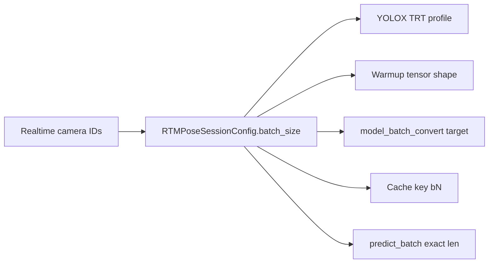
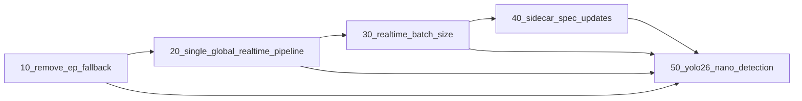

---
name: Realtime Batch Size Config
overview: Replace max_batch_size with batch_size on skellytracker session configs. batch_size is exact session batch for TRT profiles, warmup, and predict_batch. Default batch_size=1 for standalone skellytracker; freemocap derives batch_size=len(resolved_ids) at session create (not stored in config). Benches use one session per batch size. No backwards compatibility. Requires plans 10 and 20 first.
todos:
  - id: rename-rtmpose-session-config
    content: Rename max_batch_size to batch_size (default 1); expose RTMPoseSession.batch_size property (required for freemocap gating); fix warmup_image_shape comment
    status: pending
  - id: rename-composite-session-config
    content: Rename CompositeGPUSessionConfig.max_batch_size to batch_size (default 1); v1 rename + bench only — no BatchSizeMismatchError on CompositeGPU
    status: pending
  - id: warmup-and-trt-profile
    content: Warmup at config.batch_size only; YOLOX TRT profiles min=opt=max=batch_size in _trt_dynamic_batch_profile; remove multi-size warmup at {1, max_batch_size}
    status: pending
  - id: predict-batch-semantics
    content: BatchSizeMismatchError in predict_batch and predict_pose_from_bboxes; freemocap infer_or_skip_batch catches mismatch internally (kind=catch_mismatch); _run logs + publish_skipped_batch + continue; OOM wraps infer_or_skip_batch only
    status: pending
  - id: bench-one-session-per-batch
    content: Refactor bench_rtmpose_session.py and bench_composite_gpu.py to create a new session per batch size (Option A); single-image baseline uses batch_size=1 session
    status: pending
  - id: freemocap-derived-batch-size
    content: Remove max_batch_size from Pydantic/Redux/ExecutionProviderConfigPanel; derive batch_size=len(resolved_ids) at session create; wire _build_session on manager recreate path
    status: pending
  - id: skeleton-node-gating
    content: realtime_skeleton_batch_logic (should_run_inference, publish_skipped_batch, infer_or_skip_batch); wire _run to outcome model; Approach A empty-read early exit in _run; OOM wraps infer_or_skip_batch
    status: pending
  - id: tests
    content: test_rtmpose_batch_size.py; test_realtime_skeleton_inference_node batch_logic; _build_session test update in test_system_gpu_and_rtmpose_config.py
    status: pending
isProject: false
---

# Realtime Batch Size Config

## Motivation

Today freemocap realtime passes `max_batch_size` from [`RealtimeSkeletonInferenceNodeConfig`](../freemocap/freemocap/core/pipeline/realtime/realtime_skeleton_inference_node_config.py) into `RTMPoseSessionConfig`, and skellytracker uses it for YOLOX TRT dynamic-batch profiles and multi-size warmup:

```355:362:../freemocap/freemocap/core/pipeline/realtime/realtime_skeleton_inference_node.py
    session_config = RTMPoseSessionConfig(
        mode=skel_config.mode,
        detector_model=skel_config.detector_model,
        pose_model=skel_config.pose_model,
        execution_provider=inf_config.execution_provider,
        engine_cache_dir=inf_config.engine_cache_dir,
        max_batch_size=inf_config.max_batch_size,
```

The name `max_batch_size` implies an upper bound, but realtime needs an **exact** session batch — the number of active cameras. Rename to `batch_size` on skellytracker session configs (default `1` for standalone use). Freemocap derives `batch_size=len(resolved_ids)` at session create (from explicit `realtimeCameraIds` on apply) and removes the stored config field. Skellytracker and freemocap ship together; no backwards-compatibility shim.

This work was extracted from [50_yolo26_nano_detection.plan.md](50_yolo26_nano_detection.plan.md). YOLO26 and future sidecar-backed detectors depend on it as a prerequisite.

## Prerequisite Plans

Complete before freemocap batch-size wiring:

- [**10 — Remove EP fallback**](10_remove_ep_fallback.plan.md) — strict single-provider ORT session creation (skellytracker); freemocap worker strict mode.
- [**20 — Single global realtime pipeline**](20_single_global_realtime_pipeline.plan.md) — at most one `RealtimePipeline` in the manager; `_apply_pipeline_config` / `needs_recreate`; remove `cameraGroupId`; zero-camera apply rejected; last-camera block while connected; skeleton node no config pubsub; pipeline error UX; worker-start RTMPose session validation remains unchanged.



## Scope

### In scope

| Layer | Change |
|-------|--------|
| `RTMPoseSessionConfig` / `CompositeGPUSessionConfig` | `max_batch_size` → `batch_size`; **default `1`** for standalone callers |
| `warmup_image_shape` comment | Replace stale "actual inputs can be any shape" — batch dim is fixed at `batch_size` |
| `build_tuned_ort_session` / `_trt_dynamic_batch_profile` | Rename `max_batch_size` → `batch_size`; YOLOX TRT **min = opt = max = batch_size** |
| `RTMPoseSession._warmup()` | Warm at `config.batch_size` only |
| `RTMPoseSession.predict_batch()` | Requires `len(images) == batch_size`; `BatchSizeMismatchError` on non-empty mismatch; `[]` on empty |
| `RTMPoseSession.predict_pose_from_bboxes()` | Same exact-batch validation as `predict_batch` (today bypasses it via `_estimate_pose_batched`); `[]` on empty |
| `RTMPoseSession.batch_size` | **Required** `@property` — freemocap gating reads session, not persisted config (section 1) |
| Freemocap | **Remove** `max_batch_size` from all persisted config; derive `batch_size=len(resolved_ids)` at session create only; wire `_build_session(..., batch_size=len(camera_ids))` on manager recreate ([20_single_global_realtime_pipeline.plan.md](20_single_global_realtime_pipeline.plan.md) prerequisite) |
| Bench scripts / tests | One session per batch size (section 4); update all `max_batch_size` references |

### Out of scope

- Sidecar `batching.batch_size` / `model_batch_convert()` integration — [50_yolo26_nano_detection.plan.md](50_yolo26_nano_detection.plan.md)
- Eager session validation on apply — not planned. Plan 20 keeps current worker-start RTMPose session construction; this plan only changes the batch-size value passed when that worker creates the session.
- **UI batch size control** — batch size is never user-configurable; `gpu-capabilities` `fixed_batch_sizes` describes EP capabilities, not a realtime batch slider (no UI work for batch size in this plan)
- **[future_streaming_pipeline_implementation.plan.md](future_streaming_pipeline_implementation.plan.md) — ignore for this plan.** Implement ring-buffer skeleton-node behavior only (`_read_frames`, gate, full-camera `None` publish). Do not add `use_streaming_pipeline`, streaming graph nodes, ring-buffer streaming executor, or wait-for-full-batch streaming policy from that document. If the streaming plan references `batch_size`, treat this plan as the authority for batch semantics; do not block on or implement streaming-plan freemocap changes here.

## Skellytracker Implementation

### 1. Rename `max_batch_size` → `batch_size` on session configs

**Files:**

- [`skellytracker/trackers/rtmpose_tracker/rtmpose_session.py`](skellytracker/trackers/rtmpose_tracker/rtmpose_session.py) — `RTMPoseSessionConfig`
- [`skellytracker/trackers/composite_gpu_tracker/composite_gpu_session.py`](skellytracker/trackers/composite_gpu_tracker/composite_gpu_session.py) — `CompositeGPUSessionConfig`
- [`skellytracker/utilities/gpu_utils/ort_session_utils.py`](skellytracker/utilities/gpu_utils/ort_session_utils.py) — `build_tuned_ort_session(batch_size=...)` and `_trt_dynamic_batch_profile(batch_size=...)`
- [`skellytracker/trackers/rtmpose_tracker/bench_rtmpose_session.py`](skellytracker/trackers/rtmpose_tracker/bench_rtmpose_session.py)
- [`skellytracker/trackers/composite_gpu_tracker/bench_composite_gpu.py`](skellytracker/trackers/composite_gpu_tracker/bench_composite_gpu.py)
- [`skellytracker/trackers/composite_gpu_tracker/composite_gpu_README.md`](skellytracker/trackers/composite_gpu_tracker/composite_gpu_README.md)
- All tests referencing `max_batch_size`
- Session startup log label (`max_batch` → `batch_size`) in [`rtmpose_session.py`](skellytracker/trackers/rtmpose_tracker/rtmpose_session.py) and [`composite_gpu_session.py`](skellytracker/trackers/composite_gpu_tracker/composite_gpu_session.py)
- Pose-model `build_tuned_ort_session(..., batch_size=...)` call sites (kwarg rename; no TRT profile on pose)

```python
# Before
max_batch_size: int = 4

# After — requires Field from pydantic
batch_size: int = Field(default=1, ge=1)  # default for standalone; freemocap passes len(resolved_ids)
```

Rules:

- **Remove** `max_batch_size` from configs and APIs — do not keep both fields.
- **`batch_size` default is `1`** (was `4`). Standalone skellytracker callers rely on this default and do not pass `batch_size` explicitly:
  - `RTMPoseSession.predict_single()` → `predict_batch([image])` — **only valid when `session.batch_size == 1`**; raises `BatchSizeMismatchError` on multi-camera sessions (use `predict_batch` instead)
  - [`RTMPoseDetector`](skellytracker/trackers/rtmpose_tracker/rtmpose_detector.py) / webcam demo (`python -m skellytracker`)
  - [`CompositeGPUDetector`](skellytracker/trackers/composite_gpu_tracker/composite_gpu_detector.py) via default `CompositeGPUSessionConfig`
  - Single-image GPU tests (e.g. [`test_rtmpose_session_predict_batch_timing.py`](skellytracker/tests/test_rtmpose_session_predict_batch_timing.py))
- **Freemocap realtime always passes `batch_size=len(resolved_ids)` explicitly** at session create (`resolved_ids` from apply’s `realtimeCameraIds`) — never relies on the skellytracker default. In the skeleton worker, `len(camera_ids) == len(resolved_ids)` at spawn.
- `batch_size` drives YOLOX TRT `trt_set_batch_profile`, pre-NMS session profile, warmup, and fixed-batch detector sessions (YOLO26).
- **`batch_size >= 1`** enforced on `RTMPoseSessionConfig` via Pydantic (`Field(ge=1)`). Freemocap rejects zero-camera apply per [20_single_global_realtime_pipeline.plan.md](20_single_global_realtime_pipeline.plan.md).
- Update stale `warmup_image_shape` comment (see section 2).

#### `RTMPoseSession.batch_size` property (required)

After the derived-only freemocap model, **no persisted config carries batch size**. The skeleton inference worker must gate on the **live session**, not pipeline config or `RTMPoseSessionConfig` after create.

**Implement in** [`rtmpose_session.py`](skellytracker/trackers/rtmpose_tracker/rtmpose_session.py):

```python
@property
def batch_size(self) -> int:
    return self.config.batch_size
```

| Consumer | Use | Do **not** use |
|----------|-----|----------------|
| Freemocap skeleton node partial-read gating (section 6) | `len(images) == len(camera_ids) == session.batch_size` | `pipeline_config.*`; zip-to-subset on partial read |
| `BatchSizeMismatchError` messages / logs | `session.batch_size` as expected count | — |
| Tests | Assert property matches value at `RTMPoseSession.create()` | Stale config fixture fields |

**Checklist item:** grep freemocap skeleton node — infer gate must compare all three counts; skip publish must use full `camera_ids`, not `ordered_camera_ids`.

### 2. Warmup, TRT profiles, and config comments

**Files:**

- [`skellytracker/trackers/rtmpose_tracker/rtmpose_session.py`](skellytracker/trackers/rtmpose_tracker/rtmpose_session.py)
- [`skellytracker/utilities/gpu_utils/ort_session_utils.py`](skellytracker/utilities/gpu_utils/ort_session_utils.py) — `_trt_dynamic_batch_profile`, `build_tuned_ort_session`

#### Warmup

- Replace multi-size warmup `sorted({1, max(1, config.max_batch_size)})` with a single warmup at `config.batch_size`.
- Pass `batch_size=config.batch_size` into `build_tuned_ort_session(..., trt_set_batch_profile=True)` for YOLOX detector and pre-NMS sessions.
- YOLO26 warmup dtype branching stays in the YOLO26 plan; this plan owns the batch dimension only.

#### YOLOX TRT optimization profiles — exact batch (min = opt = max)

Today [`_trt_dynamic_batch_profile`](skellytracker/utilities/gpu_utils/ort_session_utils.py) sets a **1..N range**:

```python
min_str = f"{name}:1x{fixed_str}"           # min = 1
opt_str = f"{name}:{max_batch_size}x{fixed_str}"
max_str = f"{name}:{max_batch_size}x{fixed_str}"
```

That matched the old `max_batch_size` upper-bound model where `predict_batch` accepted any `len(images)` from 1 to N. Multi-size warmup at `{1, N}` compensated by touching both ends of the profile.

**Decision: pin all three profile points to `batch_size`.** Do **not** keep a 1..N range.

```python
# After — rename kwarg max_batch_size → batch_size
shape = f"{batch_size}x{fixed_str}"
min_str = f"{name}:{shape}"
opt_str = f"{name}:{shape}"
max_str = f"{name}:{shape}"
```

**Why not keep min=1:**

| Reason | Detail |
|--------|--------|
| Contract | `predict_batch` only runs at `len(images) == batch_size`; batch=1 never occurs on a `batch_size=4` session |
| TRT optimization | min=1 steers TensorRT toward kernels tuned for batch=1, hurting throughput at the actual camera count |
| Consistency | Single warmup at `batch_size` + single profile point avoids the old split-brain between profile extremes and runtime batch |
| Session lifecycle | Camera-count changes recreate the session with a new `batch_size` — no need for one session to serve multiple batch widths |

Rename `_trt_dynamic_batch_profile(..., max_batch_size=...)` → `batch_size=...` and update its docstring (drop "batch range from 1 to …").

**CompositeGPU (v1):** rename `max_batch_size` → `batch_size` and bench Option A only. **Do not** add `BatchSizeMismatchError` or exact-batch validation to `CompositeGPUSession.predict_batch()` in this plan — CompositeGPU is not used for multi-camera freemocap realtime today.

**YOLO26 fixed-batch detectors:** no dynamic TRT batch profile coercion (see [50_yolo26_nano_detection.plan.md](50_yolo26_nano_detection.plan.md)); this subsection applies to YOLOX detector + pre-NMS sessions only.

#### Config comments

```python
# Used only to size the warmup batch — actual inputs can be any shape.
warmup_image_shape: tuple[int, int] = (720, 1280)
```

  Under exact-batch semantics, `predict_batch` requires `len(images) == batch_size`; only H/W may vary per image. Replace with something like:

```python
# Synthetic warmup frame spatial size (H, W). Batch dimension is always config.batch_size.
warmup_image_shape: tuple[int, int] = (720, 1280)
```

  Apply the same comment fix on [`composite_gpu_session.py`](skellytracker/trackers/composite_gpu_tracker/composite_gpu_session.py) if an equivalent comment exists.

### 3. Exact-batch `predict_batch()` semantics and error contract

**Files:**

- [`skellytracker/trackers/rtmpose_tracker/rtmpose_session.py`](skellytracker/trackers/rtmpose_tracker/rtmpose_session.py) — `predict_batch()` validation
- New: [`skellytracker/trackers/rtmpose_tracker/rtmpose_session_errors.py`](skellytracker/trackers/rtmpose_tracker/rtmpose_session_errors.py) — `BatchSizeMismatchError`
- [`realtime_skeleton_batch_logic.py`](../freemocap/freemocap/core/pipeline/realtime/realtime_skeleton_batch_logic.py) — `infer_or_skip_batch` catches `BatchSizeMismatchError` (section below)

**Import (freemocap batch logic only — not the worker `_run` loop):**

```python
from skellytracker.trackers.rtmpose_tracker.rtmpose_session_errors import BatchSizeMismatchError
```

Export from `rtmpose_session_errors.py` (re-export in `rtmpose_session.py` optional). `infer_or_skip_batch` must catch this **type**, not broad `ValueError` or `Exception`. On `catch_mismatch`, copy `exc.actual` / `exc.expected` into the outcome (see `SkeletonBatchOutcome` below) so `_run` can log without re-catching.

**Import boundary (fix for split responsibilities):**

| Module | Imports `BatchSizeMismatchError`? |
|--------|-----------------------------------|
| [`realtime_skeleton_batch_logic.py`](../freemocap/freemocap/core/pipeline/realtime/realtime_skeleton_batch_logic.py) | **Yes** — only freemocap module that catches it |
| [`realtime_skeleton_inference_node.py`](../freemocap/freemocap/core/pipeline/realtime/realtime_skeleton_inference_node.py) | **No** — imports `infer_or_skip_batch`, `publish_skipped_batch` from batch logic only |
| Tests | Import from `rtmpose_session_errors` when asserting skellytracker raise; from batch logic when asserting outcome |

**Reference `infer_or_skip_batch` (mismatch + success — section 6 success path lives here):**

```python
def infer_or_skip_batch(
    *,
    frame_number: int,
    images: list[np.ndarray],
    ordered_camera_ids: list[CameraIdString],
    camera_ids: list[CameraIdString],
    session: RTMPoseSession,
) -> SkeletonBatchOutcome:
    if not should_run_inference(images, camera_ids, session):
        return SkeletonBatchOutcome(kind="skip")

    try:
        batch_results = session.predict_batch(images)
    except BatchSizeMismatchError as exc:
        return SkeletonBatchOutcome(
            kind="catch_mismatch",
            mismatch_actual=exc.actual,
            mismatch_expected=exc.expected,
        )

    # Success — zip moved from worker L290-300 today; no setdefault loop on full read
    per_camera_skeleton: dict[CameraIdString, BaseObservation | None] = {}
    for camera_id, image, (keypoints, scores) in zip(
        ordered_camera_ids, images, batch_results
    ):
        per_camera_skeleton[camera_id] = RTMPoseObservation.from_detection_results(
            frame_number=frame_number,
            keypoints=keypoints,
            scores=scores,
            image_size=(int(image.shape[0]), int(image.shape[1])),
        )
    # Full-read invariant: gate passed ⇒ ordered_camera_ids == camera_ids (same order)
    if __debug__:
        assert len(per_camera_skeleton) == len(camera_ids)
    return SkeletonBatchOutcome(kind="infer", per_camera_skeleton=per_camera_skeleton)
```

**Module boundary:** `infer_or_skip_batch` imports `RTMPoseObservation` from skellytracker and builds `BaseObservation` dicts — intentional coupling so `_run` only publishes outcomes. Keep batch logic in freemocap (not skellytracker); do not move observation construction back into the worker.

`BatchSizeMismatchError` is a subclass of `ValueError` but must **not** be caught by a broad `except ValueError` in this function — catch `BatchSizeMismatchError` first, then let other errors propagate to `_run`'s outer handler.

#### When `len(images) == batch_size`

Run inference normally.

#### When `len(images) == 0`

| Layer | Behavior |
|-------|----------|
| **Skellytracker** | **No-op** — `return []` (unchanged). No exception. Applies to **`predict_batch` and `predict_pose_from_bboxes`** — empty input must not raise `BatchSizeMismatchError`. |
| **Freemocap** | **Approach A (section 6):** `_run` early exit when `not images` — `publish_skipped_batch`, `continue`; **never** call `infer_or_skip_batch` with an empty list. |

#### When `len(images) != batch_size` and `len(images) > 0` — split by layer

Skellytracker and freemocap responsibilities are **different**. The mismatch is non-breaking for the realtime pipeline: the batch is dropped, the aggregator still gets a message, and the worker continues on the next frame.

##### Skellytracker behavior (strict — reject batch)

| Rule | Detail |
|------|--------|
| **Raise** | `BatchSizeMismatchError` at the top of `RTMPoseSession.predict_batch()` before any preprocess or ORT `session.run` |
| **Do not process** | No padding, no subset inference, no truncation — zero GPU work for that call |
| **Non-breaking** | Means the library **never** silently processes a wrong-size batch; it always fails fast with a typed exception. Does **not** mean freemocap may ignore the error — see below. |

```python
# rtmpose_session.py — first lines of predict_batch()
n = len(images)
if n == 0:
    return []
if n != self.batch_size:
    raise BatchSizeMismatchError(actual=n, expected=self.batch_size)
# ... existing inference ...
```

##### Freemocap behavior (graceful — drop batch and continue)

| Rule | Detail |
|------|--------|
| **Prefer avoid** | `infer_or_skip_batch` returns `kind="skip"` when `not should_run_inference(...)` — partial reads never call skellytracker |
| **If `BatchSizeMismatchError` raised** | `infer_or_skip_batch` returns `kind="catch_mismatch"` (caught internally); `_run` logs warning, publishes full-camera `None`, **continue** — no re-raise, no retry |
| **Log** | `logger.warning(...)` on `catch_mismatch` with `outcome.mismatch_actual` / `outcome.mismatch_expected` from `infer_or_skip_batch` |
| **Publish** | `publish_skipped_batch` — same full-camera `None` shape as partial-read skip |
| **Continue** | `continue` main loop — next `ProcessFrameNumberMessage` |
| **Do not** | `kill_everything()`, session restart, or retry the same frame |

**No retry:** one skip/mismatch → one publish → next frame.

##### `_run` loop — use `infer_or_skip_batch` outcome model

Helpers live in [`realtime_skeleton_batch_logic.py`](../freemocap/freemocap/core/pipeline/realtime/realtime_skeleton_batch_logic.py) (public names: `should_run_inference`, `publish_skipped_batch`, `infer_or_skip_batch`). **`_run` does not call `session.predict_batch` directly** and does not `except BatchSizeMismatchError` at the loop level — mismatch is handled inside `infer_or_skip_batch`.

**Approach A — empty read stays in `_run`:** after `_read_frames`, if `not images`, `publish_skipped_batch` + `continue` **without** calling `infer_or_skip_batch`. Only non-empty reads enter `infer_or_skip_batch`. See section 6.

```python
images, ordered_camera_ids = _read_frames(...)
if timer is not None:
    timer.record("frame_read", ...)

t_inf = time.perf_counter() if timer is not None else 0.0
if not images:
    publish_skipped_batch(
        frame_number=requested_frame_number,
        camera_ids=camera_ids,
        pub=skeleton_result_pub,
    )
    if timer is not None:
        timer.record("predict_batch", (time.perf_counter() - t_inf) * 1e3)
        timer.maybe_flush(publication_queue=timing_pub, node_kind="skeleton_inference")
    continue

try:
    outcome = infer_or_skip_batch(
        frame_number=requested_frame_number,
        images=images,
        ordered_camera_ids=ordered_camera_ids,
        camera_ids=camera_ids,
        session=session,
    )
except Exception as mem_err:
    # OOM branch only — MemoryError / BFCArena / Available memory
    ...
    session = _build_session(pipeline_config, batch_size=len(camera_ids))
    continue

if timer is not None:
    inf_ms = (time.perf_counter() - t_inf) * 1e3
    timer.record("predict_batch", inf_ms)
    if outcome.kind == "infer":
        timer.record("human_detection_preprocess", session.last_human_detection_preprocess_ms)
        timer.record("human_detection", session.last_human_detection_ms)
        timer.record("human_detection_postprocess", session.last_human_detection_postprocess_ms)
        timer.record("pose_estimation_preprocess", session.last_pose_estimation_preprocess_ms)
        timer.record("pose_estimation", session.last_pose_estimation_ms)
        timer.record("pose_estimation_postprocess", session.last_pose_estimation_postprocess_ms)

if outcome.kind == "skip":
    publish_skipped_batch(frame_number=requested_frame_number, camera_ids=camera_ids, pub=skeleton_result_pub)
    if timer is not None:
        timer.maybe_flush(publication_queue=timing_pub, node_kind="skeleton_inference")
    continue
if outcome.kind == "catch_mismatch":
    logger.warning(
        f"RealtimeSkeletonInferenceNode [{camera_group_id}] batch size mismatch "
        f"frame={requested_frame_number} actual={outcome.mismatch_actual} "
        f"expected={outcome.mismatch_expected} — dropping batch"
    )
    publish_skipped_batch(frame_number=requested_frame_number, camera_ids=camera_ids, pub=skeleton_result_pub)
    if timer is not None:
        timer.maybe_flush(publication_queue=timing_pub, node_kind="skeleton_inference")
    continue

skeleton_result_pub.put(SkeletonInferenceResultMessage(...))
if timer is not None:
    timer.maybe_flush(publication_queue=timing_pub, node_kind="skeleton_inference")
```

##### Pipeline timing — always record stage wall time

[`PipelineStagesView`](../freemocap/freemocap-ui/src/components/framerate-viewer/PipelineStagesView.tsx) toggles `log_pipeline_times` via `applyRealtimePipeline` — that change triggers a **full pipeline restart** ([20_single_global_realtime_pipeline.plan.md](20_single_global_realtime_pipeline.plan.md) — `log_pipeline_times` in `skeleton_session_config_changed`). Expect a brief inference gap when enabling/disabling timing.

**Rule:** start `t_inf` **before** the empty-read branch so ring-buffer races still record `predict_batch` wall time. For non-empty reads, wrap **`infer_or_skip_batch(...)`** and **always** `timer.record("predict_batch", inf_ms)` for every outcome (`skip`, `catch_mismatch`, `infer`). Do not only time successful ORT runs.

- **Empty read (Approach A):** early `publish_skipped_batch` + `predict_batch` timing + `maybe_flush` — no `infer_or_skip_batch` call.
- On `kind=="infer"` only: also record `session.last_*` substage timings (today L283–288).
- On partial-read skip / mismatch: substage timings zero / omitted; `predict_batch` wall time still published.
- Call `timer.maybe_flush(...)` on **all** paths (empty, skip, mismatch, infer) when `timer is not None`.

##### Integrate with existing OOM `try/except`

Wrap **`infer_or_skip_batch(...)`** in the OOM `try/except` — not raw `predict_batch`. `BatchSizeMismatchError` is caught inside `infer_or_skip_batch` and never reaches the OOM handler.

```python
try:
    outcome = infer_or_skip_batch(...)
except Exception as mem_err:
    if not (isinstance(mem_err, MemoryError) or "BFCArena" in str(mem_err) or ...):
        raise
    # existing OOM restart path — _build_session(..., batch_size=len(camera_ids))
```

**OOM session rebuild:** the existing MemoryError handler must call `_build_session(pipeline_config, batch_size=len(camera_ids))` — same signature as worker startup. Today L266 calls `_build_session(pipeline_config)` with no `batch_size`; after this plan that would recreate a `batch_size=1` session and break multi-camera inference on the next frame.

#### `BatchSizeMismatchError` definition

```python
class BatchSizeMismatchError(ValueError):
    """predict_batch received a non-empty image list that does not match session batch_size."""

    def __init__(self, *, actual: int, expected: int, message: str | None = None) -> None:
        self.actual = actual
        self.expected = expected
        super().__init__(
            message
            or f"predict_batch expected {expected} images (session batch_size), got {actual}"
        )
```

- Raise at the top of `RTMPoseSession.predict_batch()` and **`predict_pose_from_bboxes()`** before any preprocess or ORT `session.run`. `predict_pose_from_bboxes` today bypasses `predict_batch` and calls `_estimate_pose_batched` directly — apply **`len(images) == len(bboxes_per_image) == batch_size`** (and `len(images)==0` → `return []` on both entry points). Reject mismatched bbox list length the same way as image count.

#### Tests

See [Tests](#tests) (Skellytracker + `infer_or_skip_batch` cases).

### 4. Bench scripts — one session per batch size (Option A)

Exact-batch semantics break today's bench pattern: a single session created with `max_batch_size=max(batch_sizes)` can sweep N=1,2,3,4,8 on one session. After this plan, `predict_batch` only accepts `len(images) == batch_size`, so that sweep would error on every N except the session's fixed batch.

**Adopt Option A:** create, warm up, benchmark, and tear down a **separate session per batch size**. This matches realtime behavior (changing camera count recreates the session).

**Files:**

- [`skellytracker/trackers/rtmpose_tracker/bench_rtmpose_session.py`](skellytracker/trackers/rtmpose_tracker/bench_rtmpose_session.py)
- [`skellytracker/trackers/composite_gpu_tracker/bench_composite_gpu.py`](skellytracker/trackers/composite_gpu_tracker/bench_composite_gpu.py)

**Before (one session, multi-N sweep):**

```python
session = RTMPoseSession.create(
    RTMPoseSessionConfig(..., max_batch_size=max(batch_sizes)),
)
session.predict_single(img)          # len=1 — OK when max >= 1
for n in batch_sizes:
    session.predict_batch(batch[:n]) # any n <= max — OK
```

**After (one session per N):**

```python
# Single-image baseline — dedicated batch_size=1 session
single_session = RTMPoseSession.create(RTMPoseSessionConfig(..., batch_size=1))
for i in range(iterations):
    single_session.predict_single(pool[i % len(pool)])

# Batched sweep — new session per batch size
for n in batch_sizes:
    session = RTMPoseSession.create(RTMPoseSessionConfig(..., batch_size=n))
    for i in range(iterations):
        batch = [pool[(i + k) % len(pool)] for k in range(n)]
        session.predict_batch(batch)  # len(batch) == n == session.batch_size
    del session  # release GPU memory before next N
```

**Reporting:** keep the same printed columns (`predict_single`, `predict_batch(N=…)` per-image mean). Note in bench output that each N used its own session (session-create + warmup cost is excluded from timed loops, or reported separately).

**Tradeoff:** bench runs slower (session create + TRT compile per N). Acceptable — it reflects production cost when camera count changes.

## Freemocap Implementation

Freemocap lives in sibling checkout `../freemocap`. Update in the same change set as skellytracker.

### 5. Derive `batch_size` from camera count — not in persisted config

`batch_size` must **not** live in any freemocap config surface that gets saved, serialized, or round-tripped through the UI/API. It is computed at session create from the active realtime camera set and passed straight into `RTMPoseSessionConfig`.

#### Remove stored defaults (today vs after)

Today two unrelated stored defaults exist; both are removed — neither is meaningful once batch is derived-only:

| Location | Today | After |
|----------|-------|-------|
| [`RealtimeSkeletonInferenceNodeConfig`](../freemocap/freemocap/core/pipeline/realtime/realtime_skeleton_inference_node_config.py) | `max_batch_size: int = 8` | **Field deleted** — no `batch_size` on this model |
| [`defaultRealtimePipelineConfig`](../freemocap/freemocap-ui/src/store/slices/realtime/realtime-types.ts) | `skeleton_inference_node_config.max_batch_size: 8` | **Key deleted** from `SkeletonInferenceNodeConfig` and defaults |
| [`RTMPoseSessionConfig`](skellytracker/trackers/rtmpose_tracker/rtmpose_session.py) | `max_batch_size: int = 4` | `batch_size: int = Field(default=1, ge=1)` — skellytracker library default for standalone callers only; freemocap never relies on it |

The freemocap `8` vs skellytracker `4` mismatch becomes irrelevant: freemocap stops storing batch size entirely; skellytracker's default changes to `1` for webcam/tests and is overridden explicitly in realtime.

#### What must not persist `batch_size`

- Pydantic pipeline config models (`RealtimeSkeletonInferenceNodeConfig`, `RealtimePipelineConfig` subtree)
- Redux `defaultRealtimePipelineConfig` and `SkeletonInferenceNodeConfig` TypeScript interface
- `ExecutionProviderConfigPanel` config merges (today re-injects `max_batch_size: 8` on every EP change)
- `POST /realtime/apply` request body — `realtimeConfig` must not carry batch size; derive from `realtimeCameraIds` on the server
- Browser / in-memory state — **remove** `max_batch_size` from Redux defaults and panel merges (no persisted batch field). Realtime `pipelineConfig` lives in Redux only — **not** in localStorage (camera `realtimeEnabled` persists via [`camera-settings-storage.ts`](../freemocap/freemocap-ui/src/store/slices/cameras/camera-settings-storage.ts)). **Do not** add `extra="forbid"` on Pydantic models solely to reject stale `max_batch_size` — see [Second review gaps](#second-review-gaps-incorporated) § stale config.

`batch_size` may appear only as a **runtime value**: argument to `_build_session(...)`, field on `RTMPoseSessionConfig` at create time, and `session.batch_size` after the session exists.

#### Files to change

- [`realtime_skeleton_inference_node_config.py`](../freemocap/freemocap/core/pipeline/realtime/realtime_skeleton_inference_node_config.py) — **delete** `max_batch_size` field and stale `min(num_cameras, max_batch_size)` comment (that logic was never implemented).
- [`realtime_skeleton_inference_node.py`](../freemocap/freemocap/core/pipeline/realtime/realtime_skeleton_inference_node.py) — `_build_session(pipeline_config, batch_size=len(camera_ids))`; pass `batch_size` into `RTMPoseSessionConfig`. Wire `_run` to [`realtime_skeleton_batch_logic.py`](../freemocap/freemocap/core/pipeline/realtime/realtime_skeleton_batch_logic.py). **OOM recovery path** (L266 today): same `_build_session(..., batch_size=len(camera_ids))` with spawn-time frozen config.
- **New:** [`realtime_skeleton_batch_logic.py`](../freemocap/freemocap/core/pipeline/realtime/realtime_skeleton_batch_logic.py) — `should_run_inference`, `publish_skipped_batch`, `infer_or_skip_batch` (Tests section).
- [`realtime-types.ts`](../freemocap/freemocap-ui/src/store/slices/realtime/realtime-types.ts) — remove `max_batch_size` from `SkeletonInferenceNodeConfig` interface and `defaultRealtimePipelineConfig.skeleton_inference_node_config`. **No UI control for batch size** — only remove dead field; do not add a batch-size picker.
- [`ExecutionProviderConfigPanel.tsx`](../freemocap/freemocap-ui/src/components/control-panels/realtime-panel/ExecutionProviderConfigPanel.tsx) — remove `max_batch_size: … ?? 8` from `skeleton_inference_node_config` merge.
- [`pyproject.toml`](../freemocap/pyproject.toml) — bump **skellytracker** git ref / version for coordinated release (see Validation Checklist).
- [`realtime_router.py`](../freemocap/freemocap/api/http/realtime/realtime_router.py) / apply path — resolve `batch_size = len(resolved_ids)` at session create on success path (zero-camera 422 is in [20_single_global_realtime_pipeline.plan.md](20_single_global_realtime_pipeline.plan.md)).
- Grep freemocap for `max_batch_size` / `batch_size` in config merge paths (`realtime-slice`, saved-state hydration, any panel that spreads `skeleton_inference_node_config`).

Zero-camera apply, `guardRealtimeApply`, `cameraGroupId` removal, pipeline manager singleton, skeleton pubsub removal, and pipeline error UI — see [20_single_global_realtime_pipeline.plan.md](20_single_global_realtime_pipeline.plan.md).

**Rule:** freemocap **always** passes `batch_size=len(resolved_ids)` explicitly into `RTMPoseSessionConfig` at session create when `len(resolved_ids) >= 1` — never reads batch size from persisted config and never relies on skellytracker's library default of `1`.

### 6. Skeleton-node partial-read gating and full-camera `None` publish

**File:** [`realtime_skeleton_inference_node.py`](../freemocap/freemocap/core/pipeline/realtime/realtime_skeleton_inference_node.py)

`_read_frames()` returns parallel `(images, ordered_camera_ids)` lists containing **only cameras whose ring buffer had a readable frame**. Cameras that missed the frame are omitted — not represented as `None` in the return value. With 3 pipeline cameras, a partial read might return `len(images)==2` while `len(camera_ids)==3`.

#### Today (bugs to fix)

| Case | Current behavior | Problem |
|------|------------------|---------|
| `len(images) == 0` | Early exit in `_run` (Approach A) ✓ | Keep — use `publish_skipped_batch`; do **not** call `infer_or_skip_batch` |
| `0 < len(images) < len(camera_ids)` | Calls `predict_batch(images)`, zips `ordered_camera_ids` only | **Wrong** — cameras that failed read get no entry; cameras that succeeded get skeleton for a **partial batch** misaligned with `session.batch_size` |

#### Inference gate — triple equality

Call `predict_batch` **only** when all three counts agree:

```text
len(images) == len(camera_ids) == session.batch_size
```

| Symbol | Meaning |
|--------|---------|
| `camera_ids` | Full list of cameras attached to this skeleton node (pipeline scope) |
| `len(images)` / `ordered_camera_ids` | Cameras that `_read_frames` actually returned for `requested_frame_number` |
| `session.batch_size` | Fixed at `RTMPoseSession.create()` from `batch_size=len(camera_ids)` |

After correct `_build_session` wiring, `len(camera_ids) == session.batch_size` is an invariant for the worker lifetime. **`batch_size` is not independent of camera set** — it is always `len(pipeline_camera_ids)` from apply’s `realtimeCameraIds`. The manager recreates the sole global pipeline when `needs_recreate` ([20_single_global_realtime_pipeline.plan.md](20_single_global_realtime_pipeline.plan.md) — camera group, camera set, or skeleton session config change). The runtime gate still checks all three counts so partial reads and session bugs fail safe.

#### Temporal frame mismatch (out of scope)

The triple gate checks **counts only**, not per-camera frame sync. [`_read_frames`](../freemocap/freemocap/core/pipeline/realtime/realtime_skeleton_inference_node.py) may include a camera whose ring buffer returned a **different** `frame_number` than requested (warning + use available frame). `len(images)` can equal `len(camera_ids)` while images are not the same logical multiframe timestamp. **Not in scope for this plan** — do not add timestamp validation here. Document as known ring-buffer behavior.

#### Empty read — Approach A (early exit in `_run`)

**Decision: Approach A** — keep today's fast path; do **not** route empty reads through `infer_or_skip_batch`.

| Step | Owner |
|------|-------|
| `_read_frames` returns `images==[]` | `_run` |
| `publish_skipped_batch` + `continue` | `_run` (replace inline `SkeletonInferenceResultMessage` dict comp at L228–237 with helper call) |
| `infer_or_skip_batch` | **Not called** when `len(images)==0` |

`should_run_inference` still uses `n > 0` so the helper rejects empty lists if ever called (defense in depth). Unit tests for `infer_or_skip_batch` use **partial** non-empty reads for `kind=="skip"`, not empty lists.

#### Skip / catch paths — `realtime_skeleton_batch_logic`

Implement in [`realtime_skeleton_batch_logic.py`](../freemocap/freemocap/core/pipeline/realtime/realtime_skeleton_batch_logic.py) (imported by the worker; **public** function names):

```python
def publish_skipped_batch(*, frame_number, camera_ids, pub) -> None: ...

def should_run_inference(images, camera_ids, session) -> bool:
    n = len(images)
    return n > 0 and n == len(camera_ids) == session.batch_size

def infer_or_skip_batch(...) -> SkeletonBatchOutcome: ...
```

`infer_or_skip_batch` returns `kind="skip"` when `not should_run_inference` (**partial** read only in practice — empty reads never reach this function), `kind="catch_mismatch"` when `predict_batch` raises `BatchSizeMismatchError`, `kind="infer"` with `per_camera_skeleton` on success. See section 3 for `_run` wiring.

#### Outcome table (freemocap)

| Case | `infer_or_skip_batch` | `_run` |
|------|----------------------|--------|
| Empty read (`len(images)==0`) | **Not called** (Approach A) | `publish_skipped_batch`; record timing; `continue` |
| Partial gate skip (`0 < len < len(camera_ids)`) | `kind="skip"` | `publish_skipped_batch`; optional debug log; `continue` |
| `BatchSizeMismatchError` | `kind="catch_mismatch"` | `logger.warning`; `publish_skipped_batch`; `continue` |
| Full read + infer OK | `kind="infer"` | publish `outcome.per_camera_skeleton` |

Both skip and catch paths use **`publish_skipped_batch`** — full `{camera_id: None for camera_id in camera_ids}`, not `ordered_camera_ids`.

**Do not:** pad images, infer on a subset, retry the same frame, or omit cameras from `per_camera_skeleton` on skip.

#### Success path

When `len(images) == len(camera_ids) == session.batch_size`, a full read implies `ordered_camera_ids == camera_ids` (same order). All observation construction happens **inside** `infer_or_skip_batch` (reference implementation in section 3) — not in `_run`.

| Step | Owner | Detail |
|------|-------|--------|
| `session.predict_batch(images)` | `infer_or_skip_batch` | Only after `should_run_inference` passes |
| Zip → `RTMPoseObservation` | `infer_or_skip_batch` | `zip(ordered_camera_ids, images, batch_results)` — same as worker L292-300 today |
| `setdefault(camera_id, None)` loop | **Delete** from worker | Was compensating for partial reads (L304-305); gate makes it dead on success path |
| Publish | `_run` | `SkeletonInferenceResultMessage(per_camera_skeleton=outcome.per_camera_skeleton)` |

**Do not** duplicate the zip in `_run` after calling `infer_or_skip_batch` — single owner prevents section 3 / section 6 drift.

**Worker startup assert (debug):** after `_build_session(..., batch_size=len(camera_ids))`, assert `session.batch_size == len(camera_ids)` once at loop entry — catches wiring mistakes early.

#### Ring-buffer mode only (ignore streaming plan)

This plan targets today's **ring-buffer** `RealtimeSkeletonInferenceNode` loop: `_read_frames` → **Approach A** empty early exit **or** `infer_or_skip_batch` → publish. **Do not implement** anything from [future_streaming_pipeline_implementation.plan.md](future_streaming_pipeline_implementation.plan.md) as part of this work (no `use_streaming_pipeline`, streaming graph, shared-memory pin/release, or wait-for-all-cameras-before-submit policy).

### 7. Session recreate and `_build_session`

When realtime config changes in ways that affect `RTMPoseSession` shape, the backend must **restart the entire `RealtimePipeline`** — not hot-update the skeleton worker via pubsub.

**Prerequisite:** [20_single_global_realtime_pipeline.plan.md](20_single_global_realtime_pipeline.plan.md) owns singleton manager (`_apply_pipeline_config`, `needs_recreate`), skeleton no-config-pubsub, zero-camera apply guards, `cameraGroupId` removal, and pipeline error UX.

This plan adds on recreate (when `set(existing.camera_ids) != desired_cameras` or skeleton session config changes):

- Skeleton worker calls `_build_session(pipeline_config, batch_size=len(camera_ids))`.
- `batch_size=len(resolved_ids)` derived at session create — never from persisted config.

#### Shared `_build_session` helper (multiple call sites)

Extract session construction into one function used everywhere the worker (re)creates an `RTMPoseSession`:

```python
def _build_session(
    pipeline_config: RealtimePipelineConfig,
    *,
    batch_size: int,
) -> RTMPoseSession | None:
    ...
```

**Call sites in this plan (must all pass `batch_size=len(camera_ids)`):**

| Call site | When |
|-----------|------|
| Worker startup | `RealtimeSkeletonInferenceNode` main loop entry (L148 today) — uses spawn-time frozen `pipeline_config` |
| OOM recovery | After `del session` / `gc.collect()` in the MemoryError handler (L266 today) — same frozen config + `batch_size=len(camera_ids)` |
| Pipeline recreate | Manager `shutdown()` + `RealtimePipeline.create()` on apply when skeleton session config changes — new skeleton worker calls `_build_session` at spawn |

**Why extract now:** startup and OOM paths must stay identical; pipeline recreate spawns a fresh worker that uses the same helper at spawn. [20_single_global_realtime_pipeline.plan.md](20_single_global_realtime_pipeline.plan.md) adds a **fourth** call site (eager `RTMPoseSession.create` on the HTTP apply path) — same helper, same `batch_size=len(resolved_ids)` argument, no duplicated `RTMPoseSessionConfig` field wiring.

Keep the helper in [`realtime_skeleton_inference_node.py`](../freemocap/freemocap/core/pipeline/realtime/realtime_skeleton_inference_node.py) (or a small `rtmpose_session_factory.py` beside it if imports get crowded). Only the skeleton worker and (later) the eager apply path call it — not `RealtimePipeline.update_config`.

**This plan:** worker-side session create with derived `batch_size`. **Not this plan:** eager `RTMPoseSession.create()` on the HTTP apply path before `pipeline.start()` — that is [20_single_global_realtime_pipeline.plan.md](20_single_global_realtime_pipeline.plan.md) (see below).

## Tests

Implementation ships **with** the feature code in the same change set — follow this order:

1. **Skellytracker** — rename + `BatchSizeMismatchError` + tests.
2. **Freemocap pure module** — `realtime_skeleton_batch_logic.py` (after [20_single_global_realtime_pipeline.plan.md](20_single_global_realtime_pipeline.plan.md) lands).
3. **Unit tests** on batch logic + `_build_session` **before** wiring skeleton `_run`.
4. **Wire** skeleton node `_run` and `_build_session` with derived `batch_size`.

Singleton manager, router 422, slice reducer, and Vitest setup — see [20_single_global_realtime_pipeline.plan.md](20_single_global_realtime_pipeline.plan.md) Tests section.

All planned freemocap test files for **this** plan: `test_realtime_skeleton_inference_node.py` (batch logic only). Others live in the singleton prerequisite plan.

### Skellytracker — new [`test_rtmpose_batch_size.py`](skellytracker/tests/test_rtmpose_batch_size.py)

Mock `RTMPoseSession` ORT paths (`build_tuned_ort_session`, `session.run`) — no GPU required.

| Test | Assert |
|------|--------|
| `batch_size` property | Matches `RTMPoseSessionConfig.batch_size` at create |
| `predict_batch` empty | `[]`; no `BatchSizeMismatchError` |
| `predict_batch` mismatch | `BatchSizeMismatchError(actual=…, expected=…)`; ORT `run` not called |
| `predict_single` on `batch_size=2` session | `BatchSizeMismatchError` (only `batch_size=1` supported) |
| `predict_pose_from_bboxes` empty | `[]` |
| `predict_pose_from_bboxes` image count mismatch | `BatchSizeMismatchError`; `_estimate_pose_batched` not called |
| `predict_pose_from_bboxes` bboxes count mismatch (`len(bboxes_per_image) != batch_size`) | `BatchSizeMismatchError`; `_estimate_pose_batched` not called |
| `RTMPoseSessionConfig(batch_size=0)` | Pydantic `ValidationError` |

Also update existing tests that reference `max_batch_size` after rename.

### Freemocap — extract modules (implement before tests)

**[`realtime_skeleton_batch_logic.py`](../freemocap/freemocap/core/pipeline/realtime/realtime_skeleton_batch_logic.py)** — pure functions, no worker process:

```python
@dataclass(frozen=True)
class SkeletonBatchOutcome:
    kind: Literal["skip", "catch_mismatch", "infer"]
    per_camera_skeleton: dict[CameraIdString, BaseObservation | None] | None = None
    mismatch_actual: int | None = None   # set when kind == "catch_mismatch"
    mismatch_expected: int | None = None

def should_run_inference(images, camera_ids, session) -> bool: ...
def publish_skipped_batch(*, frame_number, camera_ids, pub) -> None: ...
def infer_or_skip_batch(*, frame_number, images, ordered_camera_ids, camera_ids, session) -> SkeletonBatchOutcome: ...
```

[`realtime_skeleton_inference_node.py`](../freemocap/freemocap/core/pipeline/realtime/realtime_skeleton_inference_node.py) `_run` — Approach A empty-read early exit + `infer_or_skip_batch` for non-empty reads; on `skip` / `catch_mismatch` calls `publish_skipped_batch` (+ warning on catch); on `infer` publishes `SkeletonInferenceResultMessage`. OOM handling stays in `_run` around the orchestration call.

### Freemocap — [`test_realtime_skeleton_inference_node.py`](../freemocap/freemocap/tests/test_realtime_skeleton_inference_node.py)

Unit-test **`realtime_skeleton_batch_logic`** only — do not spawn `_run` / multiprocessing.

| Test | Setup | Assert |
|------|-------|--------|
| `should_run_inference` full read | 3 images, 3 `camera_ids`, `session.batch_size=3` | `True` |
| `should_run_inference` partial | 2 images, 3 `camera_ids` | `False` |
| `should_run_inference` empty | 0 images | `False` (defense in depth — production empty path is `_run` Approach A) |
| `publish_skipped_batch` | mock `pub` | `SkeletonInferenceResultMessage` with `{cam: None for cam in camera_ids}` |
| `infer_or_skip_batch` skip | **partial** read mock (1–2 images, 3 `camera_ids`) | `kind=="skip"`; `session.predict_batch` not called |
| `infer_or_skip_batch` infer | full read; mock `predict_batch` return | `kind=="infer"`; all `camera_ids` in `per_camera_skeleton` |
| `infer_or_skip_batch` catch | gate would pass but `predict_batch` raises `BatchSizeMismatchError` | `kind=="catch_mismatch"`; `mismatch_actual` / `mismatch_expected` populated |
| `create` kwargs | patch `_create_worker` | worker `kwargs` omit `pipeline_config_sub` |

### Freemocap — extend [`test_system_gpu_and_rtmpose_config.py`](../freemocap/freemocap/tests/test_system_gpu_and_rtmpose_config.py)

**Update existing test** `TestBuildSessionConfig.test_build_session_passes_model_overrides_and_auto_provider` — today calls `_build_session(pipeline_config)` with no `batch_size`; after signature change it must pass an explicit batch:

```python
session = _build_session(pipeline_config, batch_size=3)
# ...
assert session_config.batch_size == 3
```

Also assert:

- `_build_session(..., batch_size=N)` passes `batch_size=N` into `RTMPoseSessionConfig` (not `max_batch_size`).
- No `max_batch_size` / persisted `batch_size` on `RealtimeSkeletonInferenceNodeConfig`.


Manager, router, Vitest, and slice tests — [20_single_global_realtime_pipeline.plan.md](20_single_global_realtime_pipeline.plan.md).

### Freemocap — schema contract

- Grep freemocap repo: zero `max_batch_size` in realtime config paths.

Singleton apply-response schema (`camera_group_id` removal) — [20_single_global_realtime_pipeline.plan.md](20_single_global_realtime_pipeline.plan.md).

## Review gaps (batch-size scope)

Singleton UX, manager, router, and Vitest review items — [20_single_global_realtime_pipeline.plan.md](20_single_global_realtime_pipeline.plan.md).

| # | Issue | Fix |
|---|-------|-----|
| 1 | Stale `max_batch_size` in apply JSON | Coordinated release + remove field from Redux defaults / panel merges; Pydantic `extra='ignore'` strips unknown keys |
| 2 | Skellytracker dependency pin | Bump [`pyproject.toml`](../freemocap/pyproject.toml) skellytracker ref in same release PR as `batch_size` rename |
| 3 | `infer_or_skip_batch` production `assert` | Use `if __debug__: assert ...` only (section 3) |
| 4 | `_build_session` test signature | Update `test_build_session_passes_model_overrides_and_auto_provider` to pass `batch_size=3` (Tests section) |

## Validation Checklist

- `rg max_batch_size skellytracker/` and freemocap return no hits in config models, UI types, Redux defaults, or panel merges.
- `rg batch_size` on freemocap `realtime-types.ts` / `realtime_skeleton_inference_node_config.py` — no persisted field (only runtime pass-through in `_build_session` / router).
- `python -m skellytracker` webcam demo runs with default `batch_size=1`.
- `pytest skellytracker/tests/test_rtmpose_session_create.py skellytracker/tests/test_rtmpose_batch_size.py`
- `pytest freemocap/tests/test_system_gpu_and_rtmpose_config.py freemocap/tests/test_realtime_skeleton_inference_node.py`
- Manual: 2-camera realtime apply → `batch_size=2`; deselect one camera via **realtime toggle** or **selection toggle** while connected → auto-apply → `batch_size=1` (requires singleton prerequisite for auto-apply UX)
- Stale `max_batch_size` in POST body or in-memory Redux `pipelineConfig` is **silently ignored** by Pydantic — coordinated release + UI removal
- Freemocap [`pyproject.toml`](../freemocap/pyproject.toml) skellytracker dependency bumped to release containing `batch_size` rename + `BatchSizeMismatchError`

## Risks

- Partial ring-buffer reads are normal under load. Freemocap skips inference and publishes full-camera `None` (non-fatal). Skellytracker still raises `BatchSizeMismatchError` if a wrong-size batch is submitted — freemocap must catch it without killing the worker.
- Skeleton-affecting apply triggers **full pipeline restart** (not in-process skeleton recreate). Expect a brief inference gap and possible TRT recompile on model/EP change — same cost as today's first skeleton node start.
- Very large camera counts may exhaust VRAM during session create — surface as recoverable startup error (see remove_ep_fallback / YOLO26 plans).
- TRT engine cache keyed by profile shapes: pinning min=opt=max may invalidate existing cached engines compiled under the old 1..N profiles (one-time recompile on first run after upgrade).
- Coordinated skellytracker + freemocap release required: remove `max_batch_size` from config models, UI types, and panel merges; bump freemocap's skellytracker dependency. Mismatched versions fail at import (`BatchSizeMismatchError`, `batch_size` field). Stale `max_batch_size` in client JSON is **dropped** by Pydantic — not a hard error; users re-apply realtime config after upgrade.

## Implementation order (sibling plans)

Ship in this sequence. Later plans depend on earlier ones for `batch_size` semantics and freemocap wiring.



| Order | Plan | Why first |
|-------|------|-----------|
| **10** | [10_remove_ep_fallback.plan.md](10_remove_ep_fallback.plan.md) | Strict ORT providers; no silent CPU fallback |
| **20** | [20_single_global_realtime_pipeline.plan.md](20_single_global_realtime_pipeline.plan.md) | One global pipeline; `_apply_pipeline_config` / `needs_recreate`; apply guards and error UX |
| **30** | [30_realtime_batch_size.plan.md](30_realtime_batch_size.plan.md) (this plan) | Rename `max_batch_size` → `batch_size`; default `1` + `Field(ge=1)`; derived-only freemocap; `RTMPoseSession.batch_size`; `BatchSizeMismatchError`; partial-read gating; `_build_session(..., batch_size=len(resolved_ids))`; bench Option A; YOLOX TRT min=opt=max |
| **40** | [40_sidecar_spec_updates.plan.md](40_sidecar_spec_updates.plan.md) | Sidecar contract (`schema_version`, `resize.interpolation`) before YOLO26 catalog loading |
| **50** | [50_yolo26_nano_detection.plan.md](50_yolo26_nano_detection.plan.md) | Fixed-batch detector consumes `RTMPoseSessionConfig.batch_size` for `model_batch_convert`, cache keys, and detector ORT sessions — assumes plans 10–40 complete |
| future | [future_streaming_pipeline_implementation.plan.md](future_streaming_pipeline_implementation.plan.md) | Ring-buffer streaming graph; after core realtime path is stable |
| future | [future_hand_and_face_detection.plan.md](future_hand_and_face_detection.plan.md) | Pose-anchored hand/face ROI refinement |

**Do not** start YOLO26 session wiring before `batch_size` rename and freemocap derived-only pass-through land — YOLO26 plan explicitly depends on this plan's semantics.

### What this plan owns vs plans 10 and 20

Plans **10**, **20**, and **30** all touch session create; they split **strictness**, **apply orchestration**, and **batch semantics**:

| Concern | [30_realtime_batch_size.plan.md](30_realtime_batch_size.plan.md) (this plan) | [10_remove_ep_fallback.plan.md](10_remove_ep_fallback.plan.md) | [20_single_global_realtime_pipeline.plan.md](20_single_global_realtime_pipeline.plan.md) |
|---------|------------------------------------------------------------------------|----------------------------------------------------------|----------------------------------------------------------|
| Field rename `max_batch_size` → `batch_size` | Yes | No | No |
| Derive `batch_size=len(resolved_ids)`; remove from freemocap config | Yes | No | Uses same derivation for eager create |
| `BatchSizeMismatchError`, partial-read gating, bench Option A | Yes | No | No |
| Skeleton worker `_build_session(..., batch_size=...)` | Yes — session built **inside worker** on node start/restart | Worker strict mode | May also call create on **apply path** before `pipeline.start()` |
| Strict single-provider ORT / `OnnxExecutionProviderStartupError` | No | Yes | No |
| HTTP 422 on session create failure without starting workers | No | No | Yes |
| Recreate pipeline on model/EP / camera-set change | Yes — **after plan 20**; camera-set recreate passes derived `batch_size` via `_build_session` | No | Singleton `needs_recreate` policy |

**Implementing this plan alone:** worker still builds `RTMPoseSession` in `RealtimeSkeletonInferenceNode` after pipeline start; session create failures can still surface inside the worker until plans **10** and **20** land.

**Session-invalidating changes while connected:** this plan uses **in-place recreate** via `POST /realtime/apply` (`needs_recreate`) — **not** disconnect-then-reconnect. [10_remove_ep_fallback.plan.md](10_remove_ep_fallback.plan.md) § “Config changes requiring session rebuild” mentions `closePipeline()` then apply — treat that as superseded for desktop realtime; coordinated UX is apply-only recreate. Disconnect remains explicit via `closePipeline` / connection toggle off.

**After plans 10, 20, and this plan:** apply validates session once on the API/manager path **and** worker uses the same `_build_session` helper with identical `batch_size=len(resolved_ids)`.

## Related Plans

- [10_remove_ep_fallback.plan.md](10_remove_ep_fallback.plan.md) — **prerequisite**; strict ORT sessions.
- [20_single_global_realtime_pipeline.plan.md](20_single_global_realtime_pipeline.plan.md) — **prerequisite** for singleton manager and apply UX.
- [40_sidecar_spec_updates.plan.md](40_sidecar_spec_updates.plan.md) — **next in sequence**; sidecar contract before YOLO26 catalog.
- [50_yolo26_nano_detection.plan.md](50_yolo26_nano_detection.plan.md) — uses `batch_size` for `model_batch_convert`, cache keys, and detector ORT sessions.
- [future_streaming_pipeline_implementation.plan.md](future_streaming_pipeline_implementation.plan.md) — **not in scope; ignore** when implementing this plan (see Out of scope).
