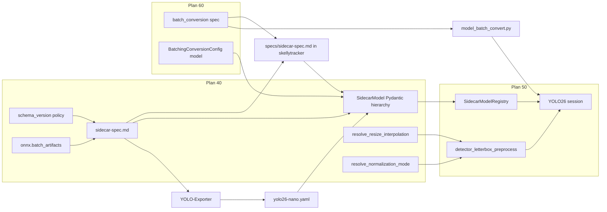

# Model Sidecar Spec

## Parent plan

Prerequisite for [60_sidecar_batch_conversion.plan.md](60_sidecar_batch_conversion.plan.md) and [50_yolo26_nano_detection.plan.md](50_yolo26_nano_detection.plan.md) (**plan 40** in sequence). Complete this plan **before** `batching.batch_conversion` spec work (plan 60) and before skellytracker `SidecarModelRegistry` catalog loading (plan 50 step 1).

## Boundary with plans 60 and 50

| Deliverable | Plan 40 (this) | Plan 60 | Plan 50 |
|-------------|----------------|---------|---------|
| `specs/sidecar-spec.md` — YAML, `schema_version`, interpolation, normalization modes | yes (this repo) | extends | consumes |
| `onnx.batch_artifacts` multi-native-batch schema | yes | consumes | uses |
| `batching.batch_conversion` spec | **no** | yes | consumes |
| `parse_sidecar_file()` / `yaml.safe_load` | yes | — | uses in registry scan |
| `SidecarModel` Pydantic validation | yes | extends `SidecarModel` with `BatchingConversionConfig` | uses in `SidecarModelRegistry` |
| `parse_skellytracker_version()` / version compare | yes | — | uses in catalog validation |
| `resolve_resize_interpolation()` | yes | — | uses in preprocess |
| `resolve_normalization_mode()` | yes | — | uses in preprocess |
| `detector_letterbox_preprocess()` | **no** | **no** | creates + wires YOLO26 |
| `SidecarModelRegistry` / `list_detection_models()` merge | **no** | **no** | creates |
| Runtime batch selection (no conversion) | **yes** — spec + validation helpers | extends with `batch_conversion` | enforces at session create |
| YOLO26 session wiring | **no** | **no** | creates |
| User/contributor documentation (README, models/, CLAUDE.md) | yes | extends `specs/sidecar-spec.md` only | — |

Plan 50 consumes plan 40 YAML sidecars (`*.yaml`, `parse_sidecar_file`, `onnx.batch_artifacts`). Confirm plan 50 has no remaining `*.json` sidecar references when plan 40 merges.

## Prerequisite Plans

Complete in implementation order before this plan:

- [**10 — Remove EP fallback**](10_remove_ep_fallback.plan.md)
- [**20 — Single global realtime pipeline**](20_single_global_realtime_pipeline.plan.md)
- [**30 — Realtime batch size config**](30_realtime_batch_size.plan.md) — runtime `batch_size` semantics (`len(cameras)` in freemocap). **Plan 40:** sidecar-backed models may only use a `batch_size` that appears as a key in `onnx.batch_artifacts` — no batch conversion until plan 60.

## Plan sequence

| Order | Plan | Notes |
|-------|------|-------|
| **10** | [10_remove_ep_fallback.plan.md](10_remove_ep_fallback.plan.md) | |
| **20** | [20_single_global_realtime_pipeline.plan.md](20_single_global_realtime_pipeline.plan.md) | |
| **30** | [30_realtime_batch_size.plan.md](30_realtime_batch_size.plan.md) | |
| **40** (this) | Model Sidecar Spec | Initial model sidecar contract (detection + pose estimation) |
| **60** | [60_sidecar_batch_conversion.plan.md](60_sidecar_batch_conversion.plan.md) | `batch_conversion` profiles |
| **50** | [50_yolo26_nano_detection.plan.md](50_yolo26_nano_detection.plan.md) | Consumes 40 + 60 |
| **70** | [70_pose_estimator_sidecar_spec.plan.md](70_pose_estimator_sidecar_spec.plan.md) | Pose estimator sidecar (RTMW, RTMW3D, RTMO, YOLO26 pose) |
| future | [future_streaming_pipeline_implementation.plan.md](future_streaming_pipeline_implementation.plan.md) | Graph executor |

This document is the home for the **initial** canonical model sidecar contract, covering both object-detection models (role: `detector`) and pose-estimation models (role: `pose_estimator`). Plan 60 adds `batching.batch_conversion`. Each release batch updates [`specs/sidecar-spec.md`](../specs/sidecar-spec.md) **in this repository**, bumps `schema_version` to the skellytracker version that introduces the change, and lists concrete field deltas in [Change sets](#change-sets) below.

## Spec ownership

| Artifact | Location | Notes |
|----------|----------|-------|
| **Canonical spec** | [`specs/sidecar-spec.md`](../specs/sidecar-spec.md) (this repo) | Single source of truth for the sidecar contract; versioned with skellytracker |
| **Runtime validation** | `skellytracker/utilities/gpu_utils/sidecar_validation.py` | Pydantic `BaseModel` subclasses that mirror the spec at runtime; `yaml.safe_load` → `SidecarModel.model_validate()` (spec is **not** parsed at inference time) |
| **Batch ONNX surgery** | `skellytracker/utilities/gpu_utils/model_batch_convert.py` (plan 60) | Vendored from retired `model-batch-converter` repo; consumes `batching.batch_conversion` from parsed sidecar dicts |

External tools (YOLO-Exporter) must link to the skellytracker repo [`specs/sidecar-spec.md`](../specs/sidecar-spec.md) — do not maintain a competing spec or converter package.

## Goals

1. **Traceable compatibility** — a sidecar's `schema_version` tells you the minimum skellytracker release required to consume it.
2. **Single source of truth** — spec changes live in **`specs/sidecar-spec.md` in this repo**; skellytracker validates via Pydantic `BaseModel` subclasses that mirror the spec (human-readable spec is documentation; it is not parsed at runtime).
3. **One sidecar per model** — a single `{model_id}.yaml` (for example `yolo26-nano.yaml`) lists every native batch size and precision variant shipped for that model via `onnx.batch_artifacts`.
4. **Explicit runtime batch only (plan 40)** — the RTMPose realtime pipeline has **no** batch-size conversion in this plan. Session `batch_size` must match a key in `onnx.batch_artifacts`; otherwise fail with a recoverable error listing supported native batches. plan 60 adds `batching.batch_conversion` for non-native targets (plan 50 wires it).
5. **First preprocessing change set** — add `input.resize.interpolation` so YOLO26 host letterbox matches the export pipeline (replacing hardcoded `cv2.INTER_LINEAR` in [`rtm_preprocessing.py`](../skellytracker/utilities/gpu_utils/rtm_preprocessing.py)).
6. **Normalization modes** — replace verbose `scale`/`mean`/`std` tuples with a closed `input.normalization` enum (`unit_float` for YOLO26 divide-by-255, `none` for YOLOX uint8 passthrough, etc.).
7. **Discoverable documentation** — explain the contract in `specs/sidecar-spec.md` and skellytracker-facing docs so exporters, contributors, and runtime consumers share one mental model (spec is not parsed at runtime; docs + validators must stay aligned).

## Release coordination

Implement and publish in this order:

1. **Bump skellytracker** via bumpver at merge time — set the changelog `schema_version` row and all example sidecars to the **new** release version, not the pre-change `__version__`.
2. **`specs/sidecar-spec.md`** — merge spec updates in this repo (create [`specs/`](../specs/) directory if missing).
3. **YOLO-Exporter** — emit YAML sidecars targeting the documented `schema_version` with `onnx.batch_artifacts`, `normalization: unit_float`, and `resize.interpolation` (no `batch_conversion` until plan 60). Pin or link to skellytracker `specs/sidecar-spec.md` at the matching release tag.
4. **Checked-in artifact** — `models/yolo26-nano.yaml` with matching `schema_version`, `batch_artifacts` (native batch `2` for v1), `normalization`, and `interpolation`.
5. **skellytracker** — validation library + `resolve_resize_interpolation()` + `resolve_normalization_mode()`; plan 50 integrates registry and preprocess.
6. **Documentation** — publish [Documentation updates](#documentation-updates) in the same release (spec restructure + skellytracker README / `models/` guide).

plan 60 vendors `model_batch_convert` into this repo and retires the sibling `model-batch-converter` package — see [60_sidecar_batch_conversion.plan.md](60_sidecar_batch_conversion.plan.md).

## Sidecar format: YAML

Sidecar files use YAML instead of JSON, following the conventions established by the `names_and_connections/` YAML files (see [`skellytracker/trackers/rtmpose_tracker/names_and_connections/`](../skellytracker/trackers/rtmpose_tracker/names_and_connections/)).

### File extension

Sidecar files use the `.yaml` extension. **One sidecar per model:** `{model_id}.yaml` (for example `yolo26-nano.yaml` for `model_id: yolo26-nano`). That file may list any number of native batch sizes and precisions under `onnx.batch_artifacts`.

### Style conventions (following `names_and_connections/`)

- **Document marker:** `---` at top of file
- **Comments:** `#` prefix for human-readable notes (not allowed in JSON)
- **Format:** YAML mappings and sequences — no trailing commas, no quotes on bare strings
- **Structure:** Flat top-level keys; nested objects use indentation
- **String values:** Quoted only when necessary (e.g. when value contains a colon or special character)
- **Lint:** Consider `yamllint` on `models/*.yaml` in CI to catch tabs/indentation issues

### Consumer updates

- `pyyaml>=6.0` and `pydantic>=2.0` are already in [`pyproject.toml`](../pyproject.toml) — no new dependencies.
- Add `parse_sidecar_file(path) -> dict` using `yaml.safe_load()` in `skellytracker/utilities/gpu_utils/sidecar_validation.py`.
- Add Pydantic models (`SidecarModel`, `OnnxConfig`, `InputConfig`, `Normalization`, etc.) that `model_validate()` the parsed dict.
- Plan 50 wires `parse_sidecar_file` + `SidecarModel` into `SidecarModelRegistry` scan of `models/*.yaml`.

### File pairing and naming

| Artifact | Example |
|----------|---------|
| Sidecar YAML (one per model) | `yolo26-nano.yaml` |
| ONNX models (any listed batch × precision) | `yolo26-nano_b2_fp16.onnx`, `yolo26-nano_b4_fp32.onnx` |

Rules:

- Sidecar filename is **`{model_id}.yaml`** — not `{model_id}_b{N}.yaml`. The `model_id` field inside the file matches the basename (for example `model_id: yolo26-nano` → `yolo26-nano.yaml`).
- ONNX filenames keep the batch and precision suffix: `{model_id}_b{batch}_{precision}.onnx`.
- One sidecar describes **all** native batch sizes and precision variants for that model via `onnx.batch_artifacts` (any number of batch keys and precision keys per group).
- Sidecar and ONNX files live together under `models/` (or the artifact directory referenced by the registry).
- **Retired in plan 40:** JSON sidecars, per-precision sidecar files, `{model_id}_b{N}.yaml` sidecar naming, top-level `onnx.filename` single-artifact references, and flat `onnx.precision_artifacts` without a batch axis.
- Optional derivative ONNX files (for example converted `yolo26-nano_b3_fp16.onnx` from plan 60) do not get separate sidecars when they preserve the same runtime contract except batch dimension.

## ONNX artifacts: `onnx.batch_artifacts`

Replace the flat `onnx.precision_artifacts` map with **`onnx.batch_artifacts`**, a mapping from **native batch size** → artifact group. Each group contains a `precision_artifacts` map using the same per-precision schema as today.

This mirrors how multiple precisions are described, but adds a batch-size axis for models shipped with more than one native fixed-batch ONNX (e.g. `b2` and `b4` source files).

### Structure

| Field | Type | Required | Description |
|-------|------|----------|-------------|
| `onnx.batch_artifacts` | object | yes (when `onnx` present) | Keys are positive integer native batch sizes. Values are artifact groups. A model sidecar may list **any number** of batch keys. |
| `onnx.batch_artifacts.<N>.precision_artifacts` | object | yes per group | Map of `fp32` / `fp16` / `int8` → artifact descriptor for native batch `N`. |
| `onnx.batch_artifacts.<N>.input_shape` | array | when `len(batch_artifacts) > 1` | Full input tensor shape for native batch `N`, including batch dim. Required when more than one batch key is listed (top-level `input.shape` cannot describe multiple batch sizes). |
| `onnx.batch_artifacts.<N>.output_shapes` | array[array] | when `len(batch_artifacts) > 1` | Output tensor shapes for native batch `N`, parallel to top-level `outputs` order. |

### Per-precision artifact fields (unchanged)

| Field | Type | Required | Description |
|-------|------|----------|-------------|
| `filename` | string | yes | ONNX filename relative to sidecar directory or models root. |
| `sha256` | string | no | Lowercase hex SHA-256 of file bytes (optional in v1 consumers). |
| `input_dtype` | string | no | ONNX graph input element type for this precision variant. |

### Filename convention

```text
{model_id}_b{batch}_{precision}.onnx
```

Examples for `model_id: yolo26-nano`:

- `yolo26-nano_b2_fp16.onnx` — native batch 2, fp16
- `yolo26-nano_b4_fp32.onnx` — native batch 4, fp32 (second native batch group)

### Validation rules

- `onnx.batch_artifacts` must have at least one key; each key must be a positive integer (YAML may parse unquoted numeric keys as `int`).
- Each group must list at least one precision in `precision_artifacts`.
- Precision keys are closed enum: `fp32`, `fp16`, `int8` (extensible in future change sets).
- **Catalog-time (structural):** validate keys, precision maps, filename patterns, and per-group `input_shape` / `output_shapes` when `len(batch_artifacts) > 1`.
- **Session-time (selected batch `N`):** `requested_batch_size` must be a key in `onnx.batch_artifacts` (plan 40 — no conversion). Validate batch-dim agreement for group `N` using top-level `input.shape` / `outputs[].shape` when `len(batch_artifacts) == 1`, or `batch_artifacts[N].input_shape` / `output_shapes` when `len(batch_artifacts) > 1`.
- `batching.native_batch_sizes` is **derived** from `sorted(onnx.batch_artifacts.keys())` — do not duplicate as a separate required field.
- **Do not** include `batching.batch_conversion` in plan 40 sidecars — see [60_sidecar_batch_conversion.plan.md](60_sidecar_batch_conversion.plan.md).

### Runtime batch selection (plan 40 — no conversion)

The RTMPose realtime pipeline (through plan 40) does **not** perform batch-size conversion:

| Rule | Behavior |
|------|----------|
| Supported runtime batches | `sorted(onnx.batch_artifacts.keys())` only |
| Freemocap / plan 30 `batch_size` | `len(active_cameras)` at worker session create |
| Match required | `batch_size` must equal a listed native batch key |
| No match | Recoverable session-start error: model id, requested `batch_size`, supported native batches |
| `supports_dynamic_batch: true` | Future change set — not used for YOLO26 v1 |
| Non-native batch | **Blocked until plan 60** adds `batching.batch_conversion` and plan 50 calls `model_batch_convert()` |

Add `SidecarModel.supports_runtime_batch(batch_size: int) -> bool` method on the Pydantic model for plan 50 session wiring.

### Multi-batch example (`yolo26-nano.yaml`, two native batches)

```yaml
---
model_id: yolo26-nano
# ... identity fields ...

onnx:
  batch_artifacts:
    2:
      precision_artifacts:
        fp32:
          filename: yolo26-nano_b2_fp32.onnx
          input_dtype: float32
        fp16:
          filename: yolo26-nano_b2_fp16.onnx
          input_dtype: float16
      input_shape: [2, 3, 640, 640]
      output_shapes:
        - [2, 300, 6]
    4:
      precision_artifacts:
        fp32:
          filename: yolo26-nano_b4_fp32.onnx
          input_dtype: float32
        fp16:
          filename: yolo26-nano_b4_fp16.onnx
          input_dtype: float16
      input_shape: [4, 3, 640, 640]
      output_shapes:
        - [4, 300, 6]

# Top-level input/outputs: shared contract (normalization, resize, field semantics).
# When only one batch key is listed, top-level input.shape / outputs[].shape may be used instead of per-group shapes.
```

### Batching fields (plan 40)

```yaml
batching:
  batch_axis: 0
  supports_dynamic_batch: false
```

- `batching.batch_size` is **removed** — native batch sizes come from `onnx.batch_artifacts` keys.
- `batching.batch_conversion` is **plan 60** — enables runtime batch sizes **not** listed in `batch_artifacts` via `model_batch_convert()` (plan 50). Until plan 60 lands, only listed native batches are valid.

## Input contract (`input`)

Port baseline field tables from the retired draft spec, with these plan 40 deltas:

| Field | Notes |
|-------|-------|
| `input.dtype` | Allowed when all precision variants share one element type. |
| `input.dtype_by_precision` | Required when `onnx.batch_artifacts.*.precision_artifacts` use different `input_dtype` values (YOLO26 uses this). When both are present, keys and values must agree. |
| `input.normalization` | **Replaces** legacy `{scale, mean, std}` object as the primary authoring shape — see [Input normalization](#input-normalization-inputnormalization). |
| `input.resize.interpolation` | **New** — required when `input.resize` is present. |

## Input normalization: `input.normalization`

Declare how the host transforms letterboxed pixels before `session.run()`. Use a **closed enum** string or a `custom` object — do not require exporters to spell out `1/255` as a magic float when `unit_float` suffices.

### Modes

| Mode | Host behavior | Typical use |
|------|---------------|-------------|
| `none` | Letterbox → pass `uint8` pixels unchanged (no float scaling) | YOLOX — ONNX graph normalizes internally |
| `unit_float` | `pixel.astype(float) / 255.0` per channel → **[0, 1]** | YOLO26 fp32/fp16 — Ultralytics-style float input |
| `imagenet_bgr` | `(pixel - mean) / std` on **0–255 BGR** pixels using fixed ImageNet constants: mean `(123.675, 116.28, 103.53)`, std `(58.395, 57.12, 57.375)` | Future RTMPose pose sidecars |
| `custom` | `(pixel * scale - mean) / std` on **0–255** channel values (float or uint8 promoted to float) after letterbox and `color_format` conversion | Rare exports that do not match a named mode |

### Field shape

**Named mode (preferred):**

```yaml
input:
  normalization: unit_float
```

**Custom mode:**

```yaml
input:
  normalization:
    mode: custom
    scale: 0.00392156862745098   # optional; default 1.0
    mean: [0.0, 0.0, 0.0]
    std: [1.0, 1.0, 1.0]
```

| Field | Type | Required | Description |
|-------|------|----------|-------------|
| `input.normalization` | string or object | yes when `input` present | Closed enum string, or object with `mode: custom` plus optional `scale`, `mean`, `std`. |
| `input.normalization_by_precision` | object | no | Optional map `fp32` / `fp16` / `int8` → mode string. Overrides top-level `normalization` for that precision. |

Allowed enum strings: `none`, `unit_float`, `imagenet_bgr`, `custom` (only as `normalization.mode` when using the object form).

### Per-precision overrides

YOLO26 lists `int8` artifacts with `input_dtype: uint8`. Override float normalization for quantized paths:

```yaml
input:
  normalization: unit_float
  normalization_by_precision:
    int8: none
```

**Default rule when `normalization_by_precision` is absent:** if the selected precision's `input.dtype_by_precision` entry is `uint8`, the host uses `none` (raw `uint8` passthrough) even when top-level `normalization` is `unit_float`. Explicit `normalization_by_precision` wins over this default.

### Validation rules

- `input.normalization` is required when the `input` section is present.
- String values must be one of `none`, `unit_float`, `imagenet_bgr`.
- Object form must have `mode: custom`; `mean` and `std` are length-3 sequences when present; `scale` is a positive number when present.
- `normalization_by_precision` keys must be subset of `fp32`, `fp16`, `int8`; values must be valid mode strings (not `custom` objects in v1).

### skellytracker consumer

- `resolve_normalization_mode(sidecar: dict, precision: str) -> str` in [`rtm_preprocessing.py`](../skellytracker/utilities/gpu_utils/rtm_preprocessing.py) — returns `none`, `unit_float`, `imagenet_bgr`, or `custom`. Resolution order: `normalization_by_precision[precision]` → `dtype_by_precision[precision] == uint8` default (`none`) → top-level `normalization` (string or `custom` object’s `mode`).
- When the resolved mode is `custom`, read `scale` / `mean` / `std` from the top-level `input.normalization` object (per-precision `custom` objects are not supported in v1).
- Plan 50 `detector_letterbox_preprocess(..., normalization_mode=...)` applies the resolved mode **after** letterbox resize (using `resolve_resize_interpolation`) and **after** `color_format` conversion (OpenCV BGR → sidecar `RGB` when required), **before** NCHW layout conversion.

## Pose sidecar: referencing names_and_connections

Pose estimator sidecars (role: `pose_estimator`) may reference existing YAML files in [`skellytracker/trackers/rtmpose_tracker/names_and_connections/`](../skellytracker/trackers/rtmpose_tracker/names_and_connections/) instead of duplicating keypoint labels and skeleton connections inline.

**Scope in plan 40:** document `pose.keypoint_config` field stubs in `specs/sidecar-spec.md` only. Full `pose_estimator` contract, validation, and `load_pose_keypoint_definition()` are [**plan 70**](70_pose_estimator_sidecar_spec.plan.md).

### `pose.keypoint_config` field

| Field | Type | Required | Description |
|-------|------|----------|-------------|
| `pose.keypoint_config` | object | no | Mapping of body region to `names_and_connections/*.yaml` basename. Supported keys: `body`, `face`, `hand`. |

Each value is the basename of a file in `names_and_connections/`, for example `rtmpose_body.yaml` or `rtmpose_hand.yaml`.

For the RTMW-L wholebody case, the equivalent composite already exists as [`rtmpose_wholebody.yaml`](skellytracker/trackers/rtmpose_tracker/names_and_connections/rtmpose_wholebody.yaml) — the loader may delegate to that file when all three keys match the standard layout.

### Label prefix rules

Prefix rules **must match** [`rtmpose_wholebody.yaml`](skellytracker/trackers/rtmpose_tracker/names_and_connections/rtmpose_wholebody.yaml) and `TrackedObjectDefinition._from_composition_data`:

| Config key | Source file | Prefix | Example |
|------------|-------------|--------|---------|
| `body` | `rtmpose_body.yaml` | `""` | `nose` → `nose` |
| `hand` (right, first) | `rtmpose_hand.yaml` | `right_hand_` | `root` → `right_hand_root` |
| `hand` (left, second) | `rtmpose_hand.yaml` | `left_hand_` | `root` → `left_hand_root` |
| `face` | `rtmpose_face.yaml` | `""` | `face_0000` → `face_0000` (names already prefixed in file) |

`rtmpose_hand.yaml` uses un-prefixed landmark names (`thumb1`, `forefinger1`, …). `rtmpose_face.yaml` already uses `face_0000`…`face_0067` — do **not** prepend an additional `face_` prefix.

### Keypoint assembly order

Order **must match** COCO133 model output layout documented in `rtmpose_wholebody.yaml`:

> `[body.23][right_hand.21][left_hand.21][face.68] = 133 total`

Assembly sequence when resolving `keypoint_config`:

1. `body` → append `tracked_points` / `connections` with `""` prefix
2. `hand` → append right-hand copy (`right_hand_` prefix), then left-hand copy (`left_hand_` prefix)
3. `face` → append with `""` prefix

Config-key iteration order in the sidecar YAML is irrelevant; the consumer always emits labels in the order above.

### Resolution rules

- When `keypoint_config` is present, derive at load time:
  - `pose.keypoint_labels` — ordered list from assembly sequence above
  - `pose.keypoint_count` — `len(keypoint_labels)`
  - `overlay.skeleton` — one `{type: edge, from: <label>, to: <label>}` per connection pair, using prefixed label names
- **Overlay groups/colors:** if the sidecar defines `overlay.palette` / `overlay.groups`, map skeleton edges to groups by region (`body`, `right_hand`, `left_hand`, `face`) using the same defaults as the RTMPose annotator. If `overlay` is absent, emit edges without group/color (consumers apply defaults).
- Canonical mapping files (`*_to_canonical_mapping.yaml`) bridge RTMPose-specific names to canonical landmark names — documented but not consumed automatically at this stage.
- If `keypoint_config` is absent, the sidecar must provide `pose.keypoint_labels`, `pose.keypoint_count`, and `overlay.skeleton` inline.

### Example: RTMW-L WholeBody

```yaml
---
schema_version: "vYYYY.MM.BBBB"  # set at merge via bumpver
model_id: rtmw-l-wholebody
display_name: RTMW L WholeBody
family: rtmw
role: pose_estimator
pose:
  estimator_type: top_down_single_person
  keypoint_config:
    body: rtmpose_body.yaml
    hand: rtmpose_hand.yaml
    face: rtmpose_face.yaml
overlay:
  palette:
    body: [0, 255, 0]
    hand: [255, 128, 0]
    face: [0, 128, 255]
```

## Schema versioning policy

Replace the current integer `schema_version` (e.g. `1`) with a **string that matches the skellytracker release version** that last introduced or required a change to the sidecar contract.

### Format

| Aspect | Rule |
|--------|------|
| Field | `schema_version` (unchanged name) |
| Type | `string` (was `integer`) |
| Value | Exact skellytracker `__version__` string at the time the spec change ships (e.g. `"v2024.09.1019"`) |
| Source of truth for format | [`skellytracker/__init__.py`](../skellytracker/__init__.py) `__version__` and [`pyproject.toml`](../pyproject.toml) `[tool.bumpver]` (`version_pattern = "vYYYY.0M.BUILD[-TAG]"`) |

Integer `schema_version: 1` never shipped in production sidecars. Do **not** support integer versions in skellytracker validation — start fresh with the calendar string format.

### Semantics

- **`schema_version` on a sidecar** = the skellytracker version that defined the contract the sidecar was authored against.
- **Minimum consumer** — skellytracker release `S` can load a sidecar with `schema_version` `V` when `S >= V` (same ordering as skellytracker calendar versions).
- **Too-new sidecar** — if `sidecar.schema_version > installed_skellytracker_version`, reject at catalog validation with a recoverable error naming both versions and an upgrade hint.
- **Exporter obligation** — when emitting a sidecar, set `schema_version` to the skellytracker version documented as current in the canonical spec at export time (or the version pin the exporter targets).

### Version comparison algorithm

Add `parse_skellytracker_version(version: str) -> tuple[int, int, int, str | None]` in skellytracker:

1. Strip optional leading `v` (accept both `v2024.09.1019` and `2024.09.1019`).
2. Split on `-` into `core` and optional `tag` (pre-release suffix per bumpver `[-TAG]`).
3. Parse `core` as `YYYY.MM.BUILD` (three dot-separated integers).
4. Compare tuples `(year, month, build, tag)` lexicographically; `tag=None` sorts **after** any tagged pre-release of the same core (stable release > pre-release).
5. **V1 sidecar policy:** reject `schema_version` strings with a pre-release tag (`-TAG` suffix). Sidecars must use stable skellytracker release versions only.

Version compatibility is enforced by `SidecarModel.model_validate()` via the `version_not_newer_than_installed` `@model_validator` — no separate `sidecar_schema_supported()` function needed.

Unit-test: equal, older sidecar / newer installed, newer sidecar / older installed, malformed string, missing components, tagged builds.

### Version-gated required fields

Validation uses Pydantic's `@model_validator` methods on `SidecarModel` rather than a separate `SCHEMA_REQUIREMENTS` callable list. Each change set adds one or more `@model_validator(mode="after")` methods that check required fields. Because validators run on the already-parsed Pydantic model, they have access to typed fields and can use version-aware gating:

```python
_PLAN_40_SCHEMA_VERSION = "vYYYY.MM.BBBB"

@model_validator(mode="after")
def _require_interpolation_when_resize_present(self):
    sidecar_ver = parse_skellytracker_version(self.schema_version)
    required_ver = parse_skellytracker_version(_PLAN_40_SCHEMA_VERSION)
    if sidecar_ver < required_ver:
        return self  # older sidecar — skip this requirement
    if self.input and self.input.resize:
        return self  # interpolation non-optional on ResizeConfig — Pydantic caught it
    return self

@model_validator(mode="after")
def _require_normalization_when_input_present(self):
    sidecar_ver = parse_skellytracker_version(self.schema_version)
    required_ver = parse_skellytracker_version(_PLAN_40_SCHEMA_VERSION)
    if sidecar_ver < required_ver:
        return self
    if self.input:
        return self  # InputConfig.normalization is non-optional — Pydantic validated it
    return self
```

Version gating via `schema_version` comparison inside validators allows older sidecars to load without satisfying newer requirements. The `normalization` field on `InputConfig` is non-optional (`Normalization`), so Pydantic's own required-field check catches missing normalization — no separate `_require_normalization_when_input_present` callable needed for current-spec sidecars.

### Spec document updates (this repo)

In [`specs/sidecar-spec.md`](../specs/sidecar-spec.md) — restructure as the **canonical human-readable spec** (see [Documentation updates](#documentation-updates) for full outline):

- Replace the Schema versioning section: `schema_version` is a required **string** matching skellytracker release versions.
- Remove integer `1` as the current version; add a **changelog table**:

| `schema_version` | skellytracker release | Changes |
|------------------|----------------------|---------|
| `vYYYY.MM.BBBB` | same as column 1 | *(bumpver at merge)* — one `{model_id}.yaml` sidecar per model; `onnx.batch_artifacts` (any native batches × precisions); explicit runtime batch only (no conversion); add `input.resize.interpolation`; add `input.normalization` mode enum; migrate `schema_version` from integer to string; adopt YAML format; document `pose.keypoint_config` |

- Update **all** reference examples (YAML) to use the string `schema_version` and current change-set fields.
- Add validation-checklist items (human-readable mirror of Pydantic validators):
  - [ ] `schema_version` is a string matching the skellytracker version pattern (no pre-release tag)
  - [ ] `schema_version` is supported by the installed skellytracker release (`installed >= schema_version`)
  - [ ] `input.normalization` is a valid mode (`none`, `unit_float`, `imagenet_bgr`, or `custom` object)
  - [ ] `input.resize.interpolation` present when `input.resize` is present
  - [ ] `onnx.batch_artifacts` present with valid native batch keys and per-group `precision_artifacts`
  - [ ] when `len(batch_artifacts) > 1`, each group has `input_shape` and `output_shapes`
  - [ ] runtime `batch_size` is a key in `onnx.batch_artifacts` (plan 40 — no conversion)
- Document that future spec edits **must** bump `schema_version` to the skellytracker version merging the spec change (not an independent integer counter).

### skellytracker consumer validation (Pydantic models)

Module: `skellytracker/utilities/gpu_utils/sidecar_validation.py`.

Instead of hand-written dict validators, define **Pydantic `BaseModel` subclasses** that mirror the YAML spec. Pydantic provides field-level validation, type coercion, `Literal` enums, discriminated unions, and structured `ValidationError` — replacing the manual `validate_*()` functions.

#### Pydantic model hierarchy

```python
from pydantic import BaseModel, Field, model_validator, field_validator
from typing import Literal, Annotated
from enum import Enum

# ---------------------------------------------------------------------------
# Identity (used directly in SidecarModel — no separate Identity model)
# ---------------------------------------------------------------------------

class ModelRole(str, Enum):
    detector = "detector"
    pose_estimator = "pose_estimator"

# ---------------------------------------------------------------------------
# ONNX artifacts
# ---------------------------------------------------------------------------

class Precision(str, Enum):
    fp32 = "fp32"
    fp16 = "fp16"
    int8 = "int8"

class PrecisionArtifact(BaseModel):
    filename: str = Field(min_length=1)
    sha256: str | None = None
    input_dtype: str | None = None   # "float32", "float16", "uint8"

class BatchArtifactGroup(BaseModel):
    precision_artifacts: dict[Precision, PrecisionArtifact] = Field(min_length=1)
    input_shape: list[int] | None = None
    output_shapes: list[list[int]] | None = None

class OnnxConfig(BaseModel):
    batch_artifacts: dict[int, BatchArtifactGroup] = Field(min_length=1)

    @field_validator("batch_artifacts")
    @classmethod
    def keys_positive(cls, v):
        for k in v:
            if k <= 0:
                raise ValueError(f"batch_artifacts key {k} must be positive")
        return v

# ---------------------------------------------------------------------------
# Normalization (discriminated union via Literal)
# ---------------------------------------------------------------------------

class CustomNormalization(BaseModel):
    mode: Literal["custom"]
    scale: float = 1.0
    mean: tuple[float, float, float] = (0.0, 0.0, 0.0)
    std: tuple[float, float, float] = (1.0, 1.0, 1.0)

NamedNormalizationMode = Literal["none", "unit_float", "imagenet_bgr"]
Normalization = NamedNormalizationMode | CustomNormalization

class ResizeMethod(str, Enum):
    letterbox = "letterbox"
    affine_person_crop = "affine_person_crop"  # plan 70

class Interpolation(str, Enum):
    linear = "linear"
    area = "area"
    cubic = "cubic"
    nearest = "nearest"

class ResizeConfig(BaseModel):
    method: ResizeMethod
    target_size: tuple[int, int]
    preserve_aspect_ratio: bool = True
    pad_value: int = 114
    interpolation: Interpolation = Interpolation.linear

# ---------------------------------------------------------------------------
# Input
# ---------------------------------------------------------------------------

class ColorFormat(str, Enum):
    RGB = "RGB"
    BGR = "BGR"

class InputConfig(BaseModel):
    name: str = Field(min_length=1)
    dtype: str | None = None
    dtype_by_precision: dict[Precision, str] | None = None
    shape: list[int]
    layout: Literal["NCHW", "NHWC"] = "NCHW"
    dynamic_axes: dict[str, dict[int, str]] = Field(default_factory=dict)
    color_format: ColorFormat = ColorFormat.RGB
    normalization: Normalization
    normalization_by_precision: dict[Precision, NamedNormalizationMode] | None = None
    resize: ResizeConfig | None = None
    coordinate_origin: Literal["top_left"] = "top_left"

    @model_validator(mode="after")
    def require_dtype_source(self):
        if self.dtype is None and self.dtype_by_precision is None:
            raise ValueError("One of dtype or dtype_by_precision is required")
        return self

# ---------------------------------------------------------------------------
# Batching
# ---------------------------------------------------------------------------

class BatchingConfig(BaseModel):
    batch_axis: int = 0
    supports_dynamic_batch: bool = False
    # batch_conversion: BatchingConversionConfig | None = None  # plan 60

# ---------------------------------------------------------------------------
# Outputs
# ---------------------------------------------------------------------------

class BoxFormat(str, Enum):
    xyxy = "xyxy"
    xywh = "xywh"
    cxcywh = "cxcywh"

class OutputTensor(BaseModel):
    name: str = Field(min_length=1)
    dtype: str
    shape: list[int]
    rank: int
    semantic: str
    fields: list[str] | None = None
    score_field: str | None = None          # field name for confidence (e.g. "score")
    class_field: str | None = None           # field name for class ID (e.g. "class_id")
    box_format: BoxFormat | None = None
    coordinate_space: str = "letterboxed_input"
    requires_nms: bool = False
    class_id_base: int = 0
    person_class_id: int = 0
    max_detections: int = 300
    may_include_non_person_classes: bool = True
    keypoint_axis: int | None = None
    keypoint_count: int | None = None

# ---------------------------------------------------------------------------
# Postprocessing
# ---------------------------------------------------------------------------

class PostprocessingConfig(BaseModel):
    requires_nms: bool = False
    nms_thr: float | None = None             # required when requires_nms=true (e.g. 0.45)
    score_thr: float | None = None            # required when requires_nms=true (e.g. 0.7)
    filter_class_id: int | None = None
    confidence_threshold_default: float = 0.7
    map_boxes_to_source_image: bool = True
    map_keypoints_to_source_image: bool = False

# ---------------------------------------------------------------------------
# Top-level sidecar model
# ---------------------------------------------------------------------------

class SidecarModel(BaseModel):
    """Pydantic mirror of the canonical sidecar spec (specs/sidecar-spec.md).

    Validated at catalog load time via model_validate(yaml.safe_load(...)).
    Pydantic ValidationError is the recoverable error — callers should catch
    it and produce a user-facing message with model_id and schema_version.
    """

    schema_version: str = Field(pattern=r"^v?\d{4}\.\d{2}\.\d{4}$")
    model_id: str = Field(min_length=1)
    display_name: str
    family: str
    role: ModelRole
    onnx: OnnxConfig | None = None
    input: InputConfig | None = None
    batching: BatchingConfig = Field(default_factory=BatchingConfig)
    outputs: list[OutputTensor] = Field(default_factory=list)
    postprocessing: PostprocessingConfig = Field(default_factory=PostprocessingConfig)
    # pose + overlay: stub in plan 40, full model in plan 70

    @model_validator(mode="after")
    def check_schema_version_stable(self):
        """Reject pre-release tags in schema_version (V1 policy)."""
        v = self.schema_version.lstrip("v")
        if "-" in v:
            raise ValueError(
                f"schema_version '{self.schema_version}' has a pre-release tag; "
                "sidecars must use stable skellytracker release versions only"
            )
        return self

    @model_validator(mode="after")
    def version_not_newer_than_installed(self):
        """Reject sidecars authored against a newer skellytracker than installed."""
        installed = _get_installed_skellytracker_version()
        if parse_skellytracker_version(self.schema_version) > parse_skellytracker_version(installed):
            raise ValueError(
                f"Sidecar '{self.model_id}' requires skellytracker "
                f"{self.schema_version}, but installed is {installed}. "
                "Upgrade skellytracker to load this model."
            )
        return self

# _get_installed_skellytracker_version() reads skellytracker.__version__
# and is a module-level helper in sidecar_validation.py:
#
# def _get_installed_skellytracker_version() -> str:
#     from skellytracker import __version__
#     return __version__

    @model_validator(mode="after")
    def multi_batch_requires_shapes(self):
        """When >1 batch_artifacts key, each group needs input_shape + output_shapes."""
        if self.onnx and len(self.onnx.batch_artifacts) > 1:
            for b, group in self.onnx.batch_artifacts.items():
                if group.input_shape is None:
                    raise ValueError(
                        f"batch_artifacts[{b}] missing input_shape (required when "
                        f">1 native batch: {sorted(self.onnx.batch_artifacts.keys())})"
                    )
                if group.output_shapes is None:
                    raise ValueError(
                        f"batch_artifacts[{b}] missing output_shapes (required when "
                        f">1 native batch)"
                    )
        return self

    def supports_runtime_batch(self, batch_size: int) -> bool:
        """Check whether a requested batch_size is a native key."""
        if self.onnx is None:
            return False
        return batch_size in self.onnx.batch_artifacts

    @property
    def native_batch_sizes(self) -> list[int]:
        if self.onnx is None:
            return []
        return sorted(self.onnx.batch_artifacts.keys())
```

#### Key differences from manual validators

| Old (manual dict validators) | New (Pydantic models) |
|------------------------------|----------------------|
| `parse_sidecar_file() -> dict` | `parse_sidecar_file() -> dict`, then `SidecarModel.model_validate(d)` |
| `SidecarValidationError` (custom class) | `pydantic.ValidationError` (field paths, multiple errors) |
| `validate_sidecar_metadata(sidecar: dict)` | `SidecarModel.model_validate(...)` — built-in |
| `validate_batch_artifacts(sidecar: dict, ...)` | `OnnxConfig` model + `multi_batch_requires_shapes` validator |
| `validate_normalization(input: dict)` | `InputConfig.normalization` with `Literal` + `CustomNormalization` |
| `sidecar_supports_runtime_batch(sidecar: dict, n: int)` | `sidecar.supports_runtime_batch(n)` — method on model |
| `SCHEMA_REQUIREMENTS` callable list | `@model_validator` methods — composable, version-gated via conditional checks |
| `parse_skellytracker_version(v: str)` | Still a free function (not replaced by Pydantic) |
| `resolve_resize_interpolation(s: str)` | Still a free function (OpenCV constant mapping) |
| `resolve_normalization_mode(sidecar, precision)` | Still a free function (resolution logic not Pydantic's job) |

#### Functions that survive (not replaced by Pydantic)

```python
def parse_sidecar_file(path: Path) -> dict:
    """yaml.safe_load with UTF-8; wrap YAMLError as ValueError."""
    ...

def parse_skellytracker_version(version: str) -> tuple[int, int, int, str | None]:
    """Parse 'vYYYY.MM.BBBB' into (year, month, build, tag)."""
    ...

def resolve_resize_interpolation(value: str) -> int:
    """Map 'linear' → cv2.INTER_LINEAR, etc."""
    ...

def resolve_normalization_mode(sidecar: SidecarModel, precision: Precision) -> str:
    """Resolution order: normalization_by_precision → uint8 default → top-level."""
    ...

def load_sidecar(path: Path) -> SidecarModel:
    """Convenience: parse_sidecar_file + SidecarModel.model_validate."""
    raw = parse_sidecar_file(path)
    return SidecarModel.model_validate(raw)
```

```mermaid
flowchart TD
  yaml[Sidecar YAML] --> parse[parse_sidecar_file → dict]
  parse --> validate[SidecarModel.model_validate]
  validate --> version{@model_validator:<br/>schema_version stable?<br/>installed >= sidecar?}
  version -->|no| reject[ValidationError with context]
  version -->|yes| fields{Pydantic field<br/>validation}
  fields -->|invalid| reject
  fields -->|valid| batch{multi_batch:<br/>per-group shapes?}
  batch -->|invalid| reject
  batch -->|valid| model[Typed SidecarModel]
  model --> registry[SidecarModelRegistry plan 50]
  model --> preprocess[resolve_normalization_mode<br/>resolve_resize_interpolation]
```

#### Version-gated requirements (Pydantic-style)

Instead of `SCHEMA_REQUIREMENTS` with callables, use `@model_validator` methods gated by `schema_version`:

```python
@model_validator(mode="after")
def _require_interpolation_when_resize_present(self):
    if self.input and self.input.resize and self.input.resize.interpolation is None:
        raise ValueError("input.resize.interpolation is required when resize is present")
    return self

@model_validator(mode="after")
def _require_batch_artifacts_when_onnx_present(self):
    if self.onnx and not self.onnx.batch_artifacts:
        raise ValueError("onnx.batch_artifacts is required when onnx section is present")
    return self
```

Future change sets add new `@model_validator` methods; older sidecars with lower `schema_version` that omit newer fields are accepted (fields default to `None` and only the validators active at their version gate fire).

Plan 60 extends `SidecarModel` with `BatchingConversionConfig` + `validate_batch_conversion_profile()` (or a Pydantic model for it).
Plan 70 extends `SidecarModel` with `PoseConfig` + `OverlayConfig` + `@model_validator` methods for pose-specific rules.

## Change sets

Each subsection is one spec evolution batch. When implementing a new batch, append a row to the changelog table in `specs/sidecar-spec.md`, add a `@model_validator` method or Pydantic field to `SidecarModel`, and bump example sidecars to the new `schema_version`.

### Change set — `onnx.batch_artifacts` (this plan)

**Problem:** Flat `onnx.precision_artifacts` assumes a single native batch size. Models may ship multiple native fixed-batch ONNX files (e.g. `b2` and `b4`). Consumers need a structured way to list native batch sizes and their precision variants, parallel to how precisions are grouped today.

**Field** — replace `onnx.precision_artifacts` with:

| Field | Type | Required | Description |
|-------|------|----------|-------------|
| `onnx.batch_artifacts` | object | when `onnx` present | Map from native batch size (int key) to `{ precision_artifacts: { ... } }`. |

See [ONNX artifacts: `onnx.batch_artifacts`](#onnx-artifacts-onnxbatch_artifacts) for full rules.

### Change set — `input.resize.interpolation` (this plan)

**Problem:** `input.resize` declares `method`, `target_size`, `preserve_aspect_ratio`, and `pad_value` only. Host resize filter is implicit; skellytracker hardcodes `INTER_LINEAR`. Wrong interpolation silently degrades detection quality.

**Field** — add to `input.resize`:

| Field | Type | Required | Description |
|-------|------|----------|-------------|
| `resize.interpolation` | string | when `input.resize` present | Host resize filter for the resize scaling step. Closed enum in this change set. |

**Allowed values**

| Sidecar value | OpenCV constant | Typical use |
|---------------|-----------------|-------------|
| `linear` | `cv2.INTER_LINEAR` | YOLO/Ultralytics letterbox export (YOLO26 default) |
| `area` | `cv2.INTER_AREA` | Downscaling with area resampling |
| `cubic` | `cv2.INTER_CUBIC` | Higher-quality upscale |
| `nearest` | `cv2.INTER_NEAREST` | Nearest-neighbor |

**Example fragment**

```yaml
---
schema_version: "vYYYY.MM.BBBB"  # bumpver at merge
input:
  resize:
    method: letterbox
    target_size: [640, 640]
    preserve_aspect_ratio: true
    pad_value: 114
    interpolation: linear
```

**skellytracker consumer:** `resolve_resize_interpolation(value: str) -> int` in [`rtm_preprocessing.py`](../skellytracker/utilities/gpu_utils/rtm_preprocessing.py). Plan 50 passes sidecar `input.resize.interpolation` into `detector_letterbox_preprocess(..., interpolation=...)`. YOLOX legacy keeps `"linear"` explicitly.

### Change set — `input.normalization` modes (this plan)

**Problem:** Early drafts used a verbose `scale` / `mean` / `std` tuple where `scale: 1/255`, `mean: 0`, `std: 1` only meant “divide uint8 pixels by 255 to get [0, 1] floats”. That is error-prone (magic float typos) and obscures intent.

**Field** — add to `input`:

| Field | Type | Required | Description |
|-------|------|----------|-------------|
| `input.normalization` | string or object | when `input` present | Closed enum: `none`, `unit_float`, `imagenet_bgr`, or `{mode: custom, scale?, mean?, std?}`. |
| `input.normalization_by_precision` | object | no | Optional per-precision override (`fp32`, `fp16`, `int8` → mode string). |

See [Input normalization: `input.normalization`](#input-normalization-inputnormalization) for host behavior per mode.

**Example fragments**

```yaml
# YOLO26 fp32/fp16
input:
  normalization: unit_float
  normalization_by_precision:
    int8: none

# YOLOX-style (future sidecar-backed YOLOX)
input:
  normalization: none

# Future RTMPose pose sidecar
input:
  normalization: imagenet_bgr
```

**skellytracker consumer:** `resolve_normalization_mode(sidecar, precision) -> str` in [`rtm_preprocessing.py`](../skellytracker/utilities/gpu_utils/rtm_preprocessing.py). Plan 50 passes the resolved mode into `detector_letterbox_preprocess(..., normalization_mode=...)`.

## Complete YOLO26 Nano detector sidecar example

Full reference sidecar for `models/yolo26-nano.yaml` — one file per model; v1 ships native batch `2` only under `batch_artifacts`. **`batching.batch_conversion` is plan 60** — see [60_sidecar_batch_conversion.plan.md](60_sidecar_batch_conversion.plan.md#complete-yolo26-nano-sidecar-example-with-batch-conversion).

```yaml
---
schema_version: "vYYYY.MM.BBBB"  # bumpver at merge
model_id: yolo26-nano
display_name: YOLO26 Nano
family: yolo26
role: detector

onnx:
  batch_artifacts:
    2:
      precision_artifacts:
        fp32:
          filename: yolo26-nano_b2_fp32.onnx
          sha256: "<lowercase-hex-sha256>"
          input_dtype: float32
        fp16:
          filename: yolo26-nano_b2_fp16.onnx
          sha256: "<lowercase-hex-sha256>"
          input_dtype: float16
        int8:
          filename: yolo26-nano_b2_int8.onnx
          sha256: "<lowercase-hex-sha256>"
          input_dtype: uint8

input:
  name: images
  dtype_by_precision:
    fp32: float32
    fp16: float16
    int8: uint8
  shape: [2, 3, 640, 640]
  layout: NCHW
  dynamic_axes: {}
  color_format: RGB
  normalization: unit_float
  normalization_by_precision:
    int8: none
  resize:
    method: letterbox
    target_size: [640, 640]
    preserve_aspect_ratio: true
    pad_value: 114
    interpolation: linear
  coordinate_origin: top_left

batching:
  batch_axis: 0
  supports_dynamic_batch: false

outputs:
  - name: output0
    dtype: float32
    shape: [2, 300, 6]
    rank: 3
    semantic: detections
    fields: [x1, y1, x2, y2, score, class_id]
    box_format: xyxy
    coordinate_space: letterboxed_input
    requires_nms: false
    class_id_base: 0
    person_class_id: 0
    score_field: score
    class_field: class_id
    max_detections: 300
    may_include_non_person_classes: true

postprocessing:
  requires_nms: false
  filter_class_id: 0
  confidence_threshold_default: 0.7
  map_boxes_to_source_image: true
```

## Dependency flow



plan 60 vendors batch conversion into `model_batch_convert.py` — no external package.

## Implementation plan

### 0. YAML format, spec baseline, and Pydantic models (this repo)

- **Baseline:** port the retired [`model_batch_converter/specs/sidecar-spec.md`](../model_batch_converter/model_batch_converter/specs/sidecar-spec.md) identity, `input`, `outputs`, `postprocessing`, `pose`, and `overlay` sections into [`specs/sidecar-spec.md`](../specs/sidecar-spec.md), then apply plan 40 deltas (YAML format, string `schema_version`, `batch_artifacts`, normalization modes, interpolation). **Do not** copy `batching.batch_conversion` tables — plan 60 owns those. **Do not** keep JSON examples or integer `schema_version`.
- Create [`specs/`](../specs/) if missing; define YAML as the sidecar format: file extension `.yaml`, document marker `---`, style conventions, and [file pairing](#file-pairing-and-naming).
- Update all reference examples to YAML using the `names_and_connections/` conventions.
- Add `parse_sidecar_file()` (raw `yaml.safe_load`), `load_sidecar()` (parse + `SidecarModel.model_validate`), and the Pydantic model hierarchy (`SidecarModel`, `OnnxConfig`, `BatchArtifactGroup`, `InputConfig`, `Normalization`, `ResizeConfig`, `BatchingConfig`, `OutputTensor`, `PostprocessingConfig`) in `sidecar_validation.py`.
- Unit-test that a valid YAML sidecar parses and validates correctly via Pydantic; unit-test non-dict root and malformed YAML rejection.

### 1. Schema version format (this repo)

- Rewrite Schema versioning in [`specs/sidecar-spec.md`](../specs/sidecar-spec.md) per [Schema versioning policy](#schema-versioning-policy).
- **Bump skellytracker** via bumpver at merge; use the new version in changelog row and all examples.
- Add `parse_skellytracker_version` in `sidecar_validation.py`; version gating via `@model_validator` on `SidecarModel`.
- Unit-test version comparison edge cases.

### 2. Change set — `onnx.batch_artifacts` (this repo)

- Document `onnx.batch_artifacts` in [`specs/sidecar-spec.md`](../specs/sidecar-spec.md); remove flat `onnx.precision_artifacts`.
- Update all ONNX artifact examples to nested batch → precision structure.
- `OnnxConfig` Pydantic model covers structural validation; `multi_batch_requires_shapes` `@model_validator` covers per-group shape requirements when `len(batch_artifacts) > 1`.
- Unit-test single-batch and multi-batch artifact groups, invalid keys, empty precision maps.

### 3. Change set — interpolation (this repo)

- Add `resize.interpolation` field table, enum, and checklist item in [`specs/sidecar-spec.md`](../specs/sidecar-spec.md).
- Update all letterbox `resize` examples with `interpolation: linear`.
- Add `resolve_resize_interpolation()` in [`rtm_preprocessing.py`](../skellytracker/utilities/gpu_utils/rtm_preprocessing.py).
- `ResizeConfig.interpolation` is non-optional (`Interpolation` enum with default `linear`) — Pydantic validates it automatically.

### 3b. Change set — normalization modes (this repo)

- Document `input.normalization` enum and `normalization_by_precision` in [`specs/sidecar-spec.md`](../specs/sidecar-spec.md).
- Update YOLO26 examples to `normalization: unit_float` with `int8: none` override.
- `InputConfig.normalization` is non-optional (`Normalization` union) — Pydantic validates automatically; no separate `validate_normalization()` needed.
- Add `resolve_normalization_mode()` in [`rtm_preprocessing.py`](../skellytracker/utilities/gpu_utils/rtm_preprocessing.py).
- Unit-test mode resolution, uint8 default, and invalid mode rejection.

### 4. YOLO-Exporter

- Emit YAML sidecar (`.yaml` extension) with string `schema_version`, `onnx.batch_artifacts`, `normalization: unit_float`, and `resize.interpolation`.
- **Do not** emit `batching.batch_conversion` (plan 60).
- Update [exporter tests](https://github.com/domisjustanumber/YOLO-Exporter/blob/main/tests/test_yolo_sidecar.py).
- Follow [Release coordination](#release-coordination) ordering.

### 5. Published YOLO26 artifact

- Create `models/yolo26-nano.yaml` with bumped `schema_version`, `batch_artifacts` key `2`, `normalization: unit_float`, and `interpolation`.
- No `batch_conversion` block until plan 60.

### 6. skellytracker validation library (plan 50 integrates)

- Implement the Pydantic model hierarchy in `sidecar_validation.py` as described in [skellytracker consumer validation](#skellytracker-consumer-validation-pydantic-models).
- Implement `parse_sidecar_file()`, `load_sidecar()`, `parse_skellytracker_version()`, `resolve_resize_interpolation()`, and `resolve_normalization_mode()`.
- Export public API from `skellytracker.utilities.gpu_utils` for plan 50 `SidecarModelRegistry`.
- `SidecarModel.model_validate()` replaces `validate_sidecar_metadata()`; Pydantic `ValidationError` replaces `SidecarValidationError`.
- **Do not** implement `SidecarModelRegistry`, `detector_letterbox_preprocess`, YOLO26 session wiring, or batch conversion in this plan.

### 7. Pose sidecar: `pose.keypoint_config` — spec only (this repo)

- Add `pose.keypoint_config` field and prefix/order rules to [`specs/sidecar-spec.md`](../specs/sidecar-spec.md) per [Pose sidecar](#pose-sidecar-referencing-names_and_connections).
- Document `TrackedObjectDefinition` reuse for the future loader.
- **Defer** skellytracker loader implementation and unit tests until a pose sidecar catalog consumer exists.

### 8. Documentation updates

Ship documentation in the same release as the spec and validation library. The plan sections above are the **authoring source**; published docs must mirror them without drift.

#### `specs/sidecar-spec.md` (canonical, this repo)

Restructure [`specs/sidecar-spec.md`](../specs/sidecar-spec.md) with these top-level sections:

1. **Overview** — what a sidecar is (runtime I/O contract beside ONNX files), YAML format, relationship to skellytracker `schema_version`, and that runtime validation uses Python mirrors (spec is not parsed at inference time).
2. **Author guide** — how to author a new sidecar: pick `schema_version`, fill required sections by `role` (`detector` / `pose_estimator`), filename conventions (`{model_id}_b{batch}_{precision}.onnx`), bump `schema_version` when changing the contract.
3. **Consumer guide** — how skellytracker loads sidecars: `parse_sidecar_file` → `SidecarModel.model_validate` → role-specific checks (plan 50 registry); link to `sidecar_validation.py` Pydantic model hierarchy.
4. **Field reference** — normative tables mirroring this plan (ported baseline + plan 40 deltas):
   - Identity (`model_id`, `display_name`, `family`, `role`)
   - [File pairing](#file-pairing-and-naming) — `{model_id}.yaml`, one sidecar per model
   - `onnx.batch_artifacts` (any number of native batches × precisions; per-group shapes when `len > 1`)
   - [Runtime batch selection](#runtime-batch-selection-plan-40--no-conversion)
   - `input` (tensor name, `dtype` or `dtype_by_precision`, shape, layout, `color_format`, **`normalization` modes**, `resize` + `interpolation`, `coordinate_origin`)
   - `batching` (`batch_axis`, `supports_dynamic_batch`; note plan 60 owns `batch_conversion`)
   - `outputs`, `postprocessing`, `pose`, `overlay`
5. **Normalization modes** — dedicated subsection explaining `none`, `unit_float`, `imagenet_bgr`, `custom`, `normalization_by_precision`, and uint8 default (copy tables from [Input normalization](#input-normalization-inputnormalization)).
6. **Schema versioning** — format, semantics, changelog table, version-gated required fields.
7. **Validation checklist** — human-readable mirror of Pydantic model validators.
8. **Reference examples** — full YAML sidecars (YOLO26 detector, multi-batch artifact fragment, RTMW pose with `keypoint_config`).
9. **Changelog table** — `schema_version` rows with skellytracker release and field deltas.

#### skellytracker — README and `models/`

Add **ONNX model sidecars** section to [`README.md`](../README.md):

- What sidecars are and where they live (`models/*.yaml` by default after plan 50).
- Minimum fields a reader should know (`schema_version`, `model_id`, `onnx.batch_artifacts`, `input.normalization`, `input.resize.interpolation`).
- Link to canonical spec: [`specs/sidecar-spec.md`](specs/sidecar-spec.md) in this repository (same commit as the installed skellytracker release).
- Cross-link [Hardware Precision Compatibility](../README.md#hardware-precision-compatibility) — sidecars list artifacts; EP/hardware policy selects among them at session create (plan 50).
- Note `batching.batch_conversion` is documented in plan 60 / spec changelog after that plan lands.

Create [`models/README.md`](../models/README.md):

- Purpose of the directory (checked-in sidecar YAML + co-located or referenced ONNX artifacts).
- Naming: sidecar `yolo26-nano.yaml` (`model_id: yolo26-nano`); ONNX files `yolo26-nano_b{batch}_{precision}.onnx` listed under `onnx.batch_artifacts`.
- Runtime batch size must match a key in `onnx.batch_artifacts` (plan 40); plan 60+50 add conversion for other sizes.
- Point to full field rules in [`specs/sidecar-spec.md`](../specs/sidecar-spec.md).
- Include a minimal annotated example (or link to plan 40 [Complete YOLO26 example](#complete-yolo26-nano-detector-sidecar-example)).

#### skellytracker — contributor / agent docs

Update [`CLAUDE.md`](../CLAUDE.md) architecture section:

- Short **ONNX sidecar contract** bullet: canonical spec at `specs/sidecar-spec.md`; validated by Pydantic models (`SidecarModel` hierarchy) in `sidecar_validation.py`; plan 60 adds vendored `model_batch_convert.py`; plan 50 `SidecarModelRegistry` for catalog-backed detectors.
- List key modules: `sidecar_validation.py`, `model_batch_convert.py`, `resolve_resize_interpolation`, `resolve_normalization_mode` in `rtm_preprocessing.py`.

Add module-level docstring to `skellytracker/utilities/gpu_utils/sidecar_validation.py`:

- State that Pydantic models mirror [`specs/sidecar-spec.md`](../specs/sidecar-spec.md) in this repo (spec is not parsed at runtime; Pydantic acts as the runtime type-safe mirror).
- Document public API: `parse_sidecar_file`, `load_sidecar`, `SidecarModel`, `OnnxConfig`, `InputConfig`, `Normalization`, `ResizeConfig`, `BatchingConfig`, `OutputTensor`, `PostprocessingConfig`, `resolve_resize_interpolation`, `resolve_normalization_mode`, `parse_skellytracker_version`.
- Link to repo spec path for field semantics.

#### YOLO-Exporter (external)

Update [YOLO-Exporter README](https://github.com/domisjustanumber/YOLO-Exporter) / `yolo_sidecar.py` module docstring:

- Document emitted sidecar fields (`schema_version`, `onnx.batch_artifacts`, `normalization: unit_float`, `resize.interpolation`).
- Link to skellytracker [`specs/sidecar-spec.md`](https://github.com/freemocap/skellytracker/blob/main/specs/sidecar-spec.md) at the target release tag (or pinned commit).

#### Documentation validation

- Manually diff plan 40 field tables against [`specs/sidecar-spec.md`](../specs/sidecar-spec.md) before release.
- Add a lightweight CI check that `specs/sidecar-spec.md` exists and contains required section headings (`## Overview`, `## Normalization modes`, `## Schema versioning`, `## Validation checklist`).

## Validation plan

### Plan 40 (this release)

- Unit-test `parse_sidecar_file` on valid YAML sidecar; unit-test non-dict root / malformed YAML → `ValueError`.
- Unit-test `SidecarModel.model_validate()` on valid YOLO26 sidecar → returns typed `SidecarModel`.
- Unit-test Pydantic `ValidationError` for missing required fields (`model_id`, `schema_version`, `input.normalization`), invalid enum values, wrong types.
- Unit-test `model_validator` rejects `schema_version` with pre-release tag suffix.
- Unit-test `model_validator` rejects sidecar with `schema_version` newer than installed skellytracker.
- Unit-test `model_validator` accepts when installed >= sidecar version.
- Unit-test `sidecar.supports_runtime_batch()` for matching and non-matching `batch_size`.
- Unit-test `multi_batch_requires_shapes` validator: rejects when >1 batch key and missing `input_shape` / `output_shapes`.
- Unit-test `Normalization` discriminated union: string `"unit_float"` → valid; `CustomNormalization` with `mode: custom` → valid; `"invalid_mode"` → Pydantic `ValidationError`.
- Unit-test `resolve_normalization_mode(sidecar, precision)` for `unit_float`, `none`, `imagenet_bgr`, `custom`, `normalization_by_precision`, and uint8 default.
- Unit-test `resolve_resize_interpolation("linear")` → `cv2.INTER_LINEAR`; unknown value raises.
- Unit-test `parse_skellytracker_version` (equal, newer sidecar, older sidecar, malformed, tagged).
- Unit-test `load_sidecar(path)` convenience function.
- Verify [`specs/sidecar-spec.md`](../specs/sidecar-spec.md) contains required section headings.
- Spot-check README / `models/README.md` links resolve to `specs/sidecar-spec.md`.

### Deferred with pose loader (future)

- Unit-test `keypoint_config` resolution: body, right/left hand prefixes, face without double-prefix.
- Unit-test 133-label order matches `rtmpose_wholebody.yaml`.
- Unit-test missing referenced YAML raises clear error.

### plan 60

- Unit-test `BatchingConversionConfig` Pydantic model validation.

### Plan 50

- Unit-test `detector_letterbox_preprocess` honors passed interpolation and normalization mode.
- Unit-test `SidecarModelRegistry` scans `*.yaml` and validates via `load_sidecar()` / `SidecarModel.model_validate()`.
- Unit-test `model_batch_convert()` integration (requires plan 60 sidecar fields).

## Main risks

- **Version skew** — exporter, checked-in sidecars, spec changelog, and bumpver release must agree on the same `schema_version` string.
- **Interpolation mismatch** — same severity as color/dtype/normalization errors; host must match export.
- **YAML syntax errors** — tabs vs spaces, ambiguous indentation, or unquoted special characters can cause parse failures.
- **`names_and_connections/` drift** — config YAML files are consumed by both the legacy RTMPose tracker and the future sidecar loader; incompatible changes could break both.
- **Camera count vs native batches** — freemocap `batch_size=len(cameras)` must hit a sidecar key in plan 40; mismatches fail at session start (for example 3 cameras with only `batch_artifacts: {2, 4}` and no plan 60 conversion).
- **Multi-batch shape validation** — when `len(batch_artifacts) > 1`, per-group `input_shape` / `output_shapes` are required; do not rely on a single top-level `input.shape`.
- **Plan 50 YAML refs** — confirm plan 50 has no remaining JSON sidecar paths when plan 40 merges.
- **`precision_artifacts` migration** — exporters and plan 50 must switch to `batch_artifacts`; flat `precision_artifacts` is not valid after plan 40.
- **Documentation drift** — `specs/sidecar-spec.md`, README, `models/README.md`, and Pydantic models must be updated together.
- **Incomplete vendoring (plan 60)** — any remaining dependency on the external `model-batch-converter` package must be removed before the sibling repo is archived.
- **Future changes** — every spec edit must bump `schema_version`, add a `@model_validator` method or Pydantic field, update the changelog table, and update the documentation sections listed above.

## Related files

- Canonical spec: [`specs/sidecar-spec.md`](../specs/sidecar-spec.md)
- skellytracker user docs: [`README.md`](../README.md), [`models/README.md`](../models/README.md) (new)
- Contributor docs: [`CLAUDE.md`](../CLAUDE.md)
- Batch conversion (plan 60): [`skellytracker/utilities/gpu_utils/model_batch_convert.py`](../skellytracker/utilities/gpu_utils/model_batch_convert.py)
- skellytracker version: [`skellytracker/__init__.py`](../skellytracker/__init__.py)
- Preprocessing: [`skellytracker/utilities/gpu_utils/rtm_preprocessing.py`](../skellytracker/utilities/gpu_utils/rtm_preprocessing.py)
- Validation (new): `skellytracker/utilities/gpu_utils/sidecar_validation.py`
- Pose keypoint configs: [`skellytracker/trackers/rtmpose_tracker/names_and_connections/`](../skellytracker/trackers/rtmpose_tracker/names_and_connections/)
- Composition helper: [`skellytracker/trackers/base_tracker/tracked_object_definition.py`](../skellytracker/trackers/base_tracker/tracked_object_definition.py)
- Exporter: [YOLO-Exporter `yolo_sidecar.py`](https://github.com/domisjustanumber/YOLO-Exporter/blob/main/yolo_sidecar.py)

## Related Plans

- [70_pose_estimator_sidecar_spec.plan.md](70_pose_estimator_sidecar_spec.plan.md) — **follows plan 40**; full `pose_estimator` sidecar spec, `names_and_connections` loader, RTMW / RTMW3D / RTMO / YOLO26 pose examples.
- [60_sidecar_batch_conversion.plan.md](60_sidecar_batch_conversion.plan.md) — **next in sequence**; `batching.batch_conversion` spec, vendored `model_batch_convert.py`, retire external `model-batch-converter` repo.
- [30_realtime_batch_size.plan.md](30_realtime_batch_size.plan.md) — **prerequisite** in sequence; runtime `batch_size` semantics.
- [50_yolo26_nano_detection.plan.md](50_yolo26_nano_detection.plan.md) — **blocked on plans 40 + 60** for sidecar contract, `sidecar_validation.py`, `resolve_resize_interpolation()`, and `resolve_normalization_mode()`; plan 50 owns `SidecarModelRegistry`, `detector_letterbox_preprocess`, and YOLO26 session wiring. **Amend plan 50** for `*.yaml` sidecars and `batch_artifacts` when plan 40 merges.
