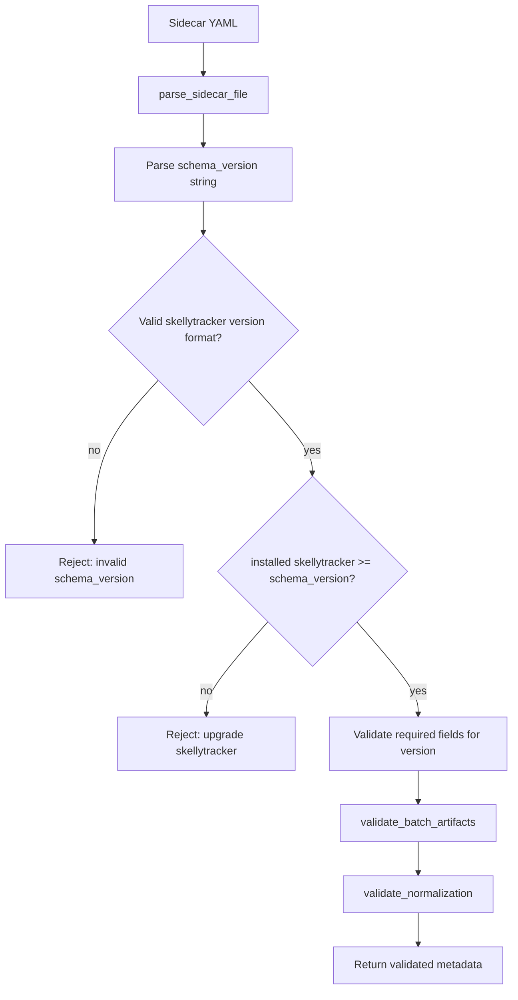
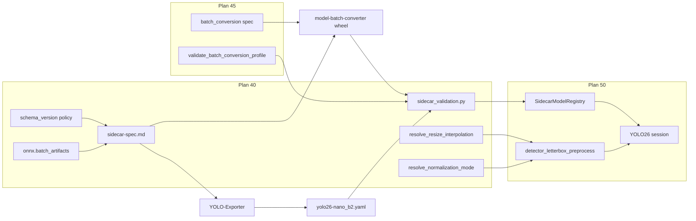

# Sidecar Spec Updates

## Parent plan

Prerequisite for [45_sidecar_batch_conversion.plan.md](45_sidecar_batch_conversion.plan.md) and [50_yolo26_nano_detection.plan.md](50_yolo26_nano_detection.plan.md) (**plan 40** in sequence). Complete this plan **before** `batching.batch_conversion` spec work (plan 45) and before skellytracker `SidecarModelRegistry` catalog loading (plan 50 step 1).

## Boundary with plans 45 and 50

| Deliverable | Plan 40 (this) | Plan 45 | Plan 50 |
|-------------|----------------|---------|---------|
| `sidecar-spec.md` — YAML, `schema_version`, interpolation, normalization modes | yes | extends | consumes |
| `onnx.batch_artifacts` multi-native-batch schema | yes | consumes | uses |
| `batching.batch_conversion` spec | **no** | yes | consumes |
| `parse_sidecar_file()` / `yaml.safe_load` | yes | — | uses in registry scan |
| `validate_sidecar_metadata()` library | yes | extends | uses in `SidecarModelRegistry` |
| `parse_skellytracker_version()` / version compare | yes | — | uses in catalog validation |
| `resolve_resize_interpolation()` | yes | — | uses in preprocess |
| `resolve_normalization_mode()` | yes | — | uses in preprocess |
| `detector_letterbox_preprocess()` | **no** | **no** | creates + wires YOLO26 |
| `SidecarModelRegistry` / `list_detection_models()` merge | **no** | **no** | creates |
| YOLO26 session wiring | **no** | **no** | creates |

Plan 50 must be updated when plan 40 lands: replace all `*.json` sidecar references with `*.yaml`, `yaml.safe_load`, and YAML examples (plan 50 still references `yolo26-nano_b2.json` and JSON catalog scan today).

## Prerequisite Plans

Complete in implementation order before this plan:

- [**10 — Remove EP fallback**](10_remove_ep_fallback.plan.md)
- [**20 — Single global realtime pipeline**](20_single_global_realtime_pipeline.plan.md)
- [**30 — Realtime batch size config**](30_realtime_batch_size.plan.md) — runtime `batch_size` semantics; sidecar native batch listing is defined here; conversion rules are plan 45.

## Plan sequence

| Order | Plan | Notes |
|-------|------|-------|
| **10** | [10_remove_ep_fallback.plan.md](10_remove_ep_fallback.plan.md) | |
| **20** | [20_single_global_realtime_pipeline.plan.md](20_single_global_realtime_pipeline.plan.md) | |
| **30** | [30_realtime_batch_size.plan.md](30_realtime_batch_size.plan.md) | |
| **40** (this) | Sidecar spec updates | Initial contract |
| **45** | [45_sidecar_batch_conversion.plan.md](45_sidecar_batch_conversion.plan.md) | `batch_conversion` profiles |
| **50** | [50_yolo26_nano_detection.plan.md](50_yolo26_nano_detection.plan.md) | Consumes 40 + 45 |
| future | [future_streaming_pipeline_implementation.plan.md](future_streaming_pipeline_implementation.plan.md) | Graph executor |

This document is the home for the **initial** canonical sidecar contract. Plan 45 adds `batching.batch_conversion`. Each release batch updates [`model_batch_converter/specs/sidecar-spec.md`](../model_batch_converter/model_batch_converter/specs/sidecar-spec.md), bumps `schema_version` to the skellytracker version that introduces the change, and lists concrete field deltas in [Change sets](#change-sets) below.

## Goals

1. **Traceable compatibility** — a sidecar's `schema_version` tells you the minimum skellytracker release required to consume it.
2. **Single source of truth** — spec changes live in `model-batch-converter`; skellytracker validates via explicit Python validators that mirror the packaged spec (human-readable `sidecar-spec.md` is documentation; it is not parsed at runtime).
3. **Multi-native-batch artifacts** — describe shipped ONNX files per native batch size and precision, mirroring how multiple precisions are grouped today.
4. **First preprocessing change set** — add `input.resize.interpolation` so YOLO26 host letterbox matches the export pipeline (replacing hardcoded `cv2.INTER_LINEAR` in [`rtm_preprocessing.py`](../skellytracker/utilities/gpu_utils/rtm_preprocessing.py)).
5. **Normalization modes** — replace verbose `scale`/`mean`/`std` tuples with a closed `input.normalization` enum (`unit_float` for YOLO26 divide-by-255, `none` for YOLOX uint8 passthrough, etc.).

## Release coordination

Implement and publish in this order:

1. **Bump skellytracker** via bumpver at merge time — set the changelog `schema_version` row and all example sidecars to the **new** release version, not the pre-change `__version__`.
2. **model-batch-converter** — publish wheel with updated `sidecar-spec.md` (uncomment/add dependency in [`pyproject.toml`](../pyproject.toml); use editable `../model_batch_converter` during dev).
3. **YOLO-Exporter** — emit YAML sidecars targeting the documented `schema_version` with `onnx.batch_artifacts`, `normalization: unit_float`, and `resize.interpolation` (no `batch_conversion` until plan 45).
4. **Checked-in artifact** — `models/yolo26-nano_b2.yaml` with matching `schema_version`, `batch_artifacts`, `normalization`, and `interpolation`.
5. **skellytracker** — validation library + `resolve_resize_interpolation()` + `resolve_normalization_mode()`; plan 50 integrates registry and preprocess.

If `model-batch-converter` is missing at validation time, plan 50 omits sidecar-backed models with a diagnostic (unchanged policy).

## Sidecar format: YAML

Sidecar files use YAML instead of JSON, following the conventions established by the `names_and_connections/` YAML files (see [`skellytracker/trackers/rtmpose_tracker/names_and_connections/`](../skellytracker/trackers/rtmpose_tracker/names_and_connections/)).

### File extension

Sidecar files use the `.yaml` extension. For example, `yolo26-nano_b2.yaml` describes the `yolo26-nano` detector's runtime contract for native batch size `2`.

### Style conventions (following `names_and_connections/`)

- **Document marker:** `---` at top of file
- **Comments:** `#` prefix for human-readable notes (not allowed in JSON)
- **Format:** YAML mappings and sequences — no trailing commas, no quotes on bare strings
- **Structure:** Flat top-level keys; nested objects use indentation
- **String values:** Quoted only when necessary (e.g. when value contains a colon or special character)
- **Lint:** Consider `yamllint` on `models/*.yaml` in CI to catch tabs/indentation issues

### Consumer updates

- `pyyaml>=6.0` is already in [`pyproject.toml`](../pyproject.toml) — no new dependency.
- Add `parse_sidecar_file(path) -> dict` using `yaml.safe_load()` in a new module (e.g. `skellytracker/utilities/gpu_utils/sidecar_validation.py`).
- Plan 50 wires `parse_sidecar_file` into `SidecarModelRegistry` scan of `models/*.yaml`.

## ONNX artifacts: `onnx.batch_artifacts`

Replace the flat `onnx.precision_artifacts` map with **`onnx.batch_artifacts`**, a mapping from **native batch size** → artifact group. Each group contains a `precision_artifacts` map using the same per-precision schema as today.

This mirrors how multiple precisions are described, but adds a batch-size axis for models shipped with more than one native fixed-batch ONNX (e.g. `b2` and `b4` source files).

### Structure

| Field | Type | Required | Description |
|-------|------|----------|-------------|
| `onnx.batch_artifacts` | object | yes (when `onnx` present) | Keys are positive integer native batch sizes. Values are artifact groups. |
| `onnx.batch_artifacts.<N>.precision_artifacts` | object | yes per group | Same schema as the former top-level `precision_artifacts`. |

### Per-precision artifact fields (unchanged)

| Field | Type | Required | Description |
|-------|------|----------|-------------|
| `filename` | string | yes | ONNX filename relative to sidecar directory or models root. |
| `sha256` | string | no | Lowercase hex SHA-256 of file bytes (optional in v1 consumers). |
| `input_dtype` | string | no | ONNX graph input element type for this precision variant. |

### Filename convention

```text
{model_id}_b{batch}_{precision}.onnx
```

Examples for `model_id: yolo26-nano`:

- `yolo26-nano_b2_fp16.onnx` — native batch 2, fp16
- `yolo26-nano_b4_fp32.onnx` — native batch 4, fp32 (second native batch group)

### Validation rules

- `onnx.batch_artifacts` must have at least one key; each key must be a positive integer.
- Each group must list at least one precision in `precision_artifacts`.
- Precision keys are closed enum: `fp32`, `fp16`, `int8` (extensible in future change sets).
- When validating a specific native batch group `N`:
  - `input.shape[batching.batch_axis]` must equal `N` (or document equivalent per-group shape fields in a future change set).
  - Each `outputs[].shape[batching.batch_axis]` must equal `N`.
- `batching.native_batch_sizes` is **derived** from `sorted(onnx.batch_artifacts.keys())` — do not duplicate as a separate required field.
- **Do not** include `batching.batch_conversion` in plan 40 sidecars — see [45_sidecar_batch_conversion.plan.md](45_sidecar_batch_conversion.plan.md).

### Multi-batch example (two native batches)

```yaml
onnx:
  batch_artifacts:
    2:
      precision_artifacts:
        fp32:
          filename: yolo26-nano_b2_fp32.onnx
          input_dtype: float32
        fp16:
          filename: yolo26-nano_b2_fp16.onnx
          input_dtype: float16
    4:
      precision_artifacts:
        fp32:
          filename: yolo26-nano_b4_fp32.onnx
          input_dtype: float32
        fp16:
          filename: yolo26-nano_b4_fp16.onnx
          input_dtype: float16
```

### Batching fields (plan 40)

```yaml
batching:
  batch_axis: 0
  supports_dynamic_batch: false
```

- `batching.batch_size` is **removed** — native batch sizes come from `onnx.batch_artifacts` keys.
- `batching.batch_conversion` is **plan 45** — required for YOLO26 runtime conversion when only one native batch is shipped.

## Input normalization: `input.normalization`

Declare how the host transforms letterboxed pixels before `session.run()`. Use a **closed enum** string or a `custom` object — do not require exporters to spell out `1/255` as a magic float when `unit_float` suffices.

### Modes

| Mode | Host behavior | Typical use |
|------|---------------|-------------|
| `none` | Letterbox → pass `uint8` pixels unchanged (no float scaling) | YOLOX — ONNX graph normalizes internally |
| `unit_float` | `pixel.astype(float) / 255.0` per channel → **[0, 1]** | YOLO26 fp32/fp16 — Ultralytics-style float input |
| `imagenet_bgr` | `(pixel - mean) / std` on **0–255 BGR** pixels using fixed ImageNet constants: mean `(123.675, 116.28, 103.53)`, std `(58.395, 57.12, 57.375)` | Future RTMPose pose sidecars |
| `custom` | `(pixel * scale - mean) / std` using explicit per-channel fields | Rare exports that do not match a named mode |

### Field shape

**Named mode (preferred):**

```yaml
input:
  normalization: unit_float
```

**Custom mode:**

```yaml
input:
  normalization:
    mode: custom
    scale: 0.00392156862745098   # optional; default 1.0
    mean: [0.0, 0.0, 0.0]
    std: [1.0, 1.0, 1.0]
```

| Field | Type | Required | Description |
|-------|------|----------|-------------|
| `input.normalization` | string or object | yes when `input` present | Closed enum string, or object with `mode: custom` plus optional `scale`, `mean`, `std`. |
| `input.normalization_by_precision` | object | no | Optional map `fp32` / `fp16` / `int8` → mode string. Overrides top-level `normalization` for that precision. |

Allowed enum strings: `none`, `unit_float`, `imagenet_bgr`, `custom` (only as `normalization.mode` when using the object form).

### Per-precision overrides

YOLO26 lists `int8` artifacts with `input_dtype: uint8`. Override float normalization for quantized paths:

```yaml
input:
  normalization: unit_float
  normalization_by_precision:
    int8: none
```

**Default rule when `normalization_by_precision` is absent:** if the selected precision's `input.dtype_by_precision` entry is `uint8`, the host uses `none` (raw `uint8` passthrough) even when top-level `normalization` is `unit_float`. Explicit `normalization_by_precision` wins over this default.

### Validation rules

- `input.normalization` is required when the `input` section is present.
- String values must be one of `none`, `unit_float`, `imagenet_bgr`.
- Object form must have `mode: custom`; `mean` and `std` are length-3 sequences when present; `scale` is a positive number when present.
- `normalization_by_precision` keys must be subset of `fp32`, `fp16`, `int8`; values must be valid mode strings (not `custom` objects in v1).

### skellytracker consumer

- `resolve_normalization_mode(sidecar: dict, precision: str) -> str` in [`rtm_preprocessing.py`](../skellytracker/utilities/gpu_utils/rtm_preprocessing.py) — applies `normalization_by_precision`, then `dtype_by_precision` uint8 default, then top-level `normalization`.
- Plan 50 `detector_letterbox_preprocess(..., normalization_mode=...)` applies the resolved mode after letterbox and color conversion.

## Pose sidecar: referencing names_and_connections

Pose estimator sidecars (role: `pose_estimator`) may reference existing YAML files in [`skellytracker/trackers/rtmpose_tracker/names_and_connections/`](../skellytracker/trackers/rtmpose_tracker/names_and_connections/) instead of duplicating keypoint labels and skeleton connections inline.

**Scope in plan 40:** document the field in `sidecar-spec.md` only. The skellytracker loader is **deferred** until a pose sidecar catalog consumer exists (not required for YOLO26). When implemented, reuse [`TrackedObjectDefinition`](skellytracker/trackers/base_tracker/tracked_object_definition.py) composition logic rather than a parallel prefix implementation.

### `pose.keypoint_config` field

| Field | Type | Required | Description |
|-------|------|----------|-------------|
| `pose.keypoint_config` | object | no | Mapping of body region to `names_and_connections/*.yaml` basename. Supported keys: `body`, `face`, `hand`. |

Each value is the basename of a file in `names_and_connections/`, for example `rtmpose_body.yaml` or `rtmpose_hand.yaml`.

For the RTMW-L wholebody case, the equivalent composite already exists as [`rtmpose_wholebody.yaml`](skellytracker/trackers/rtmpose_tracker/names_and_connections/rtmpose_wholebody.yaml) — the loader may delegate to that file when all three keys match the standard layout.

### Label prefix rules

Prefix rules **must match** [`rtmpose_wholebody.yaml`](skellytracker/trackers/rtmpose_tracker/names_and_connections/rtmpose_wholebody.yaml) and `TrackedObjectDefinition._from_composition_data`:

| Config key | Source file | Prefix | Example |
|------------|-------------|--------|---------|
| `body` | `rtmpose_body.yaml` | `""` | `nose` → `nose` |
| `hand` (right, first) | `rtmpose_hand.yaml` | `right_hand_` | `root` → `right_hand_root` |
| `hand` (left, second) | `rtmpose_hand.yaml` | `left_hand_` | `root` → `left_hand_root` |
| `face` | `rtmpose_face.yaml` | `""` | `face_0000` → `face_0000` (names already prefixed in file) |

`rtmpose_hand.yaml` uses un-prefixed landmark names (`thumb1`, `forefinger1`, …). `rtmpose_face.yaml` already uses `face_0000`…`face_0067` — do **not** prepend an additional `face_` prefix.

### Keypoint assembly order

Order **must match** COCO133 model output layout documented in `rtmpose_wholebody.yaml`:

> `[body.23][right_hand.21][left_hand.21][face.68] = 133 total`

Assembly sequence when resolving `keypoint_config`:

1. `body` → append `tracked_points` / `connections` with `""` prefix
2. `hand` → append right-hand copy (`right_hand_` prefix), then left-hand copy (`left_hand_` prefix)
3. `face` → append with `""` prefix

Config-key iteration order in the sidecar YAML is irrelevant; the consumer always emits labels in the order above.

### Resolution rules

- When `keypoint_config` is present, derive at load time:
  - `pose.keypoint_labels` — ordered list from assembly sequence above
  - `pose.keypoint_count` — `len(keypoint_labels)`
  - `overlay.skeleton` — one `{type: edge, from: <label>, to: <label>}` per connection pair, using prefixed label names
- **Overlay groups/colors:** if the sidecar defines `overlay.palette` / `overlay.groups`, map skeleton edges to groups by region (`body`, `right_hand`, `left_hand`, `face`) using the same defaults as the RTMPose annotator. If `overlay` is absent, emit edges without group/color (consumers apply defaults).
- Canonical mapping files (`*_to_canonical_mapping.yaml`) bridge RTMPose-specific names to canonical landmark names — documented but not consumed automatically at this stage.
- If `keypoint_config` is absent, the sidecar must provide `pose.keypoint_labels`, `pose.keypoint_count`, and `overlay.skeleton` inline.

### Example: RTMW-L WholeBody

```yaml
---
schema_version: "vYYYY.MM.BBBB"  # set at merge via bumpver
model_id: rtmw-l-wholebody
display_name: RTMW L WholeBody
family: rtmw
role: pose_estimator
pose:
  estimator_type: top_down_single_person
  keypoint_config:
    body: rtmpose_body.yaml
    hand: rtmpose_hand.yaml
    face: rtmpose_face.yaml
overlay:
  palette:
    body: [0, 255, 0]
    hand: [255, 128, 0]
    face: [0, 128, 255]
```

## Schema versioning policy

Replace the current integer `schema_version` (e.g. `1`) with a **string that matches the skellytracker release version** that last introduced or required a change to the sidecar contract.

### Format

| Aspect | Rule |
|--------|------|
| Field | `schema_version` (unchanged name) |
| Type | `string` (was `integer`) |
| Value | Exact skellytracker `__version__` string at the time the spec change ships (e.g. `"v2024.09.1019"`) |
| Source of truth for format | [`skellytracker/__init__.py`](../skellytracker/__init__.py) `__version__` and [`pyproject.toml`](../pyproject.toml) `[tool.bumpver]` (`version_pattern = "vYYYY.0M.BUILD[-TAG]"`) |

Integer `schema_version: 1` never shipped in production sidecars. Do **not** support integer versions in skellytracker validation — start fresh with the calendar string format.

### Semantics

- **`schema_version` on a sidecar** = the skellytracker version that defined the contract the sidecar was authored against.
- **Minimum consumer** — skellytracker release `S` can load a sidecar with `schema_version` `V` when `S >= V` (same ordering as skellytracker calendar versions).
- **Too-new sidecar** — if `sidecar.schema_version > installed_skellytracker_version`, reject at catalog validation with a recoverable error naming both versions and an upgrade hint.
- **Exporter obligation** — when emitting a sidecar, set `schema_version` to the skellytracker version documented as current in the canonical spec at export time (or the version pin the exporter targets).

### Version comparison algorithm

Add `parse_skellytracker_version(version: str) -> tuple[int, int, int, str | None]` in skellytracker:

1. Strip optional leading `v` (accept both `v2024.09.1019` and `2024.09.1019`).
2. Split on `-` into `core` and optional `tag` (pre-release suffix per bumpver `[-TAG]`).
3. Parse `core` as `YYYY.MM.BUILD` (three dot-separated integers).
4. Compare tuples `(year, month, build, tag)` lexicographically; `tag=None` sorts **after** any tagged pre-release of the same core (stable release > pre-release), or document that pre-release tags are rejected in sidecars for v1.

`sidecar_schema_supported(installed, sidecar) -> bool` returns `parse(installed) >= parse(sidecar)`.

Unit-test: equal, older sidecar / newer installed, newer sidecar / older installed, malformed string, missing components, tagged builds.

### Version-gated required fields

Validation does **not** parse `sidecar-spec.md` at runtime. Use a hardcoded checklist in `sidecar_validation.py` keyed by minimum `schema_version`, extended when new change sets ship:

```python
# v1 (this plan) — illustrative; exact version set at merge via bumpver
SCHEMA_REQUIREMENTS: list[tuple[str, Callable[[dict], list[str]]]] = [
    ("vYYYY.MM.BBBB", _require_interpolation_when_resize_present),
    ("vYYYY.MM.BBBB", _require_batch_artifacts_when_onnx_present),
    ("vYYYY.MM.BBBB", _require_normalization_when_input_present),
]
```

Rules for this change set:

| Field | Required when |
|-------|---------------|
| `input.resize.interpolation` | `input.resize` is present (all current detector/pose sidecars with resize use `letterbox`; interpolation applies to the resize scaling step regardless of `resize.method`) |
| `onnx.batch_artifacts` | `onnx` section is present — at least one native batch group with at least one precision artifact |
| `input.normalization` | `input` section is present — valid mode string or `custom` object |

Older sidecars with lower `schema_version` that omit fields added in a newer spec are accepted only if `installed >= sidecar.schema_version` **and** the sidecar satisfies the requirements active at its declared version. Exporters authoring against the current spec must include all fields for the current `schema_version`.

### Spec document updates (`model-batch-converter`)

In [`sidecar-spec.md`](../model_batch_converter/model_batch_converter/specs/sidecar-spec.md):

- Replace the Schema versioning section: `schema_version` is a required **string** matching skellytracker release versions.
- Remove integer `1` as the current version; add a **changelog table**:

| `schema_version` | skellytracker release | Changes |
|------------------|----------------------|---------|
| `vYYYY.MM.BBBB` | same as column 1 | *(bumpver at merge)* — add `input.resize.interpolation`; add `input.normalization` mode enum; migrate `schema_version` from integer to string; adopt YAML format; replace `onnx.precision_artifacts` with `onnx.batch_artifacts`; document `pose.keypoint_config` |

- Update **all** reference examples (YAML) to use the string `schema_version` and current change-set fields.
- Add validation-checklist items (human-readable mirror of Python validators):
  - [ ] `schema_version` is a string matching the skellytracker version pattern
  - [ ] `schema_version` is supported by the installed skellytracker release (`installed >= schema_version`)
  - [ ] `input.resize.interpolation` present when `input.resize` is present
  - [ ] `onnx.batch_artifacts` present with valid native batch keys and per-group `precision_artifacts`
  - [ ] `input.normalization` present with valid mode (`none`, `unit_float`, `imagenet_bgr`, or `custom` object)
- Document that future spec edits **must** bump `schema_version` to the skellytracker version merging the spec change (not an independent integer counter).

### skellytracker consumer validation

Module: `skellytracker/utilities/gpu_utils/sidecar_validation.py` (name illustrative).

- `parse_sidecar_file(path) -> dict`
- `validate_batch_artifacts(onnx: dict, batching: dict, input: dict, outputs: list) -> None`
- `validate_normalization(input: dict) -> None`
- `validate_sidecar_metadata(sidecar: dict) -> None` — raises `SidecarValidationError` with `model_id`, `schema_version`, installed version in message
- Read installed version from `skellytracker.__version__`
- Reject: malformed `schema_version`, sidecar newer than installed, missing version-gated fields, invalid `batch_artifacts` structure
- Plan 50 `SidecarModelRegistry` calls these functions; plan 40 does not implement the registry
- Plan 45 extends validation with `validate_batch_conversion_profile()`



## Change sets

Each subsection is one spec evolution batch. When implementing a new batch, append a row to the changelog table in `sidecar-spec.md`, add a `SCHEMA_REQUIREMENTS` entry, and bump example sidecars to the new `schema_version`.

### Change set — `onnx.batch_artifacts` (this plan)

**Problem:** Flat `onnx.precision_artifacts` assumes a single native batch size. Models may ship multiple native fixed-batch ONNX files (e.g. `b2` and `b4`). Consumers need a structured way to list native batch sizes and their precision variants, parallel to how precisions are grouped today.

**Field** — replace `onnx.precision_artifacts` with:

| Field | Type | Required | Description |
|-------|------|----------|-------------|
| `onnx.batch_artifacts` | object | when `onnx` present | Map from native batch size (int key) to `{ precision_artifacts: { ... } }`. |

See [ONNX artifacts: `onnx.batch_artifacts`](#onnx-artifacts-onnxbatch_artifacts) for full rules.

### Change set — `input.resize.interpolation` (this plan)

**Problem:** `input.resize` declares `method`, `target_size`, `preserve_aspect_ratio`, and `pad_value` only. Host resize filter is implicit; skellytracker hardcodes `INTER_LINEAR`. Wrong interpolation silently degrades detection quality.

**Field** — add to `input.resize`:

| Field | Type | Required | Description |
|-------|------|----------|-------------|
| `resize.interpolation` | string | when `input.resize` present | Host resize filter for the resize scaling step. Closed enum in this change set. |

**Allowed values**

| Sidecar value | OpenCV constant | Typical use |
|---------------|-----------------|-------------|
| `linear` | `cv2.INTER_LINEAR` | YOLO/Ultralytics letterbox export (YOLO26 default) |
| `area` | `cv2.INTER_AREA` | Downscaling with area resampling |
| `cubic` | `cv2.INTER_CUBIC` | Higher-quality upscale |
| `nearest` | `cv2.INTER_NEAREST` | Nearest-neighbor |

**Example fragment**

```yaml
---
schema_version: "vYYYY.MM.BBBB"  # bumpver at merge
input:
  resize:
    method: letterbox
    target_size: [640, 640]
    preserve_aspect_ratio: true
    pad_value: 114
    interpolation: linear
```

**skellytracker consumer:** `resolve_resize_interpolation(value: str) -> int` in [`rtm_preprocessing.py`](../skellytracker/utilities/gpu_utils/rtm_preprocessing.py). Plan 50 passes sidecar `input.resize.interpolation` into `detector_letterbox_preprocess(..., interpolation=...)`. YOLOX legacy keeps `"linear"` explicitly.

### Change set — `input.normalization` modes (this plan)

**Problem:** Early drafts used a verbose `scale` / `mean` / `std` tuple where `scale: 1/255`, `mean: 0`, `std: 1` only meant “divide uint8 pixels by 255 to get [0, 1] floats”. That is error-prone (magic float typos) and obscures intent.

**Field** — add to `input`:

| Field | Type | Required | Description |
|-------|------|----------|-------------|
| `input.normalization` | string or object | when `input` present | Closed enum: `none`, `unit_float`, `imagenet_bgr`, or `{mode: custom, scale?, mean?, std?}`. |
| `input.normalization_by_precision` | object | no | Optional per-precision override (`fp32`, `fp16`, `int8` → mode string). |

See [Input normalization: `input.normalization`](#input-normalization-inputnormalization) for host behavior per mode.

**Example fragments**

```yaml
# YOLO26 fp32/fp16
input:
  normalization: unit_float
  normalization_by_precision:
    int8: none

# YOLOX-style (future sidecar-backed YOLOX)
input:
  normalization: none

# Future RTMPose pose sidecar
input:
  normalization: imagenet_bgr
```

**skellytracker consumer:** `resolve_normalization_mode(sidecar, precision) -> str` in [`rtm_preprocessing.py`](../skellytracker/utilities/gpu_utils/rtm_preprocessing.py). Plan 50 passes the resolved mode into `detector_letterbox_preprocess(..., normalization_mode=...)`.

## Complete YOLO26 Nano detector sidecar example

Full reference sidecar for a YOLO26 Nano detector with native batch 2, demonstrating YAML format conventions. **`batching.batch_conversion` is plan 45** — see [45_sidecar_batch_conversion.plan.md](45_sidecar_batch_conversion.plan.md#complete-yolo26-nano-sidecar-example-with-batch-conversion).

```yaml
---
schema_version: "vYYYY.MM.BBBB"  # bumpver at merge
model_id: yolo26-nano
display_name: YOLO26 Nano
family: yolo26
role: detector

onnx:
  batch_artifacts:
    2:
      precision_artifacts:
        fp32:
          filename: yolo26-nano_b2_fp32.onnx
          sha256: "<lowercase-hex-sha256>"
          input_dtype: float32
        fp16:
          filename: yolo26-nano_b2_fp16.onnx
          sha256: "<lowercase-hex-sha256>"
          input_dtype: float16
        int8:
          filename: yolo26-nano_b2_int8.onnx
          sha256: "<lowercase-hex-sha256>"
          input_dtype: uint8

input:
  name: images
  dtype_by_precision:
    fp32: float32
    fp16: float16
    int8: uint8
  shape: [2, 3, 640, 640]
  layout: NCHW
  dynamic_axes: {}
  color_format: RGB
  normalization: unit_float
  normalization_by_precision:
    int8: none
  resize:
    method: letterbox
    target_size: [640, 640]
    preserve_aspect_ratio: true
    pad_value: 114
    interpolation: linear
  coordinate_origin: top_left

batching:
  batch_axis: 0
  supports_dynamic_batch: false

outputs:
  - name: output0
    dtype: float32
    shape: [2, 300, 6]
    rank: 3
    semantic: detections
    fields: [x1, y1, x2, y2, score, class_id]
    box_format: xyxy
    coordinate_space: letterboxed_input
    requires_nms: false
    class_id_base: 0
    person_class_id: 0
    score_field: score
    class_field: class_id
    max_detections: 300
    may_include_non_person_classes: true

postprocessing:
  requires_nms: false
  filter_class_id: 0
  confidence_threshold_default: 0.7
  map_boxes_to_source_image: true
```

## Dependency flow



Re-run `uv sync` after updating the editable `model-batch-converter` sibling checkout.

## Implementation plan

### 0. YAML format (`model-batch-converter` + skellytracker)

- Define YAML as the sidecar format in [`sidecar-spec.md`](../model_batch_converter/model_batch_converter/specs/sidecar-spec.md): file extension `.yaml`, document marker `---`, style conventions.
- Update all reference examples from JSON to YAML using the `names_and_connections/` conventions.
- Add `parse_sidecar_file()` in `sidecar_validation.py` using existing `pyyaml` dependency.
- Unit-test that a valid YAML sidecar parses correctly.

### 1. Schema version format (`model-batch-converter` + skellytracker)

- Rewrite Schema versioning in [`sidecar-spec.md`](../model_batch_converter/model_batch_converter/specs/sidecar-spec.md) per [Schema versioning policy](#schema-versioning-policy).
- **Bump skellytracker** via bumpver at merge; use the new version in changelog row and all examples.
- Add `parse_skellytracker_version`, `sidecar_schema_supported`, and `SCHEMA_REQUIREMENTS` in `sidecar_validation.py`.
- Unit-test version comparison edge cases.

### 2. Change set — `onnx.batch_artifacts` (`model-batch-converter` + skellytracker)

- Document `onnx.batch_artifacts` in [`sidecar-spec.md`](../model_batch_converter/model_batch_converter/specs/sidecar-spec.md); remove flat `onnx.precision_artifacts`.
- Update all ONNX artifact examples to nested batch → precision structure.
- Add `validate_batch_artifacts()` and `_require_batch_artifacts_when_onnx_present` to `SCHEMA_REQUIREMENTS`.
- Unit-test single-batch and multi-batch artifact groups, invalid keys, empty precision maps.

### 3. Change set — interpolation (`model-batch-converter` + skellytracker)

- Add `resize.interpolation` field table, enum, and checklist item in [`sidecar-spec.md`](../model_batch_converter/model_batch_converter/specs/sidecar-spec.md).
- Update all letterbox `resize` examples with `interpolation: linear`.
- Add `resolve_resize_interpolation()` in [`rtm_preprocessing.py`](../skellytracker/utilities/gpu_utils/rtm_preprocessing.py).
- Add `_require_interpolation_when_resize_present` to `SCHEMA_REQUIREMENTS`.

### 3b. Change set — normalization modes (`model-batch-converter` + skellytracker)

- Document `input.normalization` enum and `normalization_by_precision` in [`sidecar-spec.md`](../model_batch_converter/model_batch_converter/specs/sidecar-spec.md).
- Update YOLO26 examples to `normalization: unit_float` with `int8: none` override.
- Add `validate_normalization()` and `_require_normalization_when_input_present` to `SCHEMA_REQUIREMENTS`.
- Add `resolve_normalization_mode()` in [`rtm_preprocessing.py`](../skellytracker/utilities/gpu_utils/rtm_preprocessing.py).
- Unit-test mode resolution, uint8 default, and invalid mode rejection.

### 4. YOLO-Exporter

- Emit YAML sidecar (`.yaml` extension) with string `schema_version`, `onnx.batch_artifacts`, `normalization: unit_float`, and `resize.interpolation`.
- **Do not** emit `batching.batch_conversion` (plan 45).
- Update [exporter tests](https://github.com/domisjustanumber/YOLO-Exporter/blob/main/tests/test_yolo_sidecar.py).
- Follow [Release coordination](#release-coordination) ordering.

### 5. Published YOLO26 artifact

- Create `yolo26-nano_b2.yaml` in `models/` with bumped `schema_version`, `batch_artifacts`, `normalization: unit_float`, and `interpolation`.
- No `batch_conversion` block until plan 45.

### 6. skellytracker validation library (plan 50 integrates)

- Implement `validate_sidecar_metadata()` — `schema_version` compatibility then version-gated required fields including `validate_batch_artifacts()` and `validate_normalization()`.
- Export public API from `skellytracker.utilities.gpu_utils` for plan 50 `SidecarModelRegistry`.
- **Do not** implement `SidecarModelRegistry`, `detector_letterbox_preprocess`, YOLO26 session wiring, or `batch_conversion` validation in this plan.

### 7. Pose sidecar: `pose.keypoint_config` — spec only (`model-batch-converter`)

- Add `pose.keypoint_config` field and prefix/order rules to [`sidecar-spec.md`](../model_batch_converter/model_batch_converter/specs/sidecar-spec.md) per [Pose sidecar](#pose-sidecar-referencing-names_and_connections).
- Document `TrackedObjectDefinition` reuse for the future loader.
- **Defer** skellytracker loader implementation and unit tests until a pose sidecar catalog consumer exists.

## Validation plan

### Plan 40 (this release)

- Unit-test `parse_sidecar_file` on valid YAML sidecar.
- Unit-test `parse_skellytracker_version` (equal, newer sidecar, older sidecar, malformed, tagged).
- Unit-test `validate_sidecar_metadata` rejects sidecar newer than installed skellytracker.
- Unit-test `validate_sidecar_metadata` accepts when installed >= sidecar version.
- Unit-test `validate_batch_artifacts` for single- and multi-batch groups, shape batch-dim agreement, empty/missing precision maps.
- Unit-test `validate_normalization` and `resolve_normalization_mode` for `unit_float`, `none`, `imagenet_bgr`, `custom`, `normalization_by_precision`, and uint8 default.
- Unit-test missing / unknown `resize.interpolation` when `input.resize` present.
- Unit-test `resolve_resize_interpolation("linear")` → `cv2.INTER_LINEAR`.

### Deferred with pose loader (future)

- Unit-test `keypoint_config` resolution: body, right/left hand prefixes, face without double-prefix.
- Unit-test 133-label order matches `rtmpose_wholebody.yaml`.
- Unit-test missing referenced YAML raises clear error.

### Plan 45

- Unit-test `validate_batch_conversion_profile()` and exporter `batch_conversion` emission.

### Plan 50

- Unit-test `detector_letterbox_preprocess` honors passed interpolation and normalization mode.
- Unit-test `SidecarModelRegistry` scans `*.yaml` and calls `validate_sidecar_metadata`.
- Unit-test `model_batch_convert()` integration (requires plan 45 sidecar fields).

## Main risks

- **Version skew** — exporter, checked-in sidecars, spec changelog, and bumpver release must agree on the same `schema_version` string.
- **Interpolation mismatch** — same severity as color/dtype/normalization errors; host must match export.
- **YAML syntax errors** — tabs vs spaces, ambiguous indentation, or unquoted special characters can cause parse failures.
- **`names_and_connections/` drift** — config YAML files are consumed by both the legacy RTMPose tracker and the future sidecar loader; incompatible changes could break both.
- **Plan 50 JSON stale refs** — plan 50 must be updated for YAML discovery when plan 40 merges, or implementers will ship incompatible loaders.
- **`precision_artifacts` migration** — exporters and plan 50 must switch to `batch_artifacts`; flat `precision_artifacts` is not valid after plan 40.
- **Future changes** — every spec edit must bump `schema_version`, add a `SCHEMA_REQUIREMENTS` entry, and update the changelog table.

## Related files

- Canonical spec: [`model_batch_converter/specs/sidecar-spec.md`](../model_batch_converter/model_batch_converter/specs/sidecar-spec.md)
- skellytracker version: [`skellytracker/__init__.py`](../skellytracker/__init__.py)
- Preprocessing: [`skellytracker/utilities/gpu_utils/rtm_preprocessing.py`](../skellytracker/utilities/gpu_utils/rtm_preprocessing.py)
- Validation (new): `skellytracker/utilities/gpu_utils/sidecar_validation.py`
- Pose keypoint configs: [`skellytracker/trackers/rtmpose_tracker/names_and_connections/`](../skellytracker/trackers/rtmpose_tracker/names_and_connections/)
- Composition helper: [`skellytracker/trackers/base_tracker/tracked_object_definition.py`](../skellytracker/trackers/base_tracker/tracked_object_definition.py)
- Exporter: [YOLO-Exporter `yolo_sidecar.py`](https://github.com/domisjustanumber/YOLO-Exporter/blob/main/yolo_sidecar.py)

## Related Plans

- [45_sidecar_batch_conversion.plan.md](45_sidecar_batch_conversion.plan.md) — **next in sequence**; `batching.batch_conversion` spec and validation.
- [30_realtime_batch_size.plan.md](30_realtime_batch_size.plan.md) — **prerequisite** in sequence; runtime `batch_size` semantics.
- [50_yolo26_nano_detection.plan.md](50_yolo26_nano_detection.plan.md) — **blocked on plans 40 + 45** for sidecar contract, `sidecar_validation.py`, `resolve_resize_interpolation()`, and `resolve_normalization_mode()`; plan 50 owns `SidecarModelRegistry`, `detector_letterbox_preprocess`, and YOLO26 session wiring. **Amend plan 50** for `*.yaml` sidecars and `batch_artifacts` when plan 40 merges.
