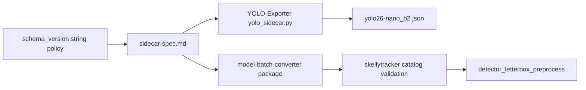

# Sidecar Spec Updates

## Parent plan

Prerequisite for [50_yolo26_nano_detection.plan.md](50_yolo26_nano_detection.plan.md) (**plan 40** in sequence). Complete this plan **before** skellytracker sidecar catalog loading (YOLO26 plan step 2) and before generic detector preprocessing is wired for YOLO26.

## Prerequisite Plans

Complete in implementation order before this plan:

- [**10 — Remove EP fallback**](10_remove_ep_fallback.plan.md)
- [**20 — Single global realtime pipeline**](20_single_global_realtime_pipeline.plan.md)
- [**30 — Realtime batch size config**](30_realtime_batch_size.plan.md) — sidecar `batching` fields are consumed by YOLO26 after this plan lands; spec work here does not require the rename but follows the global sequence.

## Plan sequence

| Order | Plan | Notes |
|-------|------|-------|
| **10** | [10_remove_ep_fallback.plan.md](10_remove_ep_fallback.plan.md) | |
| **20** | [20_single_global_realtime_pipeline.plan.md](20_single_global_realtime_pipeline.plan.md) | |
| **30** | [30_realtime_batch_size.plan.md](30_realtime_batch_size.plan.md) | |
| **40** (this) | Sidecar spec updates | Before YOLO26 catalog |
| **50** | [50_yolo26_nano_detection.plan.md](50_yolo26_nano_detection.plan.md) | Consumes this contract |
| future | [future_streaming_pipeline_implementation.plan.md](future_streaming_pipeline_implementation.plan.md) | Graph executor; after core realtime path |

This document is the home for **all** canonical sidecar contract changes. Each release batch updates [`model_batch_converter/specs/sidecar-spec.md`](../model_batch_converter/model_batch_converter/specs/sidecar-spec.md), bumps `schema_version` to the skellytracker version that introduces the change, and lists the concrete field deltas in [Change sets](#change-sets) below.

## Goals

1. **Traceable compatibility** — a sidecar's `schema_version` tells you the minimum skellytracker release required to consume it.
2. **Single source of truth** — spec changes live in `model-batch-converter`; skellytracker validates against the packaged spec via `importlib.resources`.
3. **First change set** — add `input.resize.interpolation` so YOLO26 host letterbox matches the export pipeline (replacing hardcoded `cv2.INTER_LINEAR` in [`rtm_preprocessing.py`](../skellytracker/utilities/gpu_utils/rtm_preprocessing.py)).

## Schema versioning policy

Replace the current integer `schema_version` (e.g. `1`) with a **string that matches the skellytracker release version** that last introduced or required a change to the sidecar contract.

### Format

| Aspect | Rule |
|--------|------|
| Field | `schema_version` (unchanged name) |
| Type | `string` (was `integer`) |
| Value | Exact skellytracker `__version__` string at the time the spec change ships (e.g. `"v2024.09.1019"`) |
| Source of truth for format | [`skellytracker/__init__.py`](../skellytracker/__init__.py) `__version__` and [`pyproject.toml`](../pyproject.toml) `[tool.bumpver]` (`version_pattern = "vYYYY.0M.BUILD[-TAG]"`) |

Integer `schema_version: 1` never shipped in production sidecars. Do **not** support integer versions in skellytracker validation — start fresh with the calendar string format.

### Semantics

- **`schema_version` on a sidecar** = the skellytracker version that defined the contract the sidecar was authored against.
- **Minimum consumer** — skellytracker release `S` can load a sidecar with `schema_version` `V` when `S >= V` (same ordering as skellytracker calendar versions).
- **Too-new sidecar** — if `sidecar.schema_version > installed_skellytracker_version`, reject at catalog validation with a recoverable error naming both versions and an upgrade hint.
- **Exporter obligation** — when emitting a sidecar, set `schema_version` to the skellytracker version documented as current in the canonical spec at export time (or the version pin the exporter targets).

### Spec document updates (`model-batch-converter`)

In [`sidecar-spec.md`](../model_batch_converter/model_batch_converter/specs/sidecar-spec.md):

- Replace the Schema versioning section: `schema_version` is a required **string** matching skellytracker release versions.
- Remove integer `1` as the current version; add a **changelog table**:

| `schema_version` | skellytracker release | Changes |
|------------------|----------------------|---------|
| `vYYYY.MM.BBBB` | same as column 1 | *(set at implementation time to the release that lands this plan)* — add `input.resize.interpolation`; migrate `schema_version` from integer to string |

- Update **all** reference JSON examples to use the string `schema_version` and current change-set fields.
- Add validation-checklist items:
  - [ ] `schema_version` is a string matching the skellytracker version pattern
  - [ ] `schema_version` is supported by the installed skellytracker release (`installed >= schema_version`)
- Document that future spec edits **must** bump `schema_version` to the skellytracker version merging the spec change (not an independent integer counter).

### skellytracker consumer validation

- Read installed version from `skellytracker.__version__`.
- Parse and compare `schema_version` using the same calendar-version ordering as bumpver (strip/normalize `v` prefix consistently).
- Reject invalid format, unsupported future `schema_version`, and (per change set) missing required fields for the declared version.
- Error messages should include: sidecar `model_id`, sidecar `schema_version`, installed skellytracker version.


## Change sets

Each subsection is one spec evolution batch. When implementing a new batch, append a row to the changelog table in `sidecar-spec.md` and bump example sidecars to the new `schema_version`.

### Change set — `input.resize.interpolation` (this plan)

**Problem:** `input.resize` declares `method`, `target_size`, `preserve_aspect_ratio`, and `pad_value` only. Host resize filter is implicit; skellytracker hardcodes `INTER_LINEAR`. Wrong interpolation silently degrades detection quality.

**Field** — add to `input.resize`:

| Field | Type | Required | Description |
|-------|------|----------|-------------|
| `resize.interpolation` | string | yes | Host resize filter for `resize.method` scaling. Closed enum in this change set. |

**Allowed values**

| Sidecar value | OpenCV constant | Typical use |
|---------------|-----------------|-------------|
| `"linear"` | `cv2.INTER_LINEAR` | YOLO/Ultralytics letterbox export (YOLO26 default) |
| `"area"` | `cv2.INTER_AREA` | Downscaling with area resampling |
| `"cubic"` | `cv2.INTER_CUBIC` | Higher-quality upscale |
| `"nearest"` | `cv2.INTER_NEAREST` | Nearest-neighbor |

**Example fragment**

```json
{
  "schema_version": "v2024.09.1019",
  "input": {
    "resize": {
      "method": "letterbox",
      "target_size": [640, 640],
      "preserve_aspect_ratio": true,
      "pad_value": 114,
      "interpolation": "linear"
    }
  }
}
```

Replace `"v2024.09.1019"` with the actual skellytracker version at merge time.

**skellytracker consumer:** `resolve_resize_interpolation()` in [`rtm_preprocessing.py`](../skellytracker/utilities/gpu_utils/rtm_preprocessing.py); YOLO26 reads `input.resize.interpolation`; YOLOX legacy passes `"linear"` explicitly.

## Dependency flow



Re-run `uv sync` after updating the editable `model-batch-converter` sibling checkout.

## Implementation plan

### 1. Schema version format (`model-batch-converter` + skellytracker)

- Rewrite Schema versioning in [`sidecar-spec.md`](../model_batch_converter/model_batch_converter/specs/sidecar-spec.md) per [Schema versioning policy](#schema-versioning-policy).
- Update all reference examples from `"schema_version": 1` to the target string version.
- Add skellytracker helper (e.g. `parse_skellytracker_version`, `sidecar_schema_supported(installed, sidecar)`) used by catalog validation.
- Unit-test version comparison edge cases (equal, newer sidecar, older sidecar, malformed string).

### 2. Change set — interpolation (`model-batch-converter`)

- Add `resize.interpolation` field table, enum, and checklist item.
- Update all letterbox `resize` examples with `"interpolation": "linear"`.

### 3. YOLO-Exporter

- Emit string `schema_version` (current target skellytracker version) and `resize.interpolation`.
- Update [exporter tests](https://github.com/domisjustanumber/YOLO-Exporter/blob/main/tests/test_yolo_sidecar.py).

### 4. Published YOLO26 artifact

- Update `yolo26-nano_b2.json` in `models/` with new `schema_version` and `interpolation`.

### 5. skellytracker catalog + preprocess

- Catalog validation: `schema_version` compatibility **then** required fields (including `resize.interpolation`).
- `detector_letterbox_preprocess(..., interpolation=...)` driven from sidecar on YOLO26 path.

## Validation plan

- Unit-test `schema_version` string format validation.
- Unit-test rejection when sidecar `schema_version` is newer than installed skellytracker.
- Unit-test acceptance when versions match or installed skellytracker is newer.
- Unit-test missing / unknown `resize.interpolation`.
- Unit-test `resolve_resize_interpolation("linear")` → `cv2.INTER_LINEAR`.
- Unit-test `detector_letterbox_preprocess` honors passed interpolation.

## Main risks

- **Version skew** — exporter, checked-in sidecars, and spec changelog must agree on the same `schema_version` string at release time.
- **Interpolation mismatch** — same severity as color/dtype/normalization errors; host must match export.
- **Future changes** — every spec edit must bump `schema_version` to the merging skellytracker release; document in changelog table or consumers will mis-guess compatibility.

## Related files

- Canonical spec: [`model_batch_converter/specs/sidecar-spec.md`](../model_batch_converter/model_batch_converter/specs/sidecar-spec.md)
- skellytracker version: [`skellytracker/__init__.py`](../skellytracker/__init__.py)
- Preprocessing: [`skellytracker/utilities/gpu_utils/rtm_preprocessing.py`](../skellytracker/utilities/gpu_utils/rtm_preprocessing.py)
- Exporter: [YOLO-Exporter `yolo_sidecar.py`](https://github.com/domisjustanumber/YOLO-Exporter/blob/main/yolo_sidecar.py)

## Related Plans

- [30_realtime_batch_size.plan.md](30_realtime_batch_size.plan.md) — **prerequisite** in sequence; YOLO26 `model_batch_convert` uses derived `batch_size` from this plan.
- [50_yolo26_nano_detection.plan.md](50_yolo26_nano_detection.plan.md) — **blocked on this plan** for catalog loading, validation, and `detector_letterbox_preprocess`.
- [future_streaming_pipeline_implementation.plan.md](future_streaming_pipeline_implementation.plan.md) — future sidecar-backed graph nodes use the contract defined here.
