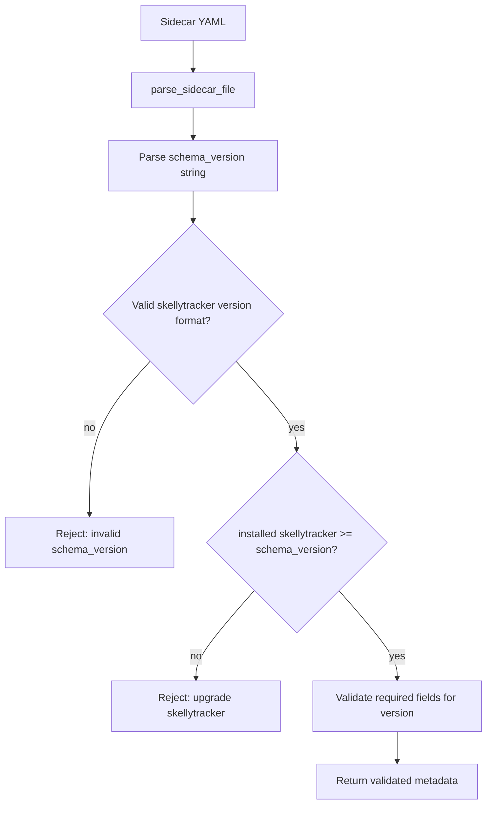
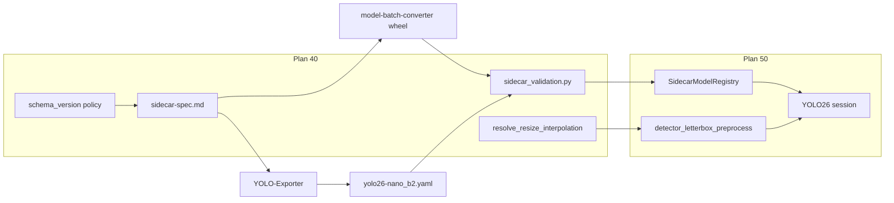

# Sidecar Spec Updates

## Parent plan

Prerequisite for [50_yolo26_nano_detection.plan.md](50_yolo26_nano_detection.plan.md) (**plan 40** in sequence). Complete this plan **before** skellytracker `SidecarModelRegistry` catalog loading (YOLO26 plan step 1) and before generic detector preprocessing is wired for YOLO26.

## Boundary with plan 50

Plan 40 and plan 50 split responsibilities to avoid duplicate work:

| Deliverable | Plan 40 (this) | Plan 50 |
|-------------|----------------|---------|
| `sidecar-spec.md` contract changes | yes | consumes |
| `parse_sidecar_file()` / `yaml.safe_load` | yes | uses in registry scan |
| `validate_sidecar_metadata()` library | yes | uses in `SidecarModelRegistry` |
| `parse_skellytracker_version()` / version compare | yes | uses in catalog validation |
| `resolve_resize_interpolation()` | yes | uses in preprocess |
| `detector_letterbox_preprocess()` | **no** | creates + wires YOLO26 |
| `SidecarModelRegistry` / `list_detection_models()` merge | **no** | creates |
| YOLO26 session wiring | **no** | creates |

Plan 50 must be updated when plan 40 lands: replace all `*.json` sidecar references with `*.yaml`, `yaml.safe_load`, and YAML examples (plan 50 still references `yolo26-nano_b2.json` and JSON catalog scan today).

## Prerequisite Plans

Complete in implementation order before this plan:

- [**10 — Remove EP fallback**](10_remove_ep_fallback.plan.md)
- [**20 — Single global realtime pipeline**](20_single_global_realtime_pipeline.plan.md)
- [**30 — Realtime batch size config**](30_realtime_batch_size.plan.md) — sidecar `batching` fields are consumed by YOLO26 after this plan lands; spec work here does not require the rename but follows the global sequence.

## Plan sequence

| Order | Plan | Notes |
|-------|------|-------|
| **10** | [10_remove_ep_fallback.plan.md](10_remove_ep_fallback.plan.md) | |
| **20** | [20_single_global_realtime_pipeline.plan.md](20_single_global_realtime_pipeline.plan.md) | |
| **30** | [30_realtime_batch_size.plan.md](30_realtime_batch_size.plan.md) | |
| **40** (this) | Sidecar spec updates | Before YOLO26 catalog |
| **50** | [50_yolo26_nano_detection.plan.md](50_yolo26_nano_detection.plan.md) | Consumes this contract |
| future | [future_streaming_pipeline_implementation.plan.md](future_streaming_pipeline_implementation.plan.md) | Graph executor; after core realtime path |

This document is the home for **all** canonical sidecar contract changes. Each release batch updates [`model_batch_converter/specs/sidecar-spec.md`](../model_batch_converter/model_batch_converter/specs/sidecar-spec.md), bumps `schema_version` to the skellytracker version that introduces the change, and lists the concrete field deltas in [Change sets](#change-sets) below.

## Goals

1. **Traceable compatibility** — a sidecar's `schema_version` tells you the minimum skellytracker release required to consume it.
2. **Single source of truth** — spec changes live in `model-batch-converter`; skellytracker validates via explicit Python validators that mirror the packaged spec (human-readable `sidecar-spec.md` is documentation; it is not parsed at runtime).
3. **First change set** — add `input.resize.interpolation` so YOLO26 host letterbox matches the export pipeline (replacing hardcoded `cv2.INTER_LINEAR` in [`rtm_preprocessing.py`](../skellytracker/utilities/gpu_utils/rtm_preprocessing.py)).

## Release coordination

Implement and publish in this order:

1. **Bump skellytracker** via bumpver at merge time — set the changelog `schema_version` row and all example sidecars to the **new** release version, not the pre-change `__version__`.
2. **model-batch-converter** — publish wheel with updated `sidecar-spec.md` (uncomment/add dependency in [`pyproject.toml`](../pyproject.toml); use editable `../model_batch_converter` during dev).
3. **YOLO-Exporter** — emit YAML sidecars targeting the documented `schema_version` (must not exceed published skellytracker; if exporter pins a future version, skellytracker rejects the sidecar until upgraded).
4. **Checked-in artifact** — `models/yolo26-nano_b2.yaml` with matching `schema_version`.
5. **skellytracker** — validation library + `resolve_resize_interpolation()`; plan 50 integrates registry and preprocess.

If `model-batch-converter` is missing at validation time, plan 50 omits sidecar-backed models with a diagnostic (unchanged policy).

## Sidecar format: YAML

Sidecar files use YAML instead of JSON, following the conventions established by the `names_and_connections/` YAML files (see [`skellytracker/trackers/rtmpose_tracker/names_and_connections/`](../skellytracker/trackers/rtmpose_tracker/names_and_connections/)).

### File extension

Sidecar files use the `.yaml` extension. For example, `yolo26-nano_b2.yaml` describes the `yolo26-nano` detector's runtime contract.

### Style conventions (following `names_and_connections/`)

- **Document marker:** `---` at top of file
- **Comments:** `#` prefix for human-readable notes (not allowed in JSON)
- **Format:** YAML mappings and sequences — no trailing commas, no quotes on bare strings
- **Structure:** Flat top-level keys; nested objects use indentation
- **String values:** Quoted only when necessary (e.g. when value contains a colon or special character)
- **Lint:** Consider `yamllint` on `models/*.yaml` in CI to catch tabs/indentation issues

### Consumer updates

- `pyyaml>=6.0` is already in [`pyproject.toml`](../pyproject.toml) — no new dependency.
- Add `parse_sidecar_file(path) -> dict` using `yaml.safe_load()` in a new module (e.g. `skellytracker/utilities/gpu_utils/sidecar_validation.py`).
- Plan 50 wires `parse_sidecar_file` into `SidecarModelRegistry` scan of `models/*.yaml`.

## Pose sidecar: referencing names_and_connections

Pose estimator sidecars (role: `pose_estimator`) may reference existing YAML files in [`skellytracker/trackers/rtmpose_tracker/names_and_connections/`](../skellytracker/trackers/rtmpose_tracker/names_and_connections/) instead of duplicating keypoint labels and skeleton connections inline.

**Scope in plan 40:** document the field in `sidecar-spec.md` only. The skellytracker loader is **deferred** until a pose sidecar catalog consumer exists (not required for YOLO26). When implemented, reuse [`TrackedObjectDefinition`](skellytracker/trackers/base_tracker/tracked_object_definition.py) composition logic rather than a parallel prefix implementation.

### `pose.keypoint_config` field

| Field | Type | Required | Description |
|-------|------|----------|-------------|
| `pose.keypoint_config` | object | no | Mapping of body region to `names_and_connections/*.yaml` basename. Supported keys: `body`, `face`, `hand`. |

Each value is the basename of a file in `names_and_connections/`, for example `rtmpose_body.yaml` or `rtmpose_hand.yaml`.

For the RTMW-L wholebody case, the equivalent composite already exists as [`rtmpose_wholebody.yaml`](skellytracker/trackers/rtmpose_tracker/names_and_connections/rtmpose_wholebody.yaml) — the loader may delegate to that file when all three keys match the standard layout.

### Label prefix rules

Prefix rules **must match** [`rtmpose_wholebody.yaml`](skellytracker/trackers/rtmpose_tracker/names_and_connections/rtmpose_wholebody.yaml) and `TrackedObjectDefinition._from_composition_data`:

| Config key | Source file | Prefix | Example |
|------------|-------------|--------|---------|
| `body` | `rtmpose_body.yaml` | `""` | `nose` → `nose` |
| `hand` (right, first) | `rtmpose_hand.yaml` | `right_hand_` | `root` → `right_hand_root` |
| `hand` (left, second) | `rtmpose_hand.yaml` | `left_hand_` | `root` → `left_hand_root` |
| `face` | `rtmpose_face.yaml` | `""` | `face_0000` → `face_0000` (names already prefixed in file) |

`rtmpose_hand.yaml` uses un-prefixed landmark names (`thumb1`, `forefinger1`, …). `rtmpose_face.yaml` already uses `face_0000`…`face_0067` — do **not** prepend an additional `face_` prefix.

### Keypoint assembly order

Order **must match** COCO133 model output layout documented in `rtmpose_wholebody.yaml`:

> `[body.23][right_hand.21][left_hand.21][face.68] = 133 total`

Assembly sequence when resolving `keypoint_config`:

1. `body` → append `tracked_points` / `connections` with `""` prefix
2. `hand` → append right-hand copy (`right_hand_` prefix), then left-hand copy (`left_hand_` prefix)
3. `face` → append with `""` prefix

Config-key iteration order in the sidecar YAML is irrelevant; the consumer always emits labels in the order above.

### Resolution rules

- When `keypoint_config` is present, derive at load time:
  - `pose.keypoint_labels` — ordered list from assembly sequence above
  - `pose.keypoint_count` — `len(keypoint_labels)`
  - `overlay.skeleton` — one `{type: edge, from: <label>, to: <label>}` per connection pair, using prefixed label names
- **Overlay groups/colors:** if the sidecar defines `overlay.palette` / `overlay.groups`, map skeleton edges to groups by region (`body`, `right_hand`, `left_hand`, `face`) using the same defaults as the RTMPose annotator. If `overlay` is absent, emit edges without group/color (consumers apply defaults).
- Canonical mapping files (`*_to_canonical_mapping.yaml`) bridge RTMPose-specific names to canonical landmark names — documented but not consumed automatically at this stage.
- If `keypoint_config` is absent, the sidecar must provide `pose.keypoint_labels`, `pose.keypoint_count`, and `overlay.skeleton` inline.

### Example: RTMW-L WholeBody

```yaml
---
schema_version: "vYYYY.MM.BBBB"  # set at merge via bumpver
model_id: rtmw-l-wholebody
display_name: RTMW L WholeBody
family: rtmw
role: pose_estimator
pose:
  estimator_type: top_down_single_person
  keypoint_config:
    body: rtmpose_body.yaml
    hand: rtmpose_hand.yaml
    face: rtmpose_face.yaml
overlay:
  palette:
    body: [0, 255, 0]
    hand: [255, 128, 0]
    face: [0, 128, 255]
```

## Schema versioning policy

Replace the current integer `schema_version` (e.g. `1`) with a **string that matches the skellytracker release version** that last introduced or required a change to the sidecar contract.

### Format

| Aspect | Rule |
|--------|------|
| Field | `schema_version` (unchanged name) |
| Type | `string` (was `integer`) |
| Value | Exact skellytracker `__version__` string at the time the spec change ships (e.g. `"v2024.09.1019"`) |
| Source of truth for format | [`skellytracker/__init__.py`](../skellytracker/__init__.py) `__version__` and [`pyproject.toml`](../pyproject.toml) `[tool.bumpver]` (`version_pattern = "vYYYY.0M.BUILD[-TAG]"`) |

Integer `schema_version: 1` never shipped in production sidecars. Do **not** support integer versions in skellytracker validation — start fresh with the calendar string format.

### Semantics

- **`schema_version` on a sidecar** = the skellytracker version that defined the contract the sidecar was authored against.
- **Minimum consumer** — skellytracker release `S` can load a sidecar with `schema_version` `V` when `S >= V` (same ordering as skellytracker calendar versions).
- **Too-new sidecar** — if `sidecar.schema_version > installed_skellytracker_version`, reject at catalog validation with a recoverable error naming both versions and an upgrade hint.
- **Exporter obligation** — when emitting a sidecar, set `schema_version` to the skellytracker version documented as current in the canonical spec at export time (or the version pin the exporter targets).

### Version comparison algorithm

Add `parse_skellytracker_version(version: str) -> tuple[int, int, int, str | None]` in skellytracker:

1. Strip optional leading `v` (accept both `v2024.09.1019` and `2024.09.1019`).
2. Split on `-` into `core` and optional `tag` (pre-release suffix per bumpver `[-TAG]`).
3. Parse `core` as `YYYY.MM.BUILD` (three dot-separated integers).
4. Compare tuples `(year, month, build, tag)` lexicographically; `tag=None` sorts **after** any tagged pre-release of the same core (stable release > pre-release), or document that pre-release tags are rejected in sidecars for v1.

`sidecar_schema_supported(installed, sidecar) -> bool` returns `parse(installed) >= parse(sidecar)`.

Unit-test: equal, older sidecar / newer installed, newer sidecar / older installed, malformed string, missing components, tagged builds.

### Version-gated required fields

Validation does **not** parse `sidecar-spec.md` at runtime. Use a hardcoded checklist in `sidecar_validation.py` keyed by minimum `schema_version`, extended when new change sets ship:

```python
# v1 (this plan) — illustrative; exact version set at merge via bumpver
SCHEMA_REQUIREMENTS: list[tuple[str, Callable[[dict], list[str]]]] = [
    ("vYYYY.MM.BBBB", _require_interpolation_when_resize_present),
]
```

Rules for this change set:

| Field | Required when |
|-------|---------------|
| `input.resize.interpolation` | `input.resize` is present (all current detector/pose sidecars with resize use `letterbox`; interpolation applies to the resize scaling step regardless of `resize.method`) |

Older sidecars with lower `schema_version` that omit fields added in a newer spec are accepted only if `installed >= sidecar.schema_version` **and** the sidecar satisfies the requirements active at its declared version. Exporters authoring against the current spec must include all fields for the current `schema_version`.

### Spec document updates (`model-batch-converter`)

In [`sidecar-spec.md`](../model_batch_converter/model_batch_converter/specs/sidecar-spec.md):

- Replace the Schema versioning section: `schema_version` is a required **string** matching skellytracker release versions.
- Remove integer `1` as the current version; add a **changelog table**:

| `schema_version` | skellytracker release | Changes |
|------------------|----------------------|---------|
| `vYYYY.MM.BBBB` | same as column 1 | *(bumpver at merge)* — add `input.resize.interpolation`; migrate `schema_version` from integer to string; adopt YAML format; document `pose.keypoint_config` |

- Update **all** reference examples (YAML) to use the string `schema_version` and current change-set fields.
- Add validation-checklist items (human-readable mirror of Python validators):
  - [ ] `schema_version` is a string matching the skellytracker version pattern
  - [ ] `schema_version` is supported by the installed skellytracker release (`installed >= schema_version`)
  - [ ] `input.resize.interpolation` present when `input.resize` is present
- Document that future spec edits **must** bump `schema_version` to the skellytracker version merging the spec change (not an independent integer counter).

### skellytracker consumer validation

Module: `skellytracker/utilities/gpu_utils/sidecar_validation.py` (name illustrative).

- `parse_sidecar_file(path) -> dict`
- `validate_sidecar_metadata(sidecar: dict) -> None` — raises `SidecarValidationError` with `model_id`, `schema_version`, installed version in message
- Read installed version from `skellytracker.__version__`
- Reject: malformed `schema_version`, sidecar newer than installed, missing version-gated fields
- Plan 50 `SidecarModelRegistry` calls these functions; plan 40 does not implement the registry



## Change sets

Each subsection is one spec evolution batch. When implementing a new batch, append a row to the changelog table in `sidecar-spec.md`, add a `SCHEMA_REQUIREMENTS` entry, and bump example sidecars to the new `schema_version`.

### Change set — `input.resize.interpolation` (this plan)

**Problem:** `input.resize` declares `method`, `target_size`, `preserve_aspect_ratio`, and `pad_value` only. Host resize filter is implicit; skellytracker hardcodes `INTER_LINEAR`. Wrong interpolation silently degrades detection quality.

**Field** — add to `input.resize`:

| Field | Type | Required | Description |
|-------|------|----------|-------------|
| `resize.interpolation` | string | when `input.resize` present | Host resize filter for the resize scaling step. Closed enum in this change set. |

**Allowed values**

| Sidecar value | OpenCV constant | Typical use |
|---------------|-----------------|-------------|
| `linear` | `cv2.INTER_LINEAR` | YOLO/Ultralytics letterbox export (YOLO26 default) |
| `area` | `cv2.INTER_AREA` | Downscaling with area resampling |
| `cubic` | `cv2.INTER_CUBIC` | Higher-quality upscale |
| `nearest` | `cv2.INTER_NEAREST` | Nearest-neighbor |

**Example fragment**

```yaml
---
schema_version: "vYYYY.MM.BBBB"  # bumpver at merge
input:
  resize:
    method: letterbox
    target_size: [640, 640]
    preserve_aspect_ratio: true
    pad_value: 114
    interpolation: linear
```

**skellytracker consumer:** `resolve_resize_interpolation(value: str) -> int` in [`rtm_preprocessing.py`](../skellytracker/utilities/gpu_utils/rtm_preprocessing.py). Plan 50 passes sidecar `input.resize.interpolation` into `detector_letterbox_preprocess(..., interpolation=...)`. YOLOX legacy keeps `"linear"` explicitly.

## Complete YOLO26 Nano detector sidecar example

Full reference sidecar for a YOLO26 Nano detector with precision-grouped ONNX artifacts, demonstrating the YAML format conventions:

```yaml
---
schema_version: "vYYYY.MM.BBBB"  # bumpver at merge
model_id: yolo26-nano
display_name: YOLO26 Nano
family: yolo26
role: detector

onnx:
  precision_artifacts:
    fp32:
      filename: yolo26-nano_b2_fp32.onnx
      sha256: "<lowercase-hex-sha256>"
      input_dtype: float32
    fp16:
      filename: yolo26-nano_b2_fp16.onnx
      sha256: "<lowercase-hex-sha256>"
      input_dtype: float16
    int8:
      filename: yolo26-nano_b2_int8.onnx
      sha256: "<lowercase-hex-sha256>"
      input_dtype: uint8

input:
  name: images
  dtype_by_precision:
    fp32: float32
    fp16: float16
    int8: uint8
  shape: [2, 3, 640, 640]
  layout: NCHW
  dynamic_axes: {}
  color_format: RGB
  normalization:
    scale: 0.00392156862745098
    mean: [0.0, 0.0, 0.0]
    std: [1.0, 1.0, 1.0]
  resize:
    method: letterbox
    target_size: [640, 640]
    preserve_aspect_ratio: true
    pad_value: 114
    interpolation: linear
  coordinate_origin: top_left

batching:
  batch_axis: 0
  supports_dynamic_batch: false
  batch_size: 2
  batch_conversion:
    profile_id: yolo26-detector-static-batch
    source_batch_size: 2
    target_batch:
      minimum: 1
      axis: 0
    rewrite_rules:
      - metadata_batch
      - leading_value_info_batch
      - int64_shape_first_dim
      - batch_offset_initializer
    tensor_matchers:
      int64_shape_first_dim:
        dtype: int64
        rank: 1
        minimum_size: 2
        first_value: source_batch
        rewrite_first_value_to: target_batch
      batch_offset_initializer:
        dtype: int64
        shape: [source_batch, 1]
        start: 0
        stride: 300
        rewrite_shape: [target_batch, 1]
    target_batch_one:
      remove_batch_offset_add: true
      offset_initializer_name: "/model.23/Mul_3_output_0"
      rewire_producer_output: true
      rewire_consumers: true
    validation:
      input_shape: [target_batch, 3, 640, 640]
      output_shapes: [[target_batch, 300, 6]]

outputs:
  - name: output0
    dtype: float32
    shape: [2, 300, 6]
    rank: 3
    semantic: detections
    fields: [x1, y1, x2, y2, score, class_id]
    box_format: xyxy
    coordinate_space: letterboxed_input
    requires_nms: false
    class_id_base: 0
    person_class_id: 0
    score_field: score
    class_field: class_id
    max_detections: 300
    may_include_non_person_classes: true

postprocessing:
  requires_nms: false
  filter_class_id: 0
  confidence_threshold_default: 0.7
  map_boxes_to_source_image: true
```

## Dependency flow



Re-run `uv sync` after updating the editable `model-batch-converter` sibling checkout.

## Implementation plan

### 0. YAML format (`model-batch-converter` + skellytracker)

- Define YAML as the sidecar format in [`sidecar-spec.md`](../model_batch_converter/model_batch_converter/specs/sidecar-spec.md): file extension `.yaml`, document marker `---`, style conventions.
- Update all reference examples from JSON to YAML using the `names_and_connections/` conventions.
- Add `parse_sidecar_file()` in `sidecar_validation.py` using existing `pyyaml` dependency.
- Unit-test that a valid YAML sidecar parses correctly.

### 1. Schema version format (`model-batch-converter` + skellytracker)

- Rewrite Schema versioning in [`sidecar-spec.md`](../model_batch_converter/model_batch_converter/specs/sidecar-spec.md) per [Schema versioning policy](#schema-versioning-policy).
- **Bump skellytracker** via bumpver at merge; use the new version in changelog row and all examples.
- Add `parse_skellytracker_version`, `sidecar_schema_supported`, and `SCHEMA_REQUIREMENTS` in `sidecar_validation.py`.
- Unit-test version comparison edge cases.

### 2. Change set — interpolation (`model-batch-converter` + skellytracker)

- Add `resize.interpolation` field table, enum, and checklist item in [`sidecar-spec.md`](../model_batch_converter/model_batch_converter/specs/sidecar-spec.md).
- Update all letterbox `resize` examples with `interpolation: linear`.
- Add `resolve_resize_interpolation()` in [`rtm_preprocessing.py`](../skellytracker/utilities/gpu_utils/rtm_preprocessing.py).
- Add `_require_interpolation_when_resize_present` to `SCHEMA_REQUIREMENTS`.

### 3. YOLO-Exporter

- Emit YAML sidecar (`.yaml` extension) with string `schema_version` (current target skellytracker version) and `resize.interpolation`.
- Update [exporter tests](https://github.com/domisjustanumber/YOLO-Exporter/blob/main/tests/test_yolo_sidecar.py).
- Follow [Release coordination](#release-coordination) ordering.

### 4. Published YOLO26 artifact

- Create `yolo26-nano_b2.yaml` in `models/` with bumped `schema_version` and `interpolation`.

### 5. skellytracker validation library (plan 50 integrates)

- Implement `validate_sidecar_metadata()` — `schema_version` compatibility then version-gated required fields.
- Export public API from `skellytracker.utilities.gpu_utils` for plan 50 `SidecarModelRegistry`.
- **Do not** implement `SidecarModelRegistry`, `detector_letterbox_preprocess`, or YOLO26 session wiring in this plan.

### 6. Pose sidecar: `pose.keypoint_config` — spec only (`model-batch-converter`)

- Add `pose.keypoint_config` field and prefix/order rules to [`sidecar-spec.md`](../model_batch_converter/model_batch_converter/specs/sidecar-spec.md) per [Pose sidecar](#pose-sidecar-referencing-names_and_connections).
- Document `TrackedObjectDefinition` reuse for the future loader.
- **Defer** skellytracker loader implementation and unit tests until a pose sidecar catalog consumer exists.

## Validation plan

### Plan 40 (this release)

- Unit-test `parse_sidecar_file` on valid YAML sidecar.
- Unit-test `parse_skellytracker_version` (equal, newer sidecar, older sidecar, malformed, tagged).
- Unit-test `validate_sidecar_metadata` rejects sidecar newer than installed skellytracker.
- Unit-test `validate_sidecar_metadata` accepts when installed >= sidecar version.
- Unit-test missing / unknown `resize.interpolation` when `input.resize` present.
- Unit-test `resolve_resize_interpolation("linear")` → `cv2.INTER_LINEAR`.

### Deferred with pose loader (future)

- Unit-test `keypoint_config` resolution: body, right/left hand prefixes, face without double-prefix.
- Unit-test 133-label order matches `rtmpose_wholebody.yaml`.
- Unit-test missing referenced YAML raises clear error.

### Plan 50

- Unit-test `detector_letterbox_preprocess` honors passed interpolation.
- Unit-test `SidecarModelRegistry` scans `*.yaml` and calls `validate_sidecar_metadata`.

## Main risks

- **Version skew** — exporter, checked-in sidecars, spec changelog, and bumpver release must agree on the same `schema_version` string.
- **Interpolation mismatch** — same severity as color/dtype/normalization errors; host must match export.
- **YAML syntax errors** — tabs vs spaces, ambiguous indentation, or unquoted special characters can cause parse failures.
- **`names_and_connections/` drift** — config YAML files are consumed by both the legacy RTMPose tracker and the future sidecar loader; incompatible changes could break both.
- **Plan 50 JSON stale refs** — plan 50 must be updated for YAML discovery when plan 40 merges, or implementers will ship incompatible loaders.
- **Future changes** — every spec edit must bump `schema_version`, add a `SCHEMA_REQUIREMENTS` entry, and update the changelog table.

## Related files

- Canonical spec: [`model_batch_converter/specs/sidecar-spec.md`](../model_batch_converter/model_batch_converter/specs/sidecar-spec.md)
- skellytracker version: [`skellytracker/__init__.py`](../skellytracker/__init__.py)
- Preprocessing: [`skellytracker/utilities/gpu_utils/rtm_preprocessing.py`](../skellytracker/utilities/gpu_utils/rtm_preprocessing.py)
- Validation (new): `skellytracker/utilities/gpu_utils/sidecar_validation.py`
- Pose keypoint configs: [`skellytracker/trackers/rtmpose_tracker/names_and_connections/`](../skellytracker/trackers/rtmpose_tracker/names_and_connections/)
- Composition helper: [`skellytracker/trackers/base_tracker/tracked_object_definition.py`](../skellytracker/trackers/base_tracker/tracked_object_definition.py)
- Exporter: [YOLO-Exporter `yolo_sidecar.py`](https://github.com/domisjustanumber/YOLO-Exporter/blob/main/yolo_sidecar.py)

## Related Plans

- [30_realtime_batch_size.plan.md](30_realtime_batch_size.plan.md) — **prerequisite** in sequence; YOLO26 `model_batch_convert` uses derived `batch_size` from this plan.
- [50_yolo26_nano_detection.plan.md](50_yolo26_nano_detection.plan.md) — **blocked on this plan** for sidecar contract, `sidecar_validation.py`, and `resolve_resize_interpolation()`; plan 50 owns `SidecarModelRegistry`, `detector_letterbox_preprocess`, and YOLO26 session wiring. **Amend plan 50** for `*.yaml` sidecars when plan 40 merges.
- [future_streaming_pipeline_implementation.plan.md](future_streaming_pipeline_implementation.plan.md) — future sidecar-backed graph nodes use the contract defined here.
