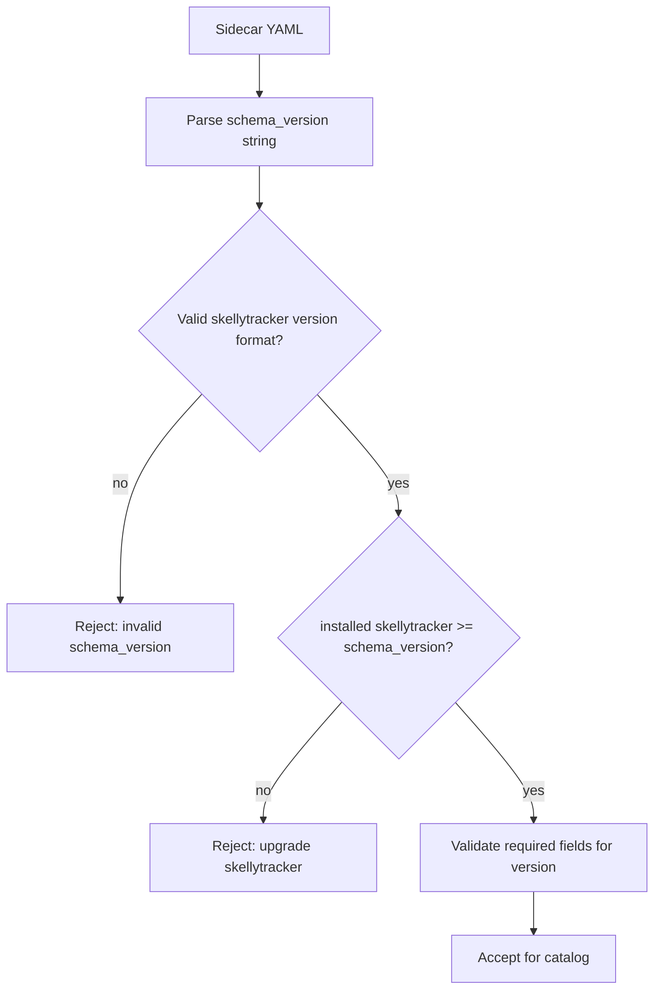
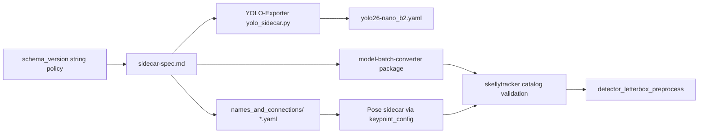

# Sidecar Spec Updates

## Parent plan

Prerequisite for [50_yolo26_nano_detection.plan.md](50_yolo26_nano_detection.plan.md) (**plan 40** in sequence). Complete this plan **before** skellytracker sidecar catalog loading (YOLO26 plan step 2) and before generic detector preprocessing is wired for YOLO26.

## Prerequisite Plans

Complete in implementation order before this plan:

- [**10 — Remove EP fallback**](10_remove_ep_fallback.plan.md)
- [**20 — Single global realtime pipeline**](20_single_global_realtime_pipeline.plan.md)
- [**30 — Realtime batch size config**](30_realtime_batch_size.plan.md) — sidecar `batching` fields are consumed by YOLO26 after this plan lands; spec work here does not require the rename but follows the global sequence.

## Plan sequence

| Order | Plan | Notes |
|-------|------|-------|
| **10** | [10_remove_ep_fallback.plan.md](10_remove_ep_fallback.plan.md) | |
| **20** | [20_single_global_realtime_pipeline.plan.md](20_single_global_realtime_pipeline.plan.md) | |
| **30** | [30_realtime_batch_size.plan.md](30_realtime_batch_size.plan.md) | |
| **40** (this) | Sidecar spec updates | Before YOLO26 catalog |
| **50** | [50_yolo26_nano_detection.plan.md](50_yolo26_nano_detection.plan.md) | Consumes this contract |
| future | [future_streaming_pipeline_implementation.plan.md](future_streaming_pipeline_implementation.plan.md) | Graph executor; after core realtime path |

This document is the home for **all** canonical sidecar contract changes. Each release batch updates [`model_batch_converter/specs/sidecar-spec.md`](../model_batch_converter/model_batch_converter/specs/sidecar-spec.md), bumps `schema_version` to the skellytracker version that introduces the change, and lists the concrete field deltas in [Change sets](#change-sets) below.

## Goals

1. **Traceable compatibility** — a sidecar's `schema_version` tells you the minimum skellytracker release required to consume it.
2. **Single source of truth** — spec changes live in `model-batch-converter`; skellytracker validates against the packaged spec via `importlib.resources`.
3. **First change set** — add `input.resize.interpolation` so YOLO26 host letterbox matches the export pipeline (replacing hardcoded `cv2.INTER_LINEAR` in [`rtm_preprocessing.py`](../skellytracker/utilities/gpu_utils/rtm_preprocessing.py)).

## Sidecar format: YAML

Sidecar files use YAML instead of JSON, following the conventions established by the `names_and_connections/` YAML files (see [`skellytracker/trackers/rtmpose_tracker/names_and_connections/`](../skellytracker/trackers/rtmpose_tracker/names_and_connections/)).

### File extension

Sidecar files use the `.yaml` extension. For example, `yolo26-nano_b2.yaml` describes the `yolo26-nano` detector's runtime contract.

### Style conventions (following `names_and_connections/`)

- **Document marker:** `---` at top of file
- **Comments:** `#` prefix for human-readable notes (not allowed in JSON)
- **Format:** YAML mappings and sequences — no trailing commas, no quotes on bare strings
- **Structure:** Flat top-level keys; nested objects use indentation
- **String values:** Quoted only when necessary (e.g. when value contains a colon or special character)

### Consumer updates

- Add `pyyaml` to dependencies (`pyproject.toml`).
- Use `yaml.safe_load()` for sidecar loading in catalog loading code.
- Sidecar validation is identical to JSON — only the serialization format changes.

## Pose sidecar: referencing names_and_connections

Pose estimator sidecars (role: `pose_estimator`) reference the existing YAML files in [`skellytracker/trackers/rtmpose_tracker/names_and_connections/`](../skellytracker/trackers/rtmpose_tracker/names_and_connections/) instead of duplicating keypoint labels and skeleton connections inline.

### `pose.keypoint_config` field

| Field | Type | Required | Description |
|-------|------|----------|-------------|
| `pose.keypoint_config` | object | no | Mapping of body region to `names_and_connections/*.yaml` basename. Supported keys: `body`, `face`, `hand`. |

Each value is the basename of a file in `names_and_connections/`, for example `"rtmpose_body.yaml"` or `"rtmpose_hand.yaml"`.

### Label prefix rules

The `names_and_connections/` files use un-prefixed landmark names (e.g. `thumb1`, `forefinger1`). When `keypoint_config` references `rtmpose_hand.yaml` under the `hand` key, the consumer **prepends the side prefix** to each `tracked_points` entry to produce canonical labels:

| Config key | Source file | Prefix | Example |
|------------|-------------|--------|---------|
| `body` | `rtmpose_body.yaml` | *(none)* | `nose` → `nose`, `left_elbow` → `left_elbow` |
| `face` | `rtmpose_face.yaml` | `face_` | *(depends on file format)* |
| `hand` | `rtmpose_hand.yaml` | `left_hand_` / `right_hand_` | `root` → `left_hand_root`, `thumb1` → `left_hand_thumb1` |

The consumer derives two handed copies from `rtmpose_hand.yaml` — one with `left_hand_` prefix and one with `right_hand_` prefix — and appends all resulting labels to `keypoint_labels`.

### Resolution rules

- When `keypoint_config` is present, `pose.keypoint_labels`, `pose.keypoint_count`, and `overlay.skeleton` are **derived** from the referenced YAMLs at load time.
- For each config key (`body`, `face`, `hand`):
  - `tracked_points` (ordered list) → appended to `pose.keypoint_labels` in config-key order (body first, then face, then hand with both side prefixes).
  - `connections` (list of `[from, to]` pairs) → appended to `overlay.skeleton` entries (each pair becomes `{type: edge, from: <prefixed>, to: <prefixed>}` with group/color inherited from the sidecar's `overlay` palette).
- Canonical mapping files (`*_to_canonical_mapping.yaml`) bridge RTMPose-specific names to canonical landmark names — documented but not consumed automatically at this stage.
- If `keypoint_config` is absent, the sidecar must provide `pose.keypoint_labels`, `pose.keypoint_count`, and `overlay.skeleton` inline (backward compatible with sidecars that do not reference `names_and_connections/`).

### Example: RTMW-L WholeBody

```yaml
---
schema_version: "v2025.01.1000"
model_id: rtmw-l-wholebody
display_name: RTMW L WholeBody
family: rtmw
role: pose_estimator
pose:
  estimator_type: top_down_single_person
  keypoint_config:
    body: "rtmpose_body.yaml"
    face: "rtmpose_face.yaml"
    hand: "rtmpose_hand.yaml"
```

## Schema versioning policy

Replace the current integer `schema_version` (e.g. `1`) with a **string that matches the skellytracker release version** that last introduced or required a change to the sidecar contract.

### Format

| Aspect | Rule |
|--------|------|
| Field | `schema_version` (unchanged name) |
| Type | `string` (was `integer`) |
| Value | Exact skellytracker `__version__` string at the time the spec change ships (e.g. `"v2024.09.1019"`) |
| Source of truth for format | [`skellytracker/__init__.py`](../skellytracker/__init__.py) `__version__` and [`pyproject.toml`](../pyproject.toml) `[tool.bumpver]` (`version_pattern = "vYYYY.0M.BUILD[-TAG]"`) |

Integer `schema_version: 1` never shipped in production sidecars. Do **not** support integer versions in skellytracker validation — start fresh with the calendar string format.

### Semantics

- **`schema_version` on a sidecar** = the skellytracker version that defined the contract the sidecar was authored against.
- **Minimum consumer** — skellytracker release `S` can load a sidecar with `schema_version` `V` when `S >= V` (same ordering as skellytracker calendar versions).
- **Too-new sidecar** — if `sidecar.schema_version > installed_skellytracker_version`, reject at catalog validation with a recoverable error naming both versions and an upgrade hint.
- **Exporter obligation** — when emitting a sidecar, set `schema_version` to the skellytracker version documented as current in the canonical spec at export time (or the version pin the exporter targets).

### Spec document updates (`model-batch-converter`)

In [`sidecar-spec.md`](../model_batch_converter/model_batch_converter/specs/sidecar-spec.md):

- Replace the Schema versioning section: `schema_version` is a required **string** matching skellytracker release versions.
- Remove integer `1` as the current version; add a **changelog table**:

| `schema_version` | skellytracker release | Changes |
|------------------|----------------------|---------|
| `vYYYY.MM.BBBB` | same as column 1 | *(set at implementation time to the release that lands this plan)* — add `input.resize.interpolation`; migrate `schema_version` from integer to string; adopt YAML format; add `pose.keypoint_config` |

- Update **all** reference examples (now YAML instead of JSON) to use the string `schema_version` and current change-set fields.
- Add validation-checklist items:
  - [ ] `schema_version` is a string matching the skellytracker version pattern
  - [ ] `schema_version` is supported by the installed skellytracker release (`installed >= schema_version`)
- Document that future spec edits **must** bump `schema_version` to the skellytracker version merging the spec change (not an independent integer counter).

### skellytracker consumer validation

- Read installed version from `skellytracker.__version__`.
- Parse and compare `schema_version` using the same calendar-version ordering as bumpver (strip/normalize `v` prefix consistently).
- Reject invalid format, unsupported future `schema_version`, and (per change set) missing required fields for the declared version.
- Error messages should include: sidecar `model_id`, sidecar `schema_version`, installed skellytracker version.



## Change sets

Each subsection is one spec evolution batch. When implementing a new batch, append a row to the changelog table in `sidecar-spec.md` and bump example sidecars to the new `schema_version`.

### Change set — `input.resize.interpolation` (this plan)

**Problem:** `input.resize` declares `method`, `target_size`, `preserve_aspect_ratio`, and `pad_value` only. Host resize filter is implicit; skellytracker hardcodes `INTER_LINEAR`. Wrong interpolation silently degrades detection quality.

**Field** — add to `input.resize`:

| Field | Type | Required | Description |
|-------|------|----------|-------------|
| `resize.interpolation` | string | yes | Host resize filter for `resize.method` scaling. Closed enum in this change set. |

**Allowed values**

| Sidecar value | OpenCV constant | Typical use |
|---------------|-----------------|-------------|
| `"linear"` | `cv2.INTER_LINEAR` | YOLO/Ultralytics letterbox export (YOLO26 default) |
| `"area"` | `cv2.INTER_AREA` | Downscaling with area resampling |
| `"cubic"` | `cv2.INTER_CUBIC` | Higher-quality upscale |
| `"nearest"` | `cv2.INTER_NEAREST` | Nearest-neighbor |

**Example fragment**

```yaml
---
schema_version: "v2024.09.1019"
input:
  resize:
    method: letterbox
    target_size: [640, 640]
    preserve_aspect_ratio: true
    pad_value: 114
    interpolation: linear
```

Replace `"v2024.09.1019"` with the actual skellytracker version at merge time.

**skellytracker consumer:** `resolve_resize_interpolation()` in [`rtm_preprocessing.py`](../skellytracker/utilities/gpu_utils/rtm_preprocessing.py); YOLO26 reads `input.resize.interpolation`; YOLOX legacy passes `"linear"` explicitly.

## Complete YOLO26 Nano detector sidecar example

Full reference sidecar for a YOLO26 Nano detector with precision-grouped ONNX artifacts, demonstrating the YAML format conventions:

```yaml
---
schema_version: "v2024.09.1019"
model_id: yolo26-nano
display_name: YOLO26 Nano
family: yolo26
role: detector

onnx:
  precision_artifacts:
    fp32:
      filename: yolo26-nano_b2_fp32.onnx
      sha256: "<lowercase-hex-sha256>"
      input_dtype: float32
    fp16:
      filename: yolo26-nano_b2_fp16.onnx
      sha256: "<lowercase-hex-sha256>"
      input_dtype: float16
    int8:
      filename: yolo26-nano_b2_int8.onnx
      sha256: "<lowercase-hex-sha256>"
      input_dtype: uint8

input:
  name: images
  dtype_by_precision:
    fp32: float32
    fp16: float16
    int8: uint8
  shape: [2, 3, 640, 640]
  layout: NCHW
  dynamic_axes: {}
  color_format: RGB
  normalization:
    scale: 0.00392156862745098
    mean: [0.0, 0.0, 0.0]
    std: [1.0, 1.0, 1.0]
  resize:
    method: letterbox
    target_size: [640, 640]
    preserve_aspect_ratio: true
    pad_value: 114
    interpolation: linear
  coordinate_origin: top_left

batching:
  batch_axis: 0
  supports_dynamic_batch: false
  batch_size: 2
  batch_conversion:
    profile_id: yolo26-detector-static-batch
    source_batch_size: 2
    target_batch:
      minimum: 1
      axis: 0
    rewrite_rules:
      - metadata_batch
      - leading_value_info_batch
      - int64_shape_first_dim
      - batch_offset_initializer
    tensor_matchers:
      int64_shape_first_dim:
        dtype: int64
        rank: 1
        minimum_size: 2
        first_value: source_batch
        rewrite_first_value_to: target_batch
      batch_offset_initializer:
        dtype: int64
        shape: [source_batch, 1]
        start: 0
        stride: 300
        rewrite_shape: [target_batch, 1]
    target_batch_one:
      remove_batch_offset_add: true
      offset_initializer_name: "/model.23/Mul_3_output_0"
      rewire_producer_output: true
      rewire_consumers: true
    validation:
      input_shape: [target_batch, 3, 640, 640]
      output_shapes: [[target_batch, 300, 6]]

outputs:
  - name: output0
    dtype: float32
    shape: [2, 300, 6]
    rank: 3
    semantic: detections
    fields: [x1, y1, x2, y2, score, class_id]
    box_format: xyxy
    coordinate_space: letterboxed_input
    requires_nms: false
    class_id_base: 0
    person_class_id: 0
    score_field: score
    class_field: class_id
    max_detections: 300
    may_include_non_person_classes: true

postprocessing:
  requires_nms: false
  filter_class_id: 0
  confidence_threshold_default: 0.7
  map_boxes_to_source_image: true
```

## Dependency flow



Re-run `uv sync` after updating the editable `model-batch-converter` sibling checkout.

## Implementation plan

### 0. YAML format (`model-batch-converter` + skellytracker)

- Define YAML as the sidecar format in [`sidecar-spec.md`](../model_batch_converter/model_batch_converter/specs/sidecar-spec.md): file extension `.yaml`, document marker `---`, style conventions.
- Update all reference examples from JSON to YAML using the `names_and_connections/` conventions.
- Add `pyyaml` to skellytracker's `pyproject.toml` dependencies.
- Wire `yaml.safe_load()` in the catalog-sidecar loading path.
- Unit-test that a valid YAML sidecar parses correctly via `yaml.safe_load`.

### 1. Schema version format (`model-batch-converter` + skellytracker)

- Rewrite Schema versioning in [`sidecar-spec.md`](../model_batch_converter/model_batch_converter/specs/sidecar-spec.md) per [Schema versioning policy](#schema-versioning-policy).
- Update all reference examples from `"schema_version": 1` to the target string version.
- Add skellytracker helper (e.g. `parse_skellytracker_version`, `sidecar_schema_supported(installed, sidecar)`) used by catalog validation.
- Unit-test version comparison edge cases (equal, newer sidecar, older sidecar, malformed string).

### 2. Change set — interpolation (`model-batch-converter`)

- Add `resize.interpolation` field table, enum, and checklist item in [`sidecar-spec.md`](../model_batch_converter/model_batch_converter/specs/sidecar-spec.md).
- Update all letterbox `resize` examples with `"interpolation": "linear"`.

### 3. YOLO-Exporter

- Emit YAML sidecar (`.yaml` extension) with string `schema_version` (current target skellytracker version) and `resize.interpolation`.
- Update [exporter tests](https://github.com/domisjustanumber/YOLO-Exporter/blob/main/tests/test_yolo_sidecar.py).

### 4. Published YOLO26 artifact

- Create `yolo26-nano_b2.yaml` in `models/` with new `schema_version` and `interpolation`.

### 5. skellytracker catalog + preprocess

- Catalog validation: `schema_version` compatibility **then** required fields (including `resize.interpolation`).
- `detector_letterbox_preprocess(..., interpolation=...)` driven from sidecar on YOLO26 path.

### 6. Pose sidecar: `pose.keypoint_config` (`model-batch-converter` + skellytracker)

- Add `pose.keypoint_config` field (object with optional `body`, `face`, `hand` keys) to [`sidecar-spec.md`](../model_batch_converter/model_batch_converter/specs/sidecar-spec.md).
- Document label prefix mapping rules for each config key.
- Implement a keypoint_config loader in skellytracker that:
  - Resolves each `names_and_connections/*.yaml` basename from the `skellytracker/trackers/rtmpose_tracker/names_and_connections/` directory.
  - For `body`: loads `tracked_points` → appended to `pose.keypoint_labels` as-is; loads `connections` → appended to `overlay.skeleton` with no prefix.
  - For `face`: loads `tracked_points` → prepends `face_` prefix; loads `connections` → prepends `face_` prefix.
  - For `hand`: loads `tracked_points` → produces two copies with `left_hand_` and `right_hand_` prefixes; loads `connections` → produces two copies with corresponding prefixes.
  - Validates that referenced files exist and raises a clear, recoverable error if they do not.
- Unit-test `keypoint_config` resolution for all three config sections.

## Validation plan

- Unit-test YAML sidecar parses correctly via `yaml.safe_load`.
- Unit-test `schema_version` string format validation.
- Unit-test rejection when sidecar `schema_version` is newer than installed skellytracker.
- Unit-test acceptance when versions match or installed skellytracker is newer.
- Unit-test missing / unknown `resize.interpolation`.
- Unit-test `resolve_resize_interpolation("linear")` → `cv2.INTER_LINEAR`.
- Unit-test `detector_letterbox_preprocess` honors passed interpolation.
- Unit-test `keypoint_config` body resolution → correct `keypoint_labels` and `skeleton` entries.
- Unit-test `keypoint_config` hand resolution → `left_hand_` and `right_hand_` prefixed labels.
- Unit-test missing `keypoint_config` file raises clear error.

## Main risks

- **Version skew** — exporter, checked-in sidecars, and spec changelog must agree on the same `schema_version` string at release time.
- **Interpolation mismatch** — same severity as color/dtype/normalization errors; host must match export.
- **YAML syntax errors** — tabs vs spaces, ambiguous indentation, or unquoted special characters can cause silent parse failures that JSON wouldn't.
- **`names_and_connections/` drift** — config YAML files are consumed by both the legacy RTMPose tracker and the new sidecar loader; incompatible changes to one could break the other.
- **Future changes** — every spec edit must bump `schema_version` to the merging skellytracker release; document in changelog table or consumers will mis-guess compatibility.

## Related files

- Canonical spec: [`model_batch_converter/specs/sidecar-spec.md`](../model_batch_converter/model_batch_converter/specs/sidecar-spec.md)
- skellytracker version: [`skellytracker/__init__.py`](../skellytracker/__init__.py)
- Preprocessing: [`skellytracker/utilities/gpu_utils/rtm_preprocessing.py`](../skellytracker/utilities/gpu_utils/rtm_preprocessing.py)
- Pose keypoint configs: [`skellytracker/trackers/rtmpose_tracker/names_and_connections/`](../skellytracker/trackers/rtmpose_tracker/names_and_connections/)
- Exporter: [YOLO-Exporter `yolo_sidecar.py`](https://github.com/domisjustanumber/YOLO-Exporter/blob/main/yolo_sidecar.py)

## Related Plans

- [30_realtime_batch_size.plan.md](30_realtime_batch_size.plan.md) — **prerequisite** in sequence; YOLO26 `model_batch_convert` uses derived `batch_size` from this plan.
- [50_yolo26_nano_detection.plan.md](50_yolo26_nano_detection.plan.md) — **blocked on this plan** for catalog loading, validation, and `detector_letterbox_preprocess`.
- [future_streaming_pipeline_implementation.plan.md](future_streaming_pipeline_implementation.plan.md) — future sidecar-backed graph nodes use the contract defined here.