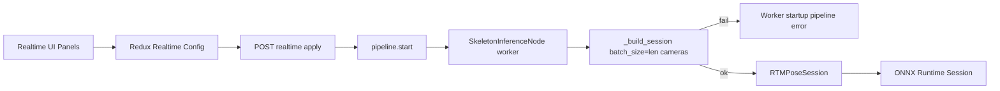
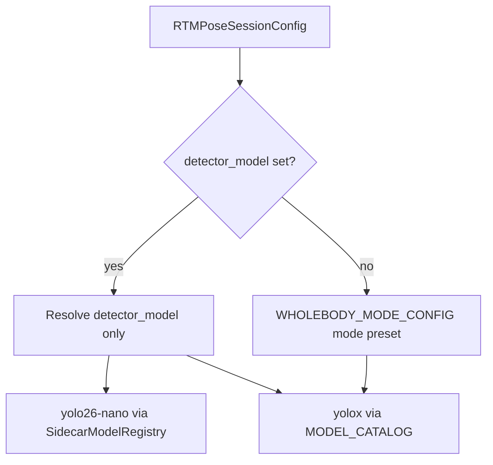

# Add YOLO26 Nano Detection

## Scope And Assumptions

- Primary detector implementation belongs in `skellytracker`, because freemocap currently delegates RTMPose session creation to `RTMPoseSession.create()` from [`pyproject.toml`](pyproject.toml).
- Freemocap lives in the sibling checkout at `../freemocap`; freemocap paths below are relative to this `skellytracker` checkout.
- The only checked-in or downloaded YOLO26 detector ONNX source artifacts are native batch size `2`, with one source file per precision, for example `yolo26-nano_b2_fp32.onnx`, `yolo26-nano_b2_fp16.onnx`, and optionally `yolo26-nano_b2_int8.onnx`. Freemocap may still request any positive runtime `batch_size` when starting a realtime session.
- Fixed-batch ONNX graph surgery is provided by **in-tree** [`skellytracker/utilities/gpu_utils/model_batch_convert.py`](../skellytracker/utilities/gpu_utils/model_batch_convert.py) (vendored in plan 60). Call `model_batch_convert()` at session startup and consume the generated ONNX file. YOLO26 detector is the first consumer, but `model_batch_convert()` should remain reusable for any model whose sidecar provides compatible `batching.batch_conversion` rules.
- Runtime YOLO26 precision selection is EP/hardware-driven at **session create**, before batch conversion. The sidecar may list any non-empty combination of `fp32`, `fp16`, and `int8` b2 source artifacts; no single precision is mandatory. **V1 runtime selection whitelists only `fp32` and `fp16`.** Sidecars may still list `int8` for metadata/tests, but skellytracker must not auto-select `int8` until a follow-up enables INT8 ORT sessions.
- **Catalog vs session-time validation:** If sidecar metadata passes validation, always expose the model in `list_detection_models()`. Do not hide YOLO26 based on the user's selected EP. If the requested EP and available v1-whitelisted precisions are incompatible (e.g. `fp32`-only sidecar + GPU EP), fail gracefully at session create with a recoverable error naming model id, EP, and available precisions.
- Do not use ONNX Runtime EP options to force YOLO26 batch shape. `model_batch_convert()` owns producing a concrete fixed-batch ONNX file from sidecar `batching.batch_conversion` metadata, and ORT session creation consumes that converted artifact as-is.
- **V1 artifact integrity:** Do not verify ONNX file SHA-256 hashes in v1. Sidecar `sha256` fields may be present per the canonical spec but are **ignored** for catalog validation, download, cache lookup, and session startup. Cache filenames use `{model_id}_b{batch}_{precision}.onnx` only — no hash suffix.
- YOLO26 nano ONNX and sidecar sources may be URLs or local relative paths. If no artifact path is provided, skellytracker should look in the top-level `models/` folder for sidecar YAML files. The canonical sidecar for the first YOLO26 nano model is `yolo26-nano.yaml` (`model_id: yolo26-nano`).
- Sidecar metadata validation must follow the canonical schema in [`specs/sidecar-spec.md`](../specs/sidecar-spec.md) **in this repository**, enforced by `sidecar_validation.py` (hardcoded Python mirrors — the markdown file is not parsed at runtime). User-facing overview: [`README.md`](../README.md) and [`models/README.md`](../models/README.md) (plan 40). Batch conversion uses vendored `model_batch_convert` from plan 60 — **no** external `model-batch-converter` package.
- This feature is an interim bridge away from the hardcoded `ModelSpec`/`MODEL_URLS` registry toward sidecar-populated model discovery. Do not remove the existing registry yet; add sidecar-backed catalog entries alongside the legacy entries.
- ONNX Runtime session creation for all realtime sessions (YOLOX, RTMPose pose, YOLO26 detector) must not include fallback providers behind the selected execution provider. See [10_remove_ep_fallback.plan.md](10_remove_ep_fallback.plan.md).
- The YOLO26 nano ONNX must be accompanied by a YAML sidecar that records the model I/O contract. The implementation should load this sidecar via `parse_sidecar_file()` from plan 40 rather than relying on hardcoded assumptions about tensor names, tensor layout, output shape, class ids, or post-NMS semantics.

## Prerequisite Plans

Complete before sidecar catalog loading (implementation step 1 below):

- [**10 — Remove EP fallback**](10_remove_ep_fallback.plan.md) — strict single-provider mode (default), `OnnxExecutionProviderStartupError`, freemocap worker strict mode.
- [**20 — Single global realtime pipeline**](20_single_global_realtime_pipeline.plan.md) — singleton manager, apply-only recreate, worker-start pipeline error UX (not eager apply validation).
- [**30 — Realtime batch size config**](30_realtime_batch_size.plan.md) — rename `max_batch_size` to `batch_size`; derive `batch_size=len(resolved_ids)` at **worker** session create; exact-batch `predict_batch`, `BatchSizeMismatchError`, skeleton-node gating.
- [**40 — Detector Sidecar Spec**](40_detector_sidecar_spec.plan.md) — YAML sidecar format, `schema_version` calendar strings, `onnx.batch_artifacts`, `input.normalization` modes, `input.resize.interpolation`, `sidecar_validation.py`, `resolve_resize_interpolation()`, `resolve_normalization_mode()`, exporter, artifact.
- [**60 — Sidecar batch conversion**](60_sidecar_batch_conversion.plan.md) — `batching.batch_conversion` spec, vendored `model_batch_convert.py`, `validate_batch_conversion_profile()`, exporter/artifact updates. Plan 50 owns `SidecarModelRegistry`, `detector_letterbox_preprocess`, and session-time conversion calls.

## Existing Flow To Reuse



Key local wiring points:

- `../freemocap/freemocap/core/pipeline/realtime/realtime_skeleton_inference_node.py` should pass the selected EP into `RTMPoseSessionConfig`. `batch_size` pass-through from camera count is defined in [30_realtime_batch_size.plan.md](30_realtime_batch_size.plan.md). EP strictness is in [10_remove_ep_fallback.plan.md](10_remove_ep_fallback.plan.md).
- `../freemocap/freemocap/system/gpu_capabilities_cache.py` serializes detection models from `skellytracker.utilities.gpu_utils.list_detection_models()`; YOLO26 should surface in freemocap when skellytracker startup/catalog validation confirms its sidecar metadata is valid. Source artifact usability is validated later, before first use.
- `../freemocap/freemocap-ui/src/components/control-panels/realtime-panel/RtmposeModelConfigPanel.tsx` renders detector models from the backend catalog.
- The freemocap frontend lets the user select which cameras are in the realtime pipeline (explicit `realtimeCameraIds` on every apply). **Batch size is not a user-facing or persisted setting** — it is `len(resolved_ids)` at **worker** session create per [30_realtime_batch_size.plan.md](30_realtime_batch_size.plan.md). YOLO26 `model_batch_convert` uses that derived `batch_size`.
- `../freemocap/freemocap-ui/src/components/control-panels/realtime-panel/ExecutionProviderConfigPanel.tsx` selects the EP; that EP selection drives YOLO26 precision policy in skellytracker at session create.

## YOLO26 ONNX Sidecar Contract

The source sidecar must follow the canonical schema in [`specs/sidecar-spec.md`](../specs/sidecar-spec.md). It is one file per model — for example `yolo26-nano.yaml` beside ONNX files `yolo26-nano_b2_fp32.onnx`, `yolo26-nano_b2_fp16.onnx`, and optionally `yolo26-nano_b2_int8.onnx`. The sidecar's `model_id` matches the filename stem (`yolo26-nano`).

It should contain only the runtime contract skellytracker needs to validate source models, select precision, run batch conversion, preprocess inputs, and postprocess detections. Do not put export logs, training metadata, skellytracker runtime defaults, or TRT provider policy in the sidecar.

Required information (see the canonical spec for field-level rules):

- Model identity and artifacts: `schema_version` (skellytracker calendar version string — see [40_detector_sidecar_spec.plan.md](40_detector_sidecar_spec.plan.md)), `model_id`, `display_name`, `family`, `role`, `onnx.batch_artifacts` with per-native-batch `precision_artifacts` (`filename`, optional `input_dtype`; `sha256` may appear per the canonical spec but is **not validated or used in v1**).
- Input contract: tensor name, dtype metadata, shape, layout, dynamic axes, color format, normalization mode (`input.normalization` — see [40_detector_sidecar_spec.plan.md](40_detector_sidecar_spec.plan.md)), resize/letterbox behavior (including `resize.interpolation`), and coordinate origin.
- Output contract: each output tensor's name, **dtype** (read from `outputs[].dtype`; do not assume output dtype matches input precision), shape, rank, semantic role, fields, coordinate format, coordinate space, and `requires_nms`.
- Detection semantics: class-id convention, person class id, confidence field, box field order, maximum detections if fixed, and whether non-person classes may appear.
- Batch semantics: `batch_axis`, `supports_dynamic_batch`, native batch sizes from `onnx.batch_artifacts` keys, and complete `batching.batch_conversion` rules for `model_batch_convert()` (see [60_sidecar_batch_conversion.plan.md](60_sidecar_batch_conversion.plan.md)). For YOLO26 nano detector source artifacts, `supports_dynamic_batch` must be `false`, native batch `2` must appear under `onnx.batch_artifacts`, and `batch_conversion` must be present.
- Postprocessing actions: `requires_nms`, `filter_class_id`, default confidence threshold, and whether boxes should be mapped back to source-image coordinates.

Canonical reference example: plan 40 base sidecar ([40_detector_sidecar_spec.plan.md](40_detector_sidecar_spec.plan.md#complete-yolo26-nano-detector-sidecar-example)) plus plan 60 `batch_conversion` block ([60_sidecar_batch_conversion.plan.md](60_sidecar_batch_conversion.plan.md#complete-yolo26-nano-sidecar-example-with-batch-conversion)) in `yolo26-nano.yaml`. Do not fork a divergent copy in this plan.

## Session Wiring

Catalog integration alone is not enough. `RTMPoseSession.create()` currently validates detector ids only against `MODEL_CATALOG`, resolves detector ONNX only through `MODEL_URLS`, and always enters the YOLOX dynamic-batch / pre-NMS path. YOLO26 requires explicit wiring:

- Add an internal sidecar registry, for example `SidecarModelRegistry`, keyed by sidecar `model_id`. Each entry stores the parsed sidecar dict, sidecar file path, discovery source, and metadata validation status/reason.
- **Registry init timing:** `SidecarModelRegistry` loads eagerly on first access to catalog APIs (`list_detection_models()` / module-level `_ensure_sidecar_registry_loaded()`), **before** any `RTMPoseSessionConfig` can validate `detector_model="yolo26-nano"`. `RTMPoseSessionConfig` `@model_validator` calls `resolve_wholebody_models()` at construction (`rtmpose_session.py` L106–113) — registry must be warm by then.
- Extend `resolve_wholebody_models()` and `_validate_detector_model()` so sidecar-backed ids resolve through the sidecar registry instead of `MODEL_CATALOG` / `MODEL_URLS`.
- Add `resolve_sidecar_precision_artifact(sidecar, precision) -> Path` for per-precision ONNX resolution (local path beside sidecar, relative path, URL, or default `models/` co-location). This is separate from single-file `resolve_model_path(ModelSource)`.
- In `RTMPoseSession.create()`, branch on detector family **before** YOLOX rewrite:
  - **YOLOX path (unchanged in v1):** existing `MODEL_URLS` download, `ensure_dynamic_batch`, YOLOX sessions, `yolox_letterbox_preprocess`.
  - **Sidecar-backed path (YOLO26 v1):** load validated sidecar metadata, select v1 precision, resolve source artifact, run cache lookup / `model_batch_convert()`, build detector ORT session via strict `build_tuned_ort_session` (default), and store sidecar-driven preprocess/postprocess hooks on the session.
- Keep RTMPose pose inference on the existing path for v1; only the detector stage branches.

## Mode Vs Explicit detector_model



- When freemocap sets `detector_model="yolo26-nano"`, `mode` (`balanced` / etc.) does **not** pick the detector; only pose falls back to mode if `pose_model` is unset (`resolve_wholebody_models` L192–205).
- Do **not** add YOLO26 to `WHOLEBODY_MODE_CONFIG` for v1.

## Execution Provider Resolution

| Layer | Behavior (all realtime sessions) |
|-------|----------------------------------|
| `resolve_provider(on_missing=...)` | `on_provider_missing="raise"` from freemocap; default `"raise"` in `RTMPoseSessionConfig` per [10_remove_ep_fallback.plan.md](10_remove_ep_fallback.plan.md) |
| `build_tuned_ort_session` | `allow_provider_fallback=False` (default) — single provider only; post-create active-provider verification |
| Freemocap `fallback_on_missing_provider` | Removed or defaulted off per [10_remove_ep_fallback.plan.md](10_remove_ep_fallback.plan.md) |

- Session startup must fail if ORT activates a different provider than requested, for YOLOX, RTMPose pose, and sidecar-backed YOLO26 detector sessions alike.
- `resolve_yolox_provider()` TRT/TRT-RTX → CUDA mapping for YOLOX detector EP selection is unchanged; strict mode still passes only the mapped single provider to ORT.

## Batch Size And Inference Semantics

Fixed-batch detector semantics (`RTMPoseSessionConfig.batch_size` replacing `max_batch_size`, freemocap **derived** `batch_size=len(resolved_ids)` — not stored in config, warmup, exact-batch `predict_batch`, skeleton-node partial-read gating) are defined in [30_realtime_batch_size.plan.md](30_realtime_batch_size.plan.md). YOLO26-specific usage below assumes that plan is complete.

- For sidecar-backed detectors, `batch_size` is required at session startup. It drives `model_batch_convert()` target batch, detector ONNX cache key, and warmup tensor shape.
- When `requested_batch_size` is a key in `onnx.batch_artifacts` (native `2` for YOLO26 nano v1), skip `model_batch_convert()` and use the validated source ONNX directly after ONNX graph checks (stored in cache under the canonical naming pattern below).
- Map boxes back to source-image coordinates using `input.resize.target_size` and letterbox metadata from the sidecar, not a hardcoded `640x640`.

## Model Cache Naming

Standardize on `~/.cache/skellytracker/models/` with a single filename pattern keyed by sidecar **`model_id`**:

```text
<model_id>_b<batch>_<precision>.onnx
```

The `b` prefix is literal — batch `2` is `b2`, batch `3` is `b3`, etc. **No hash suffix** on any artifact (native source or converted).

Examples for `model_id: "yolo26-nano"`:

- Native source: `yolo26-nano_b2_fp16.onnx`
- Converted batch 3: `yolo26-nano_b3_fp16.onnx`

- Sidecar `onnx.batch_artifacts.<N>.precision_artifacts.*.filename` uses the same pattern (e.g. `yolo26-nano_b2_fp16.onnx`). Native artifacts keep this name in cache. Converted artifacts use `b<requested_batch>` with the same `{model_id}_b{batch}_{precision}.onnx` pattern.
- Cache lookup is **filename-only** in v1: skip `model_batch_convert()` when the target cache file already exists.

Helper: `cache_artifact_name(model_id, batch, precision) -> str` builds filenames from sidecar `model_id`.

## V1 Precision Policy (Session Create Only)

- **Runtime precision whitelist (v1):** `fp32`, `fp16` only for auto-selection. Metadata may list `int8`; tests should cover sidecars with and without `int8`, but runtime selection must not choose `int8` yet.
- **Hardware source:** use existing GPU introspection from `skellytracker-gpus` / `list_execution_providers()` / `gpu_extra_resolver` to obtain vendor and GPU model/generation when available.
- **Session-time selection:** implement a **precision compatibility lookup table** in skellytracker (e.g. `skellytracker/utilities/gpu_utils/precision_policy.py`) that maps **execution provider + detected GPU model(s)** to `preferred`, `accepted`, and `disallowed` precisions. Seed the table from the README [Hardware Precision Compatibility](README.md#hardware-precision-compatibility) matrix; v1 only needs rows relevant to NVIDIA CUDA/TRT, CPU, and Apple CoreML if enabled later.
- **Selection algorithm:**
  1. Intersect sidecar-listed v1-whitelisted precisions (`fp32`, `fp16`) with EP+GPU `accepted` precisions from the lookup table.
  2. If intersection is empty → fail session create with model id, EP, GPU info, and available sidecar precisions.
  3. If multiple remain → pick `preferred` when it is in the intersection; else pick the first accepted precision in stable order (`fp16` before `fp32` on GPU EPs, `fp32` before `fp16` on CPU).
  4. If GPU model cannot be identified confidently → use EP-only fallback row (conservative: CPU EP accepts `fp32` only; NVIDIA GPU EPs accept `fp16`+`fp32`, prefer `fp16`).
- Treat precision support as a model/EP/hardware combination — a sidecar with only `fp32` may be valid metadata but invalid for GPU EP realtime use.
- **Pre-quantized artifacts vs session `fp16`:** YOLO26 detector sessions must not use `RTMPoseSessionConfig.fp16` to downcast or re-quantize inputs. Input dtype comes from `input.dtype_by_precision[selected_precision]`. For YOLO26 detector ORT sessions, disable TRT `trt_fp16_enable` coercion tied to `config.fp16`; pose sessions may keep existing `fp16` behavior in v1.

### Precision lookup table shape (implementation)

```python
@dataclass(frozen=True)
class PrecisionPolicy:
    preferred: str          # e.g. "fp16"
    accepted: frozenset[str]  # e.g. frozenset({"fp16", "fp32"})
    disallowed: frozenset[str]  # e.g. frozenset({"int8"}) — informational for v1

# Key: (execution_provider_id, gpu_vendor, gpu_model_or_generation | None)
# Example rows (v1 minimum):
# ("cuda", "nvidia", "RTX 4090") -> preferred=fp16, accepted={fp16, fp32}
# ("cpu", None, None) -> preferred=fp32, accepted={fp32}
```

Unit-test the lookup table and `select_sidecar_precision(sidecar, ep, gpu_info) -> str` independently of ORT session creation.

## Generic Detector Preprocessing

- Rename/refactor YOLOX-specific detector preprocess into a generic stage in [`rtm_preprocessing.py`](skellytracker/utilities/gpu_utils/rtm_preprocessing.py), e.g. `detector_letterbox_preprocess(img, input_size, *, dtype, normalization_mode, color_format, pad_value, interpolation)`.
- YOLOX path keeps calling it with legacy semantics (`normalization_mode="none"`, uint8 letterbox, implicit `"linear"` interpolation).
- YOLO26 path drives it from sidecar `input` + selected precision dtype (`float32` / `float16`), including `input.resize.interpolation` via `resolve_resize_interpolation()` and `input.normalization` via `resolve_normalization_mode()` from plan 40.
- `yolox_letterbox_preprocess` becomes a thin wrapper or is replaced at call sites in [`rtmpose_session.py`](skellytracker/trackers/rtmpose_tracker/rtmpose_session.py).
- Postprocessing reads `outputs[].dtype` from sidecar; do not assume output tensor dtype matches input precision.

## Implementation Plan

1. Add an interim sidecar-backed catalog path for YOLO26.

**Prerequisites:** [10_remove_ep_fallback.plan.md](10_remove_ep_fallback.plan.md), [20_single_global_realtime_pipeline.plan.md](20_single_global_realtime_pipeline.plan.md), [30_realtime_batch_size.plan.md](30_realtime_batch_size.plan.md), [40_detector_sidecar_spec.plan.md](40_detector_sidecar_spec.plan.md), and [60_sidecar_batch_conversion.plan.md](60_sidecar_batch_conversion.plan.md) must be complete.

- Keep the existing hardcoded `ModelSpec`, `MODEL_URLS`, `MODEL_REGISTRY`, and `MODEL_CATALOG` flow for existing models.
- Add a parallel sidecar-backed catalog path: internal `SidecarModelRegistry` plus a loader that scans the configured models directory for `*.yaml` files. Do not ingest every YAML file blindly. Parse via `parse_sidecar_file()` and validate via `validate_sidecar_metadata()` from plan 40 (`sidecar_validation.py`), then apply detector-specific checks (role, family, batching, artifacts).
- Keep the scan location behind a variable or resolver function so a future change can point it at a URL or remote manifest without changing catalog callers.
- Preserve the existing public catalog shape for now: `list_detection_models()` should still return `ModelCatalogEntry` objects with `id`, `display_name`, `role`, `input_size`, and `format`. Keep sidecar-only fields internal so freemocap/frontend catalog consumers do not need to change.
- Merge sidecar-backed catalog entries into `list_detection_models()` after metadata validation, without requiring them to appear in `MODEL_URLS` or to have a single `ModelSpec.source`.
- Register the stable logical model id `yolo26-nano` with display name `YOLO26 Nano` from sidecar `model_id` / `display_name`, not from a hardcoded URL entry.
- For this phase, discover `yolo26-nano.yaml` from the top-level `models/` folder by default.
- Derive the public `ModelCatalogEntry.input_size` for sidecar-backed models from `input.resize.target_size`. If `input.resize.target_size` disagrees with the spatial dimensions in `input.shape`, reject the sidecar metadata as ambiguous.
- Split validation into two phases:
  - Startup/catalog metadata validation: call `validate_sidecar_metadata()` from plan 40 (including `validate_batch_conversion_profile()` from plan 60), then confirm detector-specific fields — at least one native batch in `onnx.batch_artifacts`, at least one precision per group, each artifact has a `filename`, naming conventions, `batch_conversion.source_batch_size` matches a `batch_artifacts` key / `input.shape[batch_axis]` / output batch dimensions agree, dtype metadata consistency, complete `batch_conversion` profile fields required by `model_batch_convert()`, and a detector family skellytracker knows how to instantiate. Do **not** require or validate `sha256` in v1. This phase must not require downloading or loading large ONNX artifacts.
  - First-use artifact integrity validation: resolve or download the selected precision source ONNX, load the ONNX, and check input/output names, dtypes, shapes, and native batch size before conversion or session creation. Do **not** verify file hashes in v1.
- If startup/catalog metadata validation fails, log a clear diagnostic and omit YOLO26 from the detector catalog/recommendation output instead of offering it as a selectable detector.
- If first-use artifact integrity validation fails, fail the YOLO26 session startup with a recoverable configuration/startup error that includes the selected precision and validation failure reason.
- A direct explicit request for YOLO26 should look up sidecar metadata by `model_id` even if the catalog omitted it, then fail with the stored metadata validation reason instead of reporting only "unknown detector model".
- Do not replace existing mode defaults initially; make YOLO26 nano selectable explicitly only after startup/catalog validation succeeds.

2. Sidecar-backed detector session (YOLO26 v1).

- Implement the **Session wiring** described above: sidecar registry lookup, per-precision artifact resolution, and `RTMPoseSession.create()` branching before YOLOX rewrite.
- Reuse startup/catalog-validated sidecar metadata during session creation. If the session path is reached without validated metadata, validate metadata immediately and fail before artifact resolution if metadata is invalid.
- Require `RTMPoseSessionConfig.batch_size` for sidecar-backed detector startup (see [30_realtime_batch_size.plan.md](30_realtime_batch_size.plan.md)). Validate it is a positive integer; there is no hard skellytracker maximum — if conversion, ORT session creation, warmup, or inference fails because the batch is too large for memory or provider limits, report a recoverable startup error.
- Select v1 precision (`fp32` or `fp16`) via `select_sidecar_precision()` using the EP+GPU lookup table. If no compatible precision exists, fail session create with model id, EP, GPU info, and available sidecar precisions.
- Resolve the selected precision source artifact, load and validate ONNX graph contract, store in cache as `{model_id}_b{batch}_{precision}.onnx`.
- When `requested_batch_size` is a key in `onnx.batch_artifacts`, reuse the validated native ONNX directly (no `model_batch_convert()`). Otherwise check cache for `{model_id}_b{batch}_{precision}.onnx`; on miss, call `model_batch_convert(source_onnx, output_onnx, target_batch=requested_batch_size, sidecar=validated_sidecar)` using the artifact at `batch_conversion.source_batch_size`.
- Build the YOLO26 detector ORT session via `build_tuned_ort_session` (strict default from [10_remove_ep_fallback.plan.md](10_remove_ep_fallback.plan.md)).
- Implement generic detector preprocessing and YOLO26 postprocessing from the sidecar contract: filter person detections, apply confidence threshold, map boxes from letterboxed coordinates to source image, respect `outputs[].dtype`.
- Fixed-batch `_detect_persons_batched()` and warmup dtype branching per [30_realtime_batch_size.plan.md](30_realtime_batch_size.plan.md) and sidecar input dtype.
- Keep RTMPose pose inference unchanged for v1; YOLO26 only replaces the detector stage that produces person boxes.

2b. Add precision compatibility lookup table.

- Add `precision_policy.py` with `PrecisionPolicy`, seeded lookup table, and `select_sidecar_precision(sidecar, execution_provider, gpu_info)`.
- Map detected GPU model strings from `skellytracker-gpus` to README generation rows (e.g. `NVIDIA GeForce RTX 4090` → Ada Lovelace / RTX 40-Series).
- Unit-test lookup rows, fallback when GPU unknown, and intersection with sidecar `onnx.batch_artifacts.*.precision_artifacts`.

2b. Confirm `pyproject.toml` has no `model-batch-converter` dependency; `onnx` remains on RTMPose extras that run YOLO26.

3. Freemocap integration (YOLO26-specific).

Eager apply validation: **not planned** — session create stays in the skeleton worker ([20_single_global_realtime_pipeline.plan.md](20_single_global_realtime_pipeline.plan.md), [30_realtime_batch_size.plan.md](30_realtime_batch_size.plan.md)). EP strictness: [10_remove_ep_fallback.plan.md](10_remove_ep_fallback.plan.md). This step covers YOLO26-only error surfacing on top of worker-start failures.

**YOLO26 error surfacing (extends remove_ep_fallback error payload):**

- Include selected YOLO26 precision/source artifact and generated ONNX path when session create fails during batch conversion or sidecar artifact validation.

**Tests:** Extend [`test_system_gpu_and_rtmpose_config.py`](../freemocap/freemocap/tests/test_system_gpu_and_rtmpose_config.py) for YOLO26 session failure handling (batch_size pass-through tests live in realtime_batch_size plan).

## Validation Plan

- Unit-test YOLO26 postprocessing with representative ONNX outputs, including empty detections, multiple people, and non-person classes. Use `input.resize.target_size` and `outputs[].dtype` rather than hardcoded assumptions.
- Unit-test YOLO26 sidecar parsing and startup/catalog metadata validation against [`specs/sidecar-spec.md`](../specs/sidecar-spec.md) and `sidecar_validation.py`, including missing required fields, unsupported tensor layouts, mismatched `model_id`, unsupported or too-new `schema_version`, empty `batch_artifacts`, invalid `input.normalization` mode, `batch_conversion.source_batch_size` not in `batch_artifacts` keys, dtype metadata mismatch, incomplete `batch_conversion` profiles, `input.resize.target_size` disagreement with `input.shape`, missing `resize.interpolation`, and `outputs[].requires_nms` not matching `postprocessing.requires_nms`. Confirm v1 does not reject sidecars missing `sha256`.
- Unit-test filtered sidecar discovery so unrelated YAML files in `models/` are ignored.
- Unit-test detector catalog behavior so valid sidecar metadata appears in `list_detection_models()` beside legacy `ModelSpec` detectors as a standard `ModelCatalogEntry`, while invalid sidecar metadata logs a diagnostic and omits YOLO26 from detector options without breaking legacy catalog entries.
- Unit-test **session-time** EP/precision rejection (e.g. `fp32`-only sidecar + GPU EP fails at session create while catalog still lists the model).
- Unit-test sidecar discovery with the default top-level `models/` folder and with an overridden discovery location variable/helper.
- Unit-test `resolve_wholebody_models()` and `RTMPoseSession.create()` with sidecar-backed `yolo26-nano` so they do not require `MODEL_URLS` or enter the YOLOX rewrite path.
- Unit-test explicit YOLO26 session creation with invalid sidecar metadata so it fails with the stored metadata validation reason and does not resolve artifacts, call `model_batch_convert()`, or create ONNX Runtime sessions.
- Unit-test first-use artifact integrity validation for URL, relative path, and default `models/` sources, including graceful failure when ONNX graph input/output names or shapes mismatch metadata, native batch size differs from sidecar metadata, or selected precision dtype does not match metadata.
- Unit-test startup batch conversion through the `model_batch_convert()` integration for representative requested batch sizes, including the native `2` fast path (no converter call), smaller batches, larger batches, conversion exceptions, invalid generated ONNX, generated ONNX shape mismatch, and missing or invalid sidecar `batching.batch_conversion` rules.
- Unit-test model-cache reuse and naming (`yolo26-nano_b<batch>_<precision>.onnx`, e.g. `yolo26-nano_b2_fp16.onnx`, `yolo26-nano_b3_fp16.onnx`) so `model_batch_convert()` is not called when a matching generated ONNX already exists at the cache path.
- Unit-test `cache_artifact_name()` from sidecar `model_id`.
- Smoke-test CPU EP using FP32 converted or reused from cache at startup for the requested batch size.
- Smoke-test CUDA and TRT-RTX using FP16 converted or reused from cache at startup for the requested batch size. Confirm TRT-RTX first-run compile/cache and later cache reuse where applicable.
- Unit-test v1 runtime precision selection so `int8` listed in metadata is never auto-selected; include sidecars with and without `int8`.
- Unit-test EP/hardware precision selection and rejection using the `precision_policy` lookup table. Include compatible and incompatible model/EP combinations.
- Unit-test grouped sidecar metadata with `fp32` only, `fp16` only, `int8` only, `fp32` plus `fp16`, and all three precisions.
- Unit-test source sidecar validation for native fixed batch size 2, including failures for dynamic-batch sidecars, wrong source batch size, missing selected precision artifact, and precision/dtype mismatches.
- Unit-test generated ONNX validation where requested `batch_size` must match the converted graph input/output batch dimensions.
- Test TRT-RTX startup without YOLO26 batch profile coercion.
- Unit-test YOLO26 detector ORT session construction uses strict `build_tuned_ort_session` (no fallback providers in ORT provider list).
- Unit-test registry init before `RTMPoseSessionConfig` validation.
- Unit-test generic `detector_letterbox_preprocess` dtype paths (`float32`, `float16`, legacy uint8) and normalization modes (`unit_float`, `none`).
- Import `model_batch_convert` from `skellytracker.utilities.gpu_utils.model_batch_convert` (or documented re-export) — not from external `model_batch_converter`.
- Batch size config, warmup branch, predict_batch exact-batch, and skeleton partial-read tests: [30_realtime_batch_size.plan.md](30_realtime_batch_size.plan.md).
- Run freemocap backend tests for GPU catalog and realtime config pass-through.
- Run frontend typecheck or the repo's standard UI test command after updating realtime detector compatibility messaging or controls.

## Main Risks

- The sidecar `requires_nms` value must match the actual host action required by the exported output; if it is wrong, skellytracker will either skip required NMS or run duplicate NMS.
- `model_batch_convert()` is on the session-start critical path when cache misses occur; failures, slow conversion, or cache matching mistakes will directly affect realtime startup. Freemocap should surface a clear "preparing model" state during first-time conversion or TRT compile.
- Strict EP behavior (all realtime sessions) will expose misconfigured CUDA/TensorRT installs earlier; freemocap must surface that as a recoverable configuration/startup failure rather than crashing the app (see [10_remove_ep_fallback.plan.md](10_remove_ep_fallback.plan.md)).
- Failed worker startup (EP, YOLO26 batch conversion, TRT compile) surfaces via plan **20** pipeline-error UX; realtime may show disconnected / error state until user retries apply or changes EP.
- EP-to-precision policy is encoded in the lookup table; keep it conservative. Unknown GPU → EP-only fallback row, not guessing from sidecar alone.
- Generated ONNX cache filenames must follow `{model_id}_b{batch}_{precision}.onnx` with no hash suffix. Replacing a source ONNX at the same path will not invalidate an existing converted cache file in v1 — delete cache manually or use a follow-up hash-based cache key if needed.
- Very large requested batches may exhaust VRAM or provider limits during session creation, warmup, or inference; this should be handled as a recoverable pipeline startup or runtime failure.
- YOLO26 preprocessing must exactly match the export; a color-space, dtype, normalization, or interpolation mismatch will produce plausible but wrong detections (see [40_detector_sidecar_spec.plan.md](40_detector_sidecar_spec.plan.md)).
- Sidecar `schema_version` newer than installed skellytracker must fail catalog/session validation with an upgrade hint naming both versions.
- Partial ring-buffer reads: see [30_realtime_batch_size.plan.md](30_realtime_batch_size.plan.md).

## Related Plans

- [10_remove_ep_fallback.plan.md](10_remove_ep_fallback.plan.md) — **prerequisite**; strict ORT session create.
- [20_single_global_realtime_pipeline.plan.md](20_single_global_realtime_pipeline.plan.md) — **prerequisite**; singleton apply, pipeline recreate, worker-start error UX.
- [30_realtime_batch_size.plan.md](30_realtime_batch_size.plan.md) — **prerequisite**; derived `batch_size`, exact-batch `predict_batch`, skeleton gating.
- [40_detector_sidecar_spec.plan.md](40_detector_sidecar_spec.plan.md) — **prerequisite**; YAML sidecar contract, `onnx.batch_artifacts`, `input.normalization` modes, `sidecar_validation.py`, `resolve_resize_interpolation()`, `resolve_normalization_mode()`, `resize.interpolation`, `schema_version`.
- [60_sidecar_batch_conversion.plan.md](60_sidecar_batch_conversion.plan.md) — **prerequisite**; `batching.batch_conversion` spec, vendored `model_batch_convert.py`, `validate_batch_conversion_profile()`. This plan owns registry, `detector_letterbox_preprocess`, and YOLO26 session wiring.
- [70_pose_estimator_sidecar_spec.plan.md](70_pose_estimator_sidecar_spec.plan.md) — **related**; pose estimator sidecar (orthogonal to YOLO26 detector; YOLO26 pose example uses plan 60 batch_conversion).
- [future_streaming_pipeline_implementation.plan.md](future_streaming_pipeline_implementation.plan.md) — future sidecar-backed graph nodes build on sessions from this plan.
