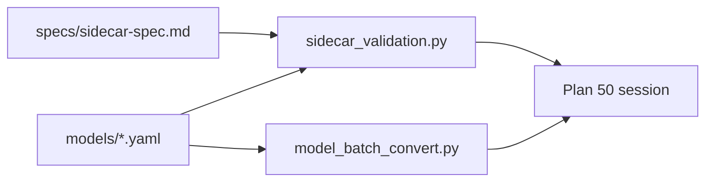

# Sidecar Batch Conversion

## Parent plan

Follows [40_detector_sidecar_spec.plan.md](40_detector_sidecar_spec.plan.md) (**plan 60** in sequence). Prerequisite for [50_yolo26_nano_detection.plan.md](50_yolo26_nano_detection.plan.md) `model_batch_convert()` integration at session startup.

## Boundary with plans 40 and 50

| Deliverable | Plan 40 | Plan 60 (this) | Plan 50 |
|-------------|---------|----------------|---------|
| `specs/sidecar-spec.md` — YAML, `schema_version`, interpolation, `batch_conversion` | yes (this repo) | extends | consumes |
| `onnx.batch_artifacts` multi-native-batch schema | yes | consumes | uses |
| `batching.batch_conversion` spec | **no** | yes | consumes |
| `validate_batch_conversion_profile()` | **no** | yes | uses in catalog/session |
| Vendored `model_batch_convert()` | **no** | yes | calls at session start |
| `SidecarModelRegistry` / YOLO26 session wiring | **no** | **no** | creates |
| `batching.batch_conversion` + vendoring docs | — | yes | — |

Plan 50 must not require `batching.batch_conversion` until plan 60 lands. After plan 60, YOLO26 sidecars with `supports_dynamic_batch: false` and a single native batch artifact must include a complete `batch_conversion` profile, and batch conversion runs from **in-tree** `skellytracker` code — not an external `model-batch-converter` wheel.

## Prerequisite plans

Complete in implementation order before this plan:

- [**10 — Remove EP fallback**](10_remove_ep_fallback.plan.md)
- [**20 — Single global realtime pipeline**](20_single_global_realtime_pipeline.plan.md)
- [**30 — Realtime batch size config**](30_realtime_batch_size.plan.md)
- [**40 — Detector Sidecar Spec**](40_detector_sidecar_spec.plan.md) — YAML format, `schema_version`, `input.resize.interpolation`, `onnx.batch_artifacts`, `sidecar_validation.py` base validators

## Plan sequence

| Order | Plan | Notes |
|-------|------|-------|
| **10** | [10_remove_ep_fallback.plan.md](10_remove_ep_fallback.plan.md) | |
| **20** | [20_single_global_realtime_pipeline.plan.md](20_single_global_realtime_pipeline.plan.md) | |
| **30** | [30_realtime_batch_size.plan.md](30_realtime_batch_size.plan.md) | |
| **40** | [40_detector_sidecar_spec.plan.md](40_detector_sidecar_spec.plan.md) | Detector Sidecar Spec |
| **60** (this) | Sidecar batch conversion + vendoring | Before YOLO26 `model_batch_convert()` |
| **50** | [50_yolo26_nano_detection.plan.md](50_yolo26_nano_detection.plan.md) | Consumes 40 + 60 |
| **70** | [70_pose_estimator_sidecar_spec.plan.md](70_pose_estimator_sidecar_spec.plan.md) | Pose estimator sidecar |
| future | [future_streaming_pipeline_implementation.plan.md](future_streaming_pipeline_implementation.plan.md) | Graph executor |

## Goals

1. **Declarative batch surgery** — sidecars describe how `model_batch_convert()` rewrites a native ONNX artifact to a requested fixed batch size.
2. **Reusable profiles** — `profile_id` and rule blocks are model-family specific but consumed through `skellytracker.utilities.gpu_utils.model_batch_convert`.
3. **YOLO26 readiness** — checked-in `yolo26-nano.yaml` includes the complete YOLO26 detector conversion profile plan 50 expects.
4. **Retire `model-batch-converter` repo** — move all runtime batch-conversion code into this repository; no separate package install.

## Vendoring `model-batch-converter`

The sibling checkout at `../model_batch_converter` is **fully retired** after this plan — no separate installable package, wheel, or editable path. Skellytracker becomes the single home for the sidecar spec (plan 40) and batch ONNX graph surgery (this plan).

### Complete repo inventory

| Path in `model_batch_converter` | Action in skellytracker | Notes |
|---------------------------------|-------------------------|-------|
| `model_batch_converter/converter.py` | **Port** → [`skellytracker/utilities/gpu_utils/model_batch_convert.py`](../skellytracker/utilities/gpu_utils/model_batch_convert.py) | Only runtime code worth keeping (~375 lines) |
| `model_batch_converter/__init__.py` | **Replace** with re-export from `skellytracker.utilities.gpu_utils` | Public API: `model_batch_convert`, `StaticBatchRewriteSummary` only |
| `model_batch_converter/spec_paths.py` | **Drop** | `read_sidecar_spec()` / `sidecar_spec_path()` are not vendored; read [`specs/sidecar-spec.md`](../specs/sidecar-spec.md) from this repo (docs / dev checkout), not `importlib.resources` |
| `model_batch_converter/specs/sidecar-spec.md` | **Drop** | Superseded by plan 40 [`specs/sidecar-spec.md`](../specs/sidecar-spec.md) |
| `model_batch_converter/specs/__init__.py` | **Drop** | Packaging shim only |
| Root `converter.py`, `__init__.py` (if present) | **Do not port** | Stale duplicates; retire with sibling repo |
| `README.md` | **Archive notice** in sibling repo only | Redirect to skellytracker spec + `model_batch_convert.py` |
| `pyproject.toml`, `uv.lock`, `.venv/`, `dist/` | **Retire** | No skellytracker dependency on the wheel |
| Tests (`pytest`) | **Add in skellytracker** | Sibling README references pytest but the repo has no test files |

### Source → destination (summary)

| Former (`model_batch_converter` repo) | In skellytracker (plan 60) | Notes |
|---------------------------------------|----------------------------|-------|
| `model_batch_converter/converter.py` | [`skellytracker/utilities/gpu_utils/model_batch_convert.py`](../skellytracker/utilities/gpu_utils/model_batch_convert.py) | Primary port target |
| `model_batch_converter/__init__.py` exports | Re-export from `skellytracker.utilities.gpu_utils` (or `model_batch_convert` module `__all__`) | Public API: `model_batch_convert`, `StaticBatchRewriteSummary` |
| `model_batch_converter/spec_paths.py` | **Drop** | Spec lives at [`specs/sidecar-spec.md`](../specs/sidecar-spec.md); converter reads `batching.batch_conversion` from parsed sidecar dicts only |
| `model_batch_converter/specs/sidecar-spec.md` | **Drop** (superseded by plan 40 `specs/sidecar-spec.md`) | Do not package or import |
| `pyproject.toml` / wheel | **Remove** from skellytracker deps | Delete commented `# model-batch-converter` lines in [`pyproject.toml`](../pyproject.toml) |

### API migration for former `model_batch_converter` consumers

| Former import | After plan 60 |
|---------------|---------------|
| `from model_batch_converter import model_batch_convert` | `from skellytracker.utilities.gpu_utils.model_batch_convert import model_batch_convert` (or documented re-export) |
| `from model_batch_converter import StaticBatchRewriteSummary` | Same module as above |
| `from model_batch_converter import read_sidecar_spec, sidecar_spec_path` | Read [`specs/sidecar-spec.md`](../specs/sidecar-spec.md) from the skellytracker repo / release tag; not packaged in the wheel |

### Port rules

- Preserve `model_batch_convert(source_onnx, output_onnx, *, target_batch, sidecar=...)` signature and `StaticBatchRewriteSummary` behavior from the sibling repo unless a bugfix requires a deliberate break (document in spec changelog).
- Accept `sidecar` dict with `batching.batch_conversion` (same as today's `_conversion_profile()` helper).
- Use existing skellytracker deps: `numpy`, `onnx` (already pulled by `rtmpose-*` / `recommended` extras — **no** new `model-batch-converter` dependency).
- Match skellytracker conventions: `beartype` on public functions if surrounding `gpu_utils` modules use it; same import style as [`sidecar_validation.py`](../skellytracker/utilities/gpu_utils/sidecar_validation.py) (plan 40).
- Add unit tests under `skellytracker/tests/` (sibling repo had no pytest suite — port any manual fixtures or add YOLO26-profile conversion tests here).

### Retiring the external repo

1. Merge vendored code + tests into skellytracker.
2. Replace sibling `model_batch_converter` README with a short archive notice: **moved to [freemocap/skellytracker](https://github.com/freemocap/skellytracker)** — `specs/sidecar-spec.md` and `skellytracker/utilities/gpu_utils/model_batch_convert.py`.
3. Archive or delete the `model_batch_converter` GitHub repository after skellytracker release ships (org policy).
4. Update YOLO-Exporter docs to reference skellytracker paths only.

### Dependency flow (after plan 60)



## Release coordination

Implement and publish in this order:

1. **Bump skellytracker** via bumpver at merge — add a changelog row for the `batch_conversion` change set in [`specs/sidecar-spec.md`](../specs/sidecar-spec.md); bump example sidecars to the new `schema_version`.
2. **`specs/sidecar-spec.md`** — add `batching.batch_conversion` section and validation checklist items.
3. **Vendor `model_batch_convert`** — land converter module + tests in `skellytracker/utilities/gpu_utils/`.
4. **YOLO-Exporter** — emit `batching.batch_conversion` targeting the documented `schema_version`.
5. **Checked-in artifact** — update `models/yolo26-nano.yaml` with `batch_conversion` block.
6. **skellytracker** — `validate_batch_conversion_profile()` in `sidecar_validation.py`; plan 50 calls it during catalog and session validation.
7. **Documentation** — extend `specs/sidecar-spec.md`, `models/README.md`, and `CLAUDE.md` per [Documentation updates](#documentation-updates).
8. **Retire sibling repo** — archive `model_batch_converter` after release.

## `batching.batch_conversion` field spec

Add to [`specs/sidecar-spec.md`](../specs/sidecar-spec.md) when `batching.supports_dynamic_batch` is `false` and the consumer may request a runtime batch size different from any native `onnx.batch_artifacts` key.

### When required

| Condition | `batch_conversion` |
|-----------|-------------------|
| `supports_dynamic_batch: false` and exactly one native batch in `onnx.batch_artifacts` | **required** — enables runtime batch ≠ native batch via `model_batch_convert()` |
| `supports_dynamic_batch: false` and multiple native batches listed | **optional per native batch** — use when conversion from a chosen source native batch is cheaper than shipping another native artifact; document `source_batch_size` |
| `supports_dynamic_batch: true` | omit — ORT dynamic batch axis handles runtime batch |

### Top-level fields

| Field | Type | Required | Description |
|-------|------|----------|-------------|
| `profile_id` | string | yes | Stable identifier for this conversion rule set (e.g. `yolo26-detector-static-batch`). |
| `source_batch_size` | integer | yes | Native batch size of the ONNX file used as conversion input. Must match a key in `onnx.batch_artifacts`. |
| `target_batch` | object | yes | Describes allowed runtime target batches. |
| `target_batch.minimum` | integer | yes | Minimum supported target batch (typically `1`). |
| `target_batch.axis` | integer | yes | Batch axis index (typically `0`). |
| `rewrite_rules` | sequence of string | yes | Ordered rule names understood by `model_batch_convert()`. |
| `tensor_matchers` | object | conditional | Matcher definitions referenced by `rewrite_rules`. Required when rules reference named matchers. |
| `target_batch_one` | object | conditional | Special-case graph edits when `target_batch == 1`. |
| `validation` | object | yes | Expected input/output shapes after conversion, using `target_batch` as a symbolic placeholder. |

### `validation` block

| Field | Type | Required | Description |
|-------|------|----------|-------------|
| `validation.input_shape` | sequence | yes | Expected graph input shape after conversion; use `target_batch` as the batch dimension literal in docs, resolved at runtime. |
| `validation.output_shapes` | sequence of sequences | yes | Expected output shapes after conversion. |

### Native-batch fast path

When `requested_batch_size` equals a key in `onnx.batch_artifacts`, consumers **must** use that native artifact directly and **must not** call `model_batch_convert()`. `batch_conversion` applies only when the requested batch is absent from `onnx.batch_artifacts` (or when explicitly converting from `source_batch_size` to a non-native target).

## Change set — `batching.batch_conversion` (this plan)

**Problem:** Plan 40 describes native ONNX artifacts per batch size and precision but does not specify how to produce non-native fixed-batch ONNX files. YOLO26 realtime needs `model_batch_convert()` metadata on the session-start path (plan 50).

**Example fragment** (YOLO26 detector, native batch 2):

```yaml
batching:
  batch_axis: 0
  supports_dynamic_batch: false
  batch_conversion:
    profile_id: yolo26-detector-static-batch
    source_batch_size: 2
    target_batch:
      minimum: 1
      axis: 0
    rewrite_rules:
      - metadata_batch
      - leading_value_info_batch
      - int64_shape_first_dim
      - batch_offset_initializer
    tensor_matchers:
      int64_shape_first_dim:
        dtype: int64
        rank: 1
        minimum_size: 2
        first_value: source_batch
        rewrite_first_value_to: target_batch
      batch_offset_initializer:
        dtype: int64
        shape: [source_batch, 1]
        start: 0
        stride: 300
        rewrite_shape: [target_batch, 1]
    target_batch_one:
      remove_batch_offset_add: true
      offset_initializer_name: "/model.23/Mul_3_output_0"
      rewire_producer_output: true
      rewire_consumers: true
    validation:
      input_shape: [target_batch, 3, 640, 640]
      output_shapes: [[target_batch, 300, 6]]
```

## Complete YOLO26 Nano sidecar example (with batch conversion)

Full reference sidecar combining plan 40 fields with plan 60 `batch_conversion`. Canonical home: plan 40 example + this block; plan 50 links here for the conversion section.

```yaml
---
schema_version: "vYYYY.MM.BBBB"  # bumpver at merge (plan 60 change set)
model_id: yolo26-nano
display_name: YOLO26 Nano
family: yolo26
role: detector

onnx:
  batch_artifacts:
    2:
      precision_artifacts:
        fp32:
          filename: yolo26-nano_b2_fp32.onnx
          sha256: "<lowercase-hex-sha256>"
          input_dtype: float32
        fp16:
          filename: yolo26-nano_b2_fp16.onnx
          sha256: "<lowercase-hex-sha256>"
          input_dtype: float16
        int8:
          filename: yolo26-nano_b2_int8.onnx
          sha256: "<lowercase-hex-sha256>"
          input_dtype: uint8

input:
  name: images
  dtype_by_precision:
    fp32: float32
    fp16: float16
    int8: uint8
  shape: [2, 3, 640, 640]
  layout: NCHW
  dynamic_axes: {}
  color_format: RGB
  normalization: unit_float
  normalization_by_precision:
    int8: none
  resize:
    method: letterbox
    target_size: [640, 640]
    preserve_aspect_ratio: true
    pad_value: 114
    interpolation: linear
  coordinate_origin: top_left

batching:
  batch_axis: 0
  supports_dynamic_batch: false
  batch_conversion:
    profile_id: yolo26-detector-static-batch
    source_batch_size: 2
    target_batch:
      minimum: 1
      axis: 0
    rewrite_rules:
      - metadata_batch
      - leading_value_info_batch
      - int64_shape_first_dim
      - batch_offset_initializer
    tensor_matchers:
      int64_shape_first_dim:
        dtype: int64
        rank: 1
        minimum_size: 2
        first_value: source_batch
        rewrite_first_value_to: target_batch
      batch_offset_initializer:
        dtype: int64
        shape: [source_batch, 1]
        start: 0
        stride: 300
        rewrite_shape: [target_batch, 1]
    target_batch_one:
      remove_batch_offset_add: true
      offset_initializer_name: "/model.23/Mul_3_output_0"
      rewire_producer_output: true
      rewire_consumers: true
    validation:
      input_shape: [target_batch, 3, 640, 640]
      output_shapes: [[target_batch, 300, 6]]

outputs:
  - name: output0
    dtype: float32
    shape: [2, 300, 6]
    rank: 3
    semantic: detections
    fields: [x1, y1, x2, y2, score, class_id]
    box_format: xyxy
    coordinate_space: letterboxed_input
    requires_nms: false
    class_id_base: 0
    person_class_id: 0
    score_field: score
    class_field: class_id
    max_detections: 300
    may_include_non_person_classes: true

postprocessing:
  requires_nms: false
  filter_class_id: 0
  confidence_threshold_default: 0.7
  map_boxes_to_source_image: true
```

## Schema changelog row (plan 60)

Append to the changelog table in `specs/sidecar-spec.md`:

| `schema_version` | skellytracker release | Changes |
|------------------|----------------------|---------|
| `vYYYY.MM.BBBB` | same as column 1 | *(bumpver at merge)* — add `batching.batch_conversion` profile schema; vendor `model_batch_convert` into skellytracker |

Add `SCHEMA_REQUIREMENTS` entry keyed to this version:

```python
("vYYYY.MM.BBBB", _require_batch_conversion_when_static_single_native_batch),
```

Rule: when `batching.supports_dynamic_batch` is `false` and `onnx.batch_artifacts` has exactly one key, `batching.batch_conversion` must be present and pass `validate_batch_conversion_profile()`.

## skellytracker validation

Extend `sidecar_validation.py` from plan 40:

- `validate_batch_conversion_profile(batching: dict, batch_artifacts: dict) -> None`
- Called from `validate_sidecar_metadata()` after base schema checks
- Reject: missing required fields, `source_batch_size` not in `batch_artifacts` keys, empty `rewrite_rules`, `validation` shape mismatches with `input.shape` / `outputs[].shape` spatial dims

Plan 50 catalog validation adds detector-specific agreement checks (`batch_conversion.source_batch_size` vs selected native artifact, output batch dims, etc.).

## Documentation updates

Extend plan 40 docs — do not fork a separate batch-conversion spec.

### `specs/sidecar-spec.md`

Add under **Field reference** and **Consumer guide**:

- **`batching.batch_conversion`** — when required, top-level fields (`profile_id`, `source_batch_size`, `target_batch`, `rewrite_rules`, `tensor_matchers`, `target_batch_one`, `validation`).
- **Native-batch fast path** — if requested batch is a key in `onnx.batch_artifacts`, skip `model_batch_convert()`; conversion applies only for non-native targets.
- **Relationship to runtime `batch_size`** — link to plan 30 semantics; conversion target = session `batch_size` from freemocap camera count.
- **Runtime module** — `skellytracker.utilities.gpu_utils.model_batch_convert` (vendored; replaces external `model-batch-converter` package).

Append changelog row and validation-checklist items for conversion profiles.

### `models/README.md`

Add subsection **Batch conversion**:

- YOLO26 ships native `b2` ONNX files; other runtime batch sizes use cached `{model_id}_b{batch}_{precision}.onnx` produced by in-tree `model_batch_convert()`.
- Point to full profile tables in `specs/sidecar-spec.md`.

### `CLAUDE.md`

- Document vendored `model_batch_convert.py` beside `sidecar_validation.py`.
- Note `model-batch-converter` sibling repo is retired.

### YOLO-Exporter

Document emitted `batching.batch_conversion` block; link to skellytracker `specs/sidecar-spec.md` only.

## Implementation plan

### 1. Spec (this repo)

- Document `batching.batch_conversion` tables and YOLO26 example in [`specs/sidecar-spec.md`](../specs/sidecar-spec.md).
- Add validation-checklist items for conversion profiles.
- Bump changelog `schema_version` row for this change set.

### 2. Vendor `model_batch_convert` (this repo)

- Port [`../model_batch_converter/model_batch_converter/converter.py`](../model_batch_converter/model_batch_converter/converter.py) → [`skellytracker/utilities/gpu_utils/model_batch_convert.py`](../skellytracker/utilities/gpu_utils/model_batch_convert.py).
- Do **not** port `spec_paths.py` or packaged `sidecar-spec.md`.
- Export `model_batch_convert` and `StaticBatchRewriteSummary` from `skellytracker.utilities.gpu_utils` (or document canonical import path in spec).
- Add `skellytracker/tests/test_model_batch_convert.py` — YOLO26 profile, batch 1 special-case, invalid profile errors.

### 3. Retire external package

- Remove all `model-batch-converter` references from [`pyproject.toml`](../pyproject.toml) (including commented `recommended` entry and `[tool.uv.sources]` editable path).
- Archive sibling `model_batch_converter` README with redirect to this repo.
- Grep monorepo / freemocap for `model-batch-converter` / `model_batch_converter` imports and update to skellytracker paths.

### 4. Validation library (`skellytracker`)

- Implement `validate_batch_conversion_profile()` and wire into `validate_sidecar_metadata()`.
- Unit-test valid YOLO26 profile, missing `rewrite_rules`, bad `source_batch_size`, incomplete `validation`.

### 5. YOLO-Exporter

- Emit `batching.batch_conversion` in YAML sidecar output.
- Update [exporter tests](https://github.com/domisjustanumber/YOLO-Exporter/blob/main/tests/test_yolo_sidecar.py).

### 6. Published YOLO26 artifact

- Update `models/yolo26-nano.yaml` with `batch_conversion` block and bumped `schema_version`.

### 7. Documentation

- Apply [Documentation updates](#documentation-updates).

## Validation plan

- Unit-test vendored `model_batch_convert()` on YOLO26 reference ONNX + sidecar profile (representative batch sizes including `target_batch_one`).
- Unit-test `validate_batch_conversion_profile()` on the YOLO26 reference profile.
- Unit-test rejection when `source_batch_size` is not a `batch_artifacts` key.
- Unit-test rejection when `supports_dynamic_batch: false`, single native batch, and `batch_conversion` absent.
- Unit-test exporter output includes required `batch_conversion` keys.
- Confirm `specs/sidecar-spec.md` documents `batching.batch_conversion`, native-batch fast path, and vendored module path.
- Confirm `pyproject.toml` has no `model-batch-converter` dependency.

### Plan 50 (deferred)

- Unit-test session integration: native-batch fast path, cache naming, conversion failure UX.

## Main risks

- **Profile drift** — `rewrite_rules` / `tensor_matchers` in sidecar examples must stay aligned with vendored `model_batch_convert.py` rule implementations.
- **source_batch_size mismatch** — must match the native artifact used as conversion input; plan 50 must select the artifact at `source_batch_size` before calling the converter.
- **Multi-native-batch sidecars** — when plan 40 lists multiple `batch_artifacts` keys, conversion is optional; plan 50 must prefer native artifacts over conversion when the requested batch exists as a key.
- **Incomplete vendoring** — any remaining `import model_batch_converter` in freemocap or CI will break after sibling repo retirement; grep before release.

## Related files

- Canonical spec: [`specs/sidecar-spec.md`](../specs/sidecar-spec.md)
- Vendored converter: [`skellytracker/utilities/gpu_utils/model_batch_convert.py`](../skellytracker/utilities/gpu_utils/model_batch_convert.py)
- Validation: `skellytracker/utilities/gpu_utils/sidecar_validation.py`
- Source to port (sibling, pre-retirement): [`../model_batch_converter/model_batch_converter/converter.py`](../model_batch_converter/model_batch_converter/converter.py)
- Checked-in artifacts guide: [`models/README.md`](../models/README.md)
- Exporter: [YOLO-Exporter `yolo_sidecar.py`](https://github.com/domisjustanumber/YOLO-Exporter/blob/main/yolo_sidecar.py)

## Related plans

- [40_detector_sidecar_spec.plan.md](40_detector_sidecar_spec.plan.md) — **prerequisite**; Detector sidecar spec and `onnx.batch_artifacts`.
- [50_yolo26_nano_detection.plan.md](50_yolo26_nano_detection.plan.md) — **blocked on this plan** for `batch_conversion` metadata and vendored `model_batch_convert()`; owns session wiring.
- [70_pose_estimator_sidecar_spec.plan.md](70_pose_estimator_sidecar_spec.plan.md) — **related**; YOLO26 pose and other pose models use the same `batching.batch_conversion` profiles.
- [30_realtime_batch_size.plan.md](30_realtime_batch_size.plan.md) — derived runtime `batch_size` drives conversion target batch.
