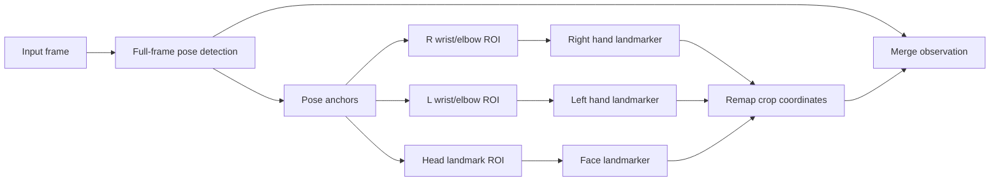

# Hand And Face Detection From Pose

## Plan sequence

This plan is **future** work — not part of the numbered **10**–**50** realtime rollout. It can proceed in parallel once core tracker APIs are stable.

| Order | Plan |
|-------|------|
| **10**–**50** | Numbered realtime plans (optional context for freemocap integration patterns) |
| **future** (this) | Pose-anchored hand/face ROI refinement |
| future | [future_streaming_pipeline_implementation.plan.md](future_streaming_pipeline_implementation.plan.md) — if integrated into realtime, would use streaming graph batch semantics from plan **30** |

## Goal

Use pose detection as the coarse full-body localization pass, then add high-detail hand and face landmarks through targeted crop refinement. This keeps the expensive high-resolution detectors focused on small image regions instead of repeatedly searching the full frame.

Feet do not need a separate refinement path in the current MediaPipe pose schema because the 33-point pose output already includes ankles, heels, and foot-index landmarks.

## Core Pipeline



## Why This Is Efficient

- The pose model runs once on the full frame and provides coarse body context.
- Hand and face landmarkers run on small crops, so each model processes fewer pixels and does less search work.
- Right hand, left hand, and face detection are independent after pose anchors are known, so they can run concurrently.
- A persistent `ThreadPoolExecutor` avoids creating threads every frame, reducing realtime overhead and jitter.
- MediaPipe inference runs mostly in native C++ and releases the Python GIL, so Python threads can overlap the sub-detector work in practice.

## ROI Strategy

Hands should use the wrist as the primary crop center and the wrist-to-elbow distance as a scale cue. To handle foreshortening, the crop size can also use the previous frame's detected hand size and a minimum image-relative crop size.

Face detection should use visible head landmarks such as nose, eyes, ears, and mouth corners. A square crop around the visible head-landmark bounding box is more robust than relying on a single landmark, especially in side views.

Each ROI should be clamped to image bounds and smoothed over time with an exponential moving average for center and size. If the necessary pose landmarks are missing or below the visibility threshold, fall back to full-image hand or face detection for that branch.

## Parallel Detection Plan

After pose detection succeeds:

- Submit right-hand crop detection, left-hand crop detection, and face crop detection as independent futures.
- Wait for all submitted futures to finish.
- Resolve duplicate or overlapping hand detections by comparing detected hand wrists against pose wrists.
- Combine right and left hand arrays into the hand observation.
- Merge pose, hand, and face observations into the composite output.

This changes the per-frame critical path from roughly:

```text
pose + right_hand + left_hand + face
```

to roughly:

```text
pose + max(right_hand, left_hand, face)
```

plus scheduling and merge overhead.

## Validation

- Confirm output point names and ordering remain compatible with the holistic tracked-object definition.
- Test frames where both wrists and head landmarks are visible.
- Test fallback cases with occluded wrists, missing face anchors, and no detected body.
- Measure realtime latency with hands and face enabled versus disabled.
- Inspect ROI stability over video to catch jitter, crop clipping, or branch-specific stalls.

## Related Plans

- [30_realtime_batch_size.plan.md](30_realtime_batch_size.plan.md) — if wired into freemocap realtime, batch size follows derived camera count.
- [50_yolo26_nano_detection.plan.md](50_yolo26_nano_detection.plan.md) — orthogonal; whole-body GPU path uses YOLO26 + RTMPose, not MediaPipe ROI refinement.
- [future_streaming_pipeline_implementation.plan.md](future_streaming_pipeline_implementation.plan.md) — optional integration target for parallel sub-detector futures in a streaming graph.
